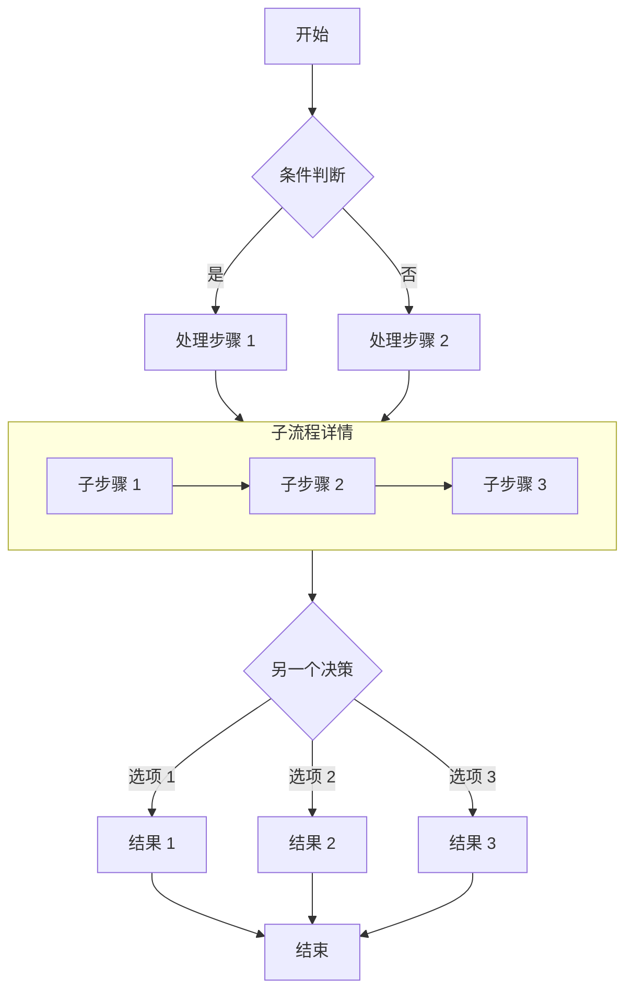
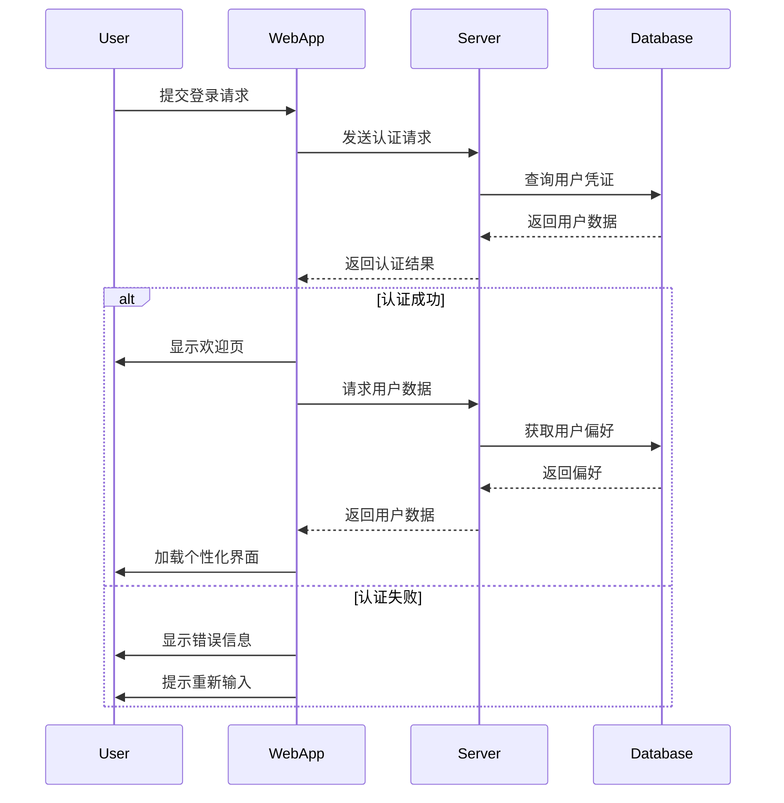
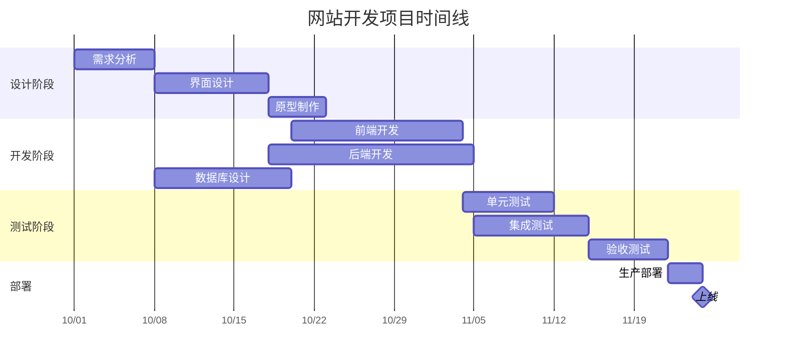
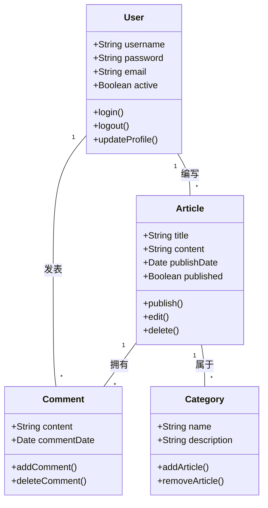
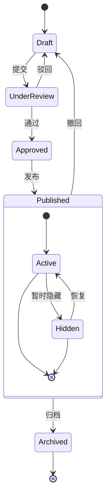
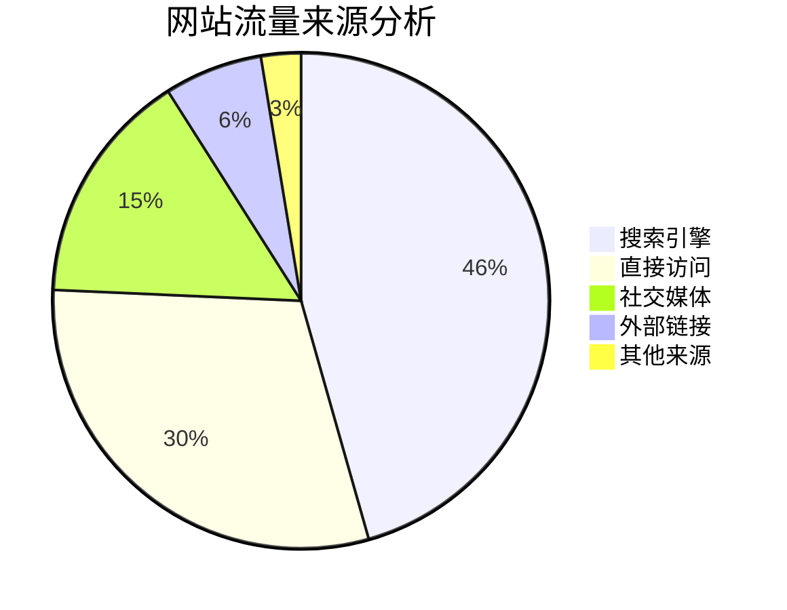

# 用 Mermaid 绘制各种图表

本文演示如何在 Markdown 文档中用 Mermaid 创建各种复杂图表，包括流程图、时序图、甘特图、类图和状态图。

## 流程图示例

流程图非常适合表达流程或算法步骤。

## 时序图示例

时序图展示对象之间随时间发生的交互。

## 甘特图示例

甘特图非常适合展示项目计划与时间线。

## 类图示例

类图展示系统的静态结构，包括类、属性、方法及其关系。

## 状态图示例

状态图展示对象在其生命周期中所经历的状态序列。

## 饼图示例

饼图非常适合展示比例与百分比数据。

## 小结

Mermaid 是一个强大的工具，可以在 Markdown 文档中创建各种类型的图表。本文演示了流程图、时序图、甘特图、类图、状态图和饼图。这些图表能帮你更清晰地表达复杂的概念、流程和数据结构。

使用方式很简单：在代码块中指定 `mermaid` 语言，然后用简洁的文本语法描述图表即可。Mermaid 会自动把这些描述转换为漂亮的图表。

在技术博客或项目文档中试试 Mermaid 图表吧，会让你的内容更专业、更易读！
