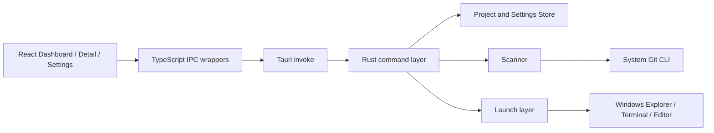
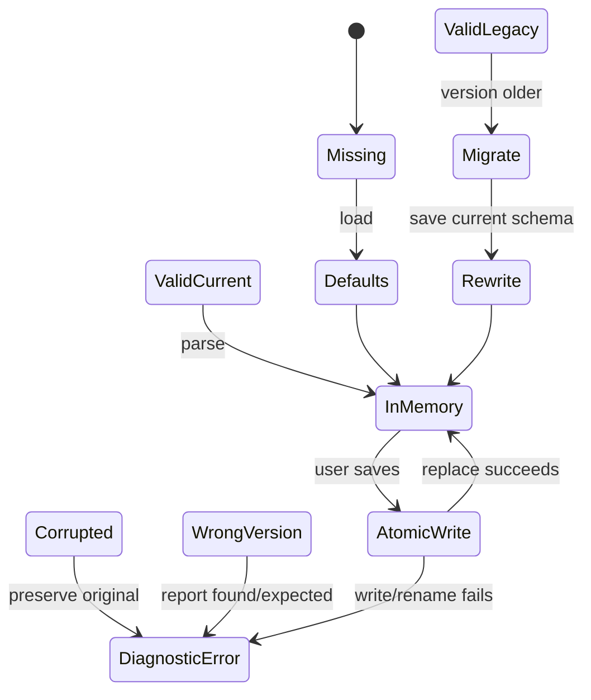
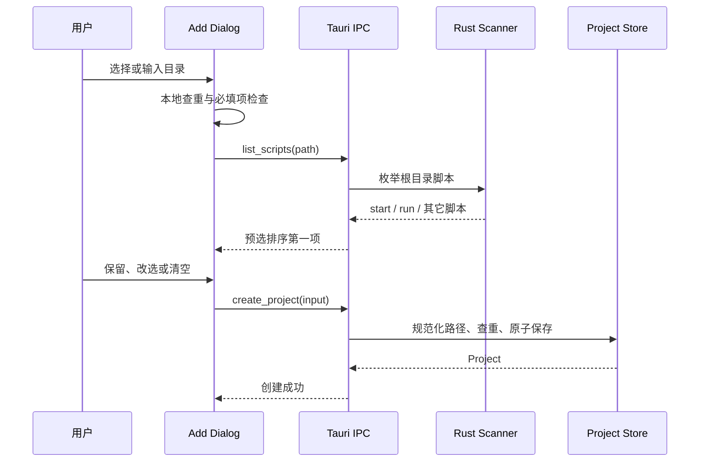
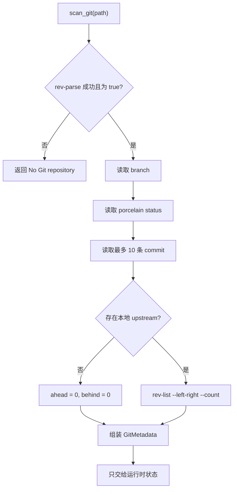
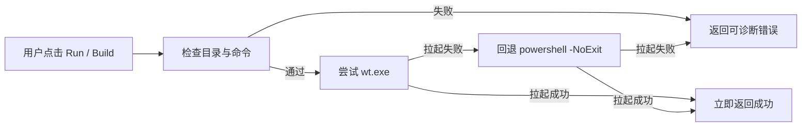
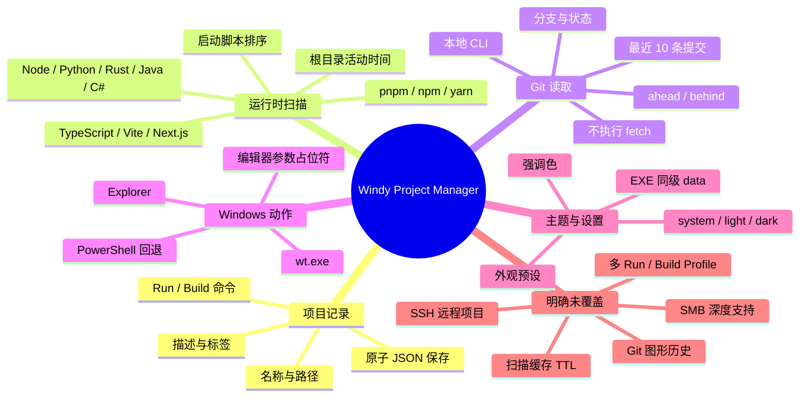

> 本文不是对“项目管理软件”这个大类的抽象综述，而是一份基于本地源码、自动化测试和真实 Windows 桌面运行结果的工程记录。文中的实现事实以 `D:\Dev\windy-project-mgr` 当前工作区为准；写作日期为 2026 年 8 月 31 日。

头图：工作台照片由 [cottonbro studio 拍摄，来源于 Pexels](https://www.pexels.com/photo/workstation-while-working-on-the-webpage-6804581/)。

## 摘要

当项目数量从几个增长到十几个，真正变慢的往往不是编译，而是“找到项目—判断状态—打开正确入口—记起启动命令”这一串重复动作。Windy Project Manager 试图把这些动作收拢到一个 Windows 本地优先的控制面中：它保存少量稳定的项目记录，在启动和刷新时读取易变的运行时信息，再把打开目录、启动 Run/Build 命令和进入编辑器的动作交给操作系统完成。

本文的核心论点是：**本地工具的可维护性取决于边界，而不取决于功能数量。** 持久化数据与扫描数据分离，网络依赖与 Git 读取分离，进程“已拉起”与命令“已成功”分离，前端状态与 Rust 能力分离，系统才有机会在离线、路径失效、非 Git 目录、空仓库和命令未配置等场景下保持可解释。

文章依次讨论问题边界、系统架构、数据模型、扫描器、Git 读取、Tauri IPC、命令启动、主题设置、实机验证和剩余限制。Mermaid 流程图用于表达控制流，思维导图用于表达能力边界，LaTeX 用于给出数据模型与扫描结果的形式化表示；截图均来自真实运行中的 Tauri 窗口，不是浏览器静态 mock。

## 1. 问题不是“缺少一个列表”，而是缺少一个本地控制面

开发者的项目目录通常分散在多个磁盘、工作区和临时目录中。项目名称可能相似，启动方式可能不同，Git 状态也可能在几分钟内改变。传统文件管理器能打开目录，终端能执行命令，编辑器能载入工作区，但这些工具并不知道彼此之间的上下文。

Windy Project Manager 的目标因此被压缩为四个问题：

1. 这个路径对应什么项目，使用了哪些技术？
2. 它当前处于哪个分支，工作区是否干净，最近改了什么？
3. 该项目应该用哪个命令启动或构建？
4. 这些信息在离线、路径失效或数据文件损坏时，是否仍然能给出明确反馈？

这四个问题对应四种不同的状态：项目记录是相对稳定的用户输入；类型、技术栈和 Git 状态是会变化的扫描结果；启动命令是用户配置的动作入口；错误信息则是系统必须保留的诊断事实。把它们混成一个“大项目对象”，会让每次刷新都变成一次写盘，也会让一次扫描失败影响整张卡片。

### 1.1 术语与边界

| 术语       | 本文中的准确含义                                       | 不包含的内容                                    |
| ---------- | ------------------------------------------------------ | ----------------------------------------------- |
| 项目记录   | `id`、名称、路径、描述、标签、Run/Build 命令和创建时间 | Git 状态、活动时间、自动识别标签                |
| 运行时扫描 | 针对项目目录即时读取类型、技术栈、Git 和根目录活动     | AST 分析、递归索引、远端代码分析                |
| 本地优先   | 数据文件与核心操作在本机完成，网络不是正常路径依赖     | 云端同步、远程项目管理、在线 Git 服务           |
| 分离式启动 | 只负责把终端或编辑器进程拉起并立即返回                 | 等待命令退出、采集 stdout、判断脚本业务是否成功 |
| 可携带数据 | 数据位于当前 EXE 同级的 `data\` 目录                   | AppData 自动迁移、账号级同步                    |

这个术语表也限定了本文的评价范围。本文可以讨论“当前实现如何处理一个本地 Node/Git 项目”，但不能把它扩展成“它已经解决了远程项目协作”或“它能判断任意构建脚本是否成功”。

## 2. 系统结构：Web UI 负责编排，Rust 负责本地能力

项目的技术栈是 React + TypeScript + Vite 前端、Tauri 2 容器和 Rust 本地后端。`package.json` 与 `src-tauri/Cargo.toml` 当前都记录版本 `0.1.0`；Tauri 配置将前端开发地址固定为 `http://localhost:1420`，生产构建入口为 `../dist`，默认窗口尺寸配置为 800×600。



这张图中最重要的不是层数，而是依赖方向：前端没有直接读取 `projects.json`，也没有在浏览器环境里执行 Git；Rust command 也没有把所有逻辑堆在 `#[tauri::command]` 函数里。命令层负责输入解析、数据目录定位和错误转换，实际业务逻辑由 `project`、`scanner`、`git` 和 `launch` 模块分别承担。

这符合 Tauri 官方文档描述的基本调用模型：Rust 函数使用 `#[tauri::command]` 暴露能力，由 `invoke_handler(tauri::generate_handler![...])` 注册，前端再通过 `@tauri-apps/api/core` 的 `invoke` 调用。项目中的 `src/lib/api.ts` 把这些调用再包成类型化函数，使组件只需要调用 `scanProject`、`getProjects` 或 `runProject`，不必重复书写命令名和载荷结构。

## 3. 数据模型：只保存稳定事实，把易变信息留在内存

### 3.1 持久化对象

Rust 的 `Project` 结构只包含用户登记和动作配置字段：

```rust
pub struct Project {
    pub id: String,
    pub name: String,
    pub path: String,
    pub description: Option<String>,
    pub tags: Vec<String>,
    pub run_command: Option<String>,
    pub build_command: Option<String>,
    pub created_at: String,
}
```

可以把一个项目记录写成：

$$
P = (id, name, path, description, tags, runCommand, buildCommand, createdAt)
$$

这里的 `P` 是用户可以编辑、程序需要跨重启保留的对象。它不包含 Git 分支、修改文件数或“最近扫描时间”，因为这些字段的意义依赖于当前目录状态。保存它们会制造一种不可靠的“历史真相”：用户打开应用看到的可能只是上一次启动时的状态。

项目数据位于当前可执行文件同级的 `data\projects.json`。文件外层带有 `version` 字段，写入时先生成同目录临时文件、写入并 `sync_all`，再重命名替换目标文件。这个顺序不是为了追求数据库级事务，而是为了避免进程在写入中途退出后把原文件截断成半个 JSON。

创建项目时，后端先规范化路径，再检查重复路径；命中重复项时拒绝创建并提示编辑已有记录。删除操作只删除 JSON 中的记录，不删除项目目录。对一个本地项目工具来说，这两条是比“多一个按钮”更重要的信任契约。

### 3.2 运行时扫描对象

扫描结果单独建模为 `ProjectMetadata`：

```rust
pub struct ProjectMetadata {
    pub project_type: Option<String>,
    pub tech_stack: Vec<String>,
    pub git: Option<GitMetadata>,
    pub activity: ActivityMetadata,
}
```

形式化地表示，给定目录 `p`，扫描器返回：

$$
M(p) = \bigl(\tau(p),\ \sigma(p),\ g(p),\ a(p)\bigr)
$$

其中：

- `\tau(p)` 是项目类型，例如 `Node`、`Python`、`Rust`，未命中时为空；
- `\sigma(p)` 是技术栈标签列表，例如 `pnpm`、`TypeScript`、`Vite`；
- `g(p)` 是 Git 元数据，非仓库时为空；
- `a(p)` 是根目录最近修改时间与本次扫描时间。

扫描器的完整管线是“类型 → 技术栈 → Git → 活动”。类型、技术栈和 Git 读取失败时会降级；活动信息读取则仍然是完整扫描的必要步骤，目录本身不存在或不可读取时会返回可诊断错误。这样，Git 失败不应让技术栈消失，非 Git 目录也应该显示为可理解的 `No Git repository`，而真正无法访问的路径不会被伪装成有效项目。

### 3.3 版本化 JSON 的恢复关系

`projects.json` 当前使用版本 1，`settings.json` 使用版本 3。设置文件在读取旧版本时可以迁移到当前结构；项目文件遇到空文件、非法 JSON 或未知版本时，会返回可诊断错误，不静默覆盖原数据。



这个状态图刻意保留错误路径。一个本地应用如果只描述“正常读取—正常保存”，就无法解释用户最需要帮助的时刻：文件损坏、磁盘权限不足、版本不匹配或上一次更新未完成。

## 4. 扫描器：用根目录特征换取速度与可解释性

### 4.1 类型和技术栈识别

当前扫描器不解析 AST，也不递归遍历整个源码树，而是检查项目根目录的有限文件特征：

| 根目录特征                             | 输出         |
| -------------------------------------- | ------------ |
| `package.json`                         | `Node`       |
| `pyproject.toml` 或 `requirements.txt` | `Python`     |
| `Cargo.toml`                           | `Rust`       |
| `pom.xml`                              | `Java`       |
| `*.csproj`                             | `C#`         |
| `pnpm-lock.yaml`                       | `pnpm`       |
| `tsconfig.json`                        | `TypeScript` |
| `vite.config.*`                        | `Vite`       |

这些规则有两个优点。第一，规则命中可以直接追溯到某个文件，用户很容易理解为什么一张卡片显示了某个标签。第二，扫描成本与源码规模近似脱钩：一个拥有数十万行代码的仓库，根目录特征检查仍然是有限次文件判断。

这同时也是它的适用边界。一个项目可能把配置放在子目录、使用自定义构建系统，或者存在多个互相嵌套的工作区；根目录规则不会替代完整的语言服务器或构建系统探测。把“轻量识别”明确写成轻量识别，比暗示它理解整个代码库更诚实。

### 4.2 启动脚本引导

添加项目分为两步。第一步登记路径、名称、描述和标签；第二步只扫描项目根目录下的 `*.bat`、`*.cmd` 和 `*.ps1`，按 `start`、`run`、字母序排列，并默认选择排序后的第一项。



这里有一个细节值得注意：`list_scripts` 是登记前的只读查询，`create_project` 才负责最终写盘。这样，用户可以在脚本引导页返回修改，而不会留下半条项目记录；同时，后端仍会在最终提交时再次检查路径重复。

## 5. Git：读取本地状态，但不把网络带进核心路径

Git 模块调用系统 `git` CLI，并以 `git -C <path>` 指定工作目录。它先用 `rev-parse --is-inside-work-tree` 判断目录是否位于工作树内；非仓库返回空值，而不是把非仓库当成错误。

仓库内的元数据包括：

```text
branch          symbolic-ref --short HEAD
status          git status --porcelain
changedFiles    porcelain 输出的非空行数
recentCommits   git log --max-count=10
ahead/behind    本地 @{u} 与 HEAD 的 rev-list 计数
```

`ahead` 与 `behind` 只基于本地已有的上游引用，不执行 `git fetch`。这使得“离线可用”不再是一句口号，而是一个可以检查的实现边界：应用能读取当前本地 Git 状态，但不会因为打开 Dashboard 而擅自访问远端。

Windows 上还有一个容易被忽略的用户体验问题。每一次系统 Git CLI 调用都可能产生子进程；如果不给它设置 `CREATE_NO_WINDOW`，用户可能在添加项目或刷新详情时看到控制台窗口闪现。当前实现为 Windows 子进程设置了这一标志，并在 Rust 契约测试中锁定了该行为。



### 5.1 一张真实详情截图里的“状态证据”

下面的截图来自本地 `pnpm tauri dev` 启动的真实 Tauri 窗口。项目通过 Add Project 两步流程登记后，使用 Dashboard 搜索框过滤到目标项目，再进入详情页。截图中的 `main · clean · ahead 2` 是当时本地仓库的实际读取结果，不是文章手工填入的示例文字。


_图 1｜真实 Dashboard：目标项目卡片显示 Node 类型、`pnpm` / `TypeScript` / `Vite` 标签、`main · clean · ahead 2`，以及 Open、Run、Build 操作。_


_图 2｜真实 Detail 概览：Overview 区展示标签、创建时间、Run command 和未配置的 Build command。_


_图 3｜真实 Detail 数据：Technology 区列出检测结果，Git 区显示分支、工作树状态、同步关系和最近提交。_


_图 4｜真实 Recent Commits：列表按最近提交展示短哈希、提交信息、作者和相对时间。_

这些截图可以证明的是：在当前机器、当前源码、当前目标目录和当前数据状态下，应用完成了这条真实交互路径。它们不能证明任意 Windows 用户都拥有相同的 Git 版本、终端配置或文件权限；那需要另外设计环境矩阵。

## 6. IPC：让异步边界显式存在

前端 API 层将 Tauri 调用收敛为少量函数：

```ts
export function scanProject(path: string): Promise<ProjectMetadata> {
	return invoke<ProjectMetadata>("scan_project", { path });
}

export function runProject(path: string, command: string): Promise<void> {
	return invoke<void>("run_project", { path, command });
}

export function updateSettings(settings: AppSettings): Promise<AppSettings> {
	return invoke<AppSettings>("update_settings", { settings });
}
```

从数据流角度看，前端得到的不是“神奇地变了的卡片”，而是一次明确的异步转换：

$$
UI\ state_{t+1} = reduce\bigl(UI\ state_t,\ IPC(command,\ payload)\bigr)
$$

启动时，App 先读取项目记录；随后对每个项目并发调用 `scan_project`，把返回的运行时元数据填入对应卡片。单卡失败进入该卡片的错误状态，其他卡片仍可展示。详情页的 Refresh 也只重扫当前项目，扫描结果依然留在内存中。

这种设计的直接收益是状态可观察：加载、成功、错误和空数据都能在 UI 中分别表达。它的代价是前端需要维护更多显式状态，也需要在页面切换后正确重建事件绑定；但这个代价换来了更清楚的错误边界。

## 7. 命令启动：只承诺“拉起”，不承诺“业务成功”

Run 和 Build 是最容易产生过度承诺的功能。当前实现的语义非常窄：检查工作目录与命令非空，优先尝试 `wt.exe`，失败后回退到 `powershell -NoExit`，以分离方式启动，然后立即把控制权还给应用。



实现中的 `LaunchPlan` 先构造程序、参数、工作目录和环境，再由 `spawn_plan` 真正拉起进程。计划构造是纯数据，既方便测试参数边界，也避免把终端探测、路径引用和进程启动全部揉进一个不可读的函数。

因此，应用报告的“成功”表示终端进程已经被拉起；它不表示 `pnpm dev`、`cargo build` 或用户自定义脚本已经成功退出。命令的 stdout、退出码和后续业务状态属于新一层的需求，不应在当前 UI 文案中被暗示出来。

编辑器入口也采用类似边界：设置中保存可执行文件和参数数组，参数中必须恰好包含一个 `{path}` 占位符；配置为空时返回 `Editor not configured`。对 `.bat` / `.cmd` 入口，启动层通过 `cmd.exe` 处理，而不是假定所有编辑器入口都是普通 `.exe`。

## 8. 设置系统：把主题当成可迁移的数据，而不是散落的样式分支

当前设置版本 3 包含颜色模式、强调色、主题工坊外观和编辑器配置。颜色模式有 `system`、`light`、`dark` 三态；强调色包含六种预设、Windows 当前颜色和自定义 `#RRGGBB`；主题工坊还提供风格预设、圆角、字号、密度、字体栈和亮暗中性色。


_图 5｜真实 Settings：Appearance 分页展示 Follow system、Light、Dark 三种模式与 Windy teal、Ocean blue、Violet、Amber 等强调色。_

设置的草稿状态与已保存状态分离。用户可以预览颜色和模式，点击 Cancel 时恢复草稿前的配置，点击 Save 才经过 IPC 写入 `data\settings.json`。旧设置版本在读取时迁移到当前结构，并用测试确认迁移和自定义外观往返。

如果把主题只写在 CSS 选择器里，跨重启持久化会变成另一套特殊逻辑；把它作为版本化设置域后，主题就和项目记录一样拥有加载、验证、保存和迁移路径。CSS 只消费当前状态，不负责猜测状态从哪里来。

## 9. 思维导图：能力、状态与边界如何相互约束

流程图适合说明一次操作如何经过系统，思维导图更适合展示这个工具的能力版图。下面的图不是功能愿望清单，而是当前实现中已经出现的几条主要边界。



导图右下角的“未覆盖”同样重要。产品边界不是把 TODO 隐藏起来，而是把它们与已完成能力并列，让读者知道当前版本解决了什么、没有解决什么。

## 10. 验证：自动化证明契约，实机证明路径

### 10.1 自动化结果

我在文章生成前对本地工作区重新执行了三组验证：

| 命令                                              | 结果                       | 它证明了什么                                      |
| ------------------------------------------------- | -------------------------- | ------------------------------------------------- |
| `pnpm test`                                       | 8 个文件、87 个测试通过    | 前端纯逻辑与契约断言通过                          |
| `pnpm build`                                      | `tsc` 与 Vite 生产构建通过 | 前端类型检查和生产打包通过                        |
| `cargo test --manifest-path src-tauri/Cargo.toml` | 155 个测试通过             | Rust 单元、集成、扫描、存储、设置和启动层契约通过 |

`cargo test` 的 155 个测试覆盖了存储文件异常、路径查重、Git 非仓库与空仓库、detached HEAD、ahead/behind、启动参数、编辑器占位符、设置迁移和系统编辑器发现等边界。测试通过表示这些被写进测试的契约成立，不表示所有第三方编辑器或所有构建脚本都已经被执行过。

### 10.2 实机路径

为了得到本文截图，我在 Windows 上启动了 `pnpm tauri dev`，在真实 Tauri 窗口内完成了以下路径：

1. 打开 Add Project，登记 `D:\Dev\windy-project-mgr`；
2. 在启动脚本引导页保留自动推荐的 `start.bat`；
3. 在 Dashboard 搜索 `windy-project-mgr`，确认只剩目标项目卡片；
4. 打开 Detail，观察 Overview、Technology、Git 和 Recent Commits；
5. 打开 Settings，观察 Appearance 分页与强调色预览。

这组证据覆盖了“登记—扫描—过滤—详情—设置”的用户主路径。它不等于完整发布验收：生产绿色 ZIP、安装包、不同 Windows 环境、真实编辑器启动和断网下的每项动作，仍然需要各自的验收证据。项目的 `TESTING.md` 与 `PROJECT_STATUS.md` 已记录此前的生产绿色版和人工验收结果；本文只把当前回合重新运行的自动化结果与截图作为本次写作证据。

### 10.3 测试与实机证据的关系

可以用下面的关系概括两类证据的职责：

$$
Evidence = Contract_{automated} \cup Path_{desktop}
$$

自动化测试适合证明输入输出契约、错误分支和数据文件规则；实机运行适合证明真实窗口、真实 IPC、焦点、布局和桌面进程路径。两者不能互相替代：一次成功的 `cargo test` 不会自动证明窗口没有闪现，一张截图也不会证明损坏 JSON 的恢复逻辑。

## 11. 讨论：这个设计把复杂度放在了哪里

### 11.1 复杂度被压缩到边界，而不是消失

“扫描结果不落盘”简化了数据一致性，却要求每次启动都重扫；“只调用系统 Git”减少依赖，却需要处理 Git 缺失、空仓库、非仓库和 Windows 子进程窗口；“分离式启动”让应用不必等待命令，却不能提供构建日志和退出码；“EXE 同级 data”带来可移动目录，却也意味着程序目录必须具备写权限。

这些不是实现缺陷的同义词，而是设计选择的成本。一个好的技术说明应同时写出收益和成本，否则“本地优先”“轻量”“便携”会变成没有可验证内容的宣传词。

### 11.2 为什么没有直接引入数据库、Git 库或远程 API

当前项目记录数量与数据结构不需要数据库的查询能力；版本化 JSON 更容易备份、迁移和人工诊断。Git CLI 已经是 Windows 用户环境中的既有能力，调用它可以保留 Git 自己对工作树、上游和 detached HEAD 的定义，同时避免在应用内重实现 Git 协议。核心功能不依赖远程 API，则可以在断网情况下保持可用。

这并不是“数据库、Git 库或远程 API 永远不该使用”。当需求变成跨设备同步、远程仓库索引、复杂历史图或大规模全文搜索时，当前边界就不够了；那时应该新增明确的领域模型和传输层，而不是偷偷把网络请求塞进启动扫描。

### 11.3 当前实现中可继续研究的指标

目前的验证主要是契约和路径级验证，尚未建立性能基线。后续如果需要把工具从个人项目管理器推进到更大规模的本地工作区，可以测量：

- `n` 个项目启动时的首屏骨架出现时间与全部扫描完成时间；
- Git 仓库大小、提交数量与扫描延迟的关系；
- 同时刷新多个项目时，Git 子进程数量和磁盘访问峰值；
- JSON 原子写入在异常终止后的恢复率；
- 不同 Windows 权限和终端安装状态下的 Run/Build 成功拉起率。

这些指标需要一个可复现的夹具矩阵和固定机器环境。当前文章不把一次本机观察推广成统计结论。

## 12. 局限与下一步

项目当前 README 已明确列出以下未实现方向：完整主题编辑机制、VSCode 式 Git 图形历史、SSH 远程项目、SMB 深度支持、更多检测规则、多 Run/Build Profile、收藏与统计、Plugin Scanner、AI Summary，以及扫描结果缓存与 TTL。

从架构演进角度看，这些方向可以分成三类：

1. **信息深度**：Git 图形历史、更多检测规则和 AI Summary 会扩大扫描模型；
2. **位置与传输**：SSH、SMB 和远程项目会要求把当前 `String path` 提升为 Local / Network / Remote 等位置模型；
3. **过程与规模**：多 Profile、缓存 TTL 和统计会要求记录执行历史、缓存有效期与更多状态。

如果未来加入这些能力，当前“稳定记录—运行时扫描—动作启动”的分层仍然可以保留，但 `ProjectLocation`、Transport、ScanCache 和 CommandRun 等对象应先被明确设计，再进入代码。否则功能会以字段堆积的方式增长，最终重新制造本文开头试图消除的混乱。

## 结语

Windy Project Manager 的价值不在于它把多少工具按钮放到了一张卡片上，而在于它把一个本地项目的几类事实分开处理：用户输入的记录跨重启保存，目录信息按需扫描，Git 状态从本地读取，终端动作只承诺进程拉起，设置以版本化数据迁移，错误则被当作正常状态的一部分来展示。

这套做法适合小型、离线、本地优先的 Windows 工具，也清楚地暴露了它的边界。对工程写作而言，这种边界比“功能齐全”更值得记录：它让源码、测试、截图和后续迭代都能围绕同一组可验证的契约展开。

## 参考资料与证据

1. Windy Project Manager 本地工作区：`README.md`、`src/lib/api.ts`、`src-tauri/src/project/`、`src-tauri/src/scanner/mod.rs`、`src-tauri/src/git/mod.rs`、`src-tauri/src/launch/mod.rs`、`TESTING.md`、`PROJECT_STATUS.md`。
2. [Windy Project Manager GitHub repository](https://github.com/CaiYan12/windy-project-mgr)（项目主页；本文实现事实以本地工作区为准）。
3. [Calling Rust from the frontend — Tauri documentation](https://github.com/tauri-apps/tauri-docs/blob/v2/src/content/docs/develop/calling-rust.mdx)（`#[tauri::command]`、`invoke_handler` 与前端 `invoke` 的官方说明）。
4. [Workstation While Working on the Webpage — Pexels](https://www.pexels.com/photo/workstation-while-working-on-the-webpage-6804581/)（头图：cottonbro studio）。
