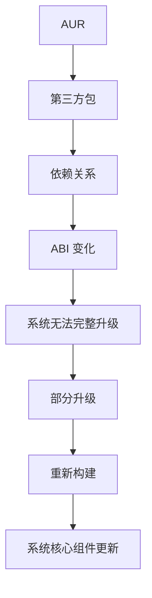
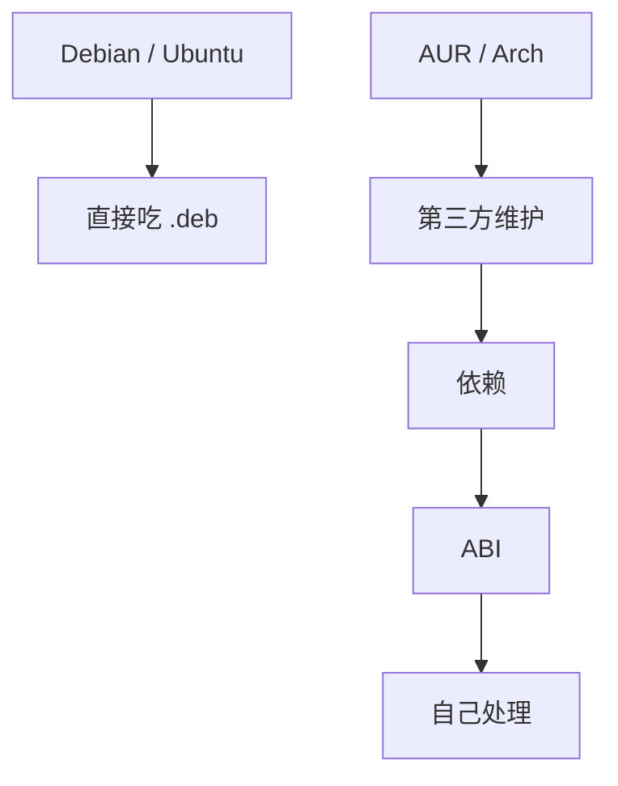

那台 RedmiBook 14 跟了我快六年，里面没什么重要数据，我早让它退休当实验机。

Windows 10 LTSC 负责日常，Linux 那块专门用来折腾。我选了 Nyarch。

结果最后是：Nyarch 被我整个卸掉了 (￣▽￣)／

## 开头其实挺顺的 🫠

Nyarch 装完，我先把它弄成能日常用的样子。

第一个装的是 Clash Verge Rev。它官方 Linux 主要提供的是 `.deb` 和 `.rpm`，没有 Arch 包，好在 AUR 里已经有人维护了：

```text
aur/clash-verge-rev-bin
```

于是直接：

```bash
yay -S clash-verge-rev-bin
```

装好了。接着是 Google Chrome。

然后为了让两台设备共用一套鼠标键盘，我装了 Deskflow。

这段是真顺。鼠标能滑到另一台机器上，键盘跟着鼠标走，我要的就是这个——鼠标在哪台电脑，键盘就输入哪台电脑。

基础环境这么顺，我还想着一边求稳、一边折腾，慢慢把它配成一台正经的 Linux 工作机。现在回头看，这是标准的立 flag。

然后就开始不对劲了。

## 剪贴板先不行了

Deskflow 的鼠标和键盘都正常，唯独两台机器之间的剪贴板死活不互通。

我当时的环境是：

```text
GNOME 50.1
Wayland
Deskflow 1.26.0
```

查了一圈，问题出在 Wayland 上：Deskflow 的剪贴板实现正在从旧的 `wl-clipboard` 路径迁到 XDG Desktop Portal，而我系统里的 `libportal` 是 `0.9.1-3`，没到新实现要求的版本。

按理说这不算事儿，滚一下系统就行。

问题是，我这系统偏偏滚不动。

我本来只想跑一句：

```bash
sudo pacman -Syu
```

结果直接撞上 Boost 依赖冲突。系统里现在是：

```text
boost        1.92.0-1
boost-libs   1.91.0-1
```

而我装的 `dwarfs` 还是 `0.15.3-1.1`，它要的是：

```text
libboost_chrono.so=1.91.0-64
libboost_filesystem.so=1.91.0-64
libboost_process.so=1.91.0-64
libboost_program_options.so=1.91.0-64
```

Boost 1.92 就这么被钉死在原地。

往下查更乐：`dwarfs` 根本不是 Arch 官方包，它是 Garuda Builder 构建出来的，而它又是 Gear Lever 的依赖。

所以实际卡住我的是个套娃——一个 AUR 软件的依赖，套着一个来自另一个发行版生态的旧包，把整台机器的系统升级按住了 (；´д｀)ゞ

AUR 上 `dwarfs` 已经有 `0.15.7-1` 了，那就升它吧。

## 硬盘这时候开始报警 🚨

这是整件事里最没想到的一环。

编译 `dwarfs 0.15.7`，进度走到 40% 左右，突然冒出：

```text
fatal error:
打开依赖文件 ...：只读文件系统
```

一查，根分区 `/dev/sda7` 已经变只读了。

再翻 `dmesg`，汗流浃背了：

```text
I/O error, dev sda, sector 896504184
```

```text
I/O error, dev sda, sector 959373296
```

一个 WRITE，一个 READ。后面紧跟着：

```text
Aborting journal on device sda7-8
```

以及：

```text
EXT4-fs ... IO failure
EXT4-fs ... Journal has aborted
EXT4-fs ... Remounting filesystem read-only
```

所以不是 `yay` 抽风，也不是 `dwarfs` 自己的锅——是这块用了六年的老 SSD，在高强度编译写盘的时候，实打实来了一次底层 I/O 超时。

我没接着往下挖。这台机器本来就准备退了，里面也没有要救的数据。

重启之后 `/dev/sda7` 又回到 `rw,noatime`，之后也没马上再报 I/O Error。

所以我的判断就是：这块老 SSD 确实出过一次明确的 I/O 异常，但它已经不是值得我继续花时间的东西了。

## 更新终于跑了，然后就炸了 💥

重启完看磁盘恢复了，我想那继续解决更新吧。

这次 `pacman -Syu` 一口气拉了：

```text
656 个软件包
约 1.7 GiB
```

包列表里已经能看到新的 `gcc-libs`。我那会儿还挺高兴，觉得折腾这么久终于要过去了。

然后 GNOME 和 Chrome 一起卡死。

整个桌面没响应，最后只能直接重启。

## GRUB：你别进来了

重启之后 GRUB 直接甩脸：

```text
loading linux linux
error: loader/i386/linux.c:grub_cmd_linux:710:invalid magic number.
Loading initial ramdisk
error: loader/i386/linux.c:grub_cmd_initrd:1082:you need to load the kernel first
```

进高级启动选项换备用 kernel，一样进不去。

到这儿其实没什么好纠结的了。一台没有重要数据、硬件本来就老、刚经历过一次 I/O Error、又在更新途中卡死、最后连 kernel 都起不来的机器……

我当时的想法就一个字：

算了 🙃

从入门到放弃，说的就是我这种。

## 卸了

回到 Windows 10 LTSC，开始清 Nyarch。

先删分区：

```text
/dev/sda6  2 GB
/dev/sda7  98 GB
```

再进 EFI 分区，里面有三个目录：

```text
Microsoft
Boot
nyarch
```

删掉 Nyarch 对应的 UEFI 启动项：

```text
{a9a683a2-aa5e-11f1-a430-806e6f6e6963}
```

最后删掉：

```text
S:\EFI\nyarch
```

这台机器又变回纯 Windows 10 LTSC，我继续当我的钉子户。

## 先叠个甲 🛡️

不是黑 Arch，不是给 Debian 打广告，也不是要说 Arch 不稳——老 SSD 的 I/O Error 不是 Arch 造成的，更新途中死机也不是 Arch 独有，中间一大半问题都出在我这台机器自己身上。

甲叠完了。**Arch 的维护模式不适合这台机器，也不适合我对它的定位。**

我想要的东西其实不复杂：装完能稳定用，中文输入正常，Chrome、Clash Verge Rev、Deskflow 都正常，偶尔还能拿来写写代码、折腾下 Linux。但最要紧的就一句——我不想天天维护系统。

而 Arch 实际给我的是这么一条链：



最后还附赠一次老 SSD 的 I/O 问题和一次中断的更新。

单拎出来一条都不算大事。全叠在一起，我就只剩一个念头：

我为什么要在一台准备退休的电脑上花这个时间？

## 下次不折腾这个了

这台机器以后要是再装 Linux，我不会优先选 Arch 系了。下一次大概是：

```text
Windows 10 LTSC
+
Debian Stable / Ubuntu LTS
```

因为我现在要的不是"最新"，是稳定、简单、能用。

还有个挺现实的原因。我一开始折腾 Arch，其中一个原因就是想装 Clash Verge Rev，它给的是 `.deb` 和 `.rpm`。

最后我发现，两条路差得不是一点半点：



Arch 折腾起来确实有意思。但对一台我想拿来用的老电脑，就不合适了。

## 也没白折腾 🔧

不是所有旧电脑都适合拿来跑 Arch。有的机器适合折腾，有的适合安安静静干活，这台 RedmiBook 14 明显是后者。

所以这次 Arch 之旅就到这儿了。不合适，卸了跑路，就这样。

折腾本身挺好玩的。但它开始让我觉得累的时候，我就知道该换系统了。
