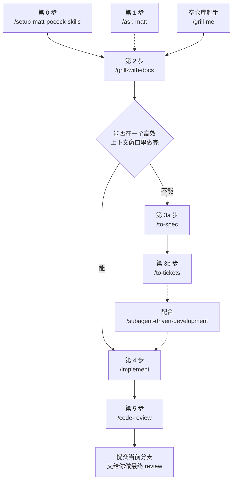

文章内容主要根据Matt Pocock的官方Youtube视频。原视频链接（可能需要科学手段）：

<iframe width="560" height="315" src="https://www.youtube.com/embed/M6mYodf0dJM?si=vYXdykrhAlIRqmwC" title="YouTube video player" frameborder="0" allow="accelerometer; autoplay; clipboard-write; encrypted-media; gyroscope; picture-in-picture; web-share" referrerpolicy="strict-origin-when-cross-origin" allowfullscreen></iframe>

作为拥有约 16 万星标、750 万次下载的 skills 仓库写的正式教程，以下将专门讲清楚各个技能该按什么顺序使用。

---

视频明确把整个流程归纳为五个核心技能的固定顺序：`/grill-with-docs`、`/to-spec`、`/to-tickets`、`/implement`、`/code-review`，外加一个一次性的仓库初始化方法。

## 贯穿全程的主要思想：上下文窗口是稀缺资源

Matt Pocock Workflow 系列技能主要在解决同一个问题——LLM的上下文窗口是有限的、且生成的质量会随使用上下文的长度衰减：

> 据我个人经验，对于现代的 LLM，虽然它们大多数都声称自己支持最大 1M Tokens 上下文，但根据智能体任务真实情况，当它们占用了 400K ~ 500K Tokens 以上上下文时，单次 API 调用质量与生成结果将较 200K ~ 400K 上下文时显著降低，这可能可以解释为现代 Transformer LLM 的注意力机制问题。因此，在 Claude Code 中，我一般倾向于限制上下文使用量不超过 40%，以此最大化发挥大模型注意力的潜力。

Matt Pocock Workflow 的技能旨在解决上述上下文工程问题。主要过程在于：

- `grill-with-docs` 管的是单次会话内的上下文；
- `to-spec`/`to-tickets` 管的是跨会话的上下文切分；
- `implement` 抛弃之前无用的上下文，根据现成计划专注于实现；
- 子代理 review 管的是“审查者要有新鲜的上下文”。这些技能大多是用户主动调用而非模型自动触发，所以平时只占用极少的 token（视频里给出的数字大约是 660 tokens），不会拖慢日常对话。

## 第 0 步：初始化工作流： `/setup-matt-pocock-skills`

在你已经配置好 Skills 的情况下，为了初始化 Matt Pocock Workflow，可以在仓库里运行一次 `setup-matt-pocock-skills`，它会:

- 写入仓库所需的配置文件（通常为你的 AGENTS.md），并引导会话应用工作流;
- 确保存在一个用来保存 spec 和 ticket 的 issue tracker，可以是 GitHub Issues、本地 Markdown，也支持 Jira、Linear 等;
- 配置分类（triage）标签，以及选择文档结构是单一上下文（大多数仓库推荐）或是面向大型 monorepo 的多仓库上下文。

## 第 1 步（可选）：`/ask-matt`

这是把 Matt 本人为你写的的一个讲解入口，专门用来讲解接下来该怎么走。如果你是第一次用不知道从哪下手时，可以尝试跑一步这个技能。之后的流程若你继续陷入疑惑，也可以引用这个技能以引导你的下一步操作。

## 第 2 步：`/grill-with-docs` —— 把模糊想法同步成共识

这是 Matt 工作流的主入口。它的主旨在于“防止大模型主观臆断或猜测需求”，启动计划模式并引用它将引导你启动一个 grilling-session（拷问流程/问答流程）。期间大模型将通过一问一答的访谈式会话来逐步打磨与细化真实需求、询问你实现的细节以保证大模型的理解与你同步。

P.S.

`/grill-with-docs`是 Matt 对于 `/grill-me` 的升级版。对于基于仓库的任务，它将开启一个基于状态运行的任务：它会把从 grilling-session 向你学到概念和决策，然后通过 `/domain-modeling` 写入 CONTEXT.md（项目术语列表）。从而让问答流程简化。

而对于一个空仓库起手，仅有模糊的预期想象、没有确切与细化的方案的任务，`/grill-with-docs` 将发挥有限的作用，因为它没有足够的背景知识来启动一个具体的问答流程。此时我将更建议你先使用 `/grill-me` 进行各项模糊需求的第一步细化，在建立充分的理解、上下文或初步需求文档之后再进行 `/grill-with-docs` 进行开工，此时大模型对模糊需求的理解将更为透彻，便于共识的同步。

## 分岔点：任务能不能在一个高效上下文窗口里做完

对于一个高效的上下文窗口（约 400K）之内的任务，我本人的界定通常是 4 个文件之内、1000 行修改以内，通常在于修改某一个特定元件的项目或功能、修订某一方面的需求等。其具体的边界因模型而异，需要你在长期的编程训练中的经验判断：

- 能 → 直接跳到 `implement`;
- 不能（需要多步完成） → 走 `to-spec` → `to-tickets`。

## 第 3a 步：`/to-spec` —— 把讨论转化成规格文档

先前的讨论仅为确立了一份详细的通用需求文档，但由于现在的修改面较大，其距离可真正上手操作的计划文档还有一段距离。

引用这个技能会将先前的 `grilling-session` 建立的上下文转化为具体的规格文档，并将其转化为更大模型友好的方式以便于执行（通常包含问题陈述、解决方案、用户协商、实现决策和测试决策）。同时建立 Issue Tracker，以更方便地管理后续计划的执行。

## 第 3b 步：`/to-tickets` —— 化为可独立执行的分步计划文档

引用这个技能将进一步将规格文档化为真正可以独立执行的 `PLAN.md` 并做好执行的准备。

这个技能设计的精妙指出在于：其生成的计划文档将按照 Matt 的 400K 上下文规则自动切分任务，将整体的计划文档划分为一步步独立的小会话来执行。

这里体现了整个方法论最核心的约束：上下文用量过大后模型出错、幻觉的风险明显上升，所以单次计划大小要按这个阈值来切。实现时逐步进行。

为了最大化体现上下文效用，通常我还会在此处使用 Superpowers 系列的 `/subagent-driven-development` 以保证每一步都拥有干净的上下文。

## 第 4 步：`/implement` —— 执行 + 内置验证

此技能会先跑一遍验证步骤（类型检查、构建等），接着根据现有已确认的计划文档执行，然后自动触发内置审查与验收，直至计划文件被标记为已完成。

## 第 5 步：`/code-review` —— 双轴审查，而且放进子代理里做

这个技能将做以下双轴审查：

1. **对照 spec**：确认验收标准都满足计划文件的要求；
2. **对照标准文档**：确认满足原需求文档的要求。如果仓库没有自己的标准文档，就退回到经典准则（参考 Martin Fowler），检测代码异味。

关键设计点是：审查要放到全新上下文的子代理里做，因为主代理刚写完代码往往会“停止继续挑毛病”，倾向于提前结束工作，且上下文污染严重。而子代理带着干净的上下文，能更客观地批判这段代码与具体实现。通过后就提交到当前分支，再交付于你做最终的 review。

## 一图记住这条链路

把上面五步串起来，实际走起来是这么个形状——实线是必经路径，虚线是按情况才挂上的支线：

`/ask-matt` 画成虚线，是因为它不在主链上：它是你迷路时随时可以回来敲的讲解入口，而不是必须走完的一环。`/subagent-driven-development` 同理，属于我个人的加法，用来把 `/to-tickets` 切出来的每一步都放进干净上下文里跑。
