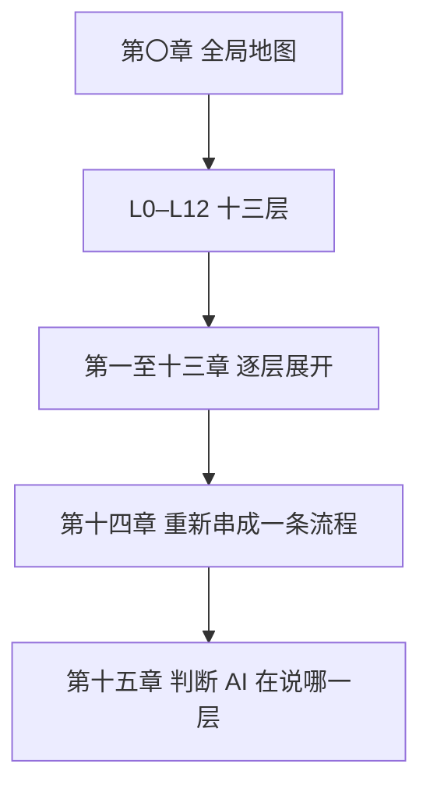
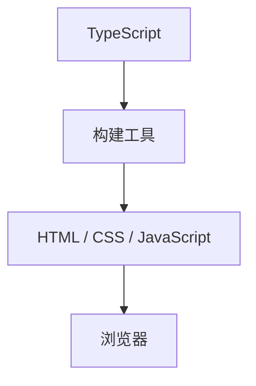
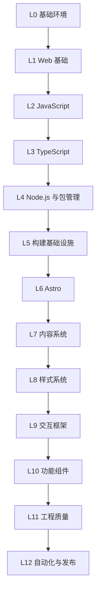
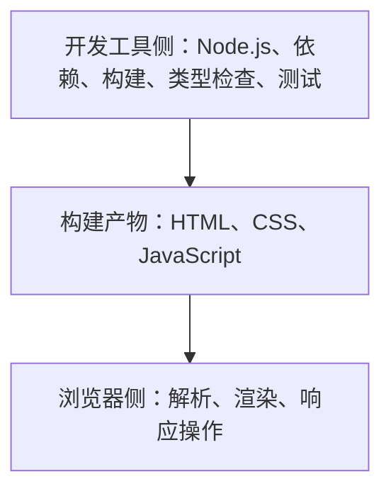
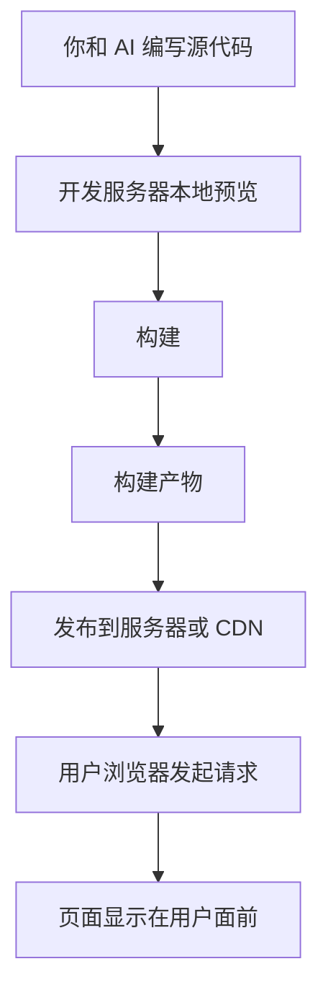

## 本章导读

你可能已经有过这样的经历：把一句「帮我做一个个人博客网站」交给 AI，几分钟后它开始输出一连串你并不熟悉的词——先装 Node.js，再运行 `pnpm install`，然后配置 Astro，最后跑一次 build 把项目发布到 Vercel。你照着一步步做完，网站确实上线了，浏览器里也能打开。但整个过程里你几乎没有判断力：不知道哪一步可以跳过，不知道一条报错意味着什么，也不知道 AI 换一种做法是不是更好。

这不是努力的问题。AI 把十几件互相关联的事压缩成了十几条命令，每一句都默认你已经有了一张地图，而你手上还没有。

这一章先给出那张地图，不解释任何具体技术：现代 Web 开发大致由哪些层组成，哪些东西最终会到达用户的浏览器，哪些只是在你自己的电脑上跑一跑，以及一个网站从一句需求走到用户屏幕上，中间要经过哪些环节。有了这张地图，后面每一章才有一个可以挂靠的位置。

## 本章在技术栈中的位置

第一至十三章各占一层，这一章不占任何一层。它给出的是整张图本身。

一本书如果只有分层，读者会拿到十三个互不相连的抽屉；如果只有流程，读者又会不知道某个环节属于哪一部分。本书两者都有：第〇章给出全景，第一至十三章逐层展开，第十四章把这些层重新串成一条真实流程，第十五章回到最初的问题——AI 说一句话的时候，你能判断它在动哪一层。

所以读这一章的时候，不需要记住任何工具名。你只要在脑子里留下几个位置，知道后面遇到陌生名词时可以往哪儿放。

## 读完本章，你应该能看懂

- “Install Node.js first.”
- “Run `pnpm install` to install the dependencies.”
- “Start the dev server and check it in the browser.”
- “Run the build before deploying.”
- “This component needs to hydrate on the client.”
- “Type check failed.”
- “Deploy the build output to production.”

这些句子本身不需要你现在就完全理解。这一章的目的是让你在读完时，至少知道每一句话大致指的是哪一类操作。

## 0.1 这本书解决什么问题

市面上大多数 Web 开发书，目标都是让你能亲手把网站写出来。本书的目标不是这个，这是它需要在开头就说清楚的第一件事。

### 0.1.1 从“学会写代码”到“看懂 AI 写的代码”

过去学 Web 开发，路径是明确的：先学 HTML，再学 CSS，然后 JavaScript，然后找一个框架，最后自己动手做一个项目。这条路径的前提是——代码要由你一行一行写出来，所以你必须掌握语法、API（别人写好、可以直接调用的功能入口）和常见写法。

现在这个前提变了。越来越多的网站，第一版代码不是人写的，而是 AI 写的。写代码这件事正在从「你必须会」变成「你可以让它发生」。但另一件事没有跟着变：**你得能判断它做对没有。**

可以这样区分两种能力：

动手能力，指你能不能把代码写出来。它靠反复练习获得，需要记住语法、熟悉 API、积累调试经验。

判断力，指当一段代码或一条指令出现在你面前时，你能不能说出它在做什么、为什么需要它、它动的是项目的哪一部分、以及它有没有可能带来麻烦。它靠理解概念之间的关系获得，不靠背，也不靠敲。

本书只训练第二种。

这个选择有一个直接后果：本书不会要求你跟着敲代码，也不会给你练习题。这是刻意的取舍，不是遗漏——练习和项目服务的是动手能力，如果把它们塞进来，会挤掉真正承载概念的正文。

### 0.1.2 AI 能替你完成什么

AI 在实际开发中替人完成的事情，比大多数人一开始以为的要多，但边界和「聪明程度」无关，而在于它处理的对象是什么。

AI 擅长的是有明确写法、有大量先例、对错可以立刻验证的工作。写一个页面的骨架、把一段重复的结构抽成一个组件、照着报错信息改配置、把一份数据整理成列表、给现有代码补上类型标注——这类事情它做得又快又稳。它们有一个共同点：正确的结果长什么样，是有共识的。

AI 也擅长解释。你贴一段看不懂的代码或一条报错，它能告诉你这段东西大致在干什么。这一点对本书的读者特别有用：本书给你的是一张地图，AI 可以随时帮你把地图上的某个点放大。

### 0.1.3 AI 不能替你理解什么

AI 不擅长、也不应该替你决定的事情，同样有共同点：它们都需要知道你没说出口的东西。

它不知道你的项目现在处于什么状态，除非你告诉它。它不知道你上一步为什么那样做。它不知道哪些文件是不能动的、哪些数据是不能丢的。它也不知道你真正想要的是「能跑就行」还是「以后还要长期维护」。

更要紧的是，AI 的输出看起来总是很有把握。它会用同样确定的语气说「这是标准做法」，也会用同样确定的语气建议你删掉一个你没看懂的文件。语气和正确性之间没有关系。

有三件事，本书希望你在读完以后不再交给 AI 替你判断：

- **它准备动什么。** “Remove node_modules and reinstall”和“Delete the lockfile”看起来都是清理，影响范围完全不同。
- **它为什么要动。** 同一个报错，可能是版本问题，也可能是配置问题；AI 的处理方式取决于它怎么归因。
- **这次改动会波及哪里。** 改一个构建配置可能让本地正常、线上失效。

这三件事都不需要你会写代码，但都需要你知道项目由哪些部分组成。这就是地图的用处。

### 0.1.4 什么程度才算“看懂”

本书对「看懂」的定义很具体，也很克制：

> 当 AI 在 Web 开发过程中提到某个概念、文件、工具、错误、命令或技术时，你能理解它是什么、为什么存在、处于哪一层、和哪些技术发生关系，以及 AI 当前大致在做什么。

这个定义有明确的上限。达到它之后，本书就停下来，不再往深处走。比如 JavaScript 只讲现代 Web 开发里反复出现的那部分，不写成完整语言教程；Git 只讲到能看懂 AI 的 Git 操作，不展开底层的对象模型；HTTP 只讲到能理解浏览器和服务器之间在做什么，不进入协议报文的全部细节。

如果某一个知识点还有大量进阶内容，本书会明确告诉你「到这里就够了」，而不是假装它已经讲完。

这个上限是可以自测的。读完一个概念以后，问自己一句话就够：**如果 AI 明天在真实项目里提到它，我能大致理解那句话吗？** 能，就说明深度已经够了。不能，说明还差一点，但也只是差一点，不需要一路追问到底层实现。

## 0.2 如何使用本书

本书同时服务两类读法，这两类读法对正文的要求不完全一样，所以需要先说清楚。

### 0.2.1 从头阅读：建立完整知识链

如果你没有系统学过现代 Web 技术，最合适的读法是从第〇章开始顺序读下去。

本书的章节顺序按技术栈的上下关系排：先讲最底层的运行环境，再往上走，最后到发布。它和难度顺序并不一致。这样安排的用意是，每读一章，你都站在一个刚刚铺好的地基上。

顺序阅读时，遇到陌生术语不需要停下来查。每个重要术语第一次出现时都会解释，并且会尽量先讲「实际发生了什么」，再给出它的正式名称。如果你在某一章遇到了一个还没解释过的词，那通常意味着它属于后面的某一层，正文会明确告诉你「这里先提一句，后面某一章会展开」。

### 0.2.2 按需查阅：把本书当作概念 Wiki

如果你已经有一定 Web 开发经验，更需要的是查阅。

本书的每一个二级、三级章节都尽量写成可以独立进入的。你可以在读到一个陌生术语时直接从目录跳到对应小节，读完就走，不需要补前文。为此，每个小节在需要时会自己补一句必要的背景，而不是写「这个前面已经讲过了」。

目录在这里是当作索引用的。三级标题里出现的名词，基本就是你要查的那个词。

### 0.2.3 不需要记住所有 API

本书不会要求你记住任何 API。

API 是可以随时查的东西，AI 也随时能帮你写出来（第三章会完整讲它）。真正需要留在脑子里的不是「这个函数叫什么」，而是「这件事通常由谁负责」。比如你不需要记住读文件用哪个函数，但需要知道：在浏览器里运行的代码，通常不能直接读写你电脑上的文件——因为浏览器不允许。

这是本书反复在做的一种替换：把一个要记的条目，换成一个能推理的判断。

### 0.2.4 不需要机械练习代码

本书不设练习题、课后作业和打卡任务，也不要求你跟着敲代码。

理由在 0.1.1 里说过：本书训练的是判断力，而判断力不通过重复敲打获得。你可以把本书理解成一份「AI 在说什么」的对照表，配合 AI 一起使用——你负责判断，AI 负责动手。

不练习不等于不验证。更好的用法是：读完一章以后，回到你自己的项目里，让 AI 做一件相关的事，然后试着在下命令之前说出它要动哪一层。说对了，这一章就过了。

## 0.3 本书的六问法则

本书解释每一个重要概念时，都会围绕同一组问题展开。这不是目录结构，而是一个思考框架。

### 0.3.1 它是什么

用准确但能理解的语言说清这个概念本身。

这里有一条纪律：不用另一个你还没解释过的术语来解释当前术语。如果必须用到，就先解释那一个。这一点看起来是常识，但技术文章里最常见的失败方式恰恰是拿三个陌生名词解释另一个陌生名词，读者一个都没接住。

### 0.3.2 为什么需要它

说明它解决了什么实际问题。

这一问的展开方式基本固定：原来是什么状态，出现了什么问题，为什么因此产生了这个技术。举例来说，与其直接写「Vite 是一个现代前端构建工具」，更有效的顺序是先说清楚：当项目只有几个 HTML、CSS、JavaScript 文件时，浏览器可以直接读它们；但当项目开始出现 TypeScript、第三方依赖、大量模块和生产环境优化，仅靠浏览器直接加载源码就开始变得困难。构建工具由此进入现代前端工程。说完这些，Vite 这个名字才有落点。

### 0.3.3 没有它会怎样

通过反事实来理解一个概念承担的职责。

这一问的目的不是夸大某个技术的重要性，而是让你看清它到底在负责哪一段。很多东西你在日常开发里根本感觉不到它存在，只有知道「去掉它会坏在哪里」，你才算真的知道它在做什么。

### 0.3.4 它处在整个技术栈的哪里

把它放到第 0.5 节那张全景图上，指出它属于哪一层、上面和下面分别是谁。

这一问是本书区别于普通术语表的地方。概念之间的关系，比概念本身的定义更值得记住。遇到层级、调用、数据流、转换过程这类关系时，本书默认用 Mermaid 图表示，比如：

图不替代讲解。每张图后面都会用正文解释它在说什么，如果只留下图，那说明这一段写得不够完整。

### 0.3.5 平时会在哪里看到它

指出这个概念在实际项目里出现的具体位置。

一个概念如果只停留在定义层面，你很快会忘掉它。但如果它和某个你每天都会看到的东西绑在一起，它就留住了。常见的落点包括：文件名、配置文件、项目目录、命令行、报错信息、浏览器开发者工具、AI 的修改说明、`package.json`、构建日志。

「平时会在哪里看到它」这一问，往往比「它是什么」更有用。

### 0.3.6 AI 什么时候会提到它

回到本书的出发点：AI 为什么会提到这个概念，它可能要求你做什么，你看到那句话时应该怎么理解。

这一问还负责区分两种情况——哪些操作属于常规行为，可以直接配合；哪些操作需要先停下来看一眼。同一个报错，AI 说「重装一下依赖」和说「把依赖升到最新版本」，听起来都是在修问题，但前者通常只是把已经装过的版本重新装一遍，后者会改变项目实际使用的版本。

六问法则是一个框架，不是六个标题。正文不会把它机械地写成「第一问、第二问」，而是自然地回答这些问题。你在读的时候能感觉到它们在，但看不到它们被列出来。

## 0.4 AI 黑话翻译

AI 描述自己的操作时，习惯用行业里通用的说法。这些说法对流利使用工具的人是清楚的，对刚上手的人则像暗号。

本书会在正文里就地翻译这类表达。翻译的重点不是英译中，而是说清 AI 这句话实际上准备对项目做什么。

下面六句是后面十三章里出现频率最高的。现在不理解细节没关系，先看看这个栏目长什么样。

### 0.4.1 “安装依赖”是什么意思

> **AI 可能会说：**
>
> “Run `pnpm install` to install the project dependencies.”
>
> **翻译成人话：**
>
> 这个项目的代码里有一份清单，写着它需要用到哪些别人已经写好的程序包。这些包现在不在你的电脑上，这条命令就是照着清单把它们下载下来、放到项目里。
>
> **实际发生的是：**
>
> 一个叫 pnpm 的工具读取项目根目录下的 `package.json`，算出完整的需求列表，然后从网络上的软件仓库把包取回来，放进项目里的 `node_modules` 目录。如果项目里已经有一份记录着每个包**具体版本**的锁文件（`pnpm-lock.yaml`），pnpm 会优先照着它装，不再重新计算该用哪个版本。

「依赖（Dependency）」这个词在本书里会反复出现。它的意思很简单：你的项目需要别人已经写好的东西。这件事由第四层的 Node.js 与包管理负责，第五章会完整展开，锁文件也在那里讲。

### 0.4.2 “启动开发服务器”是什么意思

> **AI 可能会说：**
>
> “Start the dev server and open `localhost:4321`.”
>
> **翻译成人话：**
>
> 在你自己的电脑上开一个临时的小型网站服务，让你能用浏览器打开这个项目看效果。它只在你本机有效，别人访问不到。

为什么不能直接双击打开那个 HTML 文件？因为现代项目的源码往往不是浏览器能直接读的格式，而且你希望改完代码后页面能自动更新。这个临时服务承担的就是「把源码即时变成浏览器能看的东西」这件事。「开发服务器（Dev Server）」和构建的关系在第六章展开。

### 0.4.3 “构建项目”是什么意思

> **AI 可能会说：**
>
> “Run the build, then check the `dist` folder.”
>
> **翻译成人话：**
>
> 把适合人阅读和编辑的源码，转换成浏览器直接能用的文件。转换的结果放在一个新的目录里，那个目录才是最终要发布出去的东西。

有一个区分本书希望你尽早建立：**你写的文件，和浏览器读的文件，通常不是同一批文件。** 0.5.3 会专门讲这个区别，第六章讲转换过程本身。

### 0.4.4 “Hydrate 这个组件”是什么意思

> **AI 可能会说：**
>
> “This component needs to hydrate on the client.”
>
> **翻译成人话：**
>
> 这段页面的 HTML 已经生成好并送到了浏览器——文字能选中、链接能点，但这个按钮对应的交互还不会发生。Hydrate 的意思是让浏览器用 JavaScript 接管这段已有的结构，补上交互能力：按钮能响应点击，输入的内容也会被应用接住。

**Hydration（水合 / 客户端接管）** 这个词在讲交互框架时会反复出现。它说的是页面结构与交互能力由不同环节补齐：HTML 先在服务器或构建过程中生成好，JavaScript 再由浏览器接管。第十章展开。

### 0.4.5 “类型检查失败”是什么意思

> **AI 可能会说：**
>
> “Type check failed: `Property 'title' does not exist`.”
>
> **翻译成人话：**
>
> 有一种工具会检查代码里对数据形状的约定有没有被违反。它不运行代码，只读代码，所以它报告的问题不一定马上会出错，但通常意味着某个地方不一致。

这类报错的实际含义是「代码内部前后说法不一致」，不是「网站坏了」。这个区分在你决定要不要立刻修它的时候很有用。第四章展开。

### 0.4.6 “部署到生产环境”是什么意思

> **AI 可能会说：**
>
> “Deploy the build output to production.”
>
> **翻译成人话：**
>
> 把上一步构建出来的文件，放到真实用户能访问的服务器上。做完这一步，网站就不只是你能看见了。

「生产环境（Production）」指的是真实用户正在使用的那个环境，和你在自己电脑上跑的环境不是一回事。这个区别在 0.5.4 里讲，第十三章讲具体怎么做。

## 0.5 现代 Web 技术栈全景

前面四节讲的是这本书怎么读。这一节给出地图本身，也是全书唯一一次把十三层完整列出来。

### 0.5.1 L0 到 L12 的十三层结构

现代 Web 开发涉及的名词很多，但它们并不并列——彼此之间有上下关系。本书把它们排成十三层，从最底层的运行环境一直到最上层的发布，一层对应一章。

这张图就是后面十三章的目录。

最下面的两层是浏览器和网页本身。L0 是这些东西得以运行的前提：操作系统、命令行、浏览器，以及浏览器和服务器之间说话的方式。L1 是网页的基本材料——HTML 描述结构，CSS 描述外观，浏览器把这些材料变成你能看见的页面。

再往上是语言层。L2 的 JavaScript 让页面能对操作做出反应；L3 的 TypeScript 在 JavaScript 之上加了一层类型约定，让错误在运行之前就能被发现。

L4 和 L5 是两类容易被初学者混在一起的东西。L4 的 Node.js 让 JavaScript 能离开浏览器、在你自己的电脑上运行，包管理则解决「用别人写好的东西」这件事。L5 的构建解决的是另一个问题：源码和浏览器能直接读的文件之间有差距，得有工具来做这个转换。

L6 到 L10 是网站本身被组织起来的过程。L6 的 Astro 负责把整个站点的结构组织好；L7 处理文章这类内容如何变成网页；L8 处理样式如何从零散的 CSS 变成一套统一的设计体系；L9 的交互框架负责页面里需要动态变化的部分；L10 负责当现成框架不够用时，如何引入第三方功能。

最上面的两层和质量、发布有关。L11 关心「能运行」之外的工程问题——类型检查、代码格式、测试。L12 把网站送到互联网上。

有一个地方需要说清楚，免得你把它理解得太严格：**这十三层不是一条严格的依赖链。** L7 的内容系统并不需要 L9 的交互框架才能工作，很多网站根本不用交互框架。分层回答的不是「谁依赖谁」，而是「AI 现在动的这个东西，属于项目的哪一部分」。第十四章会把它们重新串成一条真实流程，那时你会看到层与层在实际工作里是怎么交替出现的。

### 0.5.2 浏览器侧与开发工具侧

初学者最容易混淆的一件事，是把项目里所有的东西都当成「网站的一部分」。

实际情况是：一个现代 Web 项目里的文件，绝大部分永远不会到达用户的浏览器。

浏览器渲染一个页面，依赖的只有三类语言：HTML、CSS 和 JavaScript——而且通常还是被构建工具重新生成过的那一份。图片、字体、音视频这些资源也会到达用户设备，多数情况下由这三类文件引用之后再单独请求，但它们本身也有独立地址，可以直接打开。TypeScript 文件、`.astro` 文件、`node_modules` 目录、各种配置文件，全都留在开发工具这一侧。

这个区分能解释一个常见的困惑。当 AI 说「升级一下这个依赖」或者「改一下构建配置」时，它动的是开发工具侧，用户看到的页面可能一点变化都没有；而当它说「这个样式没生效」时，问题可能出在浏览器侧。判断 AI 在动哪一侧，是读它输出时最基本的一次定位。

### 0.5.3 源代码与构建产物

**源代码（Source Code）** 是你和 AI 编辑的文件。**构建产物（Build Output）** 是浏览器真正读取的文件。在有构建这一步的项目里，两者是两批不同的文件。

这个区分带来几个很实际的推论。

改源代码不会自动改变用户看到的东西，中间必须经过一次构建。反过来，构建产物通常不应该手工去改，因为下一次构建会把它整个覆盖掉——AI 偶尔会建议你直接改生成出来的文件来「快速修好」，那只是一时的。另外，构建产物通常是可重建的：删掉后重新构建一次就回来了。不过重建得到的是新的一版——如果构建时会从外部拉取内容，结果不一定和原来那一版完全一致；而源代码删了就是真的没了。这两类文件在 AI 的删除建议里风险完全不同。

具体哪个工具负责构建、产物放在哪个目录，会随着工具和版本变化。这里需要先建立的是区分本身：哪些文件是给人看的，哪些文件是给浏览器看的。

### 0.5.4 开发环境与生产环境

同一份代码，会在两种环境里运行。

**开发环境（Development Environment）** 跑在你自己的电脑上。它的目标只有一个：让你改完代码马上能看到效果。所以它容忍慢、容忍体积大、报错尽量详细——详细到能把内部结构暴露出来，因为只有你能看到。

**生产环境（Production Environment）** 跑在真实用户访问的地方。这里的目标反过来：页面要快、文件要小、缓存要生效，而且内部错误细节不能显示给用户——堆栈、服务器路径、依赖版本这类信息不该公开，用户看到的只是简短的提示文案。

这个区别解释了一类很常见的现象：一个功能在你本地完全正常，发布以后却坏了。原因通常不是代码写错了，而是某些只在开发环境成立的假设——比如某个接口地址、某个环境变量、某个调试开关——在生产环境里不成立。

当 AI 说 “works locally but fails in production” 的时候，它说的就是这个区别。第十三章会讲这两个环境是怎么分开的。

### 0.5.5 一个网站从代码到用户屏幕的完整旅程

把前面几节串起来，一个网站从一句需求走到用户屏幕上，大致经过这样几个环节。

这条链上的每一步，前面都对应过：A 到 B 属于开发环境和开发工具侧；C 到 D 是构建，把源码换成浏览器能读的文件；E 是部署，把产物送到生产环境；F 到 G 回到浏览器侧，也就是 L0 和 L1 那一端。

这条链的形状有个特点：它最后回到了起点附近。整个现代 Web 工具链存在的意义，是生成浏览器认识的 HTML、CSS 和 JavaScript，而不是取代它们。图片、字体这类资源不由工具链生成，但它们会和产物一起发布，其中一部分还会被压缩、改名或转成更小的格式。理解这一点，后面很多设计上的疑问会自己消失。

这里给出的是简化版本。真实的项目里，这条链会分叉、会循环，还会有自动化在每次提交时重跑一遍。第十四章会在你已经认识十三层之后，把完整流程重新串一次。

## 0.6 本章小结

这一章没有讲任何具体技术，只做了两件事：说明这本书训练什么，以及给出一张地图。

需要留下的整体认知是：现代 Web 开发是一个分层的系统，从操作系统和浏览器一直排到自动化与发布，共十三层，一层一章。这些层里，只有浏览器能直接读的那部分会送到用户设备；TypeScript、`.astro` 源文件、依赖目录、配置文件都留在开发工具侧。

同时留下的还有一个区分：源代码是给人编辑的，构建产物是给浏览器读的；开发环境服务你自己，生产环境服务真实用户。后面很多看起来复杂的说法，最后都会落到这两个区分上。

本书训练的是判断力而不是动手能力。你不会在这里学到怎么写代码，但你应该能在读完以后，听到 AI 说出一个陌生的技术名词时，先判断出它属于哪一层，再决定要不要担心。

到这里，地图已经在你手上了。接下来进入 L0——操作系统、命令行、浏览器和网络。所有那些工具和文件，最终都要运行在某个操作系统上，通过命令行被启动，通过网络把结果送到浏览器。下一章从一个最容易被忽略的问题开始：当 AI 让你「打开终端」的时候，它到底在让你操作什么。
