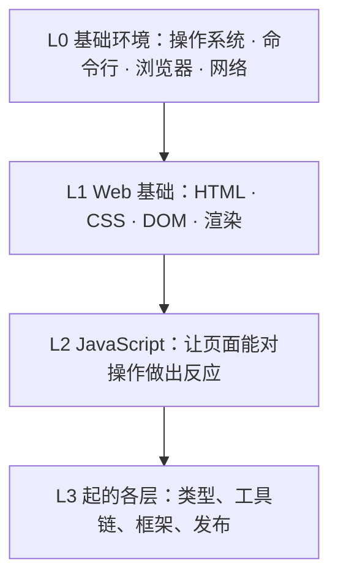
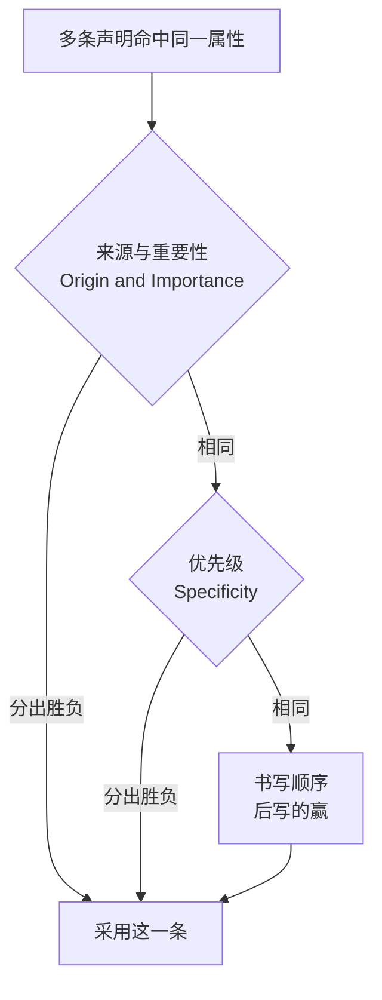
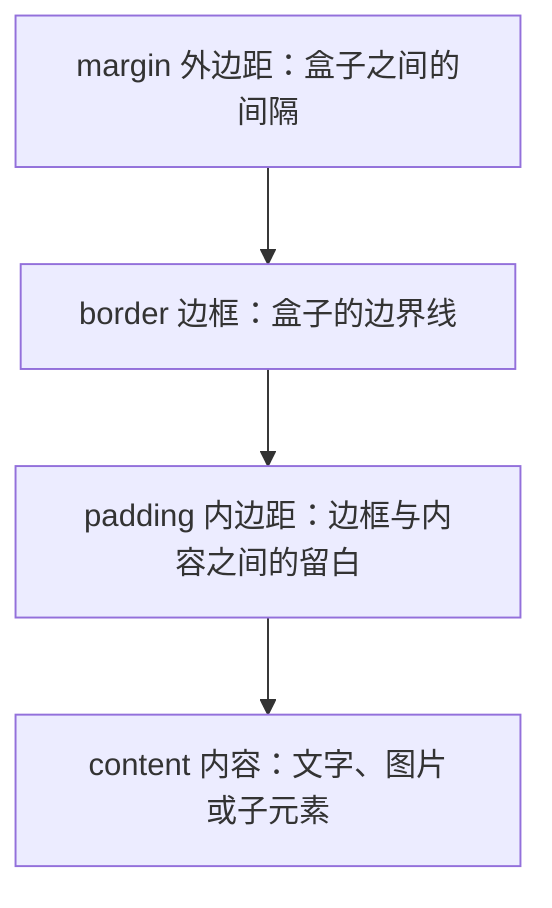
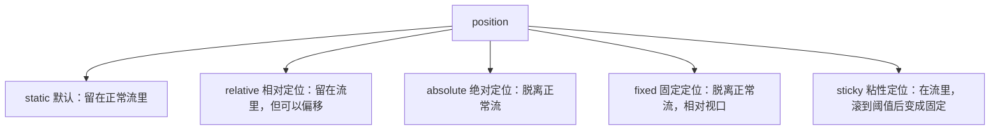
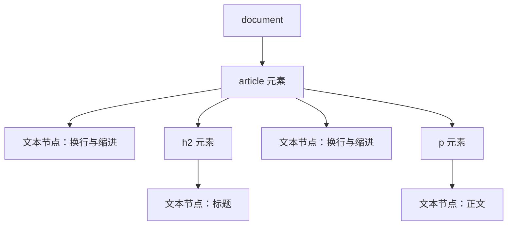
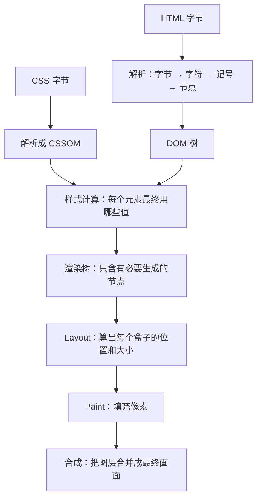
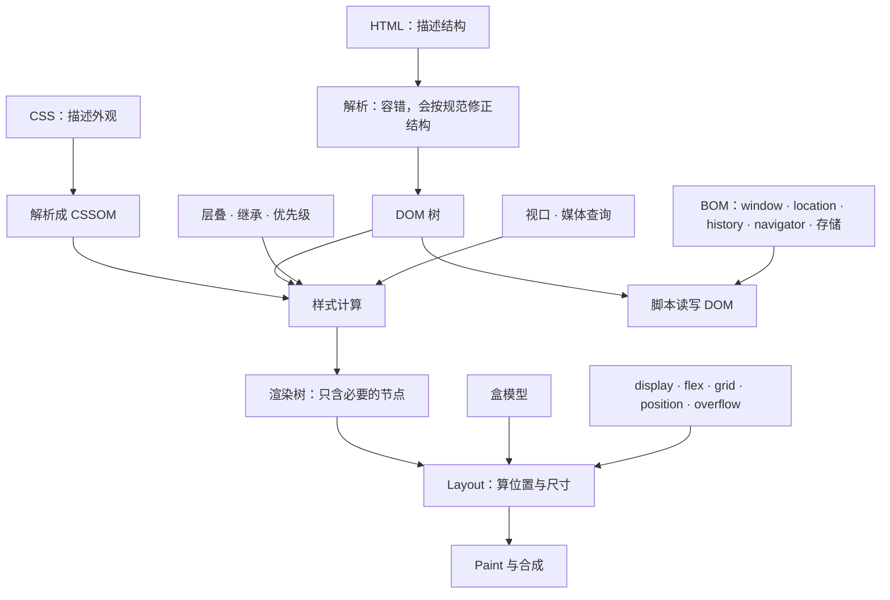

## 本章导读

AI 给你一段 HTML 和一段 CSS，页面出来了，看起来还不错。麻烦从你想改动它的时候开始。

你想让标题变红，于是在样式表里加了一行，刷新，没反应。AI 看了一眼说：「这条规则被优先级更高的选择器压住了。」你想让两个盒子并排，AI 说：「把它们的父元素设成 `display: flex`。」你照着改，成功了，但你并不知道刚才发生了什么。还有一次，你把一个元素设成 `display: none`，它消失了，可另一个元素的间距也跟着变了，AI 说：「那是外边距折叠。」

这些话你都能照着做，甚至做对了。但它们说的是什么，你答不上来。优先级、层叠、盒模型、外边距折叠、正常流、渲染树：这些词不像 `pnpm install` 那样有明确的动作，它们描述的是浏览器内部一套一直在运转的规则。

这一章讲的就是这套规则。上一章的 L0 是网页运行的场地：操作系统、命令行、浏览器、网络。从这一章开始，我们终于要看那个被送到浏览器里的东西本身：HTML、CSS，以及浏览器把它们变成画面的过程。

需要先说清这一章的边界。它不是 HTML 和 CSS 的教程。标签怎么拼、属性有哪些、Flexbox 有多少个属性，这些查文档比读书快，AI 也随时能写给你。这一章要回答的是另外一类问题：浏览器拿到这些文件之后做了什么，以及为什么你改了代码却没有得到预期的结果。前一半是浏览器的构造，后一半是判断的依据。

## 本章在技术栈中的位置

L1 是浏览器直接认识的那一层。上一层的所有工具——TypeScript、构建工具、框架、样式系统——存在的意义，都是最终生成这一层的东西；而这一层之下的 L0，是它得以运行的前提。



这一章的九节分成三组。2.1 到 2.6 讲浏览器直接读的两样材料：HTML 描述结构，CSS 描述外观。2.7 和 2.8 讲浏览器读完之后的产物：DOM 与 BOM，它们是代码操作页面的入口。2.9 把前面全部串起来，看一份文件从字节变成画面的完整流程：这一节也是全章最重要的收束。

有两处深浅需要提前交代。HTML 和 CSS 的语言细节只讲到你能看懂 AI 的描述为止，不展开属性大全；而 DOM 与渲染流程会讲得比通常的入门材料更细一些，因为它们是后面每一个框架、每一个「为什么没生效」的问题的共同底座。

## 读完本章，你应该能看懂

- “Add a class to that element and style it.”
- “The parent needs `display: flex`.”
- “That rule is being overridden — check the specificity.”
- “The margins are collapsing.”
- “It's `position: absolute`, so it's out of normal flow.”
- “Use `querySelector` to grab that node.”
- “It won't show up because it's not in the render tree.”
- “Move the critical CSS inline so it doesn't block rendering.”

这八句话本身不需要你现在就完全理解。读完这一章，你至少应该知道每一句在说浏览器的哪一部分、以及它为什么会导致你看到的现象。

---

## 2.1 HTML

这一节讲 HTML 是什么，以及它的几个基本单位：元素、标签、属性。这些词在日常对话里经常被混用，混用本身不影响沟通，但 AI 描述改动时会用到它们的差别：「给这个元素加个属性」和「改一下这个标签」说的不是同一件事。

这一节也会交代一件比语法重要得多的事：HTML 是一份**容错**的格式，浏览器不会因为你写错了就拒绝渲染。这决定了你在排查问题时的第一步该做什么。

### 2.1.1 HTML 是什么

**HTML（HyperText Markup Language，超文本标记语言）** 是用来描述网页**结构**的格式。它说明一个页面里有哪些内容、这些内容分别是什么角色、谁包含谁。

有两个说法需要纠正，因为它们直接影响你读 AI 输出时的预期。

第一，HTML 不是编程语言。「标记语言」里的标记指的是给内容打上标签，说明「这是一级标题」「这是一个段落」「这是一个链接」。它没有变量、没有条件判断、没有循环。所以当 AI 说「这段逻辑应该放在 JavaScript 里」，意思是这件事 HTML 表达不了。

第二，HTML 不描述外观。「一级标题」说的是这个内容在结构上的级别，不是说它应该多大、多粗、什么颜色。外观归 CSS 管。这个分工在 2.3 会展开，但先记住结论有好处：当 AI 说「这个标题的样式不对」，它说的通常不是 HTML 的问题。

关于版本，有一个反复出现的误解需要清掉：今天的 HTML 没有版本号。你可能见过 “HTML5” 这个说法，它来自 2014 年的一次标准化；但 2019 年之后，HTML 由 WHATWG 维护为一份持续更新的 **Living Standard**（活标准），不再发布“HTML6”“HTML7”。当 AI 说「用 HTML5 的语义标签」时，那是一句沿用过时叫法的口语，实际意思是「用现在标准里的语义标签」。

### 2.1.2 Element

**元素（Element）** 是 HTML 文档的结构单位。一个元素通常由三部分组成：一个开始标签、中间的内容、一个结束标签。

```html
<p>这是一段文字</p>
```

`<p>` 是开始标签，`</p>` 是结束标签，中间的文字是这个元素的内容。这三部分合起来构成一个段落元素。

元素是可以嵌套的，嵌套关系构成一棵树：一个元素里面可以有别的元素，被包含的那个叫子元素，包含它的叫父元素。这棵树就是后面 DOM 那一节要讲的东西的雏形。

```html
<article>
	<h2>标题</h2>
	<p>正文</p>
</article>
```

这段结构里，`article` 是父元素，`h2` 和 `p` 是它的两个子元素，两者互为兄弟。父子的说法不是修辞：DOM 里真的就是这么组织的，2.7.2 会把它画出来。

需要留意的是，元素并不总是这三个部分齐全。有一类元素没有内容，也就没有结束标签，它们叫**空元素（void element）**，`img`、`br`、`input`、`hr`、`meta`、`link` 都属于这一类。看到 `` 后面没有 `</img>`，那不是漏写了。

### 2.1.3 Tag

**标签（Tag）** 是元素在源码里的书写形式，也就是那些尖括号。它是**写法**，元素是**结构**，这个区分在 AI 说「把这段包在一个标签里」时用得上：它说的是加一对尖括号，而结果是多了一个元素。

标签分三种形态。开始标签写成 `<p>`，结束标签写成 `</p>`（多一个斜杠）。空元素只有开始标签，写成 ``。

开始标签里可以写属性。属性与标签名之间用空格隔开，多个属性之间也用空格隔开：

```html
<a href="/about" class="nav-link">关于</a>
```

这一行里，`a` 是标签名，`href` 和 `class` 是两个属性。属性只写在开始标签里：这一点看起来是废话，但在 HTML 里写错位置是常见的手误。

### 2.1.4 Attribute

**属性（Attribute）** 是写在开始标签里的附加说明，形式是「名字＝值」。

```html

```

这行里 `src` 说明图片文件在哪，`alt` 是图片的文字替代，`width` 给出宽度。三个属性各自回答一个具体问题，这是属性的通用形态：标签名说明这是什么元素，属性说明这个元素的具体情况。

有三种形态需要认识。

**布尔属性**只写名字、不写值。`disabled`、`checked`、`required` 都是这一类。写 `<input disabled>` 和写 `<input disabled="disabled">` 效果一样：只要这个名字出现，它就是真。这一条有一个直接后果：

```html
<input disabled /> 禁用 <input disabled="disabled" /> 同样禁用
<input disabled="false" /> 仍然禁用 —— 值是什么不影响判断
```

第三行是最容易踩的：想用 `false` 打开一个布尔属性是做不到的，要让它完全生效必须**整个属性都不写**。AI 让加布尔属性时，写名字就够了。

`data-` 开头的自定义属性用来给元素挂任意数据，`data-id="42"`、`data-state="open"` 都行。它们不影响渲染，是给 JavaScript 读的。你在 AI 生成的代码里看到这类属性，说明某段脚本要靠它找到或判断这个元素。

`class` 和 `id` 是最常用的两个属性，用来给元素起名字，供 CSS 和 JavaScript 定位。它们的职责差别在 2.3.4 专门讲。

还有一点要说明：**属性名不区分大小写**，`HREF` 和 `href` 一样；但属性**值**在很多情况下区分大小写，比如 `class` 的名字和 `id` 的值。所以 AI 写 `class="Card"` 而你写成 `class="card"`，CSS 就找不到了。

### 2.1.5 文档结构

一份完整的 HTML 文件有固定的骨架：

```html
<!DOCTYPE html>
<html lang="zh-CN">
	<head>
		<meta charset="utf-8" />
		<title>页面标题</title>
	</head>
	<body>
		<h1>页面内容</h1>
	</body>
</html>
```

第一行的 `<!DOCTYPE html>` 不是元素，是一条给浏览器的声明。它的作用很具体：**让浏览器进入标准模式（standards mode）**。如果省略它或者写错，浏览器会退回一种叫**怪异模式（quirks mode）**的兼容行为，某些布局计算会和老式浏览器保持一致，于是你按标准写的 CSS 会得到意料之外的结果。

这是一个很小但很实用的排查点：页面布局出现莫名其妙的偏差时，先看一眼第一行还在不在。有些工具、有些模板拼接、有些手工复制会把它弄丢，而它丢了之后页面不会报错，只是行为变了。

`<html>` 元素是整份文档的根，`lang` 属性声明主要语言（影响屏幕阅读器的发音、浏览器的翻译提示）。里面只有两个子元素：`head` 和 `body`。

### 2.1.6 head 与 body

这两个元素的分工，可以概括成一句话：`head` 里的东西给浏览器和机器看，`body` 里的东西给人看。

`head` 放着描述这个页面本身的材料，它们不出现在页面上：字符编码声明、页面标题、样式表链接、脚本、给搜索引擎和社交平台看的描述信息。你在 AI 输出里看到的 `<meta>`、`<link>`、`<title>` 通常都在这里。

`body` 放着页面的实际内容：用户会看到的每一个字、每一张图、每一个按钮。

有一个区分在排查时很有用：`head` 里出问题，症状通常是「整页都不对」（中文全是乱码、样式完全没加载、标题栏文字不对）；`body` 里出问题，症状通常是「某一块不对」。看到一个页面整体异常时，先去 `head` 找。

顺带解释一个具体现象。中文网页出现乱码，最常见的来源是 `<meta charset="utf-8">` 缺失或与实际编码不符。1.7.3 讲过，服务器返回内容时会带上 `Content-Type` 说明编码；HTML 里的这个 `meta` 是第二道声明。两道声明不一致时，浏览器以响应头为准：这也是为什么「本地打开正常、部署后乱码」是可能的。

### 2.1.7 HTML 语义化

**语义化（Semantic HTML）** 指的是：在能达到同样视觉效果的前提下，选择含义正确的元素。

一个按钮用 `<button>` 写还是用 `<div>` 加样式写，在屏幕上可以长得一模一样。区别不在外观，在这几件事上：键盘能不能用 Tab 聚焦到它、按回车能不能触发、屏幕阅读器会不会念出「按钮」、浏览器和搜索引擎能不能判断这块内容是什么。

语义化不是审美偏好，它带来的是**可用的功能**。用 `<h1>` 而不是「一个很大的 `<div>`」写标题，屏幕阅读器用户才能按标题跳读；用 `<nav>` 而不是「一个装着链接的 `<div>`」，辅助工具才能识别这是导航区。

不过这里也要防止走过头。语义化有明确的收益，但不必为了凑语义而给每个 `<div>` 找一个「更正确」的标签。AI 有时会建议把普通容器换成 `<section>` 或 `<article>`，如果那个容器并没有对应的内容含义，换了也只是让结构更啰嗦。判断标准是：这个元素在传达一个真实的结构含义吗？ 是就换，不是就保持 `<div>`。

HTML 的这五个基本概念——元素、标签、属性、文档结构、语义——是这一章的起点。接下来看具体有哪些常用元素。

## 2.2 常见 HTML 元素

元素有上百个，但日常开发里反复出现的就是下面这些。这一节的重点不是记住用法——那些查文档更快——而是认出 AI 提到它们时在说什么，以及知道哪些元素带着容易踩的行为。每个元素只讲它最要紧的一点。

### 2.2.1 标题与段落

`<h1>` 到 `<h6>` 是六级标题，`<p>` 是段落。这两个大概是整份文档里出现频率最高的元素。

标题的级别表示**结构层级**，不表示字号。`<h2>` 比 `<h3>` 高一级，说的是「这个标题统辖后者」，不是说它应该更大。字号是 CSS 的事。

这个区分有实际后果。AI 有时会说「把这里的 `h3` 改成 `h2`」，它可能在做两件完全不同的事：修正结构（这一段确实属于上一级），或者只是想让字大一点。前者是对的，后者应该改 CSS。看到 AI 动标题级别时，问一句它是在改结构还是在改外观，是一个很有效的判断。

另外，`<h1>` 通常一页一个，代表页面的主标题。AI 生成的页面有时会出现多个 `<h1>`，那多半是模板拼接的结果，不是设计意图。

### 2.2.2 链接

`<a>` 是链接，用 `href` 指明目标。1.5.8 讲过的相对 URL 与绝对 URL 在这里落地：

```html
<a href="/about">关于</a> 从网站根算起 <a href="about">关于</a> 从当前页面算起
<a href="https://example.com">外部</a> 绝对 URL
<a href="#section-2">跳到第二节</a> 页面内跳转，用的是 id
```

第四行是 1.5.7 讲的 Fragment 最常见的用途：`#` 后面的内容不会发给服务器，浏览器自己在页面里找 `id` 等于它的元素并滚过去。

`target` 属性控制在哪里打开。`target="_blank"` 是新标签页，这在 AI 生成的代码里很常见。

关于它有一个流传很久的说法需要更新：早年 `<a target="_blank">` 有一个安全隐患，新开的页面能通过 `window.opener` 反过来操纵你的页面，所以那时要求搭配写 `rel="noopener"`。现在规范已经把这件事收进去了，判定一条链接是否按 noopener 处理时，规范里的规则是：只要 `target` 是 `_blank`，且没有显式写 `rel="opener"`，就按 noopener 处理。

这里有一个细节要留意，它容易让人误判：这是行为规则，不是属性值。在本机实测里，一个写了 `target="_blank"` 的链接，它的 `relList` 是**空的**：你去 DOM 里查，看不到 `noopener` 这三个字。「AI 没写 `rel="noopener"`，是不是不安全」这个问题的答案是：现状下不必担心；但如果你看到 AI 仍然主动补上它，那也只是过时的谨慎，不是错误。

### 2.2.3 图片

`` 用 `src` 指明图片文件。它是空元素（2.1.2 讲过），没有结束标签。

最需要理解的是 `alt`。它提供图片的**文字替代**，用途不止一个：图片加载失败时显示这段文字，屏幕阅读器用它念出图片内容，搜索引擎用它理解图片。

规范对它的要求比多数人以为的严格。原文规定：除个别情况外，`alt` 属性必须写上，而且值不能为空，值要能作为图片的恰当替代。规范还给了一条很好的自测方法：把页面上的每张图都换成它 `alt` 里的文字，页面的意思不应该发生变化。另一条更直白的说法是：想象你在电话里把这一页念给别人听，你会怎么描述这张图。

那「个别情况」是什么？**纯装饰性的图片**：那些不承载信息、只起视觉作用的图，这时应当写 `alt=""`（空字符串），明确表示「请跳过它」。

`alt=""` 和干脆不写 `alt`，在规范里是两件不同的事：前者是「我知道这里有张图，它没有信息」，后者是「我漏了」。这个区别在机器读到的属性值上看不出来：本机实测，省略 `alt` 时读属性得到 `null`，而读 `img.alt` 得到空字符串，两种写法在属性访问上表现一致。区别体现在规范含义和辅助工具的处理上。

还有两个属性在 AI 输出里出现得越来越多。`loading="lazy"` 让图片滚到附近才开始加载，用于首屏之外的图。`width` 和 `height` 同时写上，可以让浏览器在图还没下载完时先按比例留好位置，避免加载过程中页面内容跳动：这就是 AI 说的 “layout shift”。

### 2.2.4 列表

`<ul>` 是无序列表，`<ol>` 是有序列表，`<li>` 是列表项。三者配套使用：`li` 只能作为 `ul` 或 `ol` 的直接子元素。

导航菜单用 `ul` 装链接是最常见的用法，这不是「用列表假装菜单」，而是语义上确实是一组并列项。

`<dl>` 是描述列表，由 `<dt>`（术语）和 `<dd>`（描述）成对组成，适合「名称—值」这类内容，比如术语表、常见问题。它出现频率不高，但 AI 在生成「元信息」区块时会用到。

### 2.2.5 表格

`<table>` 是表格，`<tr>` 是一行，`<th>` 是表头单元格，`<td>` 是普通单元格。`<thead>`、`<tbody>`、`<tfoot>` 把表格分成表头、主体和页脚。

表格在 HTML 里有一个很特别的性质：浏览器会在解析时补上你没写的结构。

本机实测过这件事。源码里只写：

```html
<table>
	<tr>
		<td>A</td>
	</tr>
</table>
```

浏览器解析之后的 DOM 是：

```html
<table>
	<tbody>
		<tr>
			<td>A</td>
		</tr>
	</tbody>
</table>
```

`<tbody>` 是浏览器自己加的。这个行为有实际影响：你用 `querySelector` 按层级找元素时（比如写 `table > tr`），选择器匹配的是**解析之后的真实结构**，不是源码里看起来的样子，所以它找不到东西，中间隔着浏览器补的那一层。

这是本章第一个「源码不等于 DOM」的例子，2.7 会专门讲这件事的完整面貌。

顺带说一句边界：表格用来展示**表格数据**（有行有列、行列之间有对应关系）。早年用表格排版的做法已经被淘汰，AI 也不会那样写；但如果 AI 用表格做布局，那是一个该质疑的信号。

### 2.2.6 表单

表单是网页收集用户输入的方式，由 `<form>` 和它里面的一组控件组成。`<input>` 是最常用的控件，`type` 属性决定它的形态：文本框、密码框、单选框、复选框、日期选择器都是它。

有两个属性决定提交行为。`method` 说明用什么方式发出去，不写时默认是 `get`。`action` 说明发到哪里，省略时提交到当前地址：本机实测确认，`getAttribute("action")` 得到 `null`，而 DOM 属性 `form.action` 会解析成当前文档的地址。

```html
<form action="/subscribe" method="post">
	<label for="email">邮箱</label>
	<input id="email" name="email" type="email" />
	<button type="submit">订阅</button>
</form>
```

这段表单需要看懂三处。`label` 的 `for` 指向输入框的 `id`，点了文字就能聚焦到输入框；`input` 的 `name` 决定这个值提交时叫什么名字；按钮上显式写了 `type="submit"`：2.2.7 会说明为什么建议写上。

关于数据怎么传出去，有一个初学者常卡住的地方：只有带 `name` 属性的控件，它的值才会被提交。你写了一个输入框，用户填了内容，但提交后服务器什么也没收到：最常见的原因就是漏了 `name`。

`<label>` 需要单独提一句。它把一段文字和一个控件关联起来（通过 `for` 指向控件的 `id`，或者把控件包在里面），点了文字就能聚焦到控件。这不只是方便：它是屏幕阅读器知道「这个输入框是干什么用的」的主要途径。AI 生成的表单里 `label` 经常缺失或没有正确关联，这是一个常见的质量问题。

表单的提交行为和校验在第三章会结合 JavaScript 再讲一次，这里只需要知道它由 HTML 直接提供，不需要脚本参与。

### 2.2.7 button

`<button>` 是按钮。它麻烦的地方不在语法，在一个默认值。

规范里，`button` 的 `type` 属性有一个「自动」状态：不写 `type` 时，这个按钮按提交按钮对待。换句话说，一个放在表单里的 `<button>`，哪怕你只是想让它在点击时做点别的事，它也会先把表单提交出去：这是页面莫名刷新的一个经典原因。

本机实测印证了这一点：`type` 不写时，无论按钮在表单内还是表单外，读到的 `button.type` 都是 `submit`。区别在于表单外它没有表单可提交，点了什么都不会发生；表单内则会真的提交。

要它只当普通按钮用，必须显式写 `type="button"`。

顺带说清三个容易混的东西的职责：需要「跳转到某个地址」，用 `<a>`；需要「触发一个操作」，用 `<button>`；两者都不需要、只想让文字能点，那是在用 `<div>` 加点击事件：这种做法键盘用户用不了，是语义化最该避免的一种形式。

### 2.2.8 div 与 span

`<div>` 和 `<span>` 是**没有语义的容器**。它们不表达任何含义，只用来分组：把几个元素装在一起，好统一加样式或者统一操作。

两者唯一稳定的差别是默认的显示方式：`<div>` 是块级（独占一行），`<span>` 是行内（和文字排在一行里）。本机实测确认了这两个默认值。这个差别属于 CSS 的 `display`，2.5.2 会展开。

因为无语义，它们在 AI 生成的代码里出现得最多：框架的组件、布局的容器、样式的挂钩，底层往往都是一堆 `div`。这本身不是问题，HTML 确实需要一个通用的分组元素。问题只出在该有语义的地方用了它：一整块导航、一篇文章、一个按钮，这些都有对应的元素，用 `div` 会丢掉功能（2.1.7 讲过）。

一个实用的判断：看到一个 `<div>`，问它「装着什么」。如果答案是「装着导航」「装着一篇文章」，那里就该换元素；如果答案是「装着一行」「装着左侧栏」，那 `div` 正合适。

### 2.2.9 section、article、nav、main

这一组是**语义容器**，形态上和 `div` 一样是块级分组，区别是它们声明了这块内容是什么。

`<main>` 是页面的主要内容区，一页通常只有一个，且不应包含页眉页脚、侧边栏、导航这些重复出现的部分。

`<nav>` 是导航链接的集合：主导航、面包屑、翻页都算。

`<article>` 是一块独立、完整、可以单独拿出去的内容：一篇博客文章、一条评论、一张商品卡片。判断标准是「把它单独抽出来放到别处，它仍然成立吗」。

`<section>` 是一个有主题的内容分区，通常带标题。它比 `article` 松，比 `div` 紧。

`<header>` 和 `<footer>` 是页眉页脚，既可以用在页面级别，也可以用在 `article` 内部（一篇文章自己的标题区和文末信息）。

这四个的分界在实践中经常模糊，连有经验的开发者也会争。它们出现的场合比语法更重要：AI 生成页面骨架时会大量使用它们，而你需要判断的是「这一块到底算不算独立内容」，这直接影响到 SEO 和辅助工具对页面的理解。

有一件事不必做：不要为了「更语义化」而给每个 `div` 都套一个 `section`。规范对 `section` 的建议是它应当有标题；一堆没有标题的 `section` 只是让结构看起来更复杂。

到这里，浏览器认识的第一样材料讲完了。接下来是第二样：CSS。

## 2.3 CSS

如果 HTML 这一节还算平顺，CSS 就是问题开始集中的地方。原因不在于 CSS 更难，而在于它的工作方式：你写下的每一条样式，都在和别的样式竞争同一个属性。谁赢是有明确规则的，但规则不写在你的代码里，写在规范里。所以「我明明写了，为什么没生效」成了前端最常见的疑问之一。

这一节讲的就是那套竞争规则。它是本章最该读透的一段，因为后面所有的「样式不对」都要回到这里。

### 2.3.1 CSS 是什么

**CSS（Cascading Style Sheets，层叠样式表）** 是描述网页**外观**的语言。它说明页面上的东西长什么样：多大、什么颜色、放在哪里、和谁并排。

名字里的两个词各自承担一半职责，需要分开看。**Style Sheets** 说的是它把外观从结构里拿出来单独写：HTML 管「这是什么」，CSS 管「它长什么样」。这个分离是它存在的理由：同一份结构可以配不同的外观，改版不用动内容。**Cascading** 说的是多条样式可以同时作用于同一个元素，需要一个明确的规则决定用哪条。这一半是 2.3.5 到 2.3.7 的内容，也是初学者最容易忽略的一半。

关于规范，有一个现状需要知道：今天没有一部叫“CSS”的单一规范。 CSS 被拆成了几十个模块，各自独立演进：层叠和继承在一个模块里（CSS Cascading and Inheritance），选择器在另一个（Selectors），盒模型、display、定位、溢出、Flexbox、Grid、取值与单位又各有一个。它们的成熟度并不一致：有的已经是正式推荐标准，有的还在草案阶段。

这个现状有一个很实际的后果：不同模块的浏览器支持程度不一样。当 AI 说「这个特性兼容性不好」时，它说的通常是某个具体模块里某个具体特性的支持情况，而不是笼统的「CSS 兼容性」。想知道准确答案，要查的是那个特性，不是 CSS。

### 2.3.2 Selector

**选择器（Selector）** 说明一条样式要作用在哪些元素上。它是 CSS 的入口：写不对选择器，后面的样式再正确也不会生效。

```css
p                 类型选择器：所有 p 元素
.card             类选择器：所有 class 含 card 的元素
#header           ID 选择器：id 为 header 的那一个
[disabled]        属性选择器：所有带 disabled 属性的元素
input[type=text]  属性选择器：只要 type 为 text 的 input
a:hover           伪类：处于鼠标悬停状态的链接
li:first-child    伪类：作为第一个子元素的 li
p::first-line     伪元素：段落的第一行
.nav a            组合器：.nav 里面的所有链接
```

这张表不需要背，但可以看出来一件事：选择器的种类决定了它「找得多准」。从类型选择器到 ID 选择器，命中的范围越来越小：这个「准」的程度，就是 2.3.7 要讲的优先级。

常用的选择器按「找得多准」排下来大概是这些。**类型选择器**直接写标签名（`p`、`button`），选中所有这类元素。**类选择器**以点开头（`.card`），选中所有带这个 class 的元素。**ID 选择器**以井号开头（`#header`），选中 id 等于这个名字的那一个元素。**属性选择器**按属性筛选（`[disabled]`、`[type="text"]`）。**伪类**以冒号开头，描述元素的某种状态或位置（`:hover` 是鼠标悬停，`:first-child` 是第一个子元素，`:focus` 是获得焦点）。**伪元素**以双冒号开头，指向元素的一部分而不是元素本身（`::before`、`::after`、`::first-line`）。

多个选择器可以组合，表达「在某个元素里面的某类元素」：`.nav a` 是「`.nav` 里面的所有链接」，`.card > .title` 是「`.card` 的直接子元素里 class 为 `title` 的」。这个写法叫组合器，后代用空格、直接子元素用 `>`、相邻兄弟用 `+`。

伪元素 `::before` 和 `::after` 需要单独说一句，因为 AI 经常用它。它们能在元素的内容前面或后面插入一段内容，而且这段内容是 CSS 生成的，不在 HTML 里：你打开页面源码找不到它，但在浏览器里能看到。这解释了一类困惑：「AI 说它加了个图标，我在 HTML 里搜不到。」它应该在 CSS 里找。

### 2.3.3 Property 与 Value

一条 CSS 规则的样子是这样的：

```css
.card {
	color: #333;
	padding: 16px;
}
```

`.card` 是选择器，花括号里是这个选择器命中的元素要应用的样式。里面每一行叫一条**声明（Declaration）**，由**属性（Property）**和**值（Value）**组成，中间用冒号隔开，末尾用分号结束。花括号里的整体叫**声明块**。

这个结构有一个新手经常踩的坑：最后一条声明的分号可以省略，但中间的不能省。看这段：

```css
.card {
  color: #333
  padding: 16px;
}
```

第一行漏了分号。浏览器不会只丢掉这一行，而是把 `color: #333 padding: 16px;` 当成一条它读不懂的声明，**两条一起丢**。所以你看到的现象是「一口气好几条样式都没生效」，而原因只是少了一个标点。

属性名和值都不区分大小写，但约定上属性名和值都写小写，因为自定义属性（`--my-color`）和类名是区分大小写的，混着写容易出错。

### 2.3.4 Class 与 ID

`class` 和 `id` 都是给元素起名字的属性，但用途不同。

`class` 可以重复：页面上任意多个元素可以有同一个 class，一个元素也可以有多个 class（用空格分隔，`class="card featured"`）。它表达的是「这一类元素」，所以样式主要靠它来挂。

`id` 必须唯一：同一份文档里不能有两个相同的 id。它表达的是「这一个元素」，更适合作为 JavaScript 查找的锚点，或者作为页面内跳转的目标（`<a href="#section-2">` 跳到的就是 id 为 `section-2` 的元素）。

给样式挂 class 还是 id，有一个明确的建议：**用 class。** 理由是 id 的优先级远高于 class（2.3.7 会讲），用它写样式会让后面的覆盖变得非常困难：你想改一个细节，发现怎么也压不过去，往往就是因为那里用了 id 选择器。

这个规则在实际项目里几乎总是被遵守，但你在读 AI 生成的代码时会遇到例外：老代码、模板代码、或者从别处抄来的片段里，用 id 写样式的情况并不少见。看到它要警惕。

### 2.3.5 Cascade

**层叠（Cascade）** 是 CSS 最核心的机制，它回答的问题是：当好几条规则同时想改同一个元素的同一个属性时，用哪一条？

规范的判定顺序是固定的，依次比较，前一步能分出胜负就不看后一步。完整顺序有六步，但其中三步是日常真正会碰到的：



第一步是**来源与重要性**。来源指的是这条样式从哪来：浏览器的默认样式、用户自己的设置、还是网页作者写的。这三者的优先级不一样，而且 `!important` 会**反转**它们的顺序：正常情况下作者样式压过浏览器默认样式，但如果作者写了 `!important`，它反而比用户的 `!important` 低。规范里的完整顺序（从高到低）是：过渡声明、带 `!important` 的用户代理样式、带 `!important` 的用户样式、带 `!important` 的作者样式、动画声明、普通作者样式、普通用户样式、普通用户代理样式。

平时你只需要关心中间那两段：带 `!important` 的作者样式 > 普通作者样式。这就是 `!important` 的作用：它把一条声明提到比同来源的其他声明都高的位置。

这里有一个例外，它是「为什么我加了 `!important` 还是没用」的答案：内联样式（写在元素的 `style` 属性里的样式）比任何选择器都强，但打不过带 `!important` 的普通规则。本机实测过这件事：一个元素同时有内联的 `color` 和一条样式表里带 `!important` 的 `color` 规则，最终生效的是样式表那条。所以内联样式并不是无敌的。

被省略的三步是：内容来源的上下文、直接写在元素 `style` 属性里的样式、以及层叠层（`@layer`），它们各自占一个位置，但对本书的读者来说很少成为问题的原因。

这里要特别纠正一个常见的说法：内联样式不是一种独立的「来源」。规范把它单列为一步，位置在来源之后、优先级之前。这个位置解释了前面那个实测结果：内联样式能压过任何选择器（因为它排在优先级前面），但压不过带 `!important` 的作者规则（因为那是在更靠前的「来源与重要性」一步就定了）。

剩下的两步是优先级和书写顺序，在接下来的两节里讲。

关于 `!important`，还要说一句态度问题。它是有效的工具，但 AI 大量使用它是一个信号：它多半是在压过某条它没找到或者没搞懂的规则。看到 AI 用 `!important` 解决问题，可以问一句「原来那条是从哪来的」。正确的修正通常是把原来的规则改对或者删掉，而不是不断加息。

### 2.3.6 Inheritance

**继承（Inheritance）** 说的是：如果一个元素没有为某个属性指定值，它会不会从父元素那里拿。

答案是**逐个属性查**。规范给每个属性都定义了「是否继承」这一项，写着 `Inherited: yes` 还是 `no`：**判据是查表，不是猜类别**。不过有一组大致的规律，可以先帮你建立直觉。

与文字有关的属性默认继承。 `color`、`font-family`、`font-size`、`line-height`、`text-align` 都是。道理很直白：一篇文章的正文应该整体是同一个字体和颜色，如果每个元素都得自己写一遍，CSS 就没法用了。

与盒子和布局有关的属性默认不继承。 `margin`、`padding`、`border`、`width`、`height`、`display`、`position` 都是。道理同样直白：给一个容器加边框，不应该让里面每个子元素都长出一圈边框。

但这个规律只是直觉，不是判据。有几个例外值得知道：**`visibility` 会继承**，父元素设成 `hidden`，子元素也是 hidden；`list-style`、`cursor`、`quotes` 也会继承。它们和「文字排版」没什么关系，却都属于可继承的那一类。真要确认某个属性继不继承，去看它的定义表。

```
父元素：  color: rgb(7,7,7);  border: 3px solid;
子元素：  color        -> rgb(7, 7, 7)     继承到了
          border-width -> 0px            没继承
          border-style -> none           没继承
          display      -> inline         没继承（span 的默认值）
```

本机实测印证了主体划分：父元素设了 `color` 和 `border`，子元素读到的 `color` 是父元素的值，而 `border` 是 `0px none`，没有继承。

理解继承有一个很实际的用法：它能解释「为什么我改了父元素，一堆子元素跟着变了」。你给容器设了 `color`，里面所有没单独设过颜色的文字都会跟着变。这有时正是你想要的，有时则是一个意外的副作用。

有两个值可以手动控制继承行为，AI 偶尔会用到。`inherit` 强制继承，`initial` 强制回到属性的初始值。后者在你想断开继承时很有用：比如容器设了颜色，但某个子元素要回到默认色。

### 2.3.7 Specificity

**优先级（Specificity）** 是层叠的第二步：来源和重要性都相同时，比哪条选择器更「具体」。

规范给的算法是数三个数字。数**ID 选择器**的个数，记作 A；数类选择器、属性选择器、伪类的个数，记作 B；数**类型选择器和伪元素**的个数，记作 C。得到的是一个三元组 (A, B, C)，比较时从 A 开始逐位比大小：A 大就赢，A 相同再看 B，B 相同再看 C。

用规范的三段记法算几个例子：

```
#header               →  (1, 0, 0)
.card .title          →  (0, 2, 0)
p.note                →  (0, 1, 1)
a                     →  (0, 0, 1)
```

这个记法解释了几件平时靠感觉判断的事。**ID 是一条分水岭**：只要选择器里有一个 ID，不管另一边堆了多少 class，都是它赢。所以 `.a.b.c.d.e.f` 也压不过 `#x`。类型选择器几乎不影响胜负：`div p span em` 是 (0,0,4)，仍然输给 `(0,1,0)` 的一个 class。

本机实测确认了这个顺序：同一个元素上同时有 `#id`、`.class`、`p.class` 三条规则，最终生效的是 `#id` 那条。另外两件事也实测过：优先级相同时，写在后面的赢；两条都带 `!important` 时，仍然按优先级分胜负：`!important` 不会让低优先级的选择器翻身。

优先级有两个容易搞错的地方。

它不是算术，不进位。 11 个 class（0, 11, 0）不会因为「满十进一」变成 (1, 1, 0)，它仍然输给一个 ID。

`!important` 和它不在一个层面。优先级只在层叠的第二步生效；`!important` 在第一步就已经改变了来源的排序。所以「用更高的优先级压过 `!important`」这条路是不存在的：那是在第二步解决第一步的问题。

开发者工具里看到的现场差不多是这样，划掉的就是没生效的那条：

```
.card .title   { color: #333; }      ← 这条赢了：(0, 2, 0)
.title         { color: red; }       ← 划掉：(0, 1, 0)，优先级更低
#main .title   { color: blue; }      ← 划掉：(1, 1, 0)，本该赢，但被 !important 压过
.title         { color: green !important; }  ← 实际生效的是这条
```

四行里有两行能说明问题：第三行的选择器优先级最高，却输给了第四行的 `!important`，因为那是在层叠更靠前的一步决定的。**看到一条高优先级规则莫名失效，先找有没有 `!important`。**

实际开发里，AI 说“check the specificity”时，它多半遇到了这两种情况之一：新写的规则被一条更具体的老规则压住，或者它在用 `!important` 硬碰硬。最有用的排查动作是打开开发者工具，看那条属性的最终值是从哪条规则来的：DevTools 会把胜出和落败的规则都列出来，被划掉的就是没生效的。这件事在 1.3.6 提过，这里是它最典型的用途。

CSS 的规则讲完了，接下来看这些规则最终作用在一个什么东西上：盒子。

## 2.4 CSS 盒模型

CSS 在排版时，把每个元素都当成一个**矩形盒子**。**盒模型（Box Model）** 就是描述这个矩形由哪几层构成的模型：从里到外是内容、内边距、边框、外边距。

这一节要仔细读，因为「为什么这个元素比我想的宽」是前端最高频的困惑之一，而答案基本都在这四层里。



### 2.4.1 Content

**内容区（Content Box）** 是盒子里装东西的部分：文字占的地方、图片的大小、子元素被排布的区域。

它的尺寸默认由内容决定：一段文字的宽度取决于文字多长，一个装着图片的盒子取决于图片多大。你也可以用 `width` 和 `height` 明确指定它。

有一个需要先建立的概念：`width` 默认指的是内容区的宽度，不是盒子的总宽度。这是理解后面所有困惑的起点。

### 2.4.2 Padding

**内边距（Padding）** 是内容与边框之间的空白。它是**盒子内部**的留白，会跟着盒子的背景色一起被填充。

一个实用的区分：想让文字不要贴着边框，用的是 padding；想让两个盒子之间拉开距离，用的是 margin。前者是盒子内部的事，后者是盒子外部的事。

padding 不能是负值：它是在内容外面加空间，没有「往里缩」的说法。

另外，padding 会**撑大盒子**。一个 `width: 100px` 加 `padding: 20px` 的盒子，实际占的宽度是 140px。这就是 2.4.6 要处理的问题。

### 2.4.3 Border

**边框（Border）** 是盒子四周的线，画在 padding 外面。它有三个维度：宽度、样式、颜色。样式不写时默认是 `none`：**也就是没有边框**，哪怕你写了宽度和颜色。

这一条能解释一个常见现象：AI 说「我给它加了 `border: 1px solid`」，结果什么都没看见，原因是颜色没写，或者样式写成了 `none`。反过来说，你写了 `border-width: 2px` 却没有视觉变化，多半也是样式默认的 `none` 在起作用。

边框也撑大盒子，和 padding 一样。

### 2.4.4 Margin

**外边距（Margin）** 是盒子与外面之间的距离，画在最外层。它和其他三层有一个重要区别：背景色不会填充 margin。你给一个盒子设背景色，涂满的是边框以内，不包括外边距。

margin 可以是负值，让盒子往里缩、和邻居重叠。

margin 麻烦的地方是**外边距折叠（Margin Collapsing）**。规范规定：在块级布局里，相邻的外边距会合并成一个。

本机实测了两种情况。

**兄弟元素之间**：上面那个盒子 `margin-bottom: 30px`，下面那个 `margin-top: 20px`，两个盒子之间的实际距离是 **30px**，不是 50px。两个外边距折叠成了较大的那一个。于是出现一类困惑：你把间距从 20 改成 30 却没有变化，因为对面那一边本来就是 30。

**父子元素之间**：父元素没有边框也没有内边距时，子元素的 `margin-top` 会「穿透」到父元素外面，子元素紧贴父元素顶部，而那段外边距跑到了父元素之上。实测中，父元素和子元素的 `offsetTop` 完全相同，子元素声明的 40px 上外边距没有留在父元素内部。

父子折叠是最容易造成困惑的一种，因为现象是「我给子元素加了上边距，结果父元素整体往下移了」。要断开它，给父元素加上边框、内边距，或者让它建立独立的格式化上下文（2.5.7 会讲）。

最后一条边界：外边距折叠只发生在**同一个块级格式化上下文内部**的相邻块级盒子之间。Flex 容器和 Grid 容器的子项之间不会折叠：这一条在实际项目里很常用，因为「间距不符合预期」有时只是因为换了布局方式。

### 2.4.5 Width 与 Height

`width` 和 `height` 的默认值是 `auto`，意思是**由内容决定**，不是 0，也不是「占满」。

`auto` 的行为分两种。块级元素的宽度默认会撑满可用宽度：一个 `<div>` 不写 `width` 也会占满整行。而高度默认由内容撑开：内容有多高，盒子就多高。这解释了一个常见现象：容器的高度总是恰好包住里面的东西，你想让它固定高度反而要显式写。

这里有一个必须澄清的实测结果。我给一个盒子设了 `width: 100px`，然后用脚本去读它的计算样式，读到的不是 `auto` 也不是 `100px`，而是当前实际使用到的像素值。原因是 `getComputedStyle` 返回的是解析之后的最终值，这时 `auto` 早就被算成了具体数字。所以你没法通过计算样式反推出作者写的是 `auto`。想知道原始写法，得去看样式表和 DevTools 里标着来源的那一行。

### 2.4.6 box-sizing

到这里可以正面回答那个高频问题了：我写了 `width: 100px`，为什么它占了 140px？

因为 `width` 默认只算内容区。它加上 padding 和 border 才是盒子的实际占位。这个默认行为叫 `content-box`。

`box-sizing` 属性可以改这个规则。设成 `border-box` 之后，`width` 指的是从边框外沿算起的完整宽度，padding 和 border 被算在里面，内容区相应变小。

本机实测的对照很直观。同一个盒子，都写 `width: 100px; padding: 10px; border: 5px`：

```
content-box（默认）:  offsetWidth = 130   clientWidth = 120   计算 width = 100px
border-box:           offsetWidth = 100   clientWidth =  90   计算 width = 100px
```

（`offsetWidth` 是边框盒的宽度，也就是内容加内边距加边框；`clientWidth` 是内容加内边距，不含边框：这两个 API 的定义来自 CSSOM View 规范，写法在这里可以直接对上。）

在 `content-box` 下，你写的 100px 是内容宽度，加上两侧各 10px 的内边距和 5px 的边框，总共占 130px。在 `border-box` 下，你写的 100px 就是总共占 100px，内容区被压缩到 70px。写成代码就是这一行之差：

```css
.card {
	width: 100px;
	padding: 10px;
	border: 5px solid #ccc;
	/* box-sizing: content-box;  默认：总宽 130px */
	box-sizing: border-box; /* 总宽 100px，内容区 70px */
}
```

两种写法下 `width: 100px` 这行代码一个字都没变，但盒子的实际占位差了 30px。这就是为什么「我明明设了 100px」这句话必须补一句问清楚：你指的是内容区 100px，还是整个盒子 100px？

顺带确认另一件常被问到的事：外边距不计入这两个尺寸。实测中，给盒子加 `margin: 25px`，`offsetWidth` 仍然是 100，`getBoundingClientRect().width` 也仍然是 100。margin 是盒子外面的空间，不属于盒子本身。

因为这个默认行为太容易出错，现代项目里一条非常常见的全局规则就是：

```css
*,
*::before,
*::after {
	box-sizing: border-box;
}
```

它把所有元素的尺寸算法统一切换到 `border-box`。你在 AI 生成的样式表顶部几乎总能看到它，现在你知道它在解决什么了。

不过要说清楚：这不是「修正了一个错误」，而是一次取舍。 `border-box` 让布局计算更符合直觉，代价是内容区的实际尺寸要反推。两种算法本身没有对错，项目内部保持一致才重要。看到一段样式里两种算法混用，那才是会出问题的地方。

盒子讲完了。接下来看这些盒子怎么被摆到页面上。

## 2.5 CSS 布局

布局要回答的是：这些盒子被摆在哪儿，谁和谁并排，谁在谁上面。

这一节涉及的东西最多，但目标很有限。`display`、`flex`、`grid`、`position` 这些词你在 AI 的输出里每天都会看到，你需要知道它们各自负责什么、用哪个来解决哪一类问题：不需要记住它们各自的属性。具体的属性清单查文档比读书有效得多，而且写起来基本是 AI 的活。

### 2.5.1 Normal Flow

如果一条样式都不写，元素也会被排布：按它们在 HTML 里出现的顺序，从上到下、从左到右。这套默认的排布方式叫**正常流（Normal Flow）**。

正常流按两种模式工作，取决于元素是块级还是行内。块级元素**独占一行**：每个都从新的一行开始，宽度默认撑满容器。行内元素**排在同一行里**，像文字一样一个接一个，只有排不下时才换行。

这个默认行为解释了很多「我什么都没写，它怎么这样」的现象：为什么两个 `<div>` 总是上下摞着，为什么两个 `<span>` 会挤在一行。

理解正常流的意义在于：所有布局手段都是在偏离它。 `flex`、`grid`、`position` 都不是在「创建」布局，而是在覆盖默认的排布方式。当布局不符合预期时，一个有效的思路是先问：如果没有这条规则，元素本来会在哪儿？

### 2.5.2 display

`display` 是决定一个元素**以什么方式参与布局**的属性。它是布局里最基础的一个，因为它决定了后面所有的规则如何作用于这个盒子。

几个核心取值。`block` 生成块级盒子，独占一行。`inline` 生成行内盒子，和文字排在一起。`inline-block` 介于两者之间：对外表现像行内（能和别的元素排在一行），对内像块级（可以设宽高，内部按块级排布）。`flex` 和 `grid` 让这个元素成为弹性或网格容器，它的直接子元素会按对应规则排布。`none` 让元素完全不生成盒子。

规范里有两个细节要知道。

`inline-block` 在现代规范中的定义是「计算为 `inline flow-root`」：它是旧写法，新的等价写法是直接写 `display: inline flow-root`。这不影响你写代码，但能帮你理解它的本质：它是行内的外壳加一个独立的内部格式化上下文。

`none` 的定义很彻底：规范说它让元素和它的后代都不生成任何盒子或文本序列。所以 `display: none` 不是把东西变透明，也不是藏起来：它在布局阶段就不存在。

这一点要和 `visibility: hidden` 区分开，两者经常被混。本机实测过一个对照：一个 `display: none` 的元素，`offsetHeight` 是 **0**；一个 `visibility: hidden` 的元素，`offsetHeight` 是 **24**，宽 756：**它仍然占着位置**，只是看不见。「让这个元素消失但不影响布局」用 `visibility`，「让它彻底不参与布局」用 `display: none`。AI 让你「隐藏」某个元素时，要确认它要的是哪一种。

顺带说几个实测到的默认值，它们比大多数人以为的要多：`p` 和 `h1` 是 `block`，`span` 是 `inline`，`li` 是 `list-item`，`table` 是 `table`，`td` 是 `table-cell`。`display` 的取值远不止 block 和 inline 两种：这些专用值各自带着一套内部布局规则，这也是表格元素行为特殊的原因之一。

### 2.5.3 Flexbox

**Flexbox** 解决的问题很具体：让一组元素在一个方向上排布，并且能分配剩余空间。

规范描述它时说的是：容器的子元素可以沿任意方向排布，并且可以「弹性」地伸缩自己的尺寸，要么长大去填满没被用掉的空间，要么缩小以避免溢出容器。这句话里的「弹性」就是它名字的来源。

用 Flexbox 需要先建立一个方位感。容器有一条**主轴（Main Axis）**，子元素沿主轴一个接一个排；垂直于主轴的叫**交叉轴（Cross Axis）**。主轴的方向由 `flex-direction` 决定：默认是横向（从左到右），可以改成纵向。改成纵向之后，主轴和交叉轴也跟着换位置。

这个模型解释了一件事：Flexbox 一次只处理一个方向。你在主轴方向上分配空间，同时在交叉轴方向上对齐。要同时控制两个方向的排布，那该用 Grid。

Flexbox 最典型的用法是这些：让几个元素水平并排、让某个元素占满剩下的空间、让内容在容器里水平或垂直居中、让一组东西均匀分布间隔。AI 说「设成 flex」时，八成是在做这几件事之一。

有一个和盒模型相关的行为要记住，它是实测确认的：Flex 容器的子项之间，外边距不会折叠。本机实测里，纵向排列的两个子项各设 `margin: 20px 0`，它们之间的实际间距是 **40px**：两个 20 相加，没有折叠成 20。所以 2.4.4 讲的折叠规则只适用于同一个块级格式化上下文内部，换了 flex 就不适用了。这也意味着在 flex 布局里调间距是「所见即所得」的，比块级布局好预测。

### 2.5.4 Grid

**Grid（网格布局）** 解决的是另一类问题：同时在两个方向上排布。

规范的描述很直接：它定义的是一个**二维**的基于网格的布局系统，容器的子元素可以被放进一个预先定义的网格里的任意格子中。

它的概念模型比 Flexbox 多一层。你先把容器划成一个网格，得到**网格线（Grid Lines）**：划分网格的那些横线和竖线。相邻两条网格线之间的空间叫**网格轨道（Grid Track）**，也就是一行或一列。轨道交叉形成的格子叫**单元格（Grid Cell）**。几个单元格还可以合成一个**网格区域（Grid Area）**，让一个元素跨行或跨列。

```css
/* Flexbox：一行排开，按比例分配剩余空间 */
.toolbar {
	display: flex;
	gap: 8px;
}
.toolbar .grow {
	flex: 1;
} /* 这个吃掉剩下的宽度 */

/* Grid：先划网格，再指定每个元素落在哪 */
.page {
	display: grid;
	grid-template-columns: 200px 1fr; /* 两列：固定 + 自适应 */
	grid-template-rows: auto 1fr auto; /* 三行：页眉 + 主体 + 页脚 */
}
```

这两段对照着看，差别就出来了。Flexbox 那段关心的是**元素之间的关系**——「你占一份，剩下的平分」。Grid 那段关心的是**位置**——「这一列固定 200px，那一列自适应」。

这个模型的价值在于它把布局从「元素的排布」变成了「位置的指定」。Flexbox 关心的是元素之间的相对关系（谁在前、谁占多少），Grid 关心的是元素落在网格的哪个位置。所以那些「左侧栏固定宽度、右侧内容自适应、顶部横跨一整行」这类版式，用 Grid 描述起来更直接。

Flexbox 和 Grid 不是替代关系，它们在同一个页面里经常同时出现：页面整体用 Grid 分区，区块内部用 Flexbox 排一排按钮。判断该用哪个，看的是一维还是二维。 AI 说「这里用 grid 更合适」时，通常意味着它发现你在试图用一个方向的手段解决两个方向的问题。

这一节不展开两者的属性，`justify-content`、`align-items`、`grid-template-columns`、`gap` 这些名字你在 AI 输出里会反复见到，但记住职责比记住名字有用：它们分别是「怎么对齐」「怎么分布」「轨道怎么划」「间隔多大」。

### 2.5.5 Position

`display` 决定元素**怎么排**，`position` 决定元素**在不在正常流里**。这是理解这一节的钥匙。



`static` 是默认值，元素老老实实待在正常流里。

`relative` 让元素**仍然占据原来的位置**，但可以相对那个位置偏移。它的典型用途不是移动自己，而是给内部的绝对定位元素提供一个参照，因为它一旦设了 `position`（哪怕值不是 `static`），就成了子元素的定位参照。

`absolute` 让元素**脱离正常流**。规范的原话是它「完全无视正常布局，把元素从流里拉出来」。脱离流的直接后果是：它原来的位置不再被保留，后面的元素会往上补。这是布局塌陷最常见的原因。

它的定位参照是**包含块（Containing Block）**：规范定义为「最近的、建立了绝对定位包含块的祖先」。

这里有一个关键细节，比大多数人以为的宽：**能建立包含块的不只是 `position`。** 规范的注记至少列了四样：`position`、`transform`、`will-change`、`contain`，而且结尾带省略号，也就是说它是开集，不是全部。所以往上找祖先时，不能只盯着 `position`：一个带 `transform` 的祖先同样会把它拽过去。

固定定位更要注意：**建立固定定位包含块的属性里没有 `position`**，常见的是 `transform`、`will-change`、`contain`。同类里还有几个容易被忽略的：`css-transforms-2` 写明 `perspective`（非 `none` 时）「也会像 `transform` 那样为所有后代建立包含块」，`transform-style: preserve-3d` 和 `backface-visibility: hidden` 也有同样效果。有一个很难查的现象正是这么来的：某个 `position: fixed` 的元素本该相对视口固定，却跟着页面滚走了，原因往往是某个祖先上有个不起眼的 `transform`。

如果一路往上都没有这样的祖先，绝对定位回落到**初始包含块**；固定定位用的是另一个术语：**初始固定包含块**，在连续介质下就是布局视口（规范说它是初始包含块在包含块链上的父级，两者并不相同）。

```
position 取值    参照物（包含块）
static           留在正常流里，不参与定位
relative         自己的正常流位置（偏移后原位置仍保留）
absolute         最近的已定位祖先；找不到则是初始包含块
fixed            通常是视口（规范称为固定定位包含块）
sticky           正常流位置 + 最近滚动容器的滚动视口
```

所以 `absolute` 元素的位置由祖先决定，祖先没设定位时它就跑到很远的地方去了：这是「我明明设了 `top: 0`，它怎么跑到页面顶上去了」的原因。

`fixed` 和 `absolute` 在规范里是同一个体系：规范说固定定位「被认为是绝对定位的一个子集」，区别只在参照物。`absolute` 相对祖先，`fixed` 相对**固定定位包含块**（规范说通常是视口）。所以 `fixed` 元素滚动页面时不动，这就是吸底工具栏、悬浮按钮的做法。

`sticky` 是最后加的，行为也最特别：**元素正常待在流里**（这一点像 `relative`），但当滚动到设定的阈值时，它会固定在那里（这一点像 `fixed`）。本机实测过：一个 `top: 0` 的粘性元素，页面滚到还没到阈值时它在自然位置，滚过之后视口顶部坐标变成了 **0**，它吸住了。

这里有一个很容易踩的地方：**粘性只在你写了偏移值的那条轴上生效。** 只写 `position: sticky` 而不写 `top`（或 `bottom`、`left`、`right`），元素不会有任何变化，因为没有阈值可判断。这个现象很有迷惑性，看起来像「sticky 不生效」，实际上只是少写了一个值。

`sticky` 最常见的失效原因，比「父容器太小」更容易被忽略：它的参照是最近的滚动容器。规范里粘性元素的偏移是相对滚动容器的滚动视口算的，而**`overflow: hidden` 也算滚动容器**（虽然滚动条看不见，但脚本仍然可以改变它的滚动位置）。

一个常见的故障是：你在某个祖先上随手加了 `overflow: hidden` 去裁掉溢出的内容，结果里面的粘性元素不再吸顶了。它没有坏，只是参照物换成了那个不会滚动的容器。

AI 说「sticky 不生效」时，先顺着祖先往上找有没有 `overflow` 不为 `visible` 的那一层。

### 2.5.6 z-index

`z-index` 控制**谁盖在谁上面**，也就是层叠顺序。

它有一条最重要的限制：只在定位元素上生效。规范里层叠顺序的规则适用于定位元素，所以一个 `position: static` 的元素写 `z-index` 是没有效果的。本机实测确认了这一点：一个没有定位的元素读到的 `z-index` 计算值是 `auto`，而一个 `position: relative; z-index: 5` 的元素读到的是 `5`。

有一个例外要知道，它常在框架代码里出现：Flex 容器的子项不需要定位也能用 `z-index`。实测中，一个 `position` 仍为 `static` 的 flex 子项设了 `z-index: 2`，它确实盖住了 `z-index: 1` 的兄弟。这是 Flexbox 规范专门规定的一条。

还有一条同样违背这个口诀的：**`fixed` 和 `sticky` 定位的元素，即使 `z-index` 是 `auto`，也会创建层叠上下文。** 所以「`z-index` 必须配定位才有用」这句话，反过来看也不成立：有些定位元素不需要 `z-index` 就已经把子元素关进去了。

`z-index` 麻烦的地方是**层叠上下文（Stacking Context）**。它不是全局排序的：你设的 `z-index` 只在所在的层叠上下文内部参与比较。如果一个元素创建了新的层叠上下文，它里面的所有 `z-index` 都被关在这个上下文里，无论设多大都跳不出去。

规范只说定位元素配合 `z-index` 会创建层叠上下文，但实际上有一批别的属性也会。本机实测了三种：`opacity` 小于 1、`transform`、`isolation: isolate`。测试方法很直接，在一个父元素里放一个 `z-index: 9999` 的子元素，外面放一个 `z-index: 2` 的兄弟：如果父元素**没有**创建层叠上下文，那个 9999 会在根层叠里参与比较并胜出；如果父元素创建了，9999 就被关住，外面的 2 反而赢。三种属性下，都是外面的 `z-index: 2` 赢了。

有一类很难查的问题就是这么来的：你设了一个很大的 `z-index` 却还是被盖住。原因通常不在那个 `z-index`，而在某个祖先上：它因为 `transform` 或者别的什么属性创建了层叠上下文，把你关进去了。排查方法是顺着祖先往上找，看哪一层开始出现了意外的属性。

### 2.5.7 Overflow

`overflow` 处理的是内容比盒子大的情况：内容溢出容器时怎么办。

三个主要取值。`visible` 是默认值，内容照常溢出到盒子外面，看得见。`hidden` 把溢出的部分裁掉。`auto` 表示需要时才出现滚动条。规范里把 `visible` 和 `clip` 归为**非滚动**取值，其余归为**可滚动**取值。

这里有一个规范留下的陷阱：`overflow-x` 和 `overflow-y` 分开设置时，如果其中一个不是 `visible`，另一个是 `visible`，那个 `visible` 会被自动换算成 `auto`。所以你想让横向裁掉、纵向可见是做不到的：它会出现意外出现的滚动条。

`overflow` 还有一个不太直观的副作用，而且它在实际调试中非常有用：它会让元素建立独立的格式化上下文。

规范给这类元素的上位说法是 **independent formatting context**（独立格式化上下文）：凡是内部布局与外部隔开的容器都算，flex 容器和 grid 容器也是。而**块级格式化上下文（BFC）** 是其中最常见的那一种：**它是独立格式化上下文的一个子类，不是它的旧名字。** 这个区别有实际后果——给某个块级盒子设 `display: flow-root` 建立的是 BFC，而设 `display: flex` 建立的是 flex 格式化上下文——**后者不是 BFC**，但两者都能阻断外边距折叠。它的实际含义是：这个元素内部的布局和外部隔开，里面的东西不会「漏」出去。最典型的表现就是它能阻止父子元素之间的外边距折叠。

本机实测了这件事。同一个结构，父元素不设任何东西时，子元素的 40px 上外边距穿透到了父元素外面（子元素距父元素顶部 0）；父元素加上 `overflow: hidden` 之后，子元素距父元素顶部变成了 **40px**：折叠被阻断了。用 `display: flow-root` 得到同样的结果，而且它正是为这个目的引入的：需要一个干净的、专门用来建立独立格式化上下文的值，而不是靠 `overflow` 的副作用。

2.4.4 讲的父子外边距折叠，有两种断开的办法：给父元素加边框或内边距，或者让它建立独立的格式化上下文。后者更干净，因为不改变视觉效果。

布局讲完了。接下来换一个话题：同一份布局要面对尺寸完全不同的屏幕。

## 2.6 响应式页面基础

同一个页面要在手机、平板、笔记本和宽屏显示器上都能用。**响应式（Responsive）** 说的是让页面根据可用空间调整自己的排布，而不是给每种设备做一个版本。

这一节的四个概念是这件事的全部基础，它们也被 AI 提得最多。

### 2.6.1 Viewport

**视口（Viewport）** 是浏览器用来布局的那块「画布」的大小。它不等于屏幕的物理尺寸，这一点是理解移动端适配的起点。

规范把这件事拆成两步。**初始视口（Initial Viewport）** 是浏览器在应用任何覆盖之前的视口，也就是窗口或可视区域给出的大小。而**实际视口（Actual Viewport）** 是处理完 viewport 元标签之后得到的那个：规范明确说，实际视口就是布局视口。

问题出在移动浏览器的一个历史决定上。手机屏幕只有几百像素宽，但早年绝大多数网页是按桌面宽度设计的；如果直接按手机宽度布局，那些页面会挤成一团。于是移动浏览器采取了一个折中：先按一个桌面宽度的虚拟视口来排版，再整体缩小塞进屏幕。

这个虚拟宽度是多少？不是一个统一的规范常量。相关规范里给的是一个大致范围（约 980 到 1024px）且明确标为非规范性；真正定下数字的是各家浏览器，常见默认值约 980px，而且不同设备不一样。这一点有官方文档明确说过：Google 的 web.dev 写的是「通常约 980px，但各设备不同」，MDN 也用了同一个数字举例。

```
没有 viewport meta：
  手机屏幕 390px  →  布局视口按约 980px 排版  →  整体缩小到 390px 显示
  结果：600px 以下才生效的媒体查询永远不触发，字小得看不清

有 viewport meta（width=device-width）：
  手机屏幕 390px  →  布局视口就是 390px  →  不做缩放
  结果：媒体查询按真实宽度判断，样式按预期生效
```

这个机制对响应式设计有一个直接后果，MDN 说得很清楚：如果虚拟视口是 980px，那么那些在 640px 或 480px 以下才生效的媒体查询永远不会被触发。你写的响应式样式一条都不会起作用。

解决办法就是那一行几乎所有现代页面 `head` 里都有的标签：

```html
<meta name="viewport" content="width=device-width, initial-scale=1" />
```

`width=device-width` 让布局视口等于设备的屏幕宽度（按 CSS 像素算），`initial-scale=1` 设定初始缩放为 1。有了它，媒体查询才会按真实的设备宽度判断。

> **AI 可能会说：**
>
> “Add the viewport meta tag to the head.”
>
> **翻译成人话：**
>
> 在页面的 `head` 里加一行声明，告诉手机浏览器「请按屏幕的真实宽度来排版，不要用一个虚拟的桌面宽度再缩小」。不加这一行，你写的所有响应式样式在手机上都不会生效：手机看到的仍然是那个约 980px 宽的虚拟页面。
>
> **实际发生的是：**
>
> 这一行不改变 HTML 结构，也不加载任何东西。它只是把布局视口的宽度从浏览器默认的虚拟值改成设备的实际宽度。改完之后，`@media` 里的宽度条件才会和真实屏幕对上。

这一条也解释了一个典型的故障模式：布局在桌面浏览器里缩放窗口时正常，在真机上完全不对。桌面浏览器没有那个虚拟视口的机制，所以桌面测不出这个问题：它是少数必须在真机或设备模拟器上才能发现的问题之一。

### 2.6.2 Media Query

**媒体查询（Media Query）** 是 CSS 里做条件判断的方式：满足条件时，这段样式才生效。

规范对它的定义很简洁：媒体查询是一个逻辑表达式，结果要么真要么假。基本写法是把条件放在 `@media` 后面：

```css
@media (min-width: 768px) {
	.sidebar {
		display: block;
	}
}
```

这里是本章第二个要记进脑子的等价关系。`min-width` 等价于 `>=`，`max-width` 等价于 `<=`。规范原文写得很直接：给一个特性加 `max-` 前缀等价于用 `<=` 运算符，`(max-width: 40em)` 就是 `(width <= 40em)`。

这个等价关系不只是措辞问题，它直接决定了一段样式在断点上生不生效。规范专门提醒过，因为 `min-` 和 `max-` 都是**包含端点**的比较，所以用它们划断点会有缝隙问题，比如你想把 320px 以下和 320px 以上分成两段，`max-width: 320px` 和 `min-width: 320px` 在 320px 这个点上会**同时成立**，样式互相打架。规范给的解法有两种：把第二个条件写成 `320.01px`，或者用范围写法 `(width <= 320px)` 和 `(width > 320px)`。

```css
/* 移动优先：先写窄屏的默认样式，再用 min-width 一层层加上去 */
.grid {
	display: grid;
	grid-template-columns: 1fr;
	gap: 16px;
}

@media (min-width: 640px) {
	.grid {
		grid-template-columns: 1fr 1fr;
	}
}
@media (min-width: 1024px) {
	.grid {
		grid-template-columns: repeat(3, 1fr);
	}
}
```

这段样式的读法是：默认一列，屏幕到 640px 变两列，到 1024px 变三列。三个状态之间是递进的，后面的规则叠加在前面的基础上。

**断点（Breakpoint）** 是这些条件里的那个宽度值。选哪些断点没有标准答案，取决于你的内容在什么宽度下开始显得挤：这一点规范不管，AI 通常也不会替你判断。

有一个约定要知道：**移动优先（Mobile First）** 指先写窄屏的样式作为默认，再用 `min-width` 一层层加上宽屏的调整。反过来（先写宽屏，再用 `max-width` 覆盖）也能用，但多一层覆盖就多一层优先级要操心。AI 说「改成移动优先」时，说的是这个顺次的调换，不是重新设计。

### 2.6.3 响应式布局

媒体查询解决「在不同宽度下用不同样式」，而**弹性本身**解决「在任意宽度下都不撑破」。后者往往比前者更重要：断点只能覆盖有限的几个宽度，而真实设备的宽度是连续的。

常用的弹性手段有几类。**百分比宽度**让元素相对于父容器算宽。`fr` 单位是 Grid 专有的，表示「剩余空间里的一份」，用来做按比例分配。`minmax()` 给一个轨道设上下限，比如「最小 200px，最大占一份」，这样窄屏时它缩到 200px 就不再缩。`clamp()` 是取值规范里的比较函数，接收三个计算值：最小值、中间值、最大值，把结果夹在这个区间里，常用来写「字号随视口缩放但不小于 14px、不大于 20px」这类规则。

这几样加起来能覆盖绝大多数需求，而且它们不依赖断点。实际项目里通常是两者配合：能弹性的地方用弹性，弹性解决不了的（比如侧栏在窄屏要整体换位置）才用断点。

### 2.6.4 移动端适配

上面三条是机制，这一条是经验。移动端有几个坑是机制层面看不出来、但一定会遇到的。

**可点击区域要够大。** 手指比鼠标指针粗得多，一个在桌面浏览器上点得挺准的小图标，在手机上很难点中。常见的做法是给可点击元素留出足够的内边距，让热区比视觉上的图标大一圈。AI 生成的界面里，这类细节常常偏小。

**正文字号不要太小。** 桌面上的 12px 放到手机上是折磨。而且部分移动浏览器会对过小的字号做自动放大，那个行为会让布局看起来和你在桌面测的不一样。

**图片要适配。** 一张 2000px 宽的图在手机上加载是纯浪费。响应式图片的做法有好几种（按条件换图、按屏幕密度选图、用现代的图片格式），具体实现会随着浏览器支持变化，但需要理解的目标是不变的：让不同设备下载各自合适的尺寸，而不是都下最大那张。

必须在真机或设备模拟器上测。 2.6.1 讲的虚拟视口机制只在移动浏览器上存在，桌面浏览器缩小窗口无法复现它。开发者工具里的设备模拟模式能覆盖大部分情况，是这一章所有内容里最该亲手试一次的地方：它会告诉你媒体查询到底有没有按你以为的方式生效。

还有一件事要提前知道：响应式布局的调试体验通常比布局本身更麻烦。 「在某个宽度下错位」这类问题的原因往往不在那一段媒体查询里，而在基础布局用了固定宽度或者绝对定位。遇到响应式问题时，第一件该看的是基础布局是不是本来就脆。

到这里，浏览器读的两样材料讲完了。接下来三节换一个角度：浏览器读完之后，留下的东西是什么，以及它是怎么一步步变成画面的。

## 2.7 DOM

前面六节讲的都是浏览器**读进去**的东西。这一节开始讲浏览器**读完之后留下的东西**。

这一节是全章的重点之一。原因很简单：DOM 是后面每一个框架、每一个交互、每一次「页面上没变化」的问题的共同底座。 React、Vue、Svelte 这些名字最终都在描述一件事：如何高效地改 DOM；而「为什么我的改动没生效」这类问题，答案往往也在这里。

### 2.7.1 HTML 与 DOM 不是同一个东西

这是本节最需要建立的一个区分，也是最多人搞错的一个。

HTML 是文本，DOM 是内存里的对象树。你写的 `.html` 文件是一串字符；浏览器读完之后，在内存里建出一棵由对象组成的树，那棵树才是页面实际的样子。两者**通常相似，但不相同**：浏览器会在解析时按规范修正你写的东西。

这件事用不着相信，可以直接验证。下面是一段故意写得不规范的 HTML，把它交给浏览器，再看浏览器解析之后的 DOM：

```html
<table><tr><td>A</td></tr></table>
<p>before<div>BLOCK IN P</div>after</p>
<ul><li>one<li>two</ul>
```

浏览器解析后实际得到的是：

```html
<table>
	<tbody>
		<tr>
			<td>A</td>
		</tr>
	</tbody>
</table>
<p>before</p>
<div>BLOCK IN P</div>
after
<p></p>
<ul>
	<li>one</li>
	<li>two</li>
</ul>
```

三处变化，每一处都对应一条解析规则。

`<tbody>` 是浏览器**补上**的，源码里没有它（2.2.5 提过）。

`<p>` 那一行的变化更说明问题。HTML 的规则是：`<p>` 里面不能放块级元素，所以解析器遇到 `<div>` 时，会先把 `<p>` 关掉，再开始 `<div>`。源码里 `after` 看起来还在 `<p>` 里面，但解析后它到了 `<p>` 外面，而且末尾那个孤零零的 `</p>` 又生成了一个空段落。

`<li>` 的结束标签是**可以省略**的：解析器看到下一个 `<li>` 就知道上一个结束了，于是自动补上。

这三条合起来说明一件事：浏览器不会因为你写得不规范就拒绝渲染，而是按一套完整的规则把你写的东西「修」成规范的结构，然后基于修好的结果建 DOM。这套容错行为是规范明确规定的，不是浏览器的善意。

这个区分有一串很实际的后果。你在源码里看到一个结构，不代表浏览器里就是那个结构。用选择器按层级找元素时（2.2.5 的 `table > tr` 就是例子），匹配的是解析后的真实结构。反过来，你在开发者工具里看到的 DOM 才是浏览器实际在用的东西：DevTools 的 Elements 面板显示的就是它，而不是你的源文件。

### 2.7.2 DOM Tree

**DOM** 是 Document Object Model（文档对象模型） 的缩写。规范对它的定位是一句很精辟的话：DOM 定义的是一个**平台中立**的模型，用来表示事件、中止活动和**节点树**。

「平台中立」这四个字是关键。DOM 不是 HTML 的附属品，也不是 JavaScript 的附属品：它是一套独立的接口规范，描述「一份文档由哪些节点、以什么关系组成」。HTML 是它最常见的来源，XML 也能建 DOM；JavaScript 是最常用来操作它的语言，但规范本身不绑定任何语言。

一份文档在 DOM 里的形态是一棵**节点树（Node Tree）**。规范说得很直接：每个这样的文档都表示为一棵节点树，树里的一些节点可以有子节点，另一些则永远是叶子。

拿 2.1.2 那段结构来看，它在 DOM 里长这样：



这张图里有一件事需要注意到：文字不是元素的属性，而是独立的节点。源码里「标题」看起来「属于」 `h2`，在 DOM 里它是 `h2` 的一个子节点：和 `h2` 自己作为 `article` 的子节点是同一种关系。至于那两个「换行与缩进」的文本节点，就是 2.7.3 要讲的空白问题。

树的形状决定了 DOM 的两个基本操作方式：**顺着关系走**（父节点、子节点、兄弟节点），和**按条件找**（用选择器匹配）。这一节剩下的部分基本都在这两种方式里。

### 2.7.3 Node

**节点（Node）** 是 DOM 树里的基本单位。树上的每一个位置都是一个节点，包括你平时不太注意的那些。

规范给每种节点类型分配了一个编号，实测读到的值和规范一致：元素是 **1**，属性是 **2**，文本是 **3**，注释是 **8**，整个文档是 **9**。

文本节点最容易被忽略，但它很重要。看这段 HTML：

```html
<div>hello</div>
```

`div` 里有一个文本节点，内容是 `hello`。而下面这段：

```html
<div>
	<span>a</span>
	<span>b</span>
</div>
```

`div` 里有**五个**子节点：换行和缩进产生的空白文本、`span`、空白文本、`span`、空白文本。这件事有一个直接的、可以观察到的后果，本机实测一个页面的 `body`：`children` 是 14，`childNodes` 是 28，正好差一倍，差额全是源码里换行缩进留下的空白文本节点。

这解释了一个非常常见的困惑：你按 `childNodes` 遍历时，会拿到一堆看起来「空」的节点。它们不是空，是空白文本。只想处理元素时，用 `children`（只有元素）而不是 `childNodes`（所有节点）。

```
nodeType 常量      值    对应的东西
ELEMENT_NODE       1     元素，如 <div>
ATTRIBUTE_NODE     2     属性，如 class="x"
TEXT_NODE          3     两段标签之间的文字
COMMENT_NODE       8     <!-- 说明 -->
DOCUMENT_NODE      9     整份文档
```

这几个数字来自 DOM 规范里的常量定义，实测读到的值与之一致。数字本身不用记，但元素和文本是两种不同的节点这件事要记住：它决定了你遍历树时拿到的到底是什么。

除了元素和文本，还有几类节点会出现：**注释**（`<!-- -->`）也是节点，在树里占位置；**文档节点**是整棵树的根；文档类型声明、处理指令各有自己的类型。

### 2.7.4 Element

**元素（Element）** 是节点里最常打交道的一类：它就是 2.1.2 讲的 HTML 元素在 DOM 里的对应物。

这里要分清两个层次，因为它们经常被混着说。**节点**是树上的位置，**元素**是其中一类节点。所有元素都是节点，但不是所有节点都是元素：文本节点、注释节点都不是元素。

所以 DOM 的 API 也分成两套。一套在节点上（父、子、兄弟、增删），一套在元素上（选择器匹配、属性、类名、尺寸）。你在 AI 输出里看到的 `parentNode`、`childNodes` 属于前者；`children`、`querySelector`、`classList`、`getBoundingClientRect` 属于后者。

元素还有一些常用的接口可以认识一下，实测都可用：`matches(选择器)` 判断这个元素是否符合某个选择器；`closest(选择器)` 从自己开始往上找最近的符合的祖先：这个在事件处理里非常常用，作用是「不管点到了里面哪一层，都找到外面那个容器」。

### 2.7.5 Attribute

属性这一节有一个精确的区分要单独讲，因为它在 DOM 里和在 HTML 里不是一回事。

在 HTML 源码里，属性是写在开始标签里的文字。在 DOM 里，它变成一个**对象**，而且这个对象**确实是节点**：规范里 `Attr` 接口继承自 `Node`，实测 `attr instanceof Node` 是 `true`，`attr.nodeType` 是 **2**。

但是，**它不在树里。** 规范把元素的内容分成两样东西：**children**（子节点）和 **attribute list**（属性列表），它们是并列的，不是包含关系。实测印证了这一点：一个带属性的元素，它的 `childNodes` 里**找不到**那个属性节点，`attributes` 列表里才有。

准确的表述是：属性是节点，但不是元素的子节点。 「属性不是节点」这个流传很广的说法是错的，但它想表达的意思——属性不在树的结构里——是对的。

这个区分有一个实际影响：遍历子节点时不会碰到属性。你写递归遍历 DOM 的代码时，属性不在遍历范围内，不用专门处理。想读写属性要走 `getAttribute` / `setAttribute` 这一组接口，实测它们和 `dataset`（`data-` 自定义属性）、`classList` 之间是双向同步的：你用 `setAttribute("data-k", "v1")` 写进去，读 `element.dataset.k` 就能拿到。

### 2.7.6 JavaScript 如何访问 DOM

这一节的方法在第三章会展开，这里只需要认识形状，因为 AI 的输出里它们出现得极频繁。

入口是 `document`，它代表整个文档。所有的查找都从它开始：

```js
const card = document.querySelector(".card"); // 第一个，或 null
const allLinks = document.querySelectorAll(".nav a"); // 全部，静态
const byId = document.getElementById("header"); // 按 id
const boxes = document.getElementsByClassName("box"); // 全部，实时
```

后两个是上一代写法，现在仍然常见。它们和 `querySelector` 那一组的关键差别，下面就会讲到。

```js
const card = document.querySelector(".card");
const allLinks = document.querySelectorAll(".nav a");
```

这两个方法的差别比名字看起来大。

`querySelector` 返回**第一个**匹配的元素，没有匹配时返回 **null**（实测确认）。返回 null 这件事是很多报错的原因：后面直接去用这个变量，就会得到「不能读取 null 的属性」。

`querySelectorAll` 返回**全部**匹配的结果。规范里它的定义是返回**静态**结果：也就是说，拿到之后文档再怎么变，这个结果不会跟着更新。实测过这一点：取出所有 `.li` 得到 2 个，然后往文档里加一个新的 `li`，这个结果仍然是 2。

对比之下，老一代的 `getElementsByClassName` 返回的是**实时**集合，同样的测试里它立刻变成了 3。规范里「实时集合」是一个专门定义的概念，这不是实现细节，是规范行为。

这个差别有一个容易踩的坑：遍历实时集合的同时往文档里加符合条件的元素，循环可能永远不结束。用 `querySelectorAll` 就没有这个问题，因为它是静态的。这也是现代代码基本都用它的原因之一。

两者还有其他差别，实测到的：`querySelectorAll` 返回的 `NodeList` 可以 `forEach`，而 `getElementsByClassName` 返回的 `HTMLCollection` **不能**，得先用 `Array.from` 转成数组。

> **AI 可能会说：**
>
> “Use `querySelector` to grab that node and add a class.”
>
> **翻译成人话：**
>
> 它准备用选择器在 DOM 里找到第一个匹配的元素，然后给这个元素加一个 class 名。加 class 会触发 CSS 重新计算：如果样式表里有针对这个 class 的规则，页面上就会跟着变。
>
> **实际发生的是：**
>
> `querySelector` 在 DOM 树里按选择器匹配，返回第一个命中的元素对象（没命中就是 `null`）。拿到之后的操作改的是**内存里的 DOM**，不是你的 HTML 文件：刷新页面就没了。而改 DOM 会让浏览器重新计算样式和布局，这也是为什么改 DOM 的代价比改一个普通变量高得多。

### 2.7.7 修改 DOM

DOM 不只是用来读的，它是页面能变的唯一途径。所有交互最终都落在这里：改内容、改属性、加元素、删元素。

改内容有两个接口，差别很重要。`innerHTML` 把字符串**当 HTML 解析**——实测给一个元素设 `innerHTML = "<b>hi</b>"`，里面真的多出一个 `<b>` 元素。`textContent` 把字符串**当纯文本**——同样设 `textContent = "<b>hi</b>"`，里面一个元素都没有，`<b>` 这几个字符原样显示。

```js
box.innerHTML = "<b>hi</b>"; // 里面真的多出一个 <b> 元素
box.textContent = "<b>hi</b>"; // 里面一个元素都没有，<b> 原样显示成文字
```

这个差别直接关系到一件安全上的事：`innerHTML` 会把字符串里的标签真的变成元素。如果那段字符串来自用户输入或者外部数据，就等于让别人往你的页面里插标签：这就是 **XSS（跨站脚本）**最常见的形式。

这里有一个流传很广但危险的误解：「`innerHTML` 插进去的 `<script>` 不会执行，所以是安全的。」前半句是对的：规范确实规定这样插入的脚本元素不执行。但它挡不住别的方式：**诸如 `onerror`、`onload` 这类事件属性里的代码是会执行的**，一个精心构造的 `` 就够了。所以判断标准不是「能不能插脚本」，而是**这段内容可不可信**。AI 说「用 `innerHTML` 插入这段内容」时，就先确认那段内容是否可信；不可信时该用 `textContent`，或者先做转义。

改完之后，事情还没结束。DOM 是浏览器渲染的输入，2.9 会完整讲这条链路，这里先给出结论：修改 DOM 会让浏览器重新走一遍样式计算和布局，也就是通常说的**重排（reflow）**和**重绘（repaint）**。而重排比改一个 JavaScript 变量的代价高几个数量级。

要理解这个代价，可以把它和另一件事对比：改一个 JavaScript 变量，代价是纳秒级的；改一次 DOM，可能要让浏览器重算一片布局。两者不在一个量级上，所以「少碰 DOM」是一条贯穿前端性能的常识。

这有一个很实际的推论，也是 AI 经常提醒、但初学者不容易理解的一点：连续改很多次 DOM，比一次性改完要慢得多。每改一次都可能触发一轮计算。框架存在的很大一部分理由就是替你做这件事：把多次修改攒起来，一次性地应用到 DOM 上。第十章讲框架时，这条会是理解它们的起点。

关于修改还有一个边界要说清楚：所有这些都是内存里的变化。你刷新页面，DOM 就从 HTML 重新建一遍，改动全部消失。想让改动持久化，要么改源码，要么把数据存起来（2.8.6 会讲浏览器提供的存储）。

DOM 讲完了。它是页面在内存里的样子。接下来看和它名字很像、但完全不同的另一个东西。

## 2.8 BOM

DOM 是**文档**在内存里的样子。BOM 是**浏览器窗口**在内存里的样子。两者名字只差一个字母，职责完全不同，而且经常被混着说。

这一节讲的是后者提供的几样东西：窗口本身、地址、历史、浏览器信息、以及本机存储。它们都是 JavaScript 能直接拿到的全局对象，也是第三章之后反复出现的东西。

### 2.8.1 BOM 是什么

**BOM（Browser Object Model，浏览器对象模型）** 指的是浏览器提供给脚本的、与**浏览器窗口**相关的那些对象的总称。典型的成员是 `window`、`location`、`history`、`navigator`、`screen`。

它和 DOM 的差别，可以这样概括：DOM 描述页面里有什么，BOM 描述页面处在什么环境里。当前地址是什么、能不能后退、用户用什么语言、本地存了哪些数据：这些都不是页面内容的一部分，但脚本必须能拿到。

关于 BOM 有一个流传很广的说法需要更新：「BOM 没有标准」这句话曾经是对的，现在只对了一半。

它最早确实不是标准。各家浏览器各自实现了一套窗口相关的对象，名字和用法大同小异但不完全一致，所以那个年代写跨浏览器的代码需要做大量兼容判断。

但今天，它里面的大部分已经被纳入了 WHATWG 的 HTML 规范。这不是推测，可以逐项核对：`Window` 和 `Location` 接口定义在 HTML 规范的 Window 相关章节里，`History` 定义在导航与会话历史那一章里，`Navigator` 定义在系统状态与能力那一章里，而 `localStorage` 和 `sessionStorage` 所在的“Web storage”是 HTML 规范的第 12 章。

准确的现状是：BOM 作为一个概念仍然在使用，但它已经不是一个没有标准的领域。你在 AI 输出里看到 `location`、`history`、`navigator` 时，它们的行为是有规范可查的：查的是 HTML 规范，不是某份叫「BOM 标准」的文件。

### 2.8.2 window

`window` 是浏览器里最外层的对象，也是**全局对象**。

全局对象的意思是：它的属性可以直接当变量用，不需要写 `window.` 前缀；反过来，顶层声明的东西有一部分也会成为它的属性。本机实测确认了它和语言层面的全局对象是同一个：`window === globalThis` 返回 `true`。

这件事有一个实用推论：顶层的 `var` 声明、函数声明、以及直接赋值（比如 `x = 1`）产生的变量，实际上是 `window` 的属性；顶层用 `let`、`const`、`class` 声明的则不会。这带来一类很难查的问题，看这段：

```js
function top() {
	/* ... */
} // window.top 已存在
```

这一段声明会让整段脚本一行都不执行，而且页面上看不到任何报错，因为它在编译阶段就失败了，不是运行到那里才出错。`location`、`history`、`name`、`length`、`status`、`parent` 这些名字都已经在 `window` 上了，用它们当函数名或变量名会带来很难查的问题。

`window` 上还有几个和尺寸相关的属性。实测中 `window.innerWidth` 和 `document.documentElement.clientWidth` 都是 756。规范对 `innerWidth` 的定义是返回视口宽度，并且包含渲染出来的滚动条所占的宽度：这个细节要知道，因为它意味着 `innerWidth` 不等于内容的可用宽度；实际的内容宽度要用文档元素上的尺寸去算。

`window` 上还有定时器、弹窗、事件监听这些接口。它们大多数在第三章讲事件时会再遇到。

### 2.8.3 location

`location` 描述**当前页面的地址**，也就是 1.5 讲过的那个 URL：只不过现在它是以对象的形式提供。

它的属性和 URL 的各段一一对应。实测把一个地址拆开读到的结果是：`protocol` 是 `https:`，`host` 是 `example.com:8443`，`port` 是 `8443`，`pathname` 是 `/a/b`，`search` 是 `?x=1&y=2`，`hash` 是 `#frag`。

这份对应关系是 1.5 那节最实际的落点：URL 不是一个字符串，它是有结构的，而 `location` 就是浏览器把这个结构拆开给你的地方。AI 说「从 URL 里取查询参数」时，它读的就是 `location.search`，而现代写法会用 `URL` 对象把参数进一步解析成键值对，比手动切字符串可靠得多。

`location` 还提供导航方法，三个的差别在于**对历史记录的影响**：

`location.assign(url)` 跳转到新地址，**会留下一条历史记录**——用户按后退能回来。`location.replace(url)` 跳转但**替换掉当前这条记录**——用户按后退会跳过当前页。`location.reload()` 重新加载当前页。

这个差别在登录跳转这类场景里很重要：登录成功后不应该让用户按后退回到登录页，那就该用 `replace`。

### 2.8.4 history

`history` 管理当前标签页的浏览历史。它提供前进、后退，以及两个经常被提到的接口：`pushState()` 和 `replaceState()`。

这两个方法做的事是：在不让浏览器跳转的情况下，改变地址栏里的地址，并往历史里塞一份数据。规范里它们的签名是接收一份数据和目标地址。

这件事是**单页应用（SPA）**能成立的基础。传统网站每换一个页面就要向服务器请求一次完整的新页面；单页应用的做法是页面只加载一次，之后切换内容全部由脚本完成，但地址栏得跟着变，否则用户没法分享链接，按后退也会跳出应用。`pushState` 就是补上这一环的工具：页面没变，地址变了。

AI 说「这是客户端路由」时，它说的就是这套东西：用脚本拦截链接点击，换成 `pushState` 改地址，再用脚本把对应的内容渲染出来，整个过程没有向服务器要新页面。这个机制带来的一类常见故障是：直接访问那个新地址会 404。原因是服务器那边并不知道有这么个地址，它只认那个入口页面。修法通常是让服务器把所有这类地址都交回同一个入口（AI 说的 “SPA fallback”）。

### 2.8.5 navigator

`navigator` 描述浏览器和运行环境的信息：语言、是否在线、剪贴板、地理位置这些能力的入口都在它上面。

它最常被提到的是 `navigator.userAgent`，也就是 UA 字符串。这里有一件事要说清楚：它是出了名的不可靠，而且不应该用来判断浏览器。

不可靠的原因有几层。最硬的一层是：**规范本身就要求这些属性返回假值。** `navigator.appName` 在所有浏览器里都返回 `"Netscape"`，`navigator.product` 都返回 `"Gecko"`，不管真实的引擎是什么。这不是实现偷懒，是规范写死的，为的是不破坏早年那些依赖这些值的网站。

第二层是历史包袱，实测这台机器上 Chrome 报出的 UA 开头是：

```
Mozilla/5.0 (Windows NT 10.0; Win64; x64) AppleWebKit/537.36
```

一个 Chrome 的 UA 里同时出现了 **Mozilla** 和 **AppleWebKit** 两个名字。这不是错误，是早年浏览器互相伪装留下的遗产：为了让老网站把自己当成别的浏览器来对待，各家都往自己的 UA 里塞了别人的标识。今天这些标识已经没有任何字面含义了。

第三层是**它被当作指纹**。UA 字符串里携带的信息足够细，可以用来区分和追踪用户，所以浏览器厂商在主动缩减它携带的信息量，这个方向通常叫「User-Agent 缩减」。

浏览器厂商也提供了替代方案：一类叫 Client Hints 的接口，让页面按需**主动询问**它真正需要的那几项信息，而不是让浏览器在每个请求里都报一遍全部。

几层合起来的结论很实际：基于 UA 做判断会随时间和浏览器版本失准。想知道某个功能能不能用，正确做法是检测这个功能本身是否存在（业界叫特性检测），而不是猜浏览器是谁。你在 AI 生成的代码里看到 `if (navigator.userAgent.includes("..."))` 这种写法时，通常有更好的替代方案。

### 2.8.6 localStorage 与 sessionStorage

这两个是浏览器提供的**本地存储**：页面可以往里面存键值对，刷新和关闭浏览器之后数据还在（取决于用哪一个）。它们所在的“Web storage”一节就在 HTML 规范里。

两者的差别只有一条，但很关键：**生命周期。**

`localStorage` 存下来的数据长期保留，关掉浏览器、重启电脑之后依然在，除非用户主动清除。`sessionStorage` 的数据只在**当前这个标签页会话**里有效，标签页关掉就没了。实测确认两者是不同的存储对象，各自独立。

它们还有一组共同的性质，每一条都有实际影响。

```js
localStorage.setItem("count", 42);
typeof localStorage.getItem("count"); // "string" —— 存进去是数字，读出来是字符串

localStorage.setItem("big", hugeString); // 超过配额时抛 QuotaExceededError
```

**只能存字符串。** 实测往里面存数字 `42`，读回来的是字符串 `"42"`，类型变成了 `string`。所以存对象要先序列化成字符串（通常用 JSON），读出来再解析：忘了这一步，你会拿到 `"[object Object]"`。

**是同步 API。** 读写会阻塞主线程。存的数据量大时，这个阻塞是能感觉到的。

**有容量上限。** 上限是多少？规范只规定超限时 `setItem` 会抛出 `QuotaExceededError`，**并没有规定具体数字**：那是各浏览器自己的策略。本机实测到了 Chrome 上的边界：以 512 KiB 为单位连续写入，第 10 次时抛出 `QuotaExceededError`，也就是大约 **5 MiB**。这个数字经常被引用，但要知道它的性质是浏览器实现，不是标准；其他浏览器、甚至同一浏览器的不同版本，都可能不同。

**按来源隔离。** 不同的网站互相看不到对方的存储：这是安全边界的一部分，和 1.3.4 讲的沙箱是同一套保护。

还有一条边界要说清楚：这些数据在你自己的浏览器里，用户随时可以清掉，其他设备上也看不到。所以它只适合放偏好设置、草稿、缓存这类东西。需要跨设备、需要用户信任的数据，得放在服务器那边。

到这里，浏览器留下的东西讲完了：DOM 是页面的样子，BOM 是它所处的环境。最后一节把它们全部串起来：从一堆字节到屏幕上的画面。

## 2.9 浏览器如何渲染页面

前面八节讲的是零件。这一节把它们装起来，看一份文件从字节变成屏幕上的画面，中间到底发生了什么。

这一节也是全章最重要的收束，因为它是很多性能话题的公共底座。当 AI 说「这个改动会触发重排」「把关键 CSS 内联」「这个脚本会阻塞解析」时，它指的是这条链上的某个具体环节。

先把整条链画出来：



### 2.9.1 HTML 解析

解析是把一串字节变成 DOM 树的过程。规范把这件事写得很细，分成几个阶段：


先处理字节流这一步要留意：字节本身不说明自己是什么编码。浏览器要先从响应头或者 `<meta charset>` 里判断该用哪种编码解释这串字节，才能得到正确的字符（1.7.3 和 2.1.6 都提过这件事）。判断错了，后面全是乱码。

确定编码之后是**记号化（Tokenization）**，把字符切成一个个记号：开始标签、结束标签、文本、注释。最后是**树构造（Tree Construction）**，按记号一步步建出节点树。

这套流程里最需要知道的一点是：错误处理是规范的一部分，不是额外的容错。

规范里有一节专门讲这件事，标题就叫「解析器中的错误处理与奇怪情况导论」。它用几个小节逐个演示那些看起来会出错的写法实际会怎样：错位嵌套的标签、表格里的意外标记，等等。这也意味着另外一件事：规范里「解析错误」这个词出现了上百次，但它**不是失败信号**。解析器记录错误，然后按既定规则继续。

这里要说准一点：**规范只保证错误处理是良定义的，并没有保证解析器一定跑完。** 原文允许实现在遇到它不想处理的解析错误时中止解析器。现实中的主流浏览器都不这么做，所以「总能产出一棵树」是实现的现实，不是规范给的保证。这个区别不影响到手的结果，但它印证了本书反复在做的一个区分：「规范规定了什么」和「实现是怎么做的」。

2.7.1 里那三个例子就是这套规则的产物：`tbody` 被补上、`p` 被提前关闭、`li` 的结束标签被省略。它们不是浏览器的「智能修复」，是规范逐条写死的算法。

排查结构问题时，正确的做法是看解析之后的结果，而不是看源文件。开发者工具的 Elements 面板显示的就是解析后的 DOM：它和你的源文件的差异，就是解析器做的事。

### 2.9.2 DOM

解析的输出是 DOM 树。它是后面所有步骤的输入，也是这一整条链上唯一一个你能用代码直接读写的东西。

这里有一个推论要记住：DOM 的构建是渐进的。解析器一边读一边建树，不是等整个文件读完才动手。这件事有两个后果：一是页面可以在还没解析完的时候就开始渲染；二是脚本可以在解析过程中就访问已经建好的那部分 DOM，所以脚本写在文档中间时，它只能看到它之前的内容。这也是为什么习惯上把脚本放在 `body` 末尾。

这两点各自还有一层延伸。

**越靠前的 HTML 越早出现在屏幕上。** 如果 `head` 里排了一堆需要等待的东西（外部样式表、会阻塞解析的脚本），用户会先看到一个空白页；反过来，把首屏内容尽量往前放，它就能更早显示出来。所谓「首屏优化」，很多时候就是在调这段顺序。

**DOM 是一个活的结构，不是一份快照。** 解析器建完树之后，脚本还可以继续改它，而每一次改动都会重新触发后面的样式计算和布局。所以同一条链既可能在页面加载时跑一次，也可能在用户每点一下时重跑其中一段。这条线索把 2.7 和 2.9 连了起来：**DOM 既是解析的产物，也是操作页面的唯一入口。**

### 2.9.3 CSSOM

CSS 也要被解析。浏览器把文档里的样式表——外链的、`<style>` 里的、内联的——读成一套结构化的样式规则模型，通常叫 **CSSOM（CSS Object Model）**。

它和 DOM 是两棵独立的树：一棵描述内容，一棵描述样式规则。让页面有外观的，是两者结合之后的结果。而参与这次结合的并不只有作者写的样式：**浏览器的默认样式也在其中**，它在层叠里是一种独立的来源（2.3.5 那八级顺序里的最后一级）。所以一个你什么样式都没写的 `<p>` 也会有上下边距，来源就是它。

CSSOM 完成之前，浏览器不会渲染。规范里有明确的机制：每个文档有一个**阻塞渲染元素集合**，`<link rel="stylesheet">` 在媒体条件匹配且它「可能阻塞渲染」时，会被加进这个集合，并触发「阻塞渲染」；等样式表解析完成再解除阻塞。

为什么必须等？因为如果不等，浏览器就得先按默认样式画一版，等 CSS 到了再重画一遍：用户会看到页面闪一下，从没有样式变成有样式。这个现象叫 **FOUC（无样式内容闪烁）**。等 CSS 是有意的取舍：用一点延迟换掉一次视觉跳变。

这条机制解释了一类 AI 常提的性能建议。如果样式表很大、或者放在很靠后的位置、或者引用了外部字体，首屏就会被它拖住，所以要「把关键 CSS 内联」：让首屏需要的那部分样式直接写在 HTML 里，不必等外部文件。等首屏渲染完成，再加载剩下的样式。

### 2.9.4 Render Tree

有了 DOM 和 CSSOM，浏览器要算出每个元素最终用哪些样式值：这一步要把层叠、继承、优先级（2.3.5 到 2.3.7 的全套规则）逐条应用一遍。

算完之后，浏览器建的**不是** DOM 树，而是另一棵树。Google 的渲染文档把它称为 **render tree（渲染树）**，并给了一句很关键的说明：渲染树只包含渲染页面所必需的节点。

这句话是理解整条链的关键，因为它意味着渲染树和 DOM 树**不是一一对应的**。几个具体的差异：

```
进渲染树：
  普通元素
  visibility: hidden 的元素（不可见，但盒子仍然占位）
  ::before / ::after 生成的内容

不进渲染树：
  display: none 的元素（不生成盒子，彻底不参与）
```

`display: none` 的元素不进渲染树。2.5.2 引过规范的定义：它「不生成任何盒子」。既然没有盒子，就没有可渲染的东西。实测中这类元素的 `offsetHeight` 是 0，正是这个原因。

`visibility: hidden` 的元素进渲染树。它只是不可见，盒子仍然存在。实测中它的 `offsetHeight` 是 24、宽 756：**位置和尺寸都还在**。「隐藏」用哪一个，取决于你要不要保留占位。

```
旧称（2.9.4 的标题沿用它）   现在叫什么              覆盖的范围
render tree                 layout tree             样式算完之后、布局要处理的那棵树
reflow                      layout                  算几何：位置与大小
repaint                     直接说 paint            只重绘、几何不变的那类情况
```

**伪元素会进渲染树。** `::before` 和 `::after` 生成的内容在 HTML 里没有对应节点，但它们是要显示出来的，所以渲染树里有它们。这解释了 2.3.2 提到的那件事：CSS 生成的内容，在 DOM 里找不到，但它确实在页面上。

文本节点要结合样式才能决定怎么渲染，所以渲染树里对应的是「盒子」，不是原始的节点。

这个区分有一个很实际的用途：当你发现某个元素「在 DOM 里存在但页面上什么都没有」时，问题多半是它没能进渲染树。常见原因就是 `display: none`，或者某个祖先不可渲染，或者尺寸被算成了 0。

### 2.9.5 Layout

渲染树建好之后，浏览器要算出每个盒子放在哪里、多大。这一步叫 **Layout（布局）**，也叫**重排（Reflow）**。

它的输入是所有盒子的样式值，输出是一组几何信息：每个盒子的位置和尺寸。这一步要用到前面讲的整套盒模型（2.4）和布局规则（2.5）：算一个盒子多宽，要看它的 `width`、`box-sizing`、内外边距和边框；算它放在哪，要看它是块级还是行内、有没有脱离正常流、父容器是什么布局方式。

Layout 是按树的顺序算的：先确定一个容器有多少可用空间，再在里面安排它的子元素；而子元素的尺寸有时又会反过来影响容器：这在 Flexbox 里尤其常见，一个子项撑大之后，同一行的其他子项可能要重新分配。所以它不是一次单向的扫描，中间可能有来回。

Layout 的计算量取决于页面的复杂度，而且**它可能牵一发动全身**：改一个元素的宽度，可能导致同一行里其他元素重新排、整个容器的尺寸变化、进而影响下面的所有内容。这就是重排代价高的原因：它不是改一个数字，是可能触发一整片重新计算。

```
offsetWidth  = 内容 + 内边距 + 边框     （不含外边距）
clientWidth  = 内容 + 内边距            （不含边框，也不含滚动条）
行内元素、或没有生成盒子的元素：clientWidth 返回 0
```

规范里和它相关的一组测量 API 可以知道一下来源：`offsetWidth` 的定义是元素所有片段边框盒的包围盒宽度，这就是它等于「内容 + 内边距 + 边框」的原因；`clientWidth` 的定义排除了边框和滚动条，而且规定元素没有盒子、或者是行内元素时返回 0。2.4.6 那些实测数字，全部可以对着这两条定义读出来。

### 2.9.6 Paint

最后一步是 **Paint（绘制）**：把每个盒子该有的样子真的画成像素，背景、边框、文字、图片、阴影。

绘制的顺序不是随机的。规范里有明确的绘制顺序：背景和边框在最下，然后是块级后代的背景、非定位的浮动元素，再往上才是行内内容与文字，最后是定位元素。这也正是 2.5.6 讲的 `z-index` 能生效的原因：它影响的不是某个元素「在哪」，而是它在这套顺序里排第几。

画完之后还有一步**合成（Compositing）**。现代浏览器不会把整页当成一张图重画，而是把它分成多个**图层**，分别绘制，最后交给合成器合并成你看到的画面。合成通常由 GPU 完成，代价比前面几步低得多。

这个分层机制解释了一类优化建议：有些改动可以不必重算布局，只走后面的阶段。把改动和它们触发的阶段对起来看：

```
改动什么                          触发到哪一步
──────────────────────────────    ──────────────────
改文字内容、删掉一个元素            Layout（几何变了）
改 width / height / margin         Layout
改 color / background               Paint（几何没变）
改 transform / opacity             只到合成层
```

这张表不需要背，但它给出一个可用的判断：改动越靠「外观」，代价越低；越靠「位置和大小」，代价越高。性能敏感的动画优先用 `transform`，不是因为它更快，而是因为它跳过了前面几步。

典型的例子是 `transform`（平移、缩放、旋转）和 `opacity`（透明度），因为它们不改变元素在文档流里占的位置和大小，所以不需要重新布局。这也是为什么动画建议用这两个属性，而不是去改 `width`、`top`、`margin`。

到这里，一条链走完了。

有一件事需要在这里说清楚，因为它把 2.9.1 到 2.9.3 串了起来：这条链上有两处会「卡住」。

**CSS 阻塞渲染。** 上面讲过：CSSOM 没建好就不渲染。

**脚本阻塞解析。** `<script>` 默认会**停下来等**：浏览器取到这个脚本、把它执行完，才继续解析后面的 HTML。

注意这里的两个「阻塞」不是同一件事。2.9.3 讲的是**阻塞渲染**（CSSOM 没好就不画），这里讲的是**阻塞解析**（HTML 解析器停下来等脚本）。规范把没有 `async`/`defer` 的解析器插入脚本归入「可能阻塞渲染」的那一类，那是渲染侧的判定；而它同时会暂停解析器，是解析侧的后果。同一行脚本，两处都卡。

这两个阻塞是同一类问题的两个面，也是 AI 给出性能建议时最常针对的地方。两个属性可以改变脚本的行为，规范对它们的定义很精确：

- 写了 `async`：脚本**与解析并行下载**，下载完立刻执行，可能在解析完成之前。
- 没写 `async` 但写了 `defer`：脚本与解析并行下载，但**等页面解析完成之后**才执行。
- **两个都没写**：脚本被立即下载并执行，**阻塞解析**，直到下载和执行都完成。

这三条里最要紧的差别是**顺序**。`async` 是「谁先下完谁先跑」，多个 `async` 脚本之间的执行顺序是不确定的；`defer` 按它们在文档里出现的顺序执行。有依赖关系的脚本用 `defer`，彼此独立的（比如统计代码）可以用 `async`。

> **AI 可能会说：**
>
> “The script is blocking the parser — add `defer`.”
>
> **翻译成人话：**
>
> 这个 `<script>` 让浏览器停下来等它：后面的 HTML 要等它下载并执行完才会继续解析，所以页面出现得慢。加上 `defer` 之后，浏览器可以一边下载它、一边继续解析剩下的 HTML，等解析完再执行。
>
> **实际发生的是：**
>
> 浏览器解析 HTML 时遇到不带 `async`/`defer` 的 `<script>`，会暂停解析去取这个文件、执行它，然后才继续。加上 `defer` 之后，取文件这一步改为并行进行，执行被推迟到解析完成之后，而且多个 `defer` 脚本仍按文档顺序执行。页面结构不会再被这个脚本拖住。

术语上还有一处要交代。本节和 2.9.3 的标题用的是“Render Tree”和“CSSOM”，这两个名字今天都容易引起误会，但误会的方向不同。

“Render Tree”是**早期的教学说法**。Chromium 的项目文档把渲染概括成四个阶段——DOM、Style、Layout、Paint；其中和「渲染树」对应的东西现在通常叫 **layout tree**（布局树）。

“CSSOM”的问题不一样：**它是一份现行规范的名字**，讲的是怎么用脚本读写样式表（2.9.5 里 `offsetWidth` 的定义就来自它）。麻烦在于这个名字同时被当成了流水线里那棵样式树的称呼。本节把它当作后者用，你读别的材料时看到「CSSOM 树」，多半也是这个意思——但要记住它首先是那份规范的名字。

这一节请这样读：名字是沿用的，关系是真的。知道「样式算完之后会得到一棵和 DOM 不完全对应的树，布局为这棵树算几何，绘制把它变成像素」：这条线索比记住任何一个名字都有用。

有一点需要补充说明，免得把这张图当成浏览器的内部说明书：上面这条链是一个用来理解过程的模型，不是一个实现规范。各家浏览器内部的阶段划分、命名和优化手段并不完全一样，有些步骤会合并、有些会被跳过、有些会在同一个帧里重跑多次。

但这条链的顺序和依赖关系是真实的，而且它足够解释你在实际开发里会遇到的那些现象。它的用法不是「记住浏览器分几步」，而是当一个问题出现时，判断它卡在哪一环。

回过头看这一整节，它给出的其实是一套**定位问题的坐标**。看到「页面上没变化」，问题可能在 DOM 修改那一步；看到「闪了一下」，问题在 CSSOM 的阻塞；看到「卡顿」，问题可能在 Layout；看到「动画不流畅」，问题在没走合成的属性。这一章前面所有零散的知识——盒模型、层叠、display、position——在 Layout 这一步全部汇合，也正是它们决定了 Layout 要算多久。

## 2.10 L1 知识地图

这一章的概念比第一章多，关系却是清楚的：两样材料进去，一条流水线出来，外加一个可以操作它的入口。



这张图里有三处连接值得单独看出来。

左边是入口，右边是出口。 HTML 和 CSS 是两样独立的材料，各自被解析，然后汇合。这个汇合点是理解 CSS 为什么能生效的关键：样式不是贴在元素上的，是在样式计算那一步按规则算出来的。

上半部分是流水线，下半部分是规则库。层叠、继承、优先级、盒模型、布局规则这些东西，本身不产生任何可见结果，它们是在样式计算和 Layout 两步里被用到的。这解释了一件事：为什么学 CSS 时背下来的属性常常用不上，而没背的那些规则反而天天出问题。

DOM 是那条唯一的操作通道。脚本通过它读写页面，而它同时又是流水线的第一站。所以改 DOM 会让流水线重跑：2.7.7 和 2.9.5 说的是同一件事的两端。

## 2.11 本章小结

这一章讲了两件事：浏览器由什么构成，以及它怎么把一份文件变成画面。

需要留下的第一个认知是：浏览器读的是两样独立的材料，产出的是三棵不同的树。 HTML 和 CSS 各自被解析，得到 DOM 和 CSSOM；两者结合算出样式，再建出**渲染树**，而渲染树和 DOM 树不是一回事，`display: none` 的元素不在里面，伪元素反而在里面。这个区分解释了「DOM 里有、页面上没有」这类问题。

第二个认知是：样式是算出来的，不是贴上去的。你写的每一条规则都在和别的规则竞争，胜负由来源与重要性、优先级、书写顺序三步依次决定。所以「我明明写了却没生效」几乎从来不是浏览器的问题，而是有一条你没想到的规则赢了。

第三个认知是：布局建立在盒子上，而盒子有它自己的算法。 `width` 默认只管内容区，padding 和 border 会把它撑大；相邻的外边距会折叠；脱离正常流的元素不再占位。这三件事能解释绝大多数「位置不对」的现象。

第四个认知是：从文件到画面是一条有顺序的链，链上有两处会卡住。 CSS 没解析完不渲染，脚本默认会挡住解析。看到页面慢、闪烁、卡顿，先判断卡在哪一环，再决定改什么。

最后一点和第一章一样：这些都是浏览器一方的规则，你在任何项目里都绕不开它们。后面几章会引入越来越多的工具——TypeScript、构建、框架、样式系统——但它们的作用全部是生成和管理这一章讲的东西。工具会换，这一层不会。

## 2.12 AI 黑话速查

| AI 常说的话                                             | 实际意思                                                     |
| ------------------------------------------------------- | ------------------------------------------------------------ |
| `Add a class to that element`                           | 给元素加一个 class 名，样式表里针对这个 class 的规则就会生效 |
| `The parent needs display: flex`                        | 把父元素变成弹性容器，它的直接子元素改按一行或一列排布       |
| `That rule is being overridden — check the specificity` | 你写的样式被另一条更具体的选择器压住了，要去比对优先级       |
| `Use querySelector to grab that node`                   | 用选择器在 DOM 里找到第一个匹配的元素，拿到它再改            |
| `It won't show up because it's not in the render tree`  | 元素存在于 DOM，但没有生成盒子，所以页面上看不到它           |

到这里，L1 结束了：你知道了一个网页由什么构成、浏览器怎么把它变成画面、以及那些「样式没生效」「位置不对」的问题从哪里找原因。

但这一章讲的全是**静态**的页面。文字、图片、样式摆在那里，用户点什么都不会发生——因为到目前为止，页面上没有任何东西在「做判断」。让页面能对操作做出反应的，是另一门语言。这就是下一章的内容——L2，JavaScript。它和这一章的交界处正是 DOM：这一章讲它是什么，下一章讲怎么用它。
