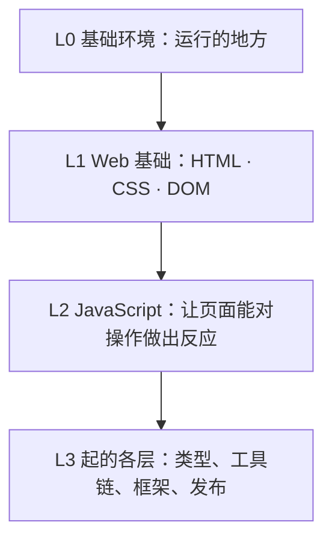
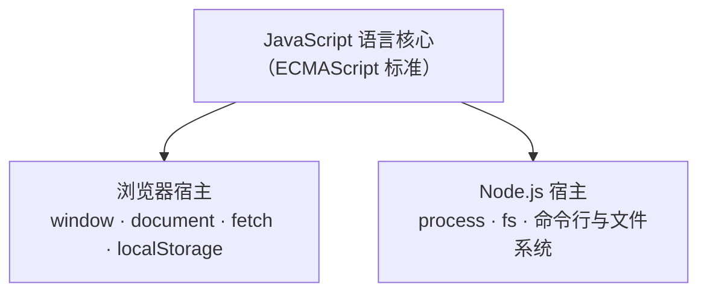
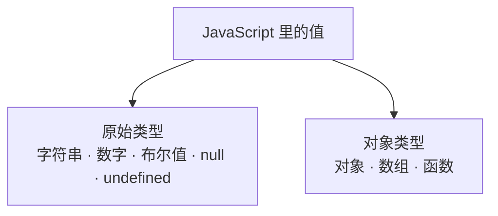
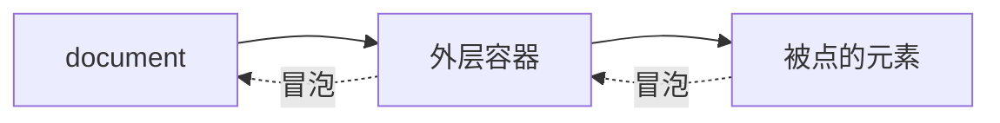
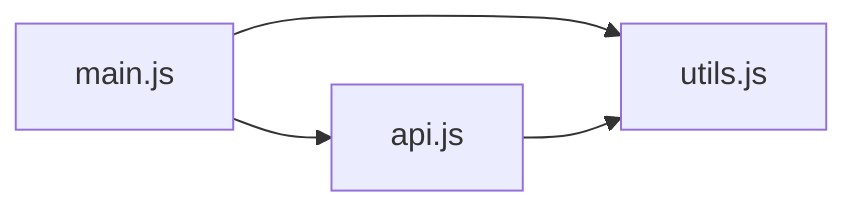
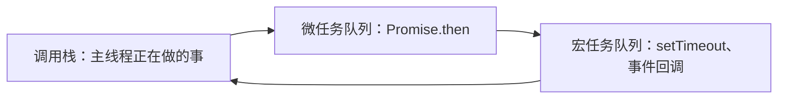
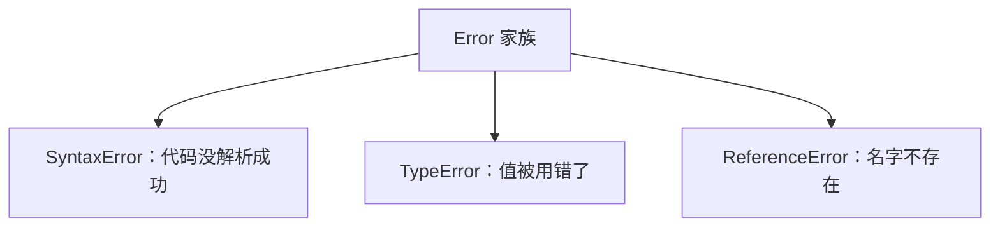
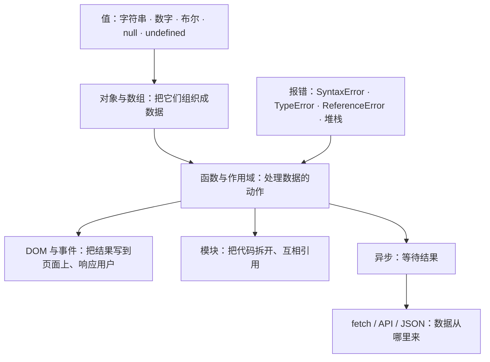

## 本章导读

第二章结尾留下了这样一幅画面：HTML 和 CSS 把页面摆好了，文字、图片、样式都各就各位，可用户点它、输入它，什么都不会发生。让页面能对操作做出反应的，是另一门语言。打开一个稍微完整的项目，你会发现除了 `.html` 和 `.css`，还有一个或多个 `.js` 文件；AI 的改动经常落在它们身上，写出的句子也开始变得像命令：等这个元素出现、给那个按钮加一段逻辑、拿到数据之后再做下一件事。

这些句子读起来像英语，却不像 HTML 和 CSS 那样只是在描述状态。它们每一句都在做判断：如果用户点了这里，就那样；如果数据还没回来，就先等一等。它们随时可能出错：拼错一个名字、早用一行还没准备好的变量，页面就可能整段不工作。

这一章讲的就是这门语言。它的目标不是让你会写 JavaScript，而是让你看懂 AI 写的那几行：它们在对什么做判断、和页面上的哪些东西连在一起、以及为什么它们有时候会失败。对大多数读者来说，AI 会替你把代码写出来；而需要你的，是看懂它写了什么。

## 本章在技术栈中的位置

L2 是“页面的行为”这一层。L1 描述页面是什么样，L2 决定页面能做什么。JavaScript 需要有一个执行它的环境：在网页里，它是浏览器；在开发工具和服务器上，它是 Node.js。再往上，L3 的 TypeScript 会在这门语言上叠加类型，L9 的框架则把它组织成更大的结构。



这一章的十节分三组。3.1 到 3.4 讲语言本身：它是什么、由哪些基本部分组成、怎么组织判断和流程、以及为什么对象和数组在 Web 项目里出现得那么频繁。3.5 和 3.6 讲它和页面的接口：DOM 与事件。第二章回答过“DOM 是什么”，这里回答“怎么用它”，两章的交界就在这里。3.7 到 3.10 讲它在真实项目里长什么样：模块、异步、网络请求，以及最常见的几类报错。

有两处深浅需要提前交代。语言基础只讲到看懂 AI 输出为止，不展开完整语法和 API；而“异步”和“报错”这两块会讲得比通常的入门材料细一些，因为它们是 AI 输出里出现最多、也最容易看不懂的两件事。

## 读完本章，你应该能看懂

- “Add a click listener to this button.”
- “Use `querySelector` to grab the element first.”
- “It's `undefined` — the data hasn't arrived yet.”
- “Export it and import it in the other file.”
- “`await` the response, then call `.json()`.”
- “`fetch` doesn't throw on a 404 — check `res.ok`.”
- “That's a `TypeError`: you're reading a property of `undefined`.”
- “It's a `SyntaxError`, so a `try/catch` won't catch it.”

这八句话本身不需要你现在就完全理解。读完这一章，你至少应该知道每一句在说哪一步、它在什么情况下出现，以及该往哪里找原因。

---

## 3.1 JavaScript 是什么

上一章停在了一句判断上：让页面能对操作做出反应的，是另一门语言。这一节先回答关于它的三个基础问题：它和 HTML、CSS 各管什么；它在哪里运行；以及为什么浏览器里的 JavaScript 和 Node.js 里的 JavaScript 算同一门语言。

先放平一个常见误解：JavaScript 不是网页的附属品。它是一门独立的编程语言，有自己的一套规则，只是最常出现在网页上。AI 提到它的地方也不只在网页里；读配置、搭开发服务器、写构建脚本，用的往往也是它。

### 3.1.1 HTML、CSS 与 JavaScript 的分工

Web 的基本分工是三样东西各管一件事：HTML 描述页面里**有什么**、它们的结构关系；CSS 描述这些东西**长什么样**；JavaScript 决定页面在运行时**做什么**。

前两样有一个共同点：它们在文件写完的那一刻就定下来了。结构不会自己变，样式不会自己做决定。第三样不一样，它写下的是一串**在运行时才会执行的指令**：浏览器遇到它们才执行，执行的结果取决于当时发生了什么。

这就是“行为”的意思。页面上本来没有“点击之后会怎样”这回事：HTML 里没有记录用户点过谁，CSS 里也没有“如果……就……”的写法。要让页面在某件事发生后做点什么，就需要一门会做判断的语言。JavaScript 在本书里扮演的就是这个角色。

分工会在 AI 的话里露出来。它说“这里加一段逻辑”，指的通常是 JavaScript；说“这个标题的样式不对”，是 CSS 的事；说“把这段逻辑从模板里拿出来”，是在提醒你：判断和反应不该写在描述结构和样式的地方。三者混着写也能跑，但出了问题会很难查，这就是分工要分清的原因。

分工在排查问题的时候最有用。页面出了问题，先给它归个类：内容没显示，多半是 HTML 或数据的问题；样子不对，是 CSS；而“点了没反应”“行为不合预期”，才轮到 JavaScript。AI 说“这不是样式问题，是逻辑问题”，做的就是这个分类。

归类的价值在于少走弯路：一个纯样式的问题，你再怎么调 JavaScript 也不会好；反过来，一个逻辑问题也不会因为改了 class 就消失。

用一个常见功能把三者串起来会更清楚：一个深色模式开关。HTML 负责造出那个按钮；CSS 负责订好“深色”状态下页面长什么样；JavaScript 负责在按钮被点时决定“现在该算深色还是浅色”，并把对应状态挂到页面上。三样各管一段，谁都不越界。

这套分类在 AI 的措词里也能看出来：“这不是样式问题”是在提醒你别去改 CSS；“把这段逻辑抽出来”是在说别把判断写在结构里；“给它加个事件监听”则已经进到行为层。听得久了，你甚至能从它的用词反推该去哪个文件里找。

分工还有一个现实的理由：三样东西的变化节奏不同。文案常改、样式常调、逻辑最不常动；分开写，改一处就不容易连带弄坏另外两处。

读 AI 的回答时，也可以用这三层做分类：它说的这句，是在改结构、改样式，还是改行为？分完类，事情就清楚了一半。

### 3.1.2 JavaScript 在哪里运行

JavaScript 不是内嵌在 HTML 里的东西。它是一门独立的语言，需要有地方来执行它。浏览器里负责这件事的部件叫 **JavaScript 引擎（JavaScript Engine）**：Chrome 使用的 V8 是其中最出名的一个，Node.js 用的也是它。

页面上的 JavaScript 一般通过一段 `<script>` 出现。浏览器解析 HTML 时遇到它，就会执行里面的代码；如果带 `src`，就先下载那个文件再执行：

```html
<script src="/src/app.js"></script>
```

这一行就是项目里那些 `.js` 文件的入口。AI 说“把脚本接进页面”，通常指的就是在 HTML 里放上这样一段 `<script>`；反过来，“脚本没生效”的排查也常常从这里开始：标签是不是漏了、路径是不是不对、是不是被前面的报错挡住了。

顺着这一行往下看，也是“找代码”的常规路径：HTML 里挂着哪个脚本，那个文件里就是行为逻辑所在地。现代项目的路径常常由构建工具重写，但你至少能从这一行知道“页面加载了哪些脚本”。

后面你还会反复见到两个词：**客户端（Client）** 和 **服务端（Server）**。前者就是“跑在用户浏览器里”，后者是“跑在服务器上”。AI 说“这段代码要放到服务端”，通常是因为它需要读文件、连数据库，或者用密钥——正是浏览器盒子外面的事。

浏览器里还有几个地方会跑 JavaScript。开发者工具的 Console 让你手敲一行、它立刻执行一行；事件回调和定时器里的代码则“挂在那儿等着”，等到用户点击、或者时间到了，浏览器才回头执行它们。这两类“等着被触发”的代码在 3.6 和 3.8 会展开讲。

还有一点和第一章呼应：JavaScript 虽然跑在浏览器里，也只是在那个盒子里活动。它能读写页面、能发网络请求，但打不开你电脑上的文件、连不上数据库。凡是需要这些能力的事，都要放到服务器那边去做。

开发时还有一个最顺手的验证场：开发者工具的 Console。把 AI 给的表达式粘进去、回车，结果立刻出来，不碰项目文件。遇到“这行到底算出什么”的疑问，它比读十遍代码都快。

在 Console 里会看到两种结果：直接算出一个值（输入 `1 + 1` 得到 `2`），或者执行一个动作（`document.body.remove()` 会把页面清空，刷新就回来）。前一种是表达式，后一种是语句——这个区分在 3.3 会自然体现。

还有一个小习惯能看出分工：页面脚本通常放在 `body` 末尾，或者在标签上用 `defer`。原因是脚本执行时页面元素得先存在，否则 `document.querySelector` 什么也找不到。看到 AI 特意把脚本放到最后，多半就是这个考虑。

### 3.1.3 浏览器 JavaScript 与 Node.js JavaScript

AI 有时会说“这段代码在浏览器里能跑，在 Node 里不行”，听起来像在说两种语言。其实是同一门。

JavaScript 有一个语言标准，叫 **ECMAScript**。浏览器和 Node.js 都实现这份标准，所以在语言这一层，两者的行为一模一样：`typeof null` 都是 `"object"`，`0.1 + 0.2` 都不等于 `0.3`，`NaN` 都不等于它自己。你在一处学到的语言规则，换到另一处照样成立。

不一样的，是语言之外的部分。任何 JavaScript 都需要一个**宿主环境（Host Environment）**来提供运行场所；浏览器和 Node.js 是两个不同的宿主，各自往这门语言上接了一套自己的 **API**：



浏览器给的是 `window`、`document`、`fetch`，用来操作页面和发请求；Node.js 给的是 `process`、`fs`，用来读写文件和操作这台机器。语言是同一套，接上的插座不一样。

这个区别解释了一类最常见的报错：`document is not defined` 是“把浏览器专用的东西拿去了 Node”，`process is not defined` 则相反。看到“某某 is not defined”，先问一句：这段代码此刻是在哪个宿主里跑？

项目里两种宿主常常同时存在：构建、打包、启动开发服务器这些活由 Node 干，而页面里真正跑的还是浏览器那一边。所以同一个项目里，配置文件用 Node 的能力，页面脚本用浏览器的能力；拿不准时，先看这段代码是“在工具里跑”还是“送到浏览器里跑”。

把这一节压缩成一张对照表，就是下面这样：

|              | 浏览器宿主           | Node.js 宿主        |
| ------------ | -------------------- | ------------------- |
| 语言规则     | 同一份 ECMAScript    | 同一份 ECMAScript   |
| 操作页面     | `document`、`window` | 没有                |
| 发网络请求   | `fetch`              | `fetch`（较新版本） |
| 读写本机文件 | 没有                 | `process`、`fs`     |

表格里“较新版本”这种限定词，恰恰是跨宿主问题时最需要注意的地方：几乎每个宿主 API 都有自己的可用版本。

这个差别很好验证：把一段用了 `document` 的代码丢进 Node 跑，会得到“document is not defined”；反过来，在浏览器控制台里敲 `process.version`，也会碰壁。报错本身就是宿主在说话。

其实可以按“跑得动跑不动”把代码分两半：纯语言的部分（算数、字符串、数组、Promise）两个宿主都能跑；碰到宿主 API 的部分，只能在提供它的那边跑。AI 把两边混着写时，报错就出现了，而错误本身已经告诉了你答案。

这个区分还有一个实用价值：AI 报“某某未定义”时，先判断它是“语言层面没声明”还是“宿主没提供”——两者的修法完全不同。

> **AI 可能会说：**
>
> “This part runs in the browser, so you can't use `fs` here.”
>
> **翻译成人话：**
>
> `fs` 是 Node.js 提供的能力，浏览器里没有。要读文件，得把它放到服务器那边（Node）去做；反过来，`document`、`window` 这些浏览器给的东西，Node 里也不存在。

---

## 3.2 JavaScript 最基本的组成

这一节过一遍 JavaScript 最基本的几样东西：变量、几种值的类型、数组和对象。它们差不多是 AI 输出里最常露面的部分：一段脚本不管做什么，几乎都要先声明几个名字、再放进一些值。

这里不打算讲语法大全，只挑其中会影响你读懂 AI 输出的部分。判断标准还是那句话：看完之后，AI 说到这些词时你不发懵，并且知道哪几种写法容易出问题。



### 3.2.1 变量

**变量（Variable）** 是给一个值起的名字。写下 `let count = 0;`，意思是“从现在起，`count` 这个名字代表 0”；之后再用到 `count`，用的就是这个值。

```js
let count = 0;
count = count + 1;
```

变量在 AI 输出里扮演的角色很好认：它是后面所有语句的操作对象。AI 说“把这个值存起来”，通常就是声明一个变量；说“这里读不到 `user`”，多半是这个变量没被赋上值，或者根本没声明。

一个名字一次只代表一个值，这正是它有用的地方：脚本用名字在“当前的意图”和“某个具体的值”之间搭桥，而不是到处重复写死数字。程序里的状态，大多就是“一批变量此刻的值”。

命名风格上，AI 常用 camelCase（`userName`、`isLoading`），常量有时写成全大写（`MAX_SIZE`）。名字本身就是线索：看到 `isLoading`、`hasError` 这类名字，大致能猜出这段脚本在关心什么状态。

名字只是名字：叫 `x` 还是叫很长的一个描述性名字，对程序没有区别，只影响读的人。AI 取名偏后者，也正是为了让改动“读得出来”。

其实 `let count = 0;` 这一行做了两个动作：登记 `count` 这个名字，再把 `0` 指给它。两件事可以分开写（`let x;` 之后 `x = 1;`），但现代代码几乎都写在一起——初始值摆在眼前，读的时候一眼就知道它从什么状态开始。

### 3.2.2 const 与 let

声明变量有两个常用关键字：`let` 和 `const`。它们的区别不在“能不能改”，而在**能不能重新赋值**。

```js
let total = 1;
total = total + 1; // 可以：let 允许换掉它代表的值

const pi = 3.14;
pi = 3; // 报错：const 不允许重新赋值
```

但 `const` 限制的只是这个“绑定”本身，不是它指向的内容。如果它指向的是一个对象，对象内部照样能改：

```js
const user = { name: "Mia" };
user.name = "Mia Chen"; // 可以：改的是对象里的属性
user = {}; // 报错：不能把 user 换成另一个对象
```

那句常见误解“用 `const` 声明就不能改了”，只对了一半：不能改的是这个变量指向谁，不是它指向的东西本身。

两个关键字还有一个容易踩的坑：它们有**暂时性死区（TDZ，Temporal Dead Zone）**。在声明语句之前访问，不会像老式的 `var` 那样得到 `undefined`，而是直接抛出 `ReferenceError`。

```js
console.log(score); // 报错：在 let 声明之前访问
let score = 10;
```

`var` 与它们的另一个差别在作用域：`var` 的作用范围是整个函数，`let` 和 `const` 只管它所在的那个块（这一层在 3.3.6 会再遇到）。AI 生成的现代代码默认用 `const`，需要重新赋值时才用 `let`；看到 `var`，基本可以判断那是一段旧写法。

关于这两个关键字，有两句常被误传的话顺手清掉。其一，“`const` 表示不可变”：它保证的只是不能重新赋值，对象内容照样能改。其二，“`var` 和 `let` 只差一个关键字”：它们的作用域规则和提升行为都不同，正是这些差别让 `var` 淡出了现代代码。

选哪个其实有个简单标准：这个值在后续还会被换掉吗？不会，就用 `const`；会，才用 `let`。这也解释了为什么 AI 默认写 `const`：多数变量声明好之后就不再换指向了。

读代码时也有个副产品：一看到 `let`，就知道这个变量后面还会被重新赋值，而那几行往往就是这段逻辑真正“变动”的地方。

顺带一提，“`const` 的东西能不能改”与它是不是“常量”无关：JavaScript 里没有变量级别的“不可变对象”（那是另一个 API 的事）。看到“用 `const` 保证不可变”这种说法，要知道它保证的只是那个名字。

### 3.2.3 字符串

**字符串（String）** 是一段文本，用引号包起来。AI 输出里字符串特别多：选择器、类名、提示语、URL、接口字段，全都是。

字符串有一个重要性质：**不可变**。你对它调用的每个方法都不会改动原字符串，而是返回一个新的：

```js
const s = "hello";
s.toUpperCase(); // 返回 "HELLO"，但 s 还是 "hello"
```

“不可变”不是“改它就报错”，而是“你改不动它，只能照着造一个新的”。这解释了一个常见的写法：把处理结果**接收回来**（`const upper = s.toUpperCase()`），而不是指望原字符串被改。

还有一种常见的写法：**模板字符串（Template Literal）**，用反引号包裹，可以直接嵌变量。AI 拼路径、拼提示语时经常用它：

```js
const url = `/api/users/${id}`;
```

字符串的方法不用背，但有几个在 AI 输出里高频出现：`slice` 截取一段、`toLowerCase` / `toUpperCase` 转换大小写、`includes` 判断包含、`trim` 去首尾空白、`split` 按分隔符切开。看到它们，知道这段在做“加工文本”即可。

还有一个风格上的小差别：字符串有时用双引号、有时单引号，模板字符串用反引号。这只影响观感，不影响行为；项目里通常会有自动格式化工具统一它们，不用在这上面纠结。

模板字符串值得多看一眼的是“拼”：变量直接嵌进一段文本，不用再写一串 `+`。AI 生成提示语、URL、HTML 片段时常用它，读法就是“把 `${}` 里的东西取出来，代进那个位置”。

### 3.2.4 数字

JavaScript 的数字只有一种类型，整数和小数都用它。它采用 IEEE 754 双精度浮点数，这是各类编程语言共用的标准，不是 JavaScript 自己的发明。

这个标准带来一个著名现象：某些小数算不准。

```js
console.log(0.1 + 0.2); // 0.30000000000000004
```

这是浮点数表示精度的必然结果，不是 JavaScript 的 bug。实际意义有两条：比较小数运算结果时不要直接用 `===`；涉及金额这类要求精确的数字，通常改用整数（比如按“分”存储）或专门的库。

另一个特殊值是 `NaN`（Not a Number），表示“这次运算没有得到一个有效的数字”。它的怪脾气是：用 `===` 来比，**它不等于任何值，包括它自己**。

```js
NaN === NaN; // false
```

所以判断一个值是不是 `NaN`，不能写 `x === NaN`，要用 `Number.isNaN(x)`。

（严格说，“谁都不等于”只在相等性比较里成立：`===` 和 `==` 都是 `false`，而 `Object.is(NaN, NaN)` 和 `[NaN].includes(NaN)` 都会返回 `true`。日常写“判断是不是 NaN”，记住 `Number.isNaN` 就够了。）

还有一处也顺手澄清：`NaN` 虽然“什么都不等于”，它自己仍然是一个 `number` 类型的值：`typeof NaN` 是 `"number"`。它是“表示无效运算结果的数字”，不是“非数字类型”。（顺带：判断整数可以用 `Number.isInteger`，AI 的校验代码里偶尔会见到。）

金额是这条规则最常碰到的地方：`0.1 + 0.2` 的问题会让“分”这种小单位算错，所以常见做法是把金额存成整数分（`1990` 表示 19.90 元），只在显示时再除回去。AI 说“用整数避免浮点误差”，说的就是它。

还有一类数字字面量偶尔出现：`1_000` 里的下划线只是分隔符，不改变数值；而 `007` 这种写法在严格模式下会直接报错。看到不认识的形式，先认出“它还是个数字”即可。

这里顺带提一个和类型有关的坑：`1 + "1"` 得到的是字符串 `"11"`：加号遇到字符串会变成拼接。所以“从表单里取到的数字”要显式转成数字（`Number(...)` 或 `parseInt(...)`），否则加着加着就变成了拼字符串。

### 3.2.5 布尔值

**布尔值（Boolean）** 只有两个取值：`true` 和 `false`。它是条件判断的材料——`if` 后面跟的就是它。

这里要记住的是**哪些值被视为假**。JavaScript 里的“假值”只有固定这几个：

```
false   undefined   null   0   -0   0n   ""   NaN
```

不在这份清单里的值都算真。这条规则解释了 AI 代码里几类常见写法：`if (!data)` 是在说“没有数据就……”，`if (items.length)` 是在说“数组非空才……”。它也提醒了两个易错点：空数组 `[]` 和空对象 `{}` 都是**真值**，拿它们做判断永远成立；字符串 `"0"` 也是真值，因为它不是空字符串。

把这些放到一起，布尔值在代码里其实只有三个来源：比较（`count > 0`）、假值清单（`if (name)`）、返回真假的函数（`Array.isArray(x)`）。它们最终都汇到同一个地方——`if` 和 `&&` 的括号里。

还有一个符号会偶尔出现：`!!x`。它把任意值强行转成布尔（取反两次就回来了），常见于“把某个值直接当条件用”的地方。看到它，读作“只看它真假”。

需要显式转换时也会看到 `Boolean(x)`，效果一样，两个都能用。

另外，`if` 括号里也可以写赋值或函数调用（`if (user = getUser())`），但这属于不推荐的写法：它既是赋值又是条件，读的时候容易看漏。看到这种代码，先在心里把它拆开。

### 3.2.6 null 与 undefined

两个值都表示“没有值”，但来历不同。`undefined` 是系统给的空：声明了没赋值、函数没写 `return`、访问不存在的属性，得到的都是它。`null` 是人为给的空：明确表示“这里我就是想放一个空值”。

一个容易记反的细节：`typeof null` 返回的是 `"object"`。这是语言早期的历史遗留；规范只规定这个结果，并没有解释原因。所以判断一个值是不是 `null`，要用 `value === null`，不能靠 `typeof`。

两者之间的比较也有一处要留意：

```js
null == undefined; // true（松散比较把它们视为一类）
null === undefined; // false（严格比较不放过）
```

现代代码里还常看到 `??`（空值合并）和 `?.`（可选链），它们就是为这两种“空”准备的：`data ?? fallback` 表示“是 `null` 或 `undefined` 就用备选值”，`user?.name` 表示“`user` 为空就停下，不要报错”。

另外两处差别值得记住：`||` 遇到任意假值（包括 `0`、`""`）就会启用备选值，而 `??` 只在 `null` / `undefined` 时才启用，所以“数量为 0 也不该被替换”的场景要用 `??`。还有，`null` 在松散比较里只和 `undefined` 相等：`null == 0` 是 `false`，别把空值当成数字 0。

习惯上，`undefined` 多为“系统默认的空”，`null` 多为“明确标注的空”。所以看到 `= null`，常常是有人主动把某处清空；看到 `undefined`，多为“这里本来该有东西，但没来”——这个区分在排查数据问题时很有用。

### 3.2.7 数组

**数组（Array）** 是“按顺序排列的一串值”，用方括号写出来：

```js
const colors = ["red", "green", "blue"];
```

取用其中一项用索引，索引从 0 开始：`colors[0]` 是 `"red"`。

有一个容易误解的点：数组也是对象。`typeof []` 返回的同样是 `"object"`，数组并没有一个专属的类型名。想确认一个值是不是数组，要用 `Array.isArray()`。

另一处小陷阱是 `length`：它表示“最大索引加一”，不是“实际元素个数”。两者只在数组被“挖洞”（留出空位）时才不一样，日常几乎遇不到，但知道了就能解释某些意外读数。

还有一处日常就会碰到：用越界的索引读取不会报错，只会得到 `undefined`（`colors[99]` 是 `undefined`）。这类“读出来是 undefined”的位置，正是 3.10.4 要复盘的一类线索。数组真正的用法——遍历、变换、筛选——都在 3.4。

数组的心理图像就是“一列东西”：有序、可重复、可以按下标找。它的方法分成两类，3.4 会展开：一类返回新结果（`map`、`filter`），一类直接改自己（`push`、`sort`）。记住这个分界，就能预判“改完原数组还在不在”。

它和字符串还有一点像：都有 `length`，都能用方括号按下标取。区别也很直观：字符串的一格是一个字符，数组的一格可以是任何东西（包括另一个数组或对象）。

它还有一个现代用法：配合 `map` 一步生成“每个元素对应的新值”，也就是“数组进、数组出”，这是 3.4.4 要展开的典型形状。

还有一个直觉值得建立：页面上看到的“列表”（消息流、商品列表、搜索结果），在代码里通常就是一个数组。所以“把数组变成页面”会是项目里反复出现的动作：遍历数组、为每一项造一块界面。后面 3.5 的创建元素、和 3.9 的接口数据，都会回到这个形状。

### 3.2.8 对象

**对象（Object）** 是一组“名字和值”的集合，用来描述一个东西的各个方面：

```js
const user = { name: "Mia", age: 20 };
```

读取属性有两种写法：点号 `user.name` 和方括号 `user["name"]`，效果一样。方括号的价值在于名字可以是变量，也可以包含特殊字符。

键的顺序也有个小结论：整数样式的键（如 `"1"`、`"2"`）会排在前面并按升序，其余的按**写入顺序**排列。日常依赖这个顺序不会出问题；但如果 AI 的代码“改动了某段数据的显示次序”，可以回来想一下这一条。

对象的形态在 Web 项目里几乎无处不在：接口返回的数据、组件接收的参数、配置项，都是对象。3.4 会接着讲它更实际的用法。

顺手预告一个高频报错：属性是一路“点”下去的（`user.profile.name`），中间任何一环是 `undefined`，再往下读就会抛错。所以现代代码里大量出现 `?.`；看到 “Cannot read properties of undefined”，第一反应就是顺着这条链往回找是哪一环断了。

对象还有一个常见来源是文本：接口返回的 JSON（3.9）解析之后就是对象，形状几乎和手写的一样。所以“数据从外面来”这件事，在代码里落地成的就是“一个对象、里面若干字段”。不认识某个字段时，往接口文档或返回数据里找，比猜快。

把 3.2 的值类型压成一张速览表：

| 值        | 写法示例         | 常见坑                            |
| --------- | ---------------- | --------------------------------- |
| 字符串    | `"hi"`           | 不可变；方法返回新值              |
| 数字      | `42`             | 浮点精度；`NaN` 不自等            |
| 布尔值    | `true` / `false` | 假值只有那几个                    |
| null      | `null`           | `typeof null` 是 `"object"`       |
| undefined | `undefined`      | 没赋值、没返回、没这个属性        |
| 数组      | `[1, 2]`         | 也是对象；`length` 是索引上限加一 |
| 对象      | `{ a: 1 }`       | 取不存在的属性得到 `undefined`    |

表格不是要背的清单，而是“看到不认识的写法时，知道该回到哪一节”。

---

## 3.3 表达式与程序流程

上一节讲的是“值”，这一节讲怎么对值做决定：先算出一个结果（表达式），再根据结果选择走哪条路（条件与流程），以及把常用的一段做法包起来重复使用（函数）。这三件事加起来，就是一段脚本的骨架。

读 AI 代码时，大部分行都属于这里。你不需要会写，但要能看出“这行在做判断”还是“这行在算一个值”，因为后者通常无害，前者往往决定程序往哪边走。

### 3.3.1 运算符

**运算符（Operator）** 是“把值算成新值”的记号。`+ - * /`、比较大小的 `> <`、判断相等的 `===`，都属于它。由运算符和值组成的式子叫**表达式（Expression）**：它的特点是总能算出一个结果。

```js
10 + 20; // 30
"a" + "b"; // "ab"（加号在字符串上是拼接）
```

有几处 AI 输出里高频出现的记号，认识它们就够了。

判断相等有两个写法：`===`（严格相等）和 `==`（松散相等）。它们最大的差别是：`==` 会先做类型转换。

```js
1 == "1"; // true：先把字符串转成数字再比
1 === "1"; // false：类型不同，直接不等
```

这就是“最好用 `===`”这条建议的由来：`==` 的转换规则不直观，容易让判断结果出乎意料。看到 AI 用 `===`，是在刻意规避这类意外。

逻辑运算符 `&&`、`||`、`!` 处理的是真假。它们除了组合条件，还能“短路”：`&&` 前面的值为假时，后面的根本不执行。

```js
isReady && start();
```

这行常被读作“准备好就启动”。它不是语法糖，而是靠 `&&` 的短路行为实现的。类似的还有 `??`（空值合并，3.2.6 见过），以及三元运算符 `条件 ? 甲 : 乙`，它把“二选一”压在一行里。

关于 `&&` 和 `||`，有个细节容易看错：它们返回的**不是布尔值，而是其中一个操作数**。`a || b` 的准确意思是“`a` 为真就用 `a`，否则用 `b`”，所以它常见于“有就用、没有就给个默认值”的写法。理解成“返回操作数”，比理解成“逻辑运算”更接近实际。

运算符本身有优先级，但 AI 代码里更常见的是用括号把意图写死。看到 `(a && b) || c` 这种写法，先按括号分层读，就不用去背优先级表。

另外几个简写会经常出现：`x += 1` 等于 `x = x + 1`，`x++` 是“用完再加一”。看到它们知道意思即可。

松散相等还有一些不那么直观的结果，比如 `0 == ""` 和 `[] == false` 都成立。不用去背这张表，把“少用 `==`”记成习惯，就不会掉进去。

还有一个特殊值要留意：`undefined` 参与算数大多得到 `NaN`（比如 `undefined + 1`）。这也是“读到 undefined 之后算出一串 NaN”的来路。

顺带认一下两个不太常见的运算符：`**` 是乘方（`2 ** 10`），`?.` 是可选链（3.2.6）。它们不算高频，但遇到时别当成语法错误。

### 3.3.2 条件判断

**条件判断** 决定“走哪条路”，最常看到的是 `if`：

```js
if (score >= 60) {
	console.log("及格");
} else {
	console.log("不及格");
}
```

括号里那个值会被转成真或假，用的就是 3.2.5 讲过的那套规则：只有 `false`、`undefined`、`null`、`0`、`""`、`NaN` 这几类是假，其余都是真。所以 `if (user)` 问的不是“`user` 是不是布尔值”，而是“`user` 是不是那几类假值之一”。

`else if` 可以把多个条件串起来，但串得太长会难读。AI 常写的一种替代是“守卫子句”：不满足条件就提前退出，剩下的都按正常路径继续。

```js
if (!user) return;
// 从这里往下都可以假定 user 存在
```

看到这种节奏，意思是“先把不该继续的情况排除掉”。

分支多起来时，另一种写法是按值选路：`switch`，或者用对象把“值 → 要执行的事”列出来。AI 的现代代码更偏后者。形式不同，含义都是“按情况选一条路”。

还有一个简写值得认识：三元运算符（3.3.1）常被用来“二选一赋值”或“二选一显示”，比如 `const label = isOpen ? "收起" : "展开";`。分支只有两条、结果只是一个值时，它比四五行的 `if/else` 更接近阅读节奏；但嵌套多层三元就该拆开了。

条件里还常和 3.2.6 的工具配合：`if (user?.name)` 是“用户存在、名字也有才继续”。这类写法把“有没有值”和“做什么”压在一行里，读的时候记得它同时在回答两个问题。

### 3.3.3 循环

**循环（Loop）** 让同一段逻辑重复执行。现代 AI 输出里手写循环不算多，遍历数据大多交给了 `map`、`forEach` 这类方法（3.4 会讲）。但作为读者，几种形态还是认得出为好。

```js
for (const color of colors) {
	console.log(color); // 依次取出数组里的每一项
}

for (let i = 0; i < 5; i++) {
	console.log(i); // 数着次数跑
}

while (isWaiting) {
	tick(); // 条件成立就一直跑
}
```

还有一种 `for...in`，它跑的是对象的键。它也能用在数组上，但那是老写法，容易出意外，看到时知道它在干什么即可。

还有一个常见误解：`for...of` 看着像“遍历一切”，其实只适用于**可迭代**的东西（数组、字符串、Map 等），普通对象不是。要遍历对象的键，用 `for...in` 或 `Object.keys()`。循环里另有两个小开关：`break` 直接跳出，`continue` 跳过这一轮。

给循环一个定位：它是“过程式”的做法，写明每一步怎么做。现代 JavaScript 里更常见的是把意图写出来（“筛选”“映射”，3.4）。两者结果一样，但后者更容易读；看到手写 `for`，往往是需要“中途退出”“按索引成对处理”这类循环表达力更强的时候。

`break` 和 `continue` 的小例子：在数组里找第一个负数，找到就 `break`；只想跳过负数、继续看别的，就用 `continue`。

### 3.3.4 函数

**函数（Function）** 是一段可以被反复调用的逻辑，给它起个名字、写完放在那儿，等被调用时才执行。

```js
function greet(name) {
	return "你好，" + name;
}

greet("Mia"); // "你好，Mia"
```

函数在 AI 输出里随处可见，因为它是组织代码的基本单位：一件事写成一个函数，需要时调用它。AI 说“抽一个函数出来”，就是指把散落的几行收进一个名字里。

JavaScript 里函数有好几种写法，AI 输出里都能遇到：

```js
function sayHi() {
	return "hi";
}
const sayBye = function () {
	return "bye";
};
const yell = (text) => text.toUpperCase();
```

三者有两点差别要知道。函数声明会“提升”，在定义之前也能调用；后两种写法不会。箭头函数不绑定自己的 `this`，而是沿用定义处外层的；这一点在事件回调里很常见，先知道有这么回事即可。

函数还经常被当作参数交给别人，等某个时机由别人来调用，这就是**回调（Callback）**。AI 说“传一个回调进去”，通常就是这个意思。

两个说法先在脑子里钉住：**“函数本身”和“调用函数”是两件事**：写 `greet` 是把它当值传递，写 `greet()` 才是执行它；箭头函数写单表达式时（`(x) => x * 2`）会直接把它当返回值，不用写 `return`。

函数声明还有一个实用推论：因为它会提升，同一个文件里“先调用、后定义”也是合法的；写成表达式的版本就不行。看到 AI 把定义放在文件末尾，多数是因为它有函数声明兜底。

函数在代码里扮两种角色：一类“算出一个值”（`formatDate`、`sum`），一类“做一件事”（`render`、`save`）。读的时候分一下很省力：前者看它的返回值，后者看它对什么产生了影响（改了页面、发了请求、写了存储）。

读一个陌生函数有个固定顺序：看名字（在做什么）→ 看参数（需要什么）→ 看 `return`（给出什么）。三样看完，常常就不必再逐行读了。

补一句它为什么是“组织代码的基本单位”：一段逻辑被包进函数之后，就有了名字、边界和入口。AI 说“抽成一个函数”，本质是给这段逻辑一个可被引用、可被替换的身份。

函数名本身也是文档：`isValid(...)` 返回真假、`getUser(...)` 返回数据、`handleClick(...)` 处理事件。AI 起名大多遵守这套约定，读名字就能猜用途。

### 3.3.5 参数与返回值

**参数（Parameter）** 是函数定义里写的名字，**实参（Argument）** 是调用时真正传进去的值。调用时少传了，参数就是 `undefined`，除非它设了默认值：

```js
function greet(name = "朋友") {
	return "你好，" + name;
}
```

默认值只在实参是 `undefined` 时生效（没传也算）；显式传了 `null`，`null` 会原样用上。

**返回值（Return Value）** 是函数交给调用方的结果。没有写 `return`，函数返回 `undefined`，这也是一类“读到一个 undefined”的来源。

```js
function log(msg) {
	console.log(msg); // 只做了事，没有 return
}

const result = log("hi"); // result 是 undefined
```

一个函数一次只能返回一个值；想返回好几项，就包进一个对象。

还有一个小小的语法在 AI 输出里出现得很密集：参数也可以解构。`function render({ title, body }) {}` 表示“我期待一个对象，请把它里面的 `title` 和 `body` 取出来用”。看到参数位置是一对花括号，就是这个意思。

还有两条和参数有关的“宽容”规则：少传参数不会报错（缺的那个是 `undefined`），多传参数也不会报错（多出来的被忽略）。所以“调用时的参数个数看起来不对”本身不是错误——要按函数定义里写的用。

`return` 会立刻结束函数，写在循环里、写在 `if` 里都一样。所以看到一个函数“后面的代码没跑”，先找 `return`。

### 3.3.6 Scope

**作用域（Scope）** 决定“一个名字在哪些地方可见”。函数有自己的作用域：函数里声明的变量，外面看不到；外面的，里面能看到。

```js
const theme = "dark";

function render() {
	const label = "主题";
	console.log(theme); // 可以：外面声明的
}

console.log(label); // 报错：函数内部的变量，外面看不到
```

函数嵌套时，内层可以一直往外找变量。这个“一路向外找”的链条，让一个函数可以记住它被定义时所在的那片环境；被记住的那组变量跟着函数走，这就是**闭包（Closure）**。

```js
function makeCounter() {
	let count = 0;
	return () => ++count;
}

const next = makeCounter();
next(); // 1
next(); // 2
```

每次调用 `makeCounter` 都会新建一份 `count`，返回的那个函数一直握着它。闭包最常见的场景是循环里创建的回调：用 `let` 声明的循环变量，每一轮都是一份新的绑定，所以每轮回调记住的是各自那一份；换成老的 `var`，所有回调会共享同一个变量，最后都读到同一个值。

还有一个流传很广的说法要澄清：“闭包会导致内存泄漏，所以要少用”。闭包本身是正常且必需的机制，并不会自动泄漏；只有当它长期持有“已经不再需要的大对象”时，才会占着不放。要留意的从来不是“闭包危险”，而是“它留住了谁”。

作用域也是读报错的工具：`x is not defined` 的常见原因之一，就是这个名字在当前位置根本不在作用域里（拼错，或者定义在别的函数里）。反过来，读到“意料之外的旧值”，也常常是因为拿了别处同名的变量。

闭包在 AI 输出里最常见的现身方式是回调：事件处理器、`setTimeout` 里的函数、`map` 的回调，都在读写外层声明的东西。看到回调里用了外面的变量，就可以在脑子里画一条线：这个函数出生时，那个变量就在它的视野里。

把 3.3 整体回看一遍：运算符与条件决定“走哪条路”，循环决定“重复几遍”，函数把这些组织成可复用的块，作用域决定“谁能看见谁”。这四个词在 AI 输出里几乎每一段都会出现。

这也是“尽量别往全局放东西”的一个理由：全局上的名字全脚本可见，也全部可改，任何一处改动都可能隔很远影响别处。模块（3.7）之所以受欢迎，很大一部分就是因为它把名字关进了各自的文件。

---

## 3.4 对象与数组在 Web 项目中的意义

上一节把对象和数组当作“值”介绍了一遍。这一节回答另一个问题：为什么它们在 Web 项目里出现得这么频繁。

因为项目里流动的数据几乎都是它们。一份接口返回的 JSON 是对象，一串待处理的记录是数组，配置项是对象，组件收到的参数也是对象。AI 写的代码，很大一部分时间在做同一件事：从对象里取出需要的字段，把结果整理进新的数组或对象。认识下面几种写法，就能读懂一大半“数据处理”代码。

这类代码的骨架通常是三段：**拿到数据**（一行 `fetch` 或一个参数）→ **变换数据**（`map` / `filter` / 解构）→ **交给页面**（改 DOM、渲染）。读的时候不必逐行抠，先认出它在哪一段，再看细节。

### 3.4.1 Property

**属性（Property）** 是对象里的一个个“名字和值”。读取它有两种写法，效果一样：

```js
const user = { name: "Mia" };
user.name; // "Mia"
user["name"]; // "Mia"
user.age; // undefined（没有这个属性）
```

点号写法更常见；方括号的价值在于名字可以是变量，也可以带特殊字符（比如 `config["api-key"]`）。

项目里的数据大多是嵌套的：对象里装着数组，数组里又装着对象（接口返回的用户列表就是典型）。读的时候一路点下去：

```js
users[0].name; // 第一个用户的名字
users[0].roles[0]; // 它的第一个角色
```

这也是“取不到就 `undefined`”会一环扣一环出现的原因：链条上任何一节是空的，后面全断。

当属性名带特殊字符（`user["first-name"]`）或者名字存在变量里（`user[key]`）时，只能走方括号，而点号写法要求名字是合法的标识符。

有一个数据形状在项目里几乎无处不在：**数组装对象**。接口返回的列表大多长这样：外层是数组，每项是一个对象（`[{ id, name }, …]`）。所以“遍历数组、从每个对象里取字段”会成为最常见的代码形状——先 `filter` 再 `map`，或者在遍历里同时读好几项。

还有一点要留意：读一个不存在的属性不会报错，只会得到 `undefined`。很多“读不到的属性”类报错，源头就在这里。

### 3.4.2 Method

**方法（Method）** 没有什么神秘：它就是“值恰好是函数的属性”。调用一个方法，就是在某个对象上执行一个函数。

```js
const s = "hello";
s.toUpperCase(); // 挂在字符串上的方法
console.log(); // 挂在 console 对象上的方法
```

所以“函数”和“方法”不是两个东西：函数是独立的，方法是挂在对象上的那种。AI 说“调用这个方法”，意思是“在这个对象上执行某个函数”。

方法还常被串起来写：

```js
name.trim().toLowerCase();
```

前一个的结果直接交给后一个，像流水线。AI 处理字符串、数组时大量使用这种链式写法，读的时候按顺序从左往右看就行：先把两端的空格去掉，再统一成小写。

方法名也常常提示了数据的形状：`map`、`filter`、`push` 一听就是数组的动作；`getAttribute`、`classList` 一看就是元素的动作。名字本身就是“它在对什么做操作”的提示。

写法和“调用函数”只差一对括号：写 `name.trim` 是“提到这个方法”，写 `name.trim()` 才是“执行它”。括号在不在，结果完全不同。

### 3.4.3 数组遍历

遍历就是把数组里的每一项都过一遍。最基本的写法是 `forEach`：对每一项执行一次回调，它本身不返回结果。

```js
colors.forEach((color) => {
	console.log(color);
});
```

规律很简单：如果代码只是“每项都要做点事”，多半用 `forEach`；如果“每项都要变成一个东西、最后收进新数组”，就会用下面的方法。

`forEach` 有一个容易踩的坑：回调里写 `return` 只会结束**这一轮**，不会提前结束整个循环：

```js
nums.forEach((n) => {
	if (n < 0) return; // 只跳过这一个，不是退出
});
```

真要在中途停下或跳过，用 `for...of` 配 `break` / `continue`（3.3.3）。另外，`forEach` 没有返回值，别把它的结果赋给变量——那会是 `undefined`。

需要知道“第几项”时，`forEach` 的回调还能接第二个参数（下标）：`items.forEach((item, index) => ...)`。看到两个参数，就知道它在用位置做事。

它的回调“每个元素都会跑一遍”，所以适合放“对每一项都成立”的动作；如果只是要算出一个总结果（求和、计数），得另外用一个变量来攒，那往往意味着该换一种写法。

顺带把“遍历”这个词记下来：它描述的是“逐个处理”这件事，和用哪种写法无关。后面看到“遍历一遍”“遍历数组”，指的都是这个动作。

### 3.4.4 map、filter 与 find

这三个方法出现频率极高，差别在**返回什么**。

```js
const nums = [1, 2, 3, 4];
nums.map((n) => n * 2); // [2, 4, 6, 8]：每项都变一下，长度不变
nums.filter((n) => n % 2 === 0); // [2, 4]：只留下满足条件的
nums.find((n) => n > 2); // 3：找到第一个就返回它
```

对应三句话：`map` 是“全都改”，`filter` 是“只留一部分”，`find` 是“找我要的那一个”。拿到 `find` 的结果要用之前，记得它没找到时是 `undefined`。

它们都**不会改动原数组**，而是返回新的。相反，`sort`、`reverse`、`splice`、`push` 会直接改原数组：

```js
const a = [3, 1, 2];
a.sort(); // a 变成了 [1, 2, 3]
```

如果 AI 的代码“改着改着，原来的数组也变了”，多半就是碰上了这几个。另外一个坑是 `sort()` 默认按字符串比较，排数字要写成 `sort((a, b) => a - b)`。

“返回新数组”这一点比看起来重要：它让一串处理可以安全地接起来，而不用担心每一步都在改同一份数据。

```js
const names = users.filter((u) => u.active).map((u) => u.name);
```

这段的意思是“先留下活跃的，再取名字”，原数据全程没被动过。AI 处理列表时，十有八九是这个形状。

这几个方法受欢迎的原因也值得知道：每一步只描述“要什么”（留下活跃的、取出名字），而不是“用循环怎么搬”。读起来更接近你要表达的意思，也更容易接成流水线。这也是为什么现代 AI 代码里，手写 `for` 反而变少了。

读这类代码有个省力的办法：先看输入和输出。`users`（数组）进、`names`（数组）出，中间两个方法各做一次“缩小范围”和“换形状”。把注意力放在这上面，就不用一行行跟循环变量。

什么时候用链式、什么时候用一次遍历？看意图：每一步都能说清楚（先筛再取名字）时，链式更清楚；而“一趟里同时干好几件事”时，用一次 `forEach` 反而更实在。AI 在两种之间切换，读法都不变。

还有一个名字会出现：`reduce`。它把数组“收成一个值”（求和、分组），读法是“从一个初始值出发，逐项改造它”。遇到时可以慢一点读，但概念和 `map` 一样，只是方向相反。

（顺手记一个区别：`filter` 永远返回数组，哪怕只匹配到一个；`find` 返回的是元素本身，没找到则是 `undefined`。）

### 3.4.5 解构

**解构（Destructuring）** 是“把对象或数组里的值拆进变量”的写法：

```js
const { name, age } = user;
const [first, second] = colors;
```

第一行从对象里挑出 `name` 和 `age`，第二行按位置取出数组的前两项。它和 3.3.5 的函数参数默认值有一条同样的规则：默认值只在取到 `undefined` 时生效，`null` 不会被默认值兜住。

```js
const { size = "M" } = props; // props.size 是 undefined 时才用 "M"
```

解构在 AI 输出里几乎无处不在，因为“从一大块数据里取出我要的几个字段”正是项目里最高频的动作。

它和 3.3.5 的参数写法是一回事：`function render({ title }) {}` 就是在参数位置解构。嵌套也能拆：`const { profile: { name } } = user;` 会一层层取下去——不过层数一多，就不如分两步写清楚。

还有两个常用变体：取“剩下的”（`const [first, ...rest] = list;` 里 `rest` 是其余项组成的数组），以及交换两个变量（`[a, b] = [b, a];`）。它们都遵循同一套解构规则。

### 3.4.6 展开运算符

**展开运算符（Spread）** 写作 `...`，作用是把对象或数组“摊开”放进新的容器里：

```js
const copy = [...colors];
const updated = { ...user, name: "Chen" };
```

常用来复制、合并，或者“造一个只改了一点的新对象”。它有一个关键性质：**浅拷贝**。它只复制第一层，嵌套的对象仍然是同一份：

```js
const a = { inner: { n: 1 } };
const b = { ...a };
b.inner.n = 2;
a.inner.n; // 2：内层是同一个对象
```

AI 说“复制一份再改，别动原来的”，用的多半就是这种写法。知道它是浅拷贝，就能解释那句常见的困惑：“明明复制了，为什么原来的还是被改了？”

它最常见的四个用途：复制（`[...arr]`）、追加（`[...arr, item]`）、合并（`{ ...a, ...b }`），以及“只改其中一个字段”（`{ ...user, name: "新名字" }`）。后两种在 AI 里出现频率极高，读法就是“先铺开旧的，再用后面的盖住要改的”。需要真正复制嵌套结构时，`structuredClone(obj)` 是现在浏览器提供的做法。

有一个使用场景能看出它为什么常用：状态更新。只想改其中一个字段、又不想动原数据时，写法就是“铺开旧的 + 覆盖新的”。读它时抓住两件事就够了：被铺开的是谁，被覆盖的是谁。

“浅”的另一个推论：改数组里的对象，原数组也会跟着变，因为两边指向的是同一批对象。

所以“拷贝一份再改”之前，先想清楚要改的是哪一层。

需要每一层都独立时，要么逐层复制，要么用上一节提到的深拷贝工具。

读 AI 代码时，“是不是共享了同一份数据”值得多想一步。

这一条在调试“改了 A 结果 B 也变了”时特别有用。

这也是为什么很多框架要求“不要直接改状态，而是造一份新的”。

---

## 3.5 JavaScript 与 DOM

第二章讲过 DOM 是什么：浏览器把 HTML 读进来之后，在内存里留下的那棵由节点组成的树。它和源文件不是一回事，开发者工具里的 Elements 面板显示的就是它。

这一节讲另一半：怎么**用**它。JavaScript 之所以能改变页面，靠的就是 DOM 这套接口：先找到要动的那个元素，再改它的内容、样式或结构。AI 改页面时的代码，绝大多数都在做这两步。

这也是第二章和第三章的交界处。第二章回答“DOM 是什么”，这里回答“怎么用它”；两章合起来，才是一句完整的“让页面动起来”。

整节的动作可以概括成三种：**找到**（选择器 → 元素）、**改变**（内容、样式、结构）、**反应**（下一节的事件）。代码再长，也是这三种动作的组合。

还有一个视角：DOM 是“页面此刻的样子”，而 HTML 文件是“它最初的样子”。JavaScript 操作的一直是前者。

### 3.5.1 querySelector

要找元素，入口是 `document`，它代表整份文档。最常用的方法是 `querySelector`，参数是一个 **CSS 选择器**，就是第二章选择器那一节里那些写法：

选择器能写多细，就决定了你拿到的是“一个”还是“一批”——这也是它和第二章那一节直接的连接点。

```js
const button = document.querySelector("#submit");
const firstLink = document.querySelector(".nav a");
```

`querySelector` 只返回**第一个**匹配的元素。想要全部，用 `querySelectorAll`：

```js
const items = document.querySelectorAll(".item");
```

这里有一个最常踩的坑：找不到时，`querySelector` 返回的是 `null`，不是报错。粗心的代码拿到 `null` 之后继续访问属性，就会抛出 “Cannot read properties of null”。看到这条报错，第一步就是回来看：这个选择器到底选中了谁。

两个方法的返回值也不一样：`querySelectorAll` 返回的是一个**静态**列表，取出来之后再往页面里加元素，它不会跟着变；而 `getElementsByClassName`、`getElementsByTagName` 返回的是**实时**集合，会随页面变化。后者还少了 `forEach` 这类方法，所以现代代码更常看到前者。

还有一类“为什么没选中”的怪事值得提前知道：页面里有多个相同元素时，`querySelector` 只拿第一个：想处理全部却只操作了第一个，是常见的疏漏；反过来，想拿某一个却用了不带条件的通用选择器，也会拿到意料之外的元素。选择器“选得不对”时不会报错，只会静默地选中别的东西或者什么都不选；但如果选择器的**语法本身非法**，`querySelector` 会直接抛 `SyntaxError`。两种“写错”表现不同，值得分开记。

所以第一个调试动作永远是：在 Console 里把这个选择器跑一遍，看它选中了什么。

这也是一条通用经验：凡是“代码好像没生效”，先在现场确认它到底选中、拿到了什么。

“找不到元素”的排查可以按三步：选择器写对了吗（对照 HTML 里的 id / class）→ 代码执行时那个元素存在吗（脚本跑得比元素早就会找不到）→ 是不是在另一个文档/组件的范围里找的。三步过一遍，多半就知道问题在哪。

一个顺带的好处：这里的写法和 CSS 里选择器的写法是同一套。AI 说“用 `.card > h2` 选中那个标题”时，你既可以在样式表里这样写，也可以原样拿去 `document.querySelector`——两处的规则相通。

拿到一批元素（`querySelectorAll` 的结果）时，常规做法是遍历它们：

```js
items.forEach((el) => el.classList.add("ready"));
```

这也是 `querySelectorAll` 比老式集合好用的原因之一：它直接带 `forEach`（3.4.3）。

不过注意：它带 `forEach`，但**不是数组**——`map`、`filter` 不能直接调，需要先转一下（`Array.from(items)` 或 `[...items]`）。

选择器还有一类常见写法是从某个元素出发找后代：`el.querySelector(".item")` 只在 `el` 的范围里找。写组件时这一条很有用，能避免两处都叫 `.item` 时互相干扰。

### 3.5.2 修改内容

拿到元素之后，改内容有两个常用的口子，差别很大。

```js
el.textContent = "你好"; // 当作纯文本
el.innerHTML = "<b>你好</b>"; // 当作 HTML 解析
```

`textContent` 把字符串原样当文本；`innerHTML` 会把它**解析成 HTML**，真能插进一个 `<b>` 元素。危险也在这里：如果这段字符串来自用户输入或外部数据，就等于让别人往你的页面里插标签。最常见的攻击方式是插入带 `onerror` 的图片，脚本借它执行——这就是 **XSS（跨站脚本）**。

有一个流传很广的说法要纠正：“`innerHTML` 插进去的 `<script>` 不会执行，所以它是安全的。”前半句对，后半句不对：`<script>` 确实不执行，但 `onerror`、`onload` 这类属性照样能跑。所以安全的做法不是“回避 `innerHTML` 的某一种写法”，而是：不可信的内容一律走 `textContent`，或者交给框架提供的转义。

还有一个容易混的近亲 `innerText`：它读的是“渲染之后的文本”，会受 CSS 影响（被隐藏的文本读不到）；`textContent` 读的是 DOM 里全部文本。两者不能当成一回事。

顺着这一点，可以记一条实用的读法：`textContent` 读到的是这段 DOM 里**所有后代文本**的拼接，不管它们是显示的还是隐藏的：它只关心“在不在 DOM 里”。所以“页面上看到的文字”和“DOM 里的文字”有时是两回事。

改内容还有一个安全习惯值得记住：**放入的内容如果来自用户或外部数据，默认当作文本来处理**（`textContent`）。只有当内容确实是你自己写的、可信的 HTML 片段时，才谈得上用 `innerHTML`。

还要注意 `innerHTML` 的另一个副作用：它替换的是整段内容，原有的子元素连同它们身上挂的事件监听都被丢掉。所以“用 `innerHTML` 重建一块界面”之后，原来绑好的点击可能就不灵了——这也反过来解释了 3.6.7 为什么要用事件委托。

反过来，**读** `innerHTML` 拿到的是这段 DOM 的 HTML 序列化文本（含标签）。所以“把页面里的结构读回来存起来”是可行的；只是读出来和当初写进去的字符串不一定逐字相同——浏览器会把结构规范化。

### 3.5.3 修改样式

改样式有两条路：直接改元素的行内样式，或者改它的 class。

```js
el.style.color = "red"; // 改行内样式
el.classList.add("active"); // 加一个 class
```

现代代码更倾向后者，原因和第二章讲的分工一样：样式应该写在样式表里，JavaScript 只负责“切换状态”。所以你会大量看到 `classList.add` / `remove` / `toggle`，配合 CSS 里写好的规则。除了 `classList` 和 `style`，还有 `dataset` 管 `data-` 开头的自定义属性，这三样是操作元素状态的三件套。

一个常见的取舍：只改一两个具体属性（比如某个宽度）时，直接写 `style` 更省事；但当那个东西本身有意义（“激活”“展开”“出错”），把它做成 class 会让样式更集中，也更容易被设计师看懂。看 AI 改的是**具体值**还是**状态名**，就知道它选的是哪条路。

有一条和第二章层叠规则接得上的推论：`style` 改的是行内样式，优先级本来就高，后期很难被 CSS 覆盖；class 走的是正常的层叠规则，好维护。“优先用 class”这个习惯，一半原因就在这里。

如果改完样式“没生效”，第一种可能是 class 确实没加上（先看 `classList` 那一行有没有执行），第二种就是第二章的层叠问题：加上了，但被别的规则压住了。

### 3.5.4 创建元素

要往页面里加一个新元素，标准动作是“造、填、插”：

```js
const li = document.createElement("li");
li.textContent = "新条目";
list.appendChild(li);
```

先 `createElement` 造出一个还没上树的元素，设好内容，再 `appendChild` 把它挂到某个父元素下面。AI 用这套而不是 `innerHTML`，正是为了让“结构”由代码明确表达——这既是安全问题，也更方便后续单独操作这个新元素。

要插一批新元素时，做法是把 `createElement` 放进循环，每轮造一个、设好内容、挂上去。这里有一个背景知识值得记一笔（第二章渲染流水线讲过的）：每一次改动 DOM，浏览器都可能要重新计算样式和布局，所以“在循环里频繁插入”比“先攒起来、最后一次性挂上去”要慢。日常页面感觉不到差别，但看到 AI 把改动集中到循环之外时，就知道它在做这件事。

把“数据 → 页面”串起来，就是这个样子：

```js
const list = document.querySelector("#list");
items.forEach((item) => {
	const li = document.createElement("li");
	li.textContent = item.name;
	list.appendChild(li);
});
```

这段是“渲染列表”的最小骨架，也是 AI 最常生成的形状之一：找到容器、遍历数据、为每一项造元素、挂上去。

实际项目里这段通常会包成一个函数（比如 `renderList(items)`），在数据变化时再调用一次。看到这种“数据变了就重画一遍”的写法，可以把它读成 3.4 那句“数据处理三段”的最后一站。

创建时还有一个顺序值得知道：元素在被挂上 DOM 之前就把内容和 class 设好，一次挂上去最省事——这也是前面说“先攒后挂”的具体做法。

### 3.5.5 删除元素

删除一个元素只需要一行：

```js
li.remove();
```

它把自己从 DOM 树里摘掉。注意“从 DOM 里删除”和“从源文件里删除”完全是两回事：页面上没了，源文件一个字都没动，刷新一下就回来；第二章讲过这一点。

还有一点：删掉之后，指向它的变量还在（元素本身也没被销毁）——重新挂回去或者在别处使用都是可以的，只是它不再出现在页面上。

还有一处选择也常出现：**删掉**（`remove()`）和**藏起来**（把 class 或样式改成隐藏）不一样。前者元素从树里消失，内容也不再占位；后者还在，只是看不见，需要时重新显示即可。AI 说“暂时隐藏”还是“移除”，指的就是这两个方向。

删元素和“清空容器”也是两件事：`remove()` 删掉自己；要清空一个容器里的全部子元素，可以循环删，也可以一步替掉。

---

## 3.6 Event

页面能“动”起来，一半靠改 DOM，另一半靠**事件（Event）**：用户在页面上的每一次点击、每一次输入，浏览器都会发出一条通知。页面提前注册好“收到通知后做什么”，就得到了交互。

这一节讲事件是怎么注册、怎么传递的。它也是第二章埋下的那句话的落点：`closest`、`window` 上的“事件监听”，都会在这里再见。

### 3.6.1 Event 是什么

事件是“某件事发生了”的通知。种类很多：用户操作（点击、输入、滚动、键盘）、页面生命周期（加载完成）、网络（请求结束），都算。

JavaScript 处理事件的方式是“监听”：你把一段函数注册给某个元素、某个事件类型，浏览器记下来；等那件事发生，就回头调用这段函数。这段函数通常叫**事件处理器（Event Handler）**，或者回调。

所以读事件代码的心法是两句：**谁在等**（哪个元素、哪个事件），**等到之后做什么**（回调里的那几行）。

它和 3.8 的异步是一脉相承的：事件回调不会“立刻”执行，而是等事件发生时才由浏览器调用；你现在读到的注册那几行，只是先把“到时候做什么”交代下去。

常见的事件类型不用背，见到认得即可：`click` / `dblclick`、`input` / `change`、`submit`、`keydown` / `keyup`、`mouseover` / `mouseout`、`scroll`、`load`。它们描述的都是“发生了什么事”，后半段才是“那要做什么”。

用一句话概括事件在应用里的角色：**事件把“用户做了什么”变成“数据变了”**。处理器通常不直接画界面，而是去改状态（变量、数据）；界面再根据状态更新。后面框架那一层，会把这件事做得更成体系。

### 3.6.2 click

最常见的事件是 `click`。一个按钮“有反应”，本质就是它上面挂了一个 click 处理器：

```js
button.addEventListener("click", () => {
	alert("被点了");
});
```

这行的意思是：这个按钮被点击时，执行这个函数。页面上的“点了有反应”“点了没反应”，基本都是查这件事有没有挂上、挂对没挂对。

一个小地方容易看错：注册时写的是 `"click"`（事件名，不带 `on`）；`onclick` 则是另一种老式写法。两者长得像，用法和限制不一样。

还有一个时序细节：`click` 发生在按下和松开之后。所以“按住不放”这类交互不能只靠 `click`，要看更细的事件组合。

还有一个选元素的习惯要留意：代码里通常会先给按钮加个 id 或 class，再用选择器找它（3.5.1）。看到 AI 在 HTML 里加了一串 `id`、又在 JavaScript 里用同名选择器去拿，那就是它在把两处接起来。

### 3.6.3 input

输入框相关的有两个事件，时机不同。`input` 在**每次内容变化时**都触发；`change` 要等到输入框**失去焦点**（或提交）时才触发。

```js
input.addEventListener("input", (e) => {
	console.log(e.target.value);
});
```

需要“边打字边搜索”“实时校验”的，用的是 `input`；只在用户“填完了”再处理的，用 `change`。分不清这两个是常见困惑的来源。

另有一个反直觉的点：用脚本给输入框赋值（`input.value = "x"`）**不会**触发 `input` 事件：浏览器不会替“像用户那样打字”这件事做戏。所以如果你改了值却发现依赖它的逻辑没反应，多半就是这个原因，需要手动通知那段逻辑。

另外，`input` 事件在“边打字边做事”的场景里出现得非常频繁，AI 常在它外面套一层“节流 / 防抖”——作用是把密集的触发合并成较少的几次，避免每次都去发请求。

### 3.6.4 submit

表单提交有自己的事件 `submit`。这里有一个必须知道的默认行为：如果什么都不做，浏览器会把表单提交出去，页面随之刷新或跳转。

```js
form.addEventListener("submit", (e) => {
	e.preventDefault(); // 拦下默认提交
	// 改成用脚本处理
});
```

`e.preventDefault()` 的作用是“拦下这个默认动作”。你在第二章的表单一节看到过“提交会把页面刷新”这个事实，处理它的办法就在这里：用 `submit` 事件接住，再用 `preventDefault` 拦掉默认行为，然后自己决定接下来做什么，比如发一个网络请求。

这也解释了“表单校验”为什么总出现在这里：先拦下默认提交，再检查每个输入是否合格；不合格就提示、不发送，合格了才用脚本把数据发出去。AI 写的表单逻辑，一大半都是这个形状。

顺带一提，表单里的按钮默认就是提交类型；如果只想让某个按钮“干点别的”，要显式写成 `type="button"`，否则它会顺手把表单提交了。

### 3.6.5 addEventListener

注册事件的标准方法是 `addEventListener`。它有两个关键特性。

第一，它可以给同一个元素挂多个处理器，都会执行；而老式的 `onclick` 属性是一对一的，后写的会覆盖先写的。

```js
button.addEventListener("click", first);
button.addEventListener("click", second); // 两个都会执行

button.onclick = first;
button.onclick = second; // 只剩第二个
```

第二，它有配套的移除方法 `removeEventListener`，传同一个函数就能取消。

还有两个细节：同一个函数给同一个元素、同一个事件类型挂两次，只会生效一次（浏览器会去重，不会执行两遍）；`addEventListener` 还可以传一个选项对象，比如 `{ once: true }` 表示“执行一次后自动移除”。看到花括号选项，知道是在调整这次监听的行为即可。

这里有一条和 `removeEventListener` 相关、却很实用的推论：要能移除，就得传“同一个函数”。所以 AI 有时会把回调抽成一个有名字的函数（`function handleClick() {}`）再注册，而不是写匿名的箭头函数——后者没有名字，也就没法在别处再指着它说“移除它”。

还有一个和“什么时候挂监听”有关的常见事故：如果脚本在 `<head>` 里执行、而目标元素还没解析出来，`querySelector` 会拿到 `null`，监听自然挂不上。所以脚本要么放到后面，要么等文档就绪再绑定（3.1.2 提过位置的事）。

> **AI 可能会说：**
>
> “Add a click listener to this button.”
>
> **翻译成人话：**
>
> 给这个按钮注册一段代码：等用户点它的时候，浏览器回头执行这段代码。也就是这行 `addEventListener("click", …)`。

### 3.6.6 Event Object

事件处理器被调用时，会收到一个**事件对象（Event Object）**，里面写着“这次发生了什么”。

```js
button.addEventListener("click", (event) => {
	console.log(event.type); // "click"
});
```

有两个字段最需要分清：`event.target` 是**真正被点的那个元素**（可能是按钮里面的文字或图标）；`event.currentTarget` 是**挂着这个处理器的元素**（通常是按钮本身）。分不清它俩，写出的判断就会时对时错。

除这两个之外，还有几个高频字段：键盘事件里的 `key`（按了哪个键）、输入相关的 `target.value`（当前内容）、复选框的 `target.checked`、鼠标事件的 `clientX` / `clientY`（坐标）。从字段名就能看出它在记什么。

顺手纠正一个说法：真正拦下默认行为的是事件对象上的 `preventDefault()` 方法——它得先拿到那个事件对象才能调用，不是随便写个名字就行的。

### 3.6.7 Event Bubbling

事件发生后并不是只在一个元素上处理，它会沿 DOM 树**传播**。顺序是：先从文档往目标元素**捕获**，到目标，再从目标往文档**冒泡**。

最常见的写法只用到了冒泡这一半：点击里面一个小图标，事件会一路向上传，经过它的每个祖先，沿途挂着的处理器都会被调用。第二章讲过的那句“不管点到了里面哪一层，都找到外面那个容器”，说的就是这种现象。

两个方法常被混用，其实管的不是一件事：

- `event.stopPropagation()` 阻止事件继续传播（不再冒泡给祖先）。
- `event.preventDefault()` 阻止元素的默认行为（比如链接跳转、表单提交）。

前者管“通知”，后者管“默认动作”。

这里有两处容易想当然。其一，`preventDefault` 不是万能的：只有浏览器标记为“可取消”的事件才拦得住，少数事件拦不了；就算拦不住，也不会报错，只是无效。其二，`focus` / `blur` 这两个事件**不冒泡**，所以事件委托对它们不适用；要监听这类事件在子元素上的发生，用的是会冒泡的 `focusin` / `focusout`。

冒泡还带来一种高效的写法，叫**事件委托**：不给每个子项都挂处理器，只在外面那个容器上挂一个，靠 `event.target` 和 `closest` 判断是谁被点了。

用一个词概括：**听在容器上，判在回调里**。

```js
list.addEventListener("click", (e) => {
	const item = e.target.closest("li");
	if (item) console.log(item.textContent);
});
```

列表有一百项也只挂一个处理器，这就是 AI 生成列表代码时常见那种“外层监听 + `closest`”写法的来由。

把传播画出来是这样：



先向下捕获、再向上冒泡；日常写的处理器大多挂在冒泡这一段。理解这一点，就能解释“为什么点一个小图标，外层的点击也会触发”。

委托的好处不止“少挂监听”：它也让“列表更新之后新加进来的项”自动被覆盖（它们出生时不需要补挂处理器）。要留意的是别把委托挂得太靠上：挂在 `document` 上时，页面上每一次点击都会先经过它；通常挂在离列表最近的公共容器上就够了。

它还有一个现实的好处，接 3.5.2 那句：用 `innerHTML` 重建内容后，新元素上原本没有监听，但委托是挂在外层容器上的，所以点击照样能被接住。两处其实说的是同一件事。

如果某个子元素自己也需要独立的处理（比如一个删除按钮），不必再单独挂一个监听，可以在委托里按条件分流（先看 `target` 是不是那个按钮）。

---

## 3.7 JavaScript 模块

单个文件里的代码一多，问题就会冒出来：名字互相覆盖、哪段代码依赖哪段看不清。**模块（Module）** 解决的就是这件事：把代码拆进独立文件，每个文件只管自己的事，对外只暴露想给别人用的部分。

现代项目的 JavaScript 几乎全是模块。AI 说“拆成几个文件”“把这个工具函数放进单独的模块”，指的就是它；你在代码顶部看到的 `import`，就是这个体系的入口。

从读代码的角度，模块化还带来一个好处：一个文件通常只回答一个问题（“处理日期”“调接口”“画列表”）。看到一个陌生的 `.js` 文件，先看它的 `export` 和 `import`，基本就能说出它是干什么的。

### 3.7.1 为什么需要模块

在模块成为标准之前，多段脚本是直接塞进页面的：用 `var` 声明、或直接赋值的顶层变量，会挂到同一个地方（第二章讲过的 `window` 上），`let` / `const` 则不会。两个文件里不小心用了同一个名字，后果也不一样：

```js
// a.js
let count = 1;

// b.js（在 a.js 之后加载）
let count = 2; // 报错：重复声明（换成 var 则会静默覆盖）
```

模块给了每个文件自己的作用域：文件里声明的变量默认只属于这个文件，想让别人用的必须显式交出去。好处不只是避免冲突，还有一点更实际：**依赖关系从“看不见”变成了“写在开头”**。拿到一个陌生文件，看它的前几行就知道它用了谁。

另一个收益在加载顺序上：老式脚本在同一个全局空间里操作，谁先谁后、什么时候执行都得靠人记；模块把依赖写进文件本身，加载器按这张图去取，“文件顺序放错了”这类问题就少了。

新项目里通常有一个明确的入口文件，从它开始把依赖一层层拉起来。想知道某段代码从哪里被用到，从入口顺着 `import` 往下找就是了。

### 3.7.2 ES Modules

今天最常用的模块方案叫 **ES Modules**（简称 ESM），它是 JavaScript 语言标准的一部分，用 `export` 和 `import` 两个关键字。

它和老式脚本有几个差别：模块有自己的作用域，不往全局上堆名字；模块自动运行在严格模式下；在页面里要用 `<script type="module">` 声明，这种脚本默认“延迟执行”——HTML 解析完才执行，按出现顺序来。你在 AI 生成的项目里看到这个写法，就知道它加载的是一段模块。

开发时还有一个细节：直接双击 HTML 文件打开（`file://`）时，模块往往加载不了，需要经由开发服务器。这也是第一章让你在本地启动一个服务的原因之一。

还有一个顺带的观察：模块脚本默认“按顺序、解析后执行”，所以你一般不用再操心它在 `<head>` 还是 `<body>`——这和 3.1.2 里提到的 `defer` 是同一件事的两种写法。

模块自动运行在严格模式下，这会带来一些差异（比如给未声明的变量赋值会直接报错，而不是悄悄建一个全局变量）。读代码时遇到“这个写法为什么会抛错”、而它本身看着没问题，可以先想到这一层。

### 3.7.3 export

**`export`** 负责“把东西交出去”。变量、函数、类都可以：

```js
// utils.js
export const APP_NAME = "My App";
export function formatDate(date) {
	return date.toISOString().slice(0, 10);
}
```

没被 `export` 的东西是私有的，外面拿不到。所以“这个文件对外提供什么”，看 `export` 那几行就够了。

两种导出风格也能在同一个文件里混用：先一个默认导出，再若干具名导出。读的时候先看默认（文件的主角），再看具名（一堆并列的工具）。

### 3.7.4 import

**`import`** 负责“把别人交出来的东西拿进来”：

```js
// main.js
import { APP_NAME, formatDate } from "./utils.js";
```

路径的写法看运行环境：浏览器里要指向一个真实可访问的文件，构建工具里通常可以省略扩展名。这一行等于把依赖显式记了下来：“我要用 `./utils.js` 里的这两个东西”。

常见的引入形式有好几种：带花括号的是具名导入；不带花括号的是默认导入；`import * as utils from "./utils.js"` 则把整个模块当成一个对象收下来（用时写 `utils.xxx`）。看到哪种，就知道它要求对方模块暴露的是什么。

反过来，一类很常见的报错就出在这里：名字没对上、路径写错、或者忘了 import，浏览器会告诉你“找到了一个没定义的名字”或“找不到这个模块”。看到这类提示，先回去检查这一行。

现代项目里路径常常不走“相对的一串 `../`”，而是用配置好的别名（比如 `@/utils/date`）。看到 `@` 开头的路径，知道它是项目约定的目录别名即可，不必当成某种特殊语法。

### 3.7.5 default export

一个模块还可以有一个**默认导出（default export）**：

```js
// logger.js
export default function log(msg) {
	console.log(msg);
}
```

引入它时，名字可以自己取：

```js
import logWhatever from "./logger.js";
```

一个模块最多只能有一个 default，所以它适合“这个文件主要就交付一件事”的情况：文件名本身就是它的名片，叫什么名字反而不重要。

所以在很多项目里，“一个文件一个组件”的风格会配默认导出：`import Button from "./Button.js"` 读起来像在说“从 Button 这个文件取它的主角”。而工具类文件更适合具名导出——里面并列着好几个同等重要的函数。

### 3.7.6 Named Export

与之相对的是**具名导出（named export）**，也就是前面那种 `export const`、`export function` 的写法。它有两个特点：一个模块可以有多个；import 时**必须用原来的名字**，想改名要显式写 `as`：

```js
import { APP_NAME as NAME } from "./utils.js";
```

项目里两种写法常常混用。很多代码规范倾向于多用具名导出：名字固定、一眼能对上来处，重构和搜索都更省事。读 AI 代码时记住一条就够：**大括号里的是具名，没有大括号的是默认**。

如果两个模块导出了重名的具名项，import 时可以用 `as` 改名——这是不太常见、但 AI 代码里偶尔会出现的一句。

旧项目里还会看到 `require()` 和 `module.exports`：那是另一套模块系统（CommonJS），Node.js 早期的主流写法。两者可以在一个项目里共存；如果你看到“`require` is not defined”或“不能在模块外使用 `import`”，通常就是把两个体系用摊了。

### 3.7.7 模块依赖关系

一个模块 `import` 另一个模块，就形成了一条依赖。整个项目就是一张依赖图：从某个入口开始，谁依赖谁一目了然。拿到 AI 新建的一个文件，不懂它做什么时，看它顶部的 `import` 就是了——它用了谁、大概就在做什么。

加载时，浏览器会先按这张图把需要的东西找齐，再开始执行。有两个细节值得知道：`import` 的写法是**静态**的，必须写在模块顶层，不能塞进 `if` 里面（这正是打包工具能提前分析、发现问题的基础）；导入的绑定是**实时的**，如果被导入的模块改了那个变量的值，这一边看到的也是新值，而不是当初拷过来的一份。

依赖也可能绕成环：两个模块互相 `import`。这不一定出问题，但执行顺序会变得难以预测，所以它被视为应该避开的写法。

把一个小项目的依赖画出来，通常是这个样子：



从入口开始，向下就是一层层“它需要谁”。实际排错时，这张图就是“改了这里会影响哪里”的依据。

看别人的项目时，这张图也可以反过来用：想找“谁在用这个函数”，从它出发往回看谁 import 了它。

循环依赖真出问题时，症状往往很迷惑（某个导入是 `undefined`、代码比预期早或晚执行）。看到这类怪象而项目里又有互相 import，可以往这个方向查。

一个模块化的最小项目，文件树大概长这样：

```text
src/
  main.js          # 入口：import 其它模块
  utils/date.js    # export 日期工具
  api/users.js     # export 请求函数
```

看到 AI 说“新建一个文件”，先想它属于哪一格：入口、工具，还是某类数据的操作。

---

## 3.8 同步与异步

前面所有代码都有一个共同点：写一行、执行一行。但有一类操作天生要等：网络要时间、定时器要时间、读文件要时间。JavaScript 处理它们的方式很特别：不干等。

所以这一节的关键词不是“快”，而是“安排”：把要等的事安排好，让不能等的事先走。

读代码时也可以沿用这个框架：先看哪些事要等（有 `await`、`.then`、回调），再看等完之后接了什么。

这就是“同步”与“异步”的区别，也是 AI 输出里最需要看懂的一块。`Promise`、`async`、`await` 满屏都是；好在读代码只需要抓住一条主线：**哪些事要等，等到了之后接着做什么**。

读异步代码有一个递进的顺序：先认**回调**（“等到了就叫我”），再认 **Promise**（“这件事将来会有结果”），最后认 `async` / `await`（“让等起来像顺序执行”）。三种写法的目标只有一个：等结果，再用结果。

### 3.8.1 同步执行

**同步（Synchronous）** 就是按顺序来：一行做完才做下一行。

```js
console.log("一");
console.log("二");
```

好处是直观；代价是如果某一行耗时长，后面全都得等。页面渲染、事件处理、脚本执行都在同一条主线程上，所以真的“干等”会让界面卡住，这也解释了为什么浏览器不希望你用耗时的同步操作。

### 3.8.2 异步执行

**异步（Asynchronous）** 换了个思路：遇到要等的操作，不站在原地等，而是让后面的代码先继续跑，等结果到了再回头处理。

`setTimeout` 就是最形象的例子（注意，这里只借它看“不等”这件事，它的 API 本身不需要展开）：

```js
console.log("一");
setTimeout(() => console.log("二"), 1000);
console.log("三");
```

输出顺序是「一、三、二」：定时器把“打印二”这件事排到了后面，主流程没有停下来。“不等待”这三个字，是理解后面所有异步代码的前提。

也要提前知道：异步不只有“稍后成功”这一面，还有“稍后失败”。所以读异步代码时，除了看“结果怎么用”，还要看它有没有为“没拿到结果”安排去处；这两件事通常写在一起。

一个小判断技巧：看到“事件驱动”“等到……之后”这种描述，几乎都是异步；看到一段代码“从上往下照着读就能懂”，多半是同步。

### 3.8.3 Callback

把“稍后要执行的那段代码”交给别的函数保管，到点由它来调用，这就是**回调（Callback）**。`setTimeout` 的第一个参数就是回调：一秒之后，浏览器回头调用它；上一节事件里的 `addEventListener` 第二个参数也是回调，只是触发条件从“时间到了”换成了“被点击了”。

回调本身没问题，麻烦在于嵌套：每一步都依赖上一步的结果时，就会写成这样：

```js
loadUser(id, (user) => {
	loadPosts(user, (posts) => {
		loadComments(posts[0], (comments) => {
			console.log(comments); // 越走越深
		});
	});
});
```

Promise 和 `async`/`await` 主要就是为了把这个形状拉平。

回调在真实项目里的常见位置值得数一数：事件处理器（3.6）、`setTimeout`（本节）、数组方法的回调（3.4），以及请求回来之后要做的事。它们形状一样——“等某个时机到，回头调用我”。

回调是最早、也最朴素的异步写法；它的麻烦在“串起来”的时候暴露：拿到第一层的结果，才能去拿第二层。

### 3.8.4 Promise

**Promise** 表示“一个现在还没有、但将来会有的结果”。它有三种状态：待定（pending）、已完成（fulfilled）、已失败（rejected）。

拿到 Promise 之后，用 `then` 接成功的结果，用 `catch` 接失败：

```js
fetch("/api/users")
	.then((res) => res.json())
	.then((data) => console.log(data))
	.catch((err) => console.error("出错了", err));
```

有三个要点。`then` 返回的是**另一个** Promise，所以可以一路链下去，避免了回调的层层嵌套；状态一旦确定就不再改变，一个 Promise 不可能既成功又失败；如果整条链上一直没有 `catch`，失败就会变成“未处理的拒绝”，在控制台里报出来。

要同时等好几个 Promise 时，用 `Promise.all([...])`：全部成功才叫成功，结果按顺序汇总。AI 的代码里“并行发几个请求”的写法多半就是它。

回头看一下它替掉了什么：回调把“下一步”交给别人保管，链一长就套娃；Promise 把“将来会有结果”这件事本身变成了一个值，于是可以像传递数据一样传递它、组合它。

在错误上记住一件事：链上任何一步失败，都会跳过后面每个 `then`，直接落到最近的 `catch`。所以把 `catch` 放在链尾，等于给整条链放了一个兜底。

Promise 还有一点和回调不同：它是**一个值**。可以把它存进变量、当参数传来传去，或者放进数组一起等——这是回调做不到的。

（这里出现的 `fetch` 是发网络请求的方法，下一节会讲。先把它读作“一个要等一会儿才有结果的操作”即可。）

### 3.8.5 async

**`async`** 是加在函数前面的一个关键字，作用是让这个函数**总是返回一个 Promise**。就算里面写的是 `return 1`，外面拿到的也是一个“已完成、值是 1”的 Promise。

```js
async function getNames() {
	return ["Mia", "Leo"];
}
```

一个容易误解的点：`async` 不等于“整个函数都异步”。函数体是从头同步执行的，只有遇到第一个 `await` 时才会“暂停等结果”；也就是说，`await` 之前的那几行，在你调用它的那一刻就已经跑完了。

AI 输出里，`async` 最常见的搭档是“从接口取数据”：一个 `async function load...()`，里面几次 `await`，最后把结果返回或渲染。看到这个形状，就能直接对号入座。

### 3.8.6 await

**`await`** 要写在 `async` 函数里。它的效果是“等这个 Promise 出结果，把结果交给我”，写法上像同步代码：

```js
async function load() {
	const res = await fetch("/api/users");
	const data = await res.json();
	console.log(data);
}
```

关键的一句话：`await` 暂停的是**这个函数**，不是整个程序。函数暂停等结果的同时，页面和其它代码照常运行——所以它既让代码读起来像同步，又不把主线程堵死。

有一个隐蔽的坑：漏写 `await` 时，你拿到的是**Promise 本身**，而不是里边的结果。后面接着用它，就会得到一些奇怪的行为（比如把一个 Promise 当对象去取属性）。这类错误很难一眼看出，记住“这行返回的是 Promise 还是结果”能帮你定位。

`await` 和 `try / catch` 还常常一起出现：

```js
async function load() {
	try {
		const res = await fetch("/api/users");
		return await res.json();
	} catch (err) {
		console.error("加载失败", err);
	}
}
```

包在 `try` 里之后，“等”的过程中出的错就有了去处——这才是完整的异步写法。

再看一段更小的：

```js
async function loadUsers() {
	const res = await fetch("/api/users");
	const data = await res.json();
	return data;
}
```

两处 `await` 分别等“响应到达”和“正文解析完”；函数返回的是一个 Promise，调用方要么 `await` 它，要么用 `.then` 接。没有回调嵌套，这就是 `async` / `await` 想达到的效果。

换个视角看：`await` 把“等”写在语句里，让下一步必须拿着结果继续——比把后续代码塞进回调更贴近人读代码的顺序。

还有一个写法上的提醒：`await` 一般只能写在 `async` 函数里，看到它出现在普通函数里，那就是语法错误（3.10.1 那一类）。唯一的例外是 ES 模块的顶层（3.7 讲的 ESM）：模块最外层可以直接写 `await`，AI 在 `.mjs` 或组件脚本顶部常这么写。

还有一个和“等”有关的写法差异：在循环里逐个 `await` 是串行的（一个完了才发下一个）；要并行发、一起等，就把 Promise 收集起来给 `Promise.all`：

```js
const [a, b] = await Promise.all([fetch(urlA), fetch(urlB)]);
```

AI 说“这里可以并行”，说的就是这种从“排队”到“一起发”的调整。

### 3.8.7 Event Loop 的基本概念

“不等”是怎么做到的？靠的是浏览器的**事件循环（Event Loop）**：它像一条传送带，主线程跑完手头的任务，就从队列里取下一条继续跑。`setTimeout` 的回调，就是排在这个队列里的“宏任务”。

有一个顺序值得记住：Promise 的 `.then` 回调属于“微任务”，优先级比宏任务更高——所以哪怕定时器写的是 0 毫秒，它的回调也会排在 Promise 的 `.then` 后面。知道这一条，就不会被“明明写在后头，怎么反倒先执行了”弄糊涂。

这套机制还有一个现实后果：主线程上如果有很长的任务在跑，事件和渲染都只能排队等——用户看到的就是“页面卡住了”。所以“耗时的事交给异步”不是风格建议，而是不卡界面的前提。

画成一张简图，大致是这样：



主线程每空下来一轮，就先把微任务清干净，再取一个宏任务。

记不住队列细节也没关系，有一条够用：**同步代码先跑完，再轮到微任务（Promise 回调），最后轮到宏任务（定时器、事件回调）**。绝大多数“顺序怎么是这样”的疑问，用这一条就能解释。

微任务之所以要“清干净”再取下一个宏任务，是为了让当前这批逻辑先收尾，不让界面被一长串排队任务拖住。这条设计细节记不住也没关系，知道“微任务优先”就够用。

给异步一个总的心智模型：把要等的操作“登记”出去，主流程继续；等到结果回来，再插回队列执行。本章后半的异步概念都在服务这一句话。

再补一个常见观察：在开发者工具里，异步回调的调用栈和同步代码长得不一样，往往是一个“由事件循环发起的调用”。知道这一点，看堆栈时就不会奇怪。

到这里，前面几节的内容合起来，就能读懂 AI 输出里最大的一类代码：拿到一个异步结果，然后用它做下一件事。

---

## 3.9 网络请求

页面的数据从哪来？一部分写死在 HTML 里，另一部分在运行时从服务器取，后者就是**网络请求（Network Request）**。它也是现代 Web 应用的核心动作：页面先到，数据后到，拿到之后再决定怎么显示。

换个说法：**HTML 负责把“壳”送过来，JavaScript 负责把“内容”填进去**。

这也解释了为什么“页面先显示空的、再填上内容”是正常现象，而不是 bug。

所以“加载中”从来不是一个补丁，而是这一类页面的常态。

顺带说：`isLoading` 这类变量在 AI 输出里到处都是，认出它，就认出了一类页面节奏。

AI 输出里最常出现的 `fetch`、API、JSON，都属于这一节。第一章讲过一条约定：“这类请求在 JavaScript 里通常用 `fetch` 发出，第三章会讲”——现在就来把它讲清楚。

把一次请求的完整时间线想成这样：用户触发（点按钮、开页面）→ 发请求 → 等服务器 → 响应回来 → 解析数据 → 更新页面。中间那三段“要等”的部分，正是它和前面几节代码最大的不同。

### 3.9.1 fetch

`fetch` 是浏览器提供的一个函数，用来向某个地址发请求。它返回一个 Promise，结果是一次响应：

```js
const res = await fetch("/api/users");
```

这里有一个最容易被忽略、也最常出错的性质：**HTTP 错误状态不会让 `fetch` 失败**。就算服务器返回 404、500，`await fetch(...)` 也照样正常返回——只有网络层真出问题（断网、地址解析不了）时它才会抛错。

所以正确的读法是：拿到响应之后，先看它是不是“成功”。

```js
if (!res.ok) {
	throw new Error(`请求失败：${res.status}`);
}
```

`res.ok` 是浏览器给的一个便利属性：状态码在 200–299 之间时为 `true`。你在 AI 生成的代码里看到这一行，说明它认真处理了失败；如果没看到，就得自己多想一步：拿到 404 的响应体继续往下走，往往才是报错现场。

发请求时还能带上方法、请求头和正文。例如提交一段数据：

```js
await fetch("/api/users", {
	method: "POST",
	headers: { "Content-Type": "application/json" },
	body: JSON.stringify({ name: "Mia" }),
});
```

看到第二个参数那个对象，就知道这次不只是“取”，而是“提交”了。

回到那句最要紧的：`fetch` 的失败分成两层。网络层出问题（断网、域名解析不了）时，它会抛错——这才是“请求失败”；而服务器明确回复了 4xx / 5xx，它认为“请求成功送达”，只是结果不理想，要自己靠 `res.ok` 判断。把这两层分开，读任何请求代码都会轻松很多。

它是浏览器现在推荐的请求方式，替掉了更早的 `XMLHttpRequest`（简称 XHR）。老代码里看到 `new XMLHttpRequest()` 或某个库自己的 `axios(...)`，作用一样：发请求、等结果——只是写法不同。

### 3.9.2 API

**API** 是“软件之间约定好的接口”。在 Web 里，它通常指服务器公布的一组地址（URL）和它们接受、返回的数据格式。前端用请求去拿数据或提交数据，用的就是这套约定。

```
GET  /api/users        → 取用户列表
POST /api/users        → 新建一个用户
```

这类“地址 + 方法”的风格很常见：`GET` 取、`POST` 建、`PUT`/`PATCH` 改、`DELETE` 删。不必背协议细节，看到这几个词知道“它在对数据做什么”就够。

有一处它容易被混：说起“浏览器 API”，指的是浏览器给 JavaScript 的能力（DOM、事件那些）；说起“这个项目的 API”，指的是服务器提供的接口。同名不同物，看上下文就能分清。

很多接口还需要“证明你是谁”——通常是在请求头里带一个令牌（token / API key）。这类字符串多来自环境变量（第一章的 `.env`），而不是写死在代码里。看到 AI 说“把 key 放进 `.env`”，就是这个原因。

接口的“方法”本身也带着语义：`GET` 用来读（不该改数据），`POST` 新建，`PUT` / `PATCH` 修改，`DELETE` 删除。AI 说“这里该用 `POST`”，意思就是“这是一个会改变服务器数据的操作”。

还有一个实用的小经验：接口的路径和名字通常就写着它的用途——`/api/users`、`/api/login`、`/api/orders/42`。看到一条请求，先读路径，大概就知道它在做什么。地址里带 `?` 的部分是查询参数（第一章讲过的 URL 结构），常用来筛选和分页：看到 `?page=2`，就知道它在取第二页。

### 3.9.3 JSON

**JSON** 是数据交换用的文本格式。它长得像 JavaScript 的对象字面量，但它是一个独立的标准——键必须用双引号，不能写注释，不能放函数。

```json
{ "name": "Mia", "age": 20 }
```

接口返回的数据几乎都是它，所以两个转换工具很常用：`JSON.parse` 把文本变回对象，`JSON.stringify` 把对象变成文本。

和 JavaScript 对象字面量比，JSON 更严：键必须用双引号，不能写注释，不能放函数，也没有 `undefined`（日期这类值要先转成字符串）。这也就是“从 JSON 解析出来的对象”看起来和手写的对象很像、但不能完全当它用的原因。

JSON 自己也能嵌套和装列表：`{ "users": [ { "name": "Mia" }, { "name": "Leo" } ] }`——这正是 3.4.1 说的“数组装对象”。所以接口数据的形状，用 JSON 一眼就能看出来。

解析成功不代表“数据符合预期”：`JSON.parse` 只保证它是合法 JSON，不保证里面有你要的字段。所以拿到数据之后常常还要检查（“这个字段在不在、类型对不对”），这也是 3.10.4 那条排查动线的起点之一。

两个工具的分工也常在 AI 代码里出现：发数据前 `JSON.stringify`，收数据后 `JSON.parse`——一来一回，对象的形状保持不变。

两个常见的报错都出自这里：`JSON.parse` 遇到不合法的文本会抛 `SyntaxError`；`JSON.stringify` 遇到循环引用（对象自己包含自己）会抛 `TypeError`，并且会默默丢掉 `undefined` 和函数这类存不进 JSON 的值。

### 3.9.4 请求与响应

一次交互拆开看，是一问一答：请求（方法、地址、头、正文）发出去，响应（状态码、头、正文）回来。第一章的 HTTP 一节（1.7）讲过这套骨架，这里补上它在 JavaScript 里的样子。

```js
const res = await fetch("/api/users");
res.status; // 200
res.ok; // true
res.headers; // 响应头
await res.json(); // 把正文解析成对象
```

状态码按家族理解就够了：2 开头是成功，4 开头表示请求这边有问题（404 找不到、403 没权限），5 开头表示服务器那边出错了。在代码里，它们对应的是 `res.status` 和 `res.ok` 这两个读数。

这全套东西在开发者工具的 **Network** 面板里都能看到：每次请求一条记录，点开就是方法、地址、状态码、请求头和完整正文。想知道“这个页面向哪里发了什么请求”，那里比读代码直接。

响应里还有一个常见字段 `Content-Type`，它说明正文是什么格式（JSON、HTML、图片……）。要留意的是：`res.json()` 并不检查这个字段，它只管把正文按 JSON 解析；正文不是合法 JSON 时才会失败（抛 `SyntaxError`）。`Content-Type` 是约定，不是 `.json()` 的开关。

请求头和响应头都是“正文之外的说明”：前者告诉服务器“我发的是什么、我是谁”，后者告诉浏览器“这是什么、能不能缓存”。

### 3.9.5 异步数据

把前面几节串起来，就是“异步数据”的日常套路：发请求（等）→ 检查成败 → 解析正文（也要等）→ 拿到的数据交给页面。

```js
async function loadUsers() {
	const res = await fetch("/api/users");
	if (!res.ok) throw new Error(`HTTP ${res.status}`);
	const users = await res.json();
	users.forEach(renderUser);
}
```

这段代码里两次 `await`，正是“数据不在手边，得等”的两个时间点。页面上的“先显示空列表，过一会儿才填上内容”，就是它的外在表现：页面本身先渲染出来，数据是后来才到的。

最后说一个经常把人劝退的报错：CORS。它不是一个可以“在前端修好”的问题。浏览器出于同源策略，默认不允许页面去请求别的域；能不能放行，取决于**服务器**在响应头里有没有声明允许。所以看到“被 CORS 拦住了”，正确的方向是去调整服务器（或者开发时用代理），而不是在前端代码里找办法绕过。

异步数据的另一面是失败：网络会断、接口会 500。所以更完整的写法会把请求放进 `try / catch`，或者接上 `.catch`——两者的区别见 3.10。

数据“在路上”的那段时间，界面通常要先给个交代：这就是“加载中”状态和骨架屏的由来。AI 写的组件里那个 `isLoading` 变量，做的就是这件事——它本身不是数据，但决定了此刻页面上显示什么。

把一个完整功能串起来看：点按钮 → 发请求 → 等响应 → 解析 JSON → 渲染列表。这里的每一步都在本章出现过：`addEventListener`（3.6）、`fetch` 与 `await`（3.8 / 3.9.1）、JSON（3.9.3）、`createElement` 与渲染（3.5.4）。本章的终点，就是看到这样一条链而心里不慌。

---

## 3.10 常见 JavaScript 错误

前面几节都假定代码能顺利跑下去。现实里，代码更常见的一副面孔是报错。报错不是敌人，是线索：它告诉你“哪一类问题、发生在哪一层”。

这一节把最常见的几类错误分门别类。目标不是学会修错，而是看到 AI 粘出来的报错时，能先判断“这属于哪一类”。

看报错可以按三步走：**它在哪一刻发生**（解析期还是运行期）、**它属于哪一类**（语法、类型、名字，还是别的）、**它指向哪里**（报错信息第一行与堆栈前几帧）。三步定完，方向就出来了。



### 3.10.1 SyntaxError

**SyntaxError** 发生在解析阶段：代码还没开始跑，就已经不合法了。最常见的原因是括号或引号不配对、关键字拼错。

它有一个重要推论：一段脚本一旦有语法错误，**整段都不会执行**，而不是“跑到那一行才停”。这也意味着 `try/catch` 抓不住它：脚本根本没启动，try 也没机会生效（这一点在 3.10.5 还会再提）。

所以看到 SyntaxError，先别急着找“哪一步出错了”，先把它整体的结构看一遍。

把括号、引号、逗号对齐了再往下读，往往比逐字找错快。

浏览器指的位置只是“它读不下去的地方”，真正的问题常常在更前面。

报错行号是线索，不是结论。

把这两句话记住，读报错时就不容易钻牛角尖。

报错文本通常长这样：`Uncaught SyntaxError: Unexpected token '}'`（“在我这里读到了不该出现的东西”）。定位办法是去看它指的位置、以及它前面那一两个括号——缺口往往就藏在那儿。

### 3.10.2 TypeError

**TypeError** 是运行期错误：值本身存在，但“被当成不该那样用的东西用了”。最常见的是读一个 `undefined` 的属性，或者把不是函数的东西当函数调用。

> `Cannot read properties of undefined (reading 'name')`

这是 JavaScript 世界里最高频的报错之一。它的意思很具体：你拿到的地方本来应该是个对象，实际却是 `undefined`，然后你又去读了它的 `name`。所以排查方向不是这句话本身，而是“这个 `undefined` 是从哪来的”。

同类错误还有两种常见形状：“`x.y` 里 `x` 是 `null`”（少了一个空值判断），以及“把不是函数的东西当函数调用”（`x is not a function`——常常是取错了属性，或者方法名拼错）。

有一个常见变体值得留意：`Cannot read properties of null` 和 `... of undefined` 是同一类问题：值不是对象（一个为空、一个不存在），排查思路也一样。

### 3.10.3 ReferenceError

**ReferenceError** 也是运行期错误，但原因不同：用到了一个**不存在的名字**——拼错了，没声明，或者忘了 `import`。

> `foo is not defined`

把它和 TypeError 放在一起看更清楚：ReferenceError 是“这个名字我根本不认识”，TypeError 是“这个名字我认识，但它的值不能用在这里”。

它也常常和模块有关：用了别处导出的名字却忘记 `import`（3.7.4），浏览器解析时就会把这个名字当成“不存在的”。看到 `xxx is not defined` 而这个名字明明确实在别的文件里，先检查 import 那一行。

还有一类相似的报错来自“先写后用”的旧写法：在 `let` 之前的区域访问同一个名字，也会抛 ReferenceError（3.2.2 说的 TDZ）。

还有一类“看起来像 ReferenceError”的情况：名字确实声明了，但声明在别的作用域里（函数里声明、函数外用）。报错一样，原因在 3.3.6。

### 3.10.4 undefined

`undefined` 本身不是错误，只是一个值；但它是很多错误的源头。前面几节已经见过它的几种来路：

- 变量声明了没赋值；
- 函数没写 `return`（3.3.5）；
- 读一个不存在的属性（3.4.1）；
- 调用时少传了参数（3.3.5）；
- `find` 没找到任何东西（3.4.4）。

所以看到报错里出现 `undefined`，有效的做法不是盯着“undefined”三个字，而是倒着往回找：这个值本该从哪来？在哪一步断了？

顺带说，`?.` 正是为这条线准备的防御写法：链上某一环为空时提前停下、给出 `undefined`，而不是报错。看到 AI 到处加 `?.`，多是在防“数据还没到位”的时段。

区分一下接口数据里的两种空：`null` 往往是服务器明确给的“此处为空”，`undefined` 往往是前端这边“根本没取到”。看到 `undefined` 而接口文档里那个字段本该存在，就该怀疑字段名或路径写错了。

排查 `undefined` 有一条固定动线：从报错的位置往上游找——那个值本来该由谁提供？是数据还没到、字段名写错，还是上一步返回了空？多数“查了很久”的问题都断在这条线上。

顺带说一句“血缘”关系：所有内置错误类型都继承自同一个 **Error**，它们都带着 `name`、`message` 和下面要讲的 `stack`。所以报错的样子五花八门，读法却差不多。

### 3.10.5 Stack Trace

报错时会附上一段**堆栈（Stack Trace）**：一份“出错那一刻的调用路径”。它记录的是“谁调用了谁”——最上面是出错的位置，往下依次是调用它的地方。

读它有一个实用技巧：先找**你自己项目里的文件名**，跳过框架和库内部的帧。堆栈很长不是问题，大多数时候你只需要看开头几行。

最后一个容易困惑的点和异步有关：在 `async` 函数里忘了写 `await`，出错的时刻和位置会变得不直观——错误不会在当场抛出，而是变成一个“未处理的拒绝”，在控制台里单独报出来。这也是“为什么 `try/catch` 没接住”的一个常见原因。

堆栈通常长这样：

> Uncaught TypeError: Cannot read properties of undefined (reading 'name')
> at renderUser (app.js:12:20)
> at app.js:20:3

第一行是错误信息，下面的 `at …` 是一层层调用。括号里的 `app.js:12:20` 表示项目文件第 12 行、第 20 列——先看项目自己的文件，别被框架内部的帧带跑。

读第一行时先抓短语：`Cannot read properties of undefined` 是取值失败、`is not a function` 是调用失败、`is not defined` 是名字不存在。短语比整句更快。

还有一处容易看错：最上面那行是“报错信息”，它不属于堆栈；从第二行起的 `at ...` 才是调用路径。

另外，报错文本里也常常藏着“下一步该看哪”的线索：它提到的函数名、属性名，就是你去搜索代码的入口。

处理运行期错误的常见写法，是把可能出错的一段包起来：

```js
try {
	risky();
} catch (err) {
	console.error("没成功", err);
}
```

它能抓住运行期抛出的错误（`TypeError`、`ReferenceError`，以及代码里主动 `throw` 的），但抓不住语法错误——脚本根本没跑起来。另外，`throw` 的时候抛一个 `Error` 对象比抛一个字符串更有用：前者带着信息和堆栈。

最后给报错一个心理定位：**报错的位置不一定是“错”的位置**。它只是“事情在这里崩了”，而根源常常在上游几步。所以从报错往回找，比盯着报错那一行看更有效。

---

## 3.11 L2 知识地图



## 3.12 本章小结

这一章讲的是页面“行为”的那一层。它和 HTML、CSS 的根本区别在于：后两者描述的是静态的状态，而 JavaScript 写下的是一串在运行时才会执行的指令，所以它能做判断、能等到东西发生之后再反应。

这门语言自己由几样东西构成：值（字符串、数字、布尔值、null、undefined）、把值组织起来的对象与数组、处理它们的函数与作用域。它在浏览器里做的主要两件事，就是通过 DOM 读写页面、通过事件响应用户操作；在真实项目里，它被拆成模块来组织，用异步处理“要等”的操作，用 `fetch` 从服务器拿数据。

最后加一条实用的：报错不是故障，是线索。看到 `SyntaxError` 就知道代码根本没解析成功，看到 `TypeError` 就去找“哪个值不该是 undefined”，看到 `ReferenceError` 就去查名字。能做出这三个判断，已经够应付 AI 输出里的大多数错误信息了。

## 3.13 AI 黑话速查

| AI 常说的话                                       | 实际意思                                           |
| ------------------------------------------------- | -------------------------------------------------- |
| “Add an event listener to this button.”           | 给这个元素注册一段回调，等事件发生时由浏览器调用   |
| “Use `querySelector` to grab the element.”        | 用选择器在 DOM 里找元素；找不到时返回 `null`       |
| “It's `undefined` — the data hasn't arrived yet.” | 异步结果还没到，或属性不存在；这是一个值，不是报错 |
| “Export it and import it in the other file.”      | 把它作为模块导出，另一个文件里按名字引入           |
| “`await` the response, then call `.json()`.”      | 等请求返回，再把响应正文解析成对象                 |

到这里，页面已经能对操作做出反应了。但这些代码还有个隐患：写错一个名字、传错一个参数，往往要等到运行那一刻才会暴露。下一层要解决的就是这件事：给 JavaScript 加上类型，让一部分错误在写下来的阶段就被指出来。
