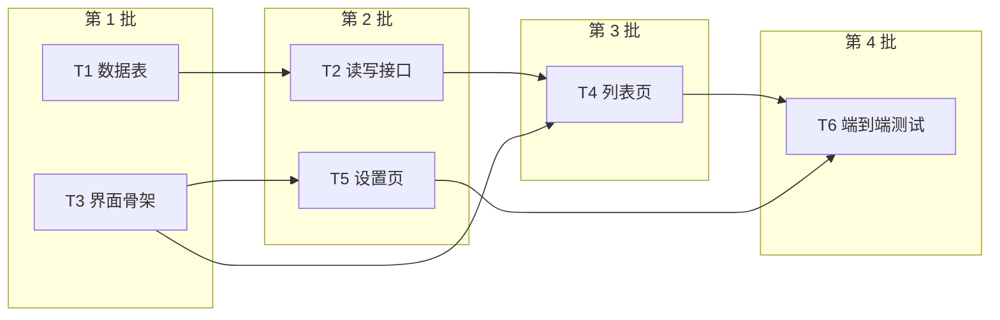
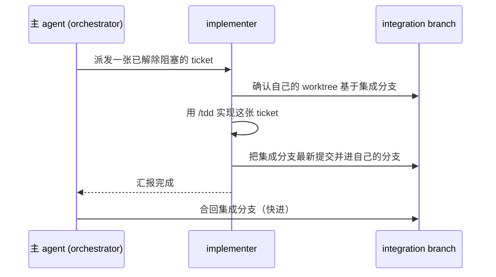
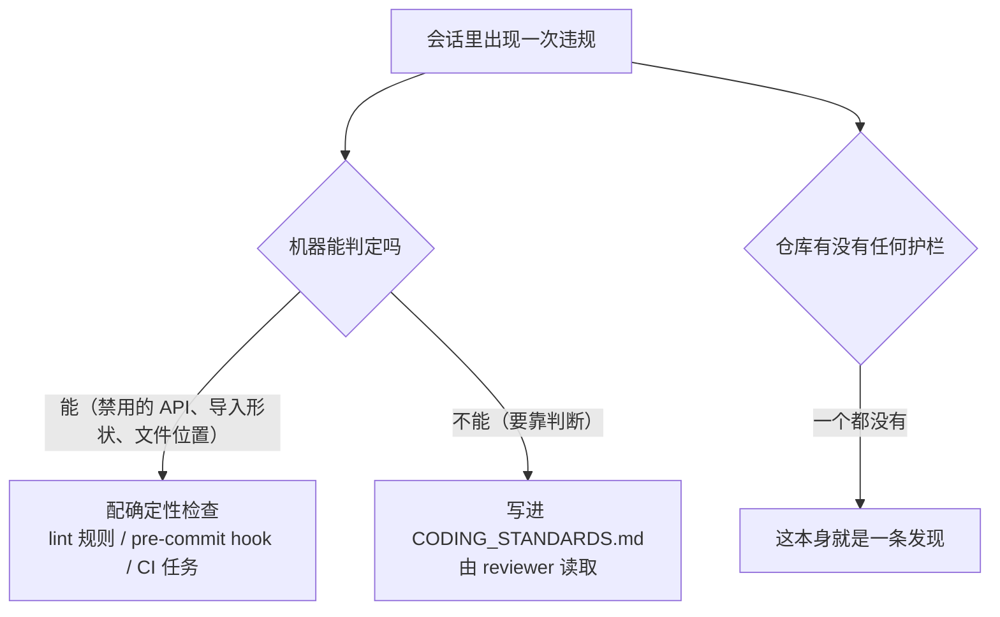
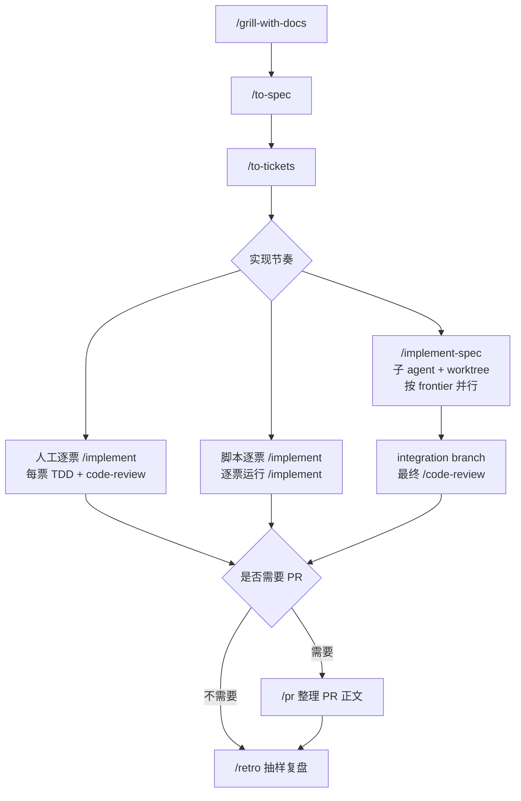

文章内容主要根据 Matt Pocock 的官方 Youtube 视频。原视频链接（可能需要科学手段）：

<iframe width="560" height="315" src="https://www.youtube.com/embed/BsJGo1wFTvQ?si=yaOop1gGgg4L9t-4" title="YouTube video player" frameborder="0" allow="accelerometer; autoplay; clipboard-write; encrypted-media; gyroscope; picture-in-picture; web-share" referrerpolicy="strict-origin-when-cross-origin" allowfullscreen></iframe>

以下将专门讲清楚本次更新的各个技能该如何使用。

---

本次 v1.3.1 更新主要带来了以下三个全新技能：`/implement-spec`、`/pr`、`/retro`，并翻新了以往部分技能的描述。

## 主题：一份功能拆成十几张 ticket 以后，谁来把它们做完？

Matt Pocock 在 v1.3.1 的视频里，先把前半段交代清楚了。工作拆成 spec 和 tickets，spec 写目标，每张 ticket 切到一次会话能做完。整份 spec 交给同一个 agent，会话一长就会触发自动压缩，早先确认过的决定可能在压缩里丢掉。拆完以后怎么推进，是 v1.3 补上的后半段。

这篇对照了 v1.3.1 的发布记录、PR 1120 和 ask-matt 的路由说明来写。视频里 Matt 的口头说法我只做转述，没有逐条拿技能源码核对，需要以源码为准的地方，文中会直接标明。

## 拆票之前，先守住一整个上下文

新版`/ask-matt` 把主流程排成 `/grill-with-docs`、`/to-spec`、`/to-tickets` 三步，并且特意交代，这三步留在同一个上下文窗口里，到 `/to-tickets` 做完以前不要 compact，也不要 clear。讨论、spec 和票据建立在同一段思考上，后面才对得上。

窗口的上限它叫 smart zone，大约 150k token，超过以后模型的推理开始变钝。如果票还没拆完就逼近这个数，办法是在最近的阶段边界 `/compact`，不要硬撑。

拆完以后，每个 `/implement` 从一张票出发，开一个新会话。每张 ticket 自包含，上一张的上下文可以直接扔掉。

## 逐票手工派活，和确定性脚本

手工路线的节奏是 `/implement` 一张票，`/clear`，再来下一张。

本地 tracker 上，每张票是 `.scratch/<feature>/issues/` 下的一个文件，人按先阻塞、后被阻塞的顺序自己挑。接到真正的 issue tracker，阻塞关系变成原生的 blocking 链接，前置票都做完的 ticket 谁都可以领。Matt 的看法是，这样每张票都要人盯着，做完还得清一次上下文，很费人。

愿意花时间搭东西的人，他更推荐一段确定性脚本，循环着逐票去跑 `/implement`。每次执行的方式一样，日常成本低，代价压在前期，要有耐心把脚本调到位。

## 一、 /implement-spec 子代理驱动自动化完成每 ticket 执行

v1.3 把 `/implement-spec` 从 in-progress 目录挪进了 engineering 目录，正式发布，随 Claude Code 插件一起装，也有了自己的文档页。

v1.3.1 的发布记录这样描述它。它把 tickets 读成一张 task graph，在各自的 worktree 里起 implementer subagent，对当前就绪的那一批 ticket 并发实现，所有成果落在同一条 integration branch 上，最后以一次 `code-review` 收尾。按视频的讲法，每张票按 TDD 实现，合回分支的活由 merger subagent 负责，依赖解除后继续派下一批。

“当前就绪的那一批”，技能里叫 frontier。一张票的所有前置票都已完成，自己还没开始，它就站在 frontier 上。

### 1. 它为什么出现

Matt 在更新说明开头先下了一个判断，写代码变便宜了，读代码没有变便宜。v1.3 的重心因此放在代码周围的事情上，`/implement-spec`、`/pr`、`/retro` 都在这一边。

前半段流程没有变，`/grill-with-docs`、`/to-spec`、`/to-tickets` 走完，手里是一份 spec 和一组 tickets。麻烦在后面。`/implement` 一次只做一张票，下一张谁来派，仍然是人。

对着一组 tickets，Matt 列了三种办法。

第一种是手工循环。对 agent 说做第一张，等它做完，清掉上下文，再说做第二张。他的评价是人成了那个 for 循环，没什么乐趣。

第二种是确定性循环。写一段脚本，逐张读 ticket，对每张跑 `/implement`。多数人他推荐这一种，每次跑法一致，可靠，也便宜，代价是搭起来、调起来要有耐心。他自己的 Sandcastle 是这类工具之一。

第三种是 agent 循环，盯着票的人换成了 agent，这就是 `/implement-spec`。

他对第三种的定位很坦率，它比确定性循环差。但在自己的“软件工厂”还没调好之前，拿它起步做 AFK（人离开键盘）的活很合适，他用它的次数比预想的多。让它成为可能的条件，是 subagent 现在可以再起自己的 subagent。

转正之前，已经有用户在自己搭类似的东西。官方文档页收了几条反馈。有人想让 subagent 去实现 tickets，一份 spec 里票多过五张时，不想一张张新开会话。有人嫌试验版最后要建 PR，没有 GitHub 这类线上仓库就用不了，希望停在合并完成的分支上。还有人发现 implementer 没有继承 `/tdd` 的要求，从一张票扩到整份 spec，红绿循环就断了。文档页说这两处现在都改了，终点是集成分支，每个 implementer 用 `tdd` 做票。

Matt 自己也点了两处毛病。产出是一整条大分支，目前没有好的拆法，叠 PR 是个路子，但他不想把技能绑死在 GitHub 上。worktree 也挡不住撞车，只是把撞车推迟到合并时，两张票可能给同一个字段起了两个名字。他的建议是把它当成基础版本，在上面搭自己的。

#### 2. 它怎么跑

`/implement-spec` 把 tickets 读成一张带阻塞关系的 task graph，阻塞关系由 `/to-tickets` 写下。任何时刻，所有前置票都已落地的 ticket，站在 frontier 上，它们同时开工。票据之间没有阻塞边，图是平的，所有票会一起启动。

一次完整的运行有五步。

1. 读 spec 和 tickets，在一个独立的 subagent 里摸清代码库。
2. 建好集成分支。
3. 给 frontier 上的每张票起一个 implementer subagent，各占一个 worktree，用 `/tdd` 做票。
4. merger subagent 把每张做完的票合进集成分支，frontier 往前走，新就绪的票拿到新的 implementer。
5. 整张图做完，对整条集成分支调用一次 `/code-review`，再起一个 fixer 去修。

它有两个前提。tracker 要先由 `/setup-matt-pocock-skills` 配好，没配的话技能会停下来，让人先去配。运行环境要能在后台跑 subagent，并给每个配一个 git worktree，只能一个一个跑的环境里，它不过是一个更慢的 `/implement`。

### 3. 一张假设的票据图

下面这张图是我编的示意，只为了看清 frontier 怎么走。六张票里，T3 和 T1 一开始都没有前置，T4 要等 T2 和 T3，T6 要等 T4 和 T5。我用一小段 Python 把票据图按依赖深度分了批。



分批只是方便看图。真跑起来 frontier 是随时更新的，T3 一完成，T5 就可以开工，不必等 T1 收尾。

并行能省多少，看的是最长的那条依赖链。设每张票耗时为 $t_i$，一个接一个做，总时间是

$$
T_{\text{串行}} = \sum_{i} t_i
$$

不限并发数时，总时间的下限由最长的依赖链决定，$p$ 取遍图里所有的依赖链。

$$
T_{\text{并行}} \ge \max_{p} \sum_{i \in p} t_i
$$

示例里每张票按 1 个单位算，串行是 6，最长的链是 T1、T2、T4、T6，长度 4。最理想也只能从 6 压到 4。合并耗时、冲突返工、票大小不均，都会把这点收益再吃掉一部分。若票据之间几乎没有阻塞关系的话，最长链接近总量，并发就没什么可赚的。

### 4. 每个 implementer 子代理要做完的事

发布记录给 implementer 加了三个动作，顺序如下。



先确认 worktree 基于集成分支，再用 `/tdd` 做票，汇报完成之前先把集成分支的最新提交并进自己的分支。这样合回去的时候每一次都是快进合并，不会在合并那一步才暴露冲突。

### 5. 交付物默认是分支

`/implement-spec` 的目标改成了整份 spec 落在一条集成分支上，PR 退到后面。

- 只有 tracker 靠 PR 来关闭 tickets，或者用户明确要 PR，才会开 draft PR，而且要等首次合并之后。一条没有任何新提交的分支，开不出 PR。
- 没有 PR 时，tickets 按 tracker 自己的方式关闭。
- tracker 没配置，技能会让人先去运行 `/setup-matt-pocock-skills`，不会悄悄默认用 `gh` 或代替用户完成。

视频演示的是 PR 路径，具体项目默认怎么走，以当前技能正文为准。

---

## 二、`/pr` 优化 Pull Request 的正文

`/pr` 管的是 PR 正文的形状，由 agent 在写 PR 时自己调用。正文有三块。

第一块是摘要，用能把改动说清楚的最小画面，伪代码、调用树、文件树、Mermaid 或 diff 都行，这部分借鉴了 Dex Horthy 的 `/show-me`。第二块是修改前后的证据。第三块是合并风险，判断这是一扇单向门还是双向门，再说影响面有多大。

PR 1120 就是照这个形状写的。摘要是一棵 diff 形式的目录树，节选如下。

```diff
 skills/
 ├── engineering/
+│   ├── implement-spec/
+│   ├── pr/
+│   ├── retro/
-│   └── resolving-merge-conflicts/
```

证据那一栏很短，改动前 `plugin.json` 带 25 个技能，改动后 27 个，`claude plugin validate . --strict` 通过。合并风险那栏写得更实在，三项转正是双向门，删除一个技能和改文件名接近单向门，因为插件用户一更新，`resolving-merge-conflicts` 就没了。

Matt 发现，写 PR 时被要求拿出证据，agent 会因此多跑一次测试，或者补一张截图。

---

## 三、`/retro` 回看环境里的摩擦

### 1. 它从哪里来

Matt 的技能一直对使用者要求很高。时间一长，需要有人来维护这个仓库，让 `AGENTS.md` 保持精简，让技能保持锋利，补上好用的 lint 规则，让代码容易被找到。他在自己的仓库里一直是手工做这些事，后来干脆打包成了一个技能。

它的出场也有一段过程。8 月 24 日，Matt 在推文里说把 `/retro` 挪进了 in-progress，可以在任何一次会话之后跑，也可以对一批会话跑，设法修补这些会话里出过的错。当时他列的目标是 agent 的导航、`CODING_STANDARDS`、工具经济和信息获取。10 月 4 日他发布 v1.3，理由写得很直白，围绕 `/retro` 的呼声太高，不发不行。这也是 v1.3 这次更新里份量最重的一项。

背后还有一个判断。他在更新说明里说，agent 抱怨得没有它该抱怨的那么多，它会接着往下推，功能最后照样做出来了。人从最终结果里看不见中间的磕绊，`/retro` 读的是真实会话的记录，所以能看到 agent 没有告诉你的那部分。你给的章节摘要把这一段概括为找出遗漏的检查、上下文丢失和工具浪费。

### 2. 它怎么看一场会话

`/retro` 读会话自己的记录，默认是当前这一场，也可以让它去会话日志里找指定的一场。它找出 agent 吃力的那几个时刻，给出一份候选修复清单，最严重的排在前面。

它改的是环境，不改代码。agent 交出去的那个 bug、花了二十次工具调用才找到的文件、reviewer 漏掉的规则，`/retro` 都不会当场去修，它追问的是仓库里有什么让这些事发生，再提议能挡住它们的检查、指引或规范。它只提议，你挑中哪条，才会改哪条。它是用户主动调用的技能，agent 不会自己想起来去用。

它在七个地方找问题。

| 会话里发生了什么                          | 改法                                                              |
| ----------------------------------------- | ----------------------------------------------------------------- |
| agent 找一个文件或一条信息找了很久        | 在它本来就会读的文件里加一条导航指引                              |
| 犯了一个工具本可以拦住的错                | 加自动检查，lint 规则、类型、测试、pre-commit hook、CI 任务都可以 |
| reviewer 漏掉了一个要靠判断的错           | 在 `CODING_STANDARDS.md` 里为 reviewer 补一条规则                 |
| `AGENTS.md` 或 `CLAUDE.md` 太大           | 把里面的 steering 挪去规范或检查                                  |
| 某次工具调用花得多、拿到的少              | 精简这个工具，或者换掉                                            |
| steering 文件里塞满了不改变任何行为的句子 | 删掉这些 no-op                                                    |
| agent 需要的信息够不着                    | 放宽它的访问，比如把开发服务器日志写进文件，给某个服务开只读权限  |

no-op 的例子，是要求写干净、可读代码这类句子，写上和不写，agent 的行为没有区别，Matt 的建议是直接删。

整套设计里最关键的是两件事，自动检查和编码规范。

规范归 reviewer，不归 implementer。理由在上下文压力上。implementer 要探索、写代码、调试失败，压力最大。reviewer 只拿到一份 diff，余地大。所以新规则放进 review 读的地方，不放进 `AGENTS.md`，因为 `AGENTS.md` 每次会话都会整个加载，不管相关不相关。

写任何规则之前，先给违规分类。



机器能判定的违规，一律配确定性检查，因为检查会失败，规范文件里的一句话不会。只有 linter 永远管不到的判断题，才写成文字。一个仓库连 pre-commit hook 和跑 lint、类型检查、测试的 CI 都没有，这件事本身也算一条发现。

`CODING_STANDARDS.md` 不是随技能发的文件。第一次有会话暴露出一条要靠判断的规则时，`/retro` 会提议新建它，你接受以后，`/code-review` 此后就会读它。你已有的 `CONTRIBUTING.md` 之类的规范文档，也按同样办法处理。

### 3. 为什么必须有人在环里

Matt 给出的循环很短，发现一个错误，跑一次 `/retro`，让这个错下次不可能再发生。照这个做法，`AGENTS.md` 会越来越短，不会越来越长。

很多人问他怎么自动化，他的回答是别这么做。自动跑的 retro 会产生误报，还会不断去修这些误报，把仓库带到不该去的地方。官方文档页补了一个旁证，有用户明确要它别自动改，因为被自动 hook 拦过好的改动。文档还特意提醒，它没有 dry-run 模式，提议出来的检查也是代码，在让它能拦合并之前，应当先拿仓库试一遍。

比较实用的用法有两种。一种是空闲的时候，抽样跑最近的几场会话。另一种是在 agent 干了怪事的那一场之后跑。一场顺利的会话没什么可教的，每场都跑，多半只会得到一堆没人需要的规则。

### 4. 它自己承认的短板

官方文档对短板写得很坦率。

- 它看得到删除 steering 文件里的 no-op 和该挪走的内容，却不会去审计它上个月提议的 lint 规则和 hook。它一次只看一场会话，判断不了某条规则已经变吵，或者早就过期。清理检查仍然是人的工作，某条规则总在好代码上报错，就是该动它的信号。
- 有用户批评，会话做完以后，AI 容易忘掉中段的磕绊，为了凑满那几个类别去编套话。文档给的防线是，每条候选都必须出自会话自己的记录。读的时候，凡是追不回具体某个时刻的候选，就扔掉。严重程度的排序也只当初稿，一个安静但昂贵的错误，可能排在一个吵闹但便宜的错误后面。
- 会话很长时，默认回看当前这场最好，磕绊还在上下文里。如果这场已经掉出 smart zone，就先 `/clear`，再让新开的 `/retro` 去读上一场的日志。

它也不是记忆系统，不会存下发生过什么，只会改环境，让同样的事发不了。和 `/improve-codebase-architecture` 的区别在输入上，后者只需要代码，找代码结构上的改进，`/retro` 需要会话历史，改进的是 agent 工作的环境。

### 5. 在流程里的位置，和 v1.3 的变化

`/retro` 之前在 in-progress 目录里，v1.3 把它转进了正式的 engineering 技能。主流程的最后一步现在是它，排在 `/code-review` 之后。ask-matt 还会在 `/diagnosing-bugs` 修完 bug 以后推荐它，问一句什么本来能防止这个 bug。`/code-review` 是它最常调整的对象，新的编码规范落在 review 读取标准的地方。它提议任何 steering 文件或技能之前，会先加载 `writing-for-agents`，用那份写作规范约束自己的措辞。

对使用者的影响是，流程第一次有了回头看自己的一步。前面的 `/grill-with-docs`、`/to-spec`、`/to-tickets`、`/implement`、`/code-review` 都在往前做事，`/retro` 把这一轮学到的东西喂回 agent 的环境。一场顺利的构建可以跳过它，一场磕磕绊绊的构建值得它。

## 对于 CONTEXT.md 改名相关的争议

领域文档的文件名变了。技能读写的约定从 `CONTEXT.md` 与 `CONTEXT-MAP.md` 改成 `GLOSSARY.md` 与 `GLOSSARY-MAP.md`。发布记录给的迁移办法是 `git mv`，技能之后只认新名字。Matt 解释，他自己的 `CONTEXT.md` 已经收敛成一份领域词汇表，所以改了名。旧文件里如果还放着项目背景和决策，应该先拆开，再迁移。

这次改名在 PR 下面吵了一轮。有人指出，团队里第一个升到 v1.3 的人一改名，没升级技能的同事就会在 `git pull` 之后读不到文件，`/grill-with-docs` 悄悄退化，输出变差，却没有任何报错。他主张新旧两个名字并存一个版本。反方的意见是，这个项目没有承诺过向后兼容，更新技能的人本来就该读一遍变更。另有人建议过渡期用符号链接。v1.3.1 最后采用的是直接改名，没有并存期。

被删掉的是 `resolving-merge-conflicts`。发布记录的说法是不再需要，也没有替代品，agent 处理合并或变基冲突时用不着专门的技能。它的文档页留着，标注为已归档。

## 此次更新的遗留事项

PR 1120 的描述里点名了 `/implement-spec` 留到以后的几项，文档页也把它们列作已知的毛病。

- frontier 的跟踪（#936）
- 有边界的 review 收尾（#1014）
- 并行安全（#988、#943）
- 行内合并与编排者的纪律（#1010）

视频里 Matt 对它的定位也很克制，它是确定性脚本和手工派票之间的一个选项，适合想让 agent 代为编排、自己能走开一会儿的人，执行结果仍不如确定性脚本可预测。

## 升级自己的工作流

在原 Matt Pocock Skills Driven Workflow 的基础上，需求讨论和拆票照旧，按 `/grill-with-docs`、`/to-spec`、`/to-tickets` 走。实现阶段有三种节奏，要不要开 PR 是后一道岔路：



三条路放在一起看。

| 路线                  | 谁在盯                    | 前期投入             | 可预测性       |
| --------------------- | ------------------------- | -------------------- | -------------- |
| 人工逐票 `/implement` | 人，每张票都要            | 几乎没有             | 取决于人的节奏 |
| 脚本逐票 `/implement` | 脚本，人只看结果          | 高，要把循环调通     | 最高           |
| `/implement-spec`     | 主 agent 调度，人可以走开 | 中，要先配好 tracker | 低于脚本       |

我的判断是，选哪一条先看票据图的形状。票和票之间几乎没有阻塞，并发赚不到什么，逐票或者脚本更省心。依赖分叉得多、最长链明显短于总量，`/implement-spec` 才有用武之地。这个判断来自上面那条下限公式，暂没有经过实测。

## 参考资料

- [Matt Pocock 的 v1.3 视频](https://www.youtube.com/watch?v=BsJGo1wFTvQ)
- [v1.3.1 发布记录](https://github.com/mattpocock/skills/releases/tag/v1.3.1)
- [v1.3 合并说明 PR 1120](https://github.com/mattpocock/skills/pull/1120)
- [当前 ask-matt 路由说明](https://github.com/mattpocock/skills/blob/main/skills/engineering/ask-matt/SKILL.md)
- [implement-spec](https://github.com/mattpocock/skills/blob/main/skills/engineering/implement-spec/SKILL.md)、[pr](https://github.com/mattpocock/skills/blob/main/skills/engineering/pr/SKILL.md)、[retro](https://github.com/mattpocock/skills/blob/main/skills/engineering/retro/SKILL.md)
