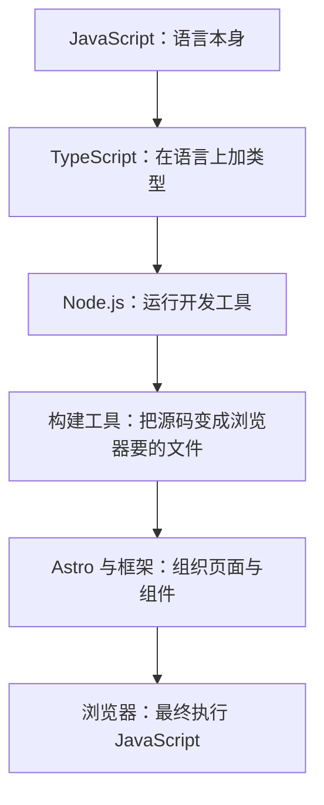
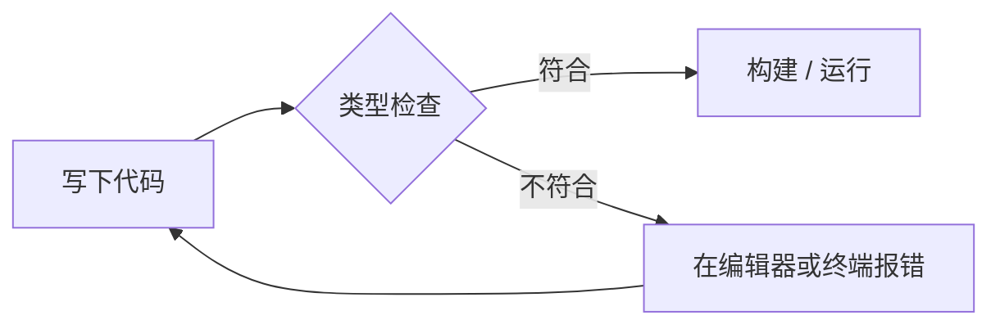
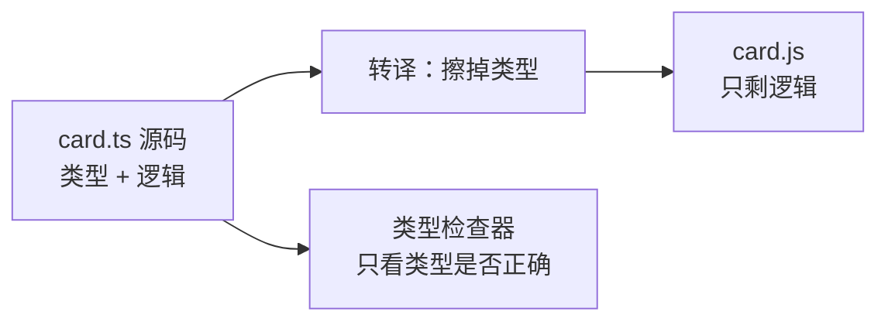
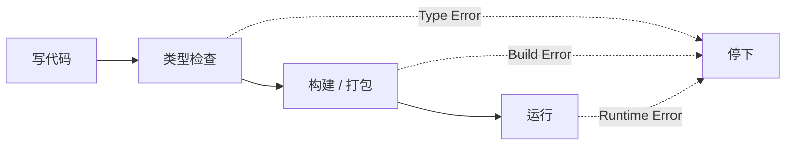
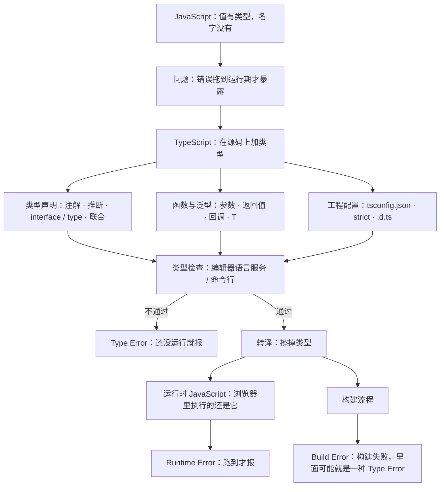

## 本章导读

AI 给你写了一个函数，写完在编辑器里就多了一道红色波浪线。它说：「这个参数的类型不对，改成 `number` 就好。」你改完，红线消失了。可你刷新页面，浏览器里跑的还是那份 JavaScript——刚才那个 `: number`，到哪儿去了？

另一件事也很常见。AI 改完一个组件，说「我把 `interface` 更新了，现在 props 对上了」，然后让你跑一次 `pnpm build`。终端里冒出一串 `TS2345`，构建失败。你没改任何逻辑，页面看起来也没坏，可它就是不让你发出去。

这两件事说的是同一个东西：TypeScript。它不是一门新的浏览器语言，也不是 JavaScript 的替代品。它是在 JavaScript 上加了一层**类型**，用处是在代码跑起来之前，先把一部分错误提前指出来。这一章讲的就是这层类型是怎么加上去的、它在哪里生效、以及 AI 说 `tsconfig`、`interface`、`type error` 时，它准备做什么。

## 本章在技术栈中的位置



本章只看图中的第二格。它紧贴 JavaScript——TypeScript 的语法就是 JavaScript 加上类型标注；往下走，它最终仍然要变回 JavaScript 才能被浏览器执行。所以这一层不改变页面能做什么，改变的是你在写代码的时候能不能更早发现问题。

## 读完本章，你应该能看懂

- “This parameter needs a `string`.”
- “Fix the type error in `Card.tsx`.”
- “I updated the interface — the props match now.”
- “The type is inferred here, no annotation needed.”
- “Check your `tsconfig.json`.”
- “That type comes from `@types/react`, not from your code.”
- “`any` turns off checking for this value.”

---

## 4.1 为什么需要 TypeScript

TypeScript 不是凭空出现的。它出现的原因可以压成一句话：JavaScript 太自由了，自由到很多错误要等到用户点下去那一刻才暴露。

这一节先看自由带来了什么，再看两种不同时机的错误，最后引出「静态类型检查」这个概念。它是这一章所有内容的起点。

### 4.1.1 JavaScript 的动态类型

JavaScript 里，变量本身不携带类型信息。类型属于**值**，不属于装值的那个名字。

```js
let total = 0;
total = "还没算"; // 合法：同一个名字可以先后装不同类型的值
console.log(total + 1); // "还没算1"
```

这段代码需要看懂的是：`let total` 声明的是一个名字，不是「一个数字」。它先指向数字 `0`，随后又指向字符串 `"还没算"`，两次都没有报错。第三行的加号遇到字符串就变成了拼接，得到的是 `"还没算1"`，而不是 `1`。

这种做法通常叫**动态类型（Dynamic Typing）**。它的好处是灵活：改一个函数的用途，不用回头改一堆类型标注；写小脚本时很省事。代价也很直接：上面那行 `total + 1` 没有任何地方会提醒你「这里其实在拼字符串」，它一路跑到运行，把结果交给下一个环节，错误在那里才以另一种样子出现。3.2.4 讲过的 `1 + "1"` 是同一件事的极简版。

动态类型还有一个更麻烦的后果：函数自己也说不清它要什么。

```js
function formatPrice(value) {
	return "¥" + value.toFixed(2);
}

formatPrice("1990"); // 运行到这里才炸：value.toFixed 不是函数
```

这个函数在写下的时候完全合法。它的问题只在你传了字符串时才暴露：`value.toFixed` 不存在，于是运行时抛出 `TypeError`。如果这条调用藏在某个不常走的分支里，它可能几周都没被发现。

在 AI 辅助开发里，这个函数最可能的样子是：它先被写出来，能用；某次调用传了字符串，运行时抛出一句 `value.toFixed is not a function`，然后你回头去找是谁传错了。如果参数上有类型，这一步会提前：写下 `value: number` 的那一刻，传字符串的那次调用就会在编辑器里亮起来。

这就是类型能带来的第一个实际好处：它把「找谁传错了」从「翻堆栈」变成了「看一眼被标红的那一行」。

同一件事在 TypeScript 里会变成当场报错：

```ts
let total: number = 0;
total = "还没算"; // 报错：string 不能赋给 number
```

这段代码需要看懂的只有一处：报错标在赋值那一行，而不是后面用到 `total` 的地方。报错的位置和原因的位置对上了，这是类型系统在排查上最直接的价值。

### 4.1.2 类型错误

**类型错误**指的是：一个值被当成另一种类型来用。上面那个 `toFixed` 就是典型：函数以为拿到的是数字。

按发生时机，类型错误分成两种，这个区分是本节最需要记住的一条：

1. 运行时的类型错误：代码已经跑起来，执行到那一行才失败。第三章 3.10.2 讲的 `TypeError` 就是这一类，比如「读取 `undefined` 的属性」。
2. 写下来就被指出的类型错误：代码还没运行，甚至还没保存，工具已经告诉你这里对不上。

第二种是 TypeScript 带来的。它不改变你代码里出问题的那一处，改变的是你什么时候知道——而且往往直接把报错钉在类型对不上的那一行（4.1.1 的例子）。

为什么时机这么重要？因为运行时错误的暴露条件很苛刻。只有用户真的走到那条分支、真的传了那种数据，问题才会出现。在开发机上测不出来、上线之后才被用户撞见的 bug，一大半是这一类。而静态检查在你还没提交的时候就把它拦住，代价从「线上排查」降到了「改一行」。

拿 3.10 那条读报错的三步来对：它在哪一刻发生、它属于哪一类、它指向哪里。TypeScript 做的其实是把第一步往前挪——把一部分原本属于「运行期」的错误，挪到「写下来」的那一刻。

这里有一个值得先建立的判断：不是所有错误都值得提前检查。变量名打错、访问一个不存在的属性，这些能在运行前被抓到（忘记写 `await` 看似同类，但类型检查通常抓不到它，那更接近逻辑问题的地盘）；但「这个折扣算得对不对」「分页有没有漏掉最后一页」不会被抓到，那是逻辑问题。TypeScript 管的是前者。分不清这两类，就容易对它抱错期待：既可能以为它能担保程序正确，也可能因为它抓不到逻辑 bug 而觉得它没用。

还有一层现实考虑：运行时错误的排查成本不是线性的。在编辑器里改一行是几秒；在测试环境里复现是几分钟；到了线上，你手里只有一条堆栈、一句用户描述和一堆不确定的复现步骤。类型检查做的事情，就是把这一类成本压回最低的那一档。

### 4.1.3 静态类型检查

**静态类型检查（Static Type Checking）** 是：不运行代码，只读代码本身，检查每个值被使用的方式是否符合它声明的类型。

「静态」这个词的意思就是「运行之前」。检查器看的是源码文本和里面写下的类型标注与推断结果，它不需要启动浏览器，也不需要真的把函数调用一遍。



这张图里值得注意的只有一件事：检查这一步在运行之前，出问题时不进入运行，而是回到写代码那一步。所以 TypeScript 的效果不会体现在页面上——页面的行为还是 JavaScript 决定的——它体现在你发现问题的时间点。

这里有一个边界必须说清楚，否则很容易对 TypeScript 抱有不切实际的期待：**类型检查只保证「代码内部自洽」，不保证「运行时数据真的符合类型」。** 数据来自用户输入、接口返回、本地存储，类型检查器看不到它们。你写 `const user: User = await res.json()`，检查器相信这是 `User`；可如果服务器返回的是别的东西，运行时照样会出问题。3.9.3 讲过的 `JSON.parse` 不校验字段，是同一件事的另一面。真正对外部数据做校验，需要运行时的检查代码——那是另一类工具的事，本章不展开。

所以对 AI 的输出，你需要建立两个直觉：它让你加类型标注的地方，多半是「这里迟早会传错」；它说「这不会在运行时出错」时，多半是在提醒你类型管不到运行时。这两句话的分界线，就在这条边界上。

---

## 4.2 TypeScript 与 JavaScript

上一节说的那层检查能力，是由一门语言提供的。它不是新语言，而是 JavaScript 的一种「加强写法」。这一节把它和 JavaScript 的关系说清楚：它多给了什么、它不能改变什么、以及它在离开你的编辑器之前还必须经过哪一步。

### 4.2.1 TypeScript 是什么

**TypeScript** 是 JavaScript 的**超集（Superset）**：所有合法的 JavaScript 都是合法的 TypeScript，它在此基础上加了类型标注、`interface`、泛型这些语法。

「超集」这个说法要补一句边界，否则容易想歪。概念上它成立：JavaScript 的语法 TypeScript 都认；但落到文件上，`.ts` 和 `.js` 并不完全等价。最直接的一点是 `let name: string = "首页"` 在 JavaScript 里是语法错误，只有 TypeScript 认识。反过来，JavaScript 里少数写法（比如 `with` 语句）在 TypeScript 里会被指出来。所以实际经验是：把一个 `.js` 改名成 `.ts`，大部分能过，少数写法会被工具挑出来，那正是它存在的意义。

类型在 TypeScript 里只有一个消费者：**开发工具**。写下的类型不会被翻译成任何运行时行为，浏览器不会看它，Node.js 也不会看它。它是一份写给工具的说明，说明「这个位置我打算放什么」。

文件扩展名是这件事的外在标记：`.ts` 是 TypeScript 源码，`.tsx` 是含 **JSX** 的 TypeScript 源码——JSX 是框架里描述界面结构的一种写法，第 10 章会展开（完整清单在附录 D）。浏览器不认识这两个后缀。Node.js 从近几个版本起倒是能直接运行 `.ts`，但它的做法只是把类型语法删掉再执行，同样不做类型检查。这正是 4.2.3 要讲的「类型擦除」——不检查、只删掉。

「超集」这个说法，用两段代码对照最清楚：

```js
// 合法 JavaScript，同时也是合法 TypeScript
function label(card) {
	return card.title;
}
```

```ts
// 只有在 TypeScript 里才合法
function label(card: { title: string }): string {
	return card.title;
}
```

两段干的是同一件事，第二段多出来的就是那一层说明。它不对第一段做任何否定——TypeScript 没有禁止依赖推断，它只是允许你把意图写下来。

还要分清「语法」与「类型」两个层面。有一类代码语法完全合法、在浏览器里也跑得通，但 TypeScript 会说它类型上讲不通。官方的例子是 `4 / []`：JavaScript 里它输出 `Infinity`，TypeScript 却认为「数字除以数组」没有意义。所以「超集」说的是语法：语法都认，但有些写法会被类型规则挑出来。

### 4.2.2 TypeScript 不是新的浏览器语言

任何一个主流浏览器都不能直接执行 `.ts` 文件。你在地址栏里让浏览器打开一个 `.ts`，它要么当纯文本下载下来，要么直接报错。

这件事和 3.1.3 讲的「浏览器 JavaScript 与 Node.js JavaScript 是同一门语言、两个运行环境」是同一类关系：环境决定能做什么，语言本身没有变。TypeScript 也没有改变语言，它只是在源码层面多加了一层描述。

所以工程里必然存在一步「把 `.ts` 变成 `.js`」。谁来做这一步、什么时候做，涉及 Node.js 与构建工具，是第 5、6 章的内容；这一章只需要知道这一步存在，以及它带来的一条结论：**浏览器最终执行的仍然是 JavaScript，只是它可能不是人手写的。**

AI 常说的两句要能对上：「TypeScript 会被编译掉」「类型在运行时不存在的」——说的都是这件事，见下一节。

### 4.2.3 TypeScript 最终如何变成 JavaScript

这一步通常叫**编译（Compile）**，更准确地叫**转译（Transpile）**：保留代码逻辑，去掉类型，必要时把较新的语法改写成较老的写法。

```ts
// 输入：card.ts
interface Card {
	title: string;
	count: number;
}

function label(card: Card): string {
	return `${card.title} × ${card.count}`;
}
```

它经过转译之后得到的是：

```js
// 输出：card.js
function label(card) {
	return `${card.title} × ${card.count}`;
}
```

两段对照着看，有三处变化：`interface` 那一行整行消失；参数后面的 `: Card` 和返回值后面的 `: string` 消失；函数体一个字都没改。

这就是「类型擦除」，也是本章最重要的一条推论：**类型与运行时无关。** 类型写得再全，页面上也不会因此多出任何检查；反过来，运行时如果真的出了问题，原因一定是别的东西：数据不对、属性不存在、逻辑走错了。

第二条推论同样实用：既然类型只是被抹掉，转译本身就不需要「理解」类型。现实里的构建工具大多采用这种方式：它们只擦掉类型、顺手降级语法，**并不做类型检查**。所以「构建成功」不等于「类型没问题」。真正的类型检查要另外跑一次（4.6、4.7 还会回到这条）。

还有一件容易意外的默认行为：类型检查报错时，默认仍然会把 JavaScript 产出来（要阻止它得显式配一个开关）。所以「终端里有报错、页面却照跑」是常见现象。



这张图要看出的是：左边一份源码，右边走了两条互不相同的路。转译负责产出能跑的 JavaScript，类型检查只负责判断类型对不对，两条路各自独立。这就是为什么「页面能跑」和「类型全对」经常是两件事。

谁来做转译？一个是 TypeScript 官方的命令行编译器 `tsc`（今天的版本已经是原生程序，入口仍然由 Node 启动），另一个是各构建工具内部自带的转译器。具体怎么装、怎么跑命令，属于第 5 章的内容，这里只需要认出 AI 那句话里的动作：它在准备把源码里的类型处理掉。

还有一条常被误解的地方值得提前说清：**被擦掉的只有类型**。类型断言（`as`）、`interface`、类型别名、泛型参数都会消失，函数体、变量、控制流程一行不少。所以「转译后的代码比源码少了什么」，答案几乎永远是「少了类型」。

反过来，如果 AI 说「这段类型代码会影响运行时」，先怀疑它说错了——除非那段代码不是类型，而是像 `enum` 那样会同时生成真实对象的少数例外（那属于进阶内容，本章不展开）。

为什么这一步在项目里还有那么多细节（用哪个工具、按什么顺序做）？因为它和依赖安装、构建流程拴在一起，而那两件事分别在下一章和第六章。这一章只需要记住图里那条结论：类型在离开你手边之前就被拿掉了。

---

## 4.3 基本类型

类型怎么写？从最基础的几种开始。它们和 3.2 讲的「值的类型」一一对应，只是换了一个位置——从值身上搬到了名字身上。

写法统一是这样的：

```ts
let name: string = "首页";
```

名字后面跟一个冒号，再跟类型名。冒号后面那一段叫**类型注解（Type Annotation）**，只写给工具看，不会出现在产物里。

### 4.3.1 string

字符串类型写成 `string`（全小写）。模板字符串、拼接出来的结果同样是 `string`。

```ts
let title: string = "首页";
let full = title + " · 全新"; // full 也是 string
```

一个常见的 AI 动作是给它加 `| null`，因为从 `localStorage`、从 DOM、从接口拿回来的字符串都可能是空的。看到 `string | null`，读法是「这里可能是个字符串，也可能是空」，而不是「它有两种写法」。

### 4.3.2 number

只有一种数字类型，整数和小数都用它，和 3.2.4 说的一致：TypeScript 没有为数字再分类型。`NaN`、`Infinity` 也都是 `number` 类型的值。

AI 报类型不匹配时，`number` 与 `string` 的混淆占很大一部分：表单里取到的值是字符串（3.2.4 讲过 `1 + "1"` 这件事），传进一个要求 `number` 的函数就会亮红。

### 4.3.3 boolean

`true` 和 `false`，类型名是 `boolean`。它常出现在函数返回值位置：`function isValid(): boolean` 说明这个函数只回答一个是非问题。

有些函数的返回类型写成 `boolean` 其实不妥，比如「校验不通过时还想带上原因」的场景会返回 `string | null`。看到 AI 把返回值从 `boolean` 改成别的，多半是它对「结果里还要带信息」做了调整。

### 4.3.4 array

数组有两种等价写法：

```ts
let tags: string[] = ["css", "html"];
let tags2: Array<string> = ["css", "html"]; // 同上
```

两种写法完全等价，看到哪个都不必惊讶。数组类型会顺着 `map`、`filter` 传下去：`number[]` 调用 `.map(x => x + 1)` 得到的还是 `number[]`，装别的东西进来会被当场指出。

一个常见的坑是空数组：`const list = []` 推不出里面要放什么，这时注解 `string[]` 就是在告诉工具意图。

数组类型最常见的报错长这样：`Property 'toUpperCase' does not exist on type 'number'`。它的意思是「你调的这个方法不在元素的类型上」，原因往往是数组里混进了不该有的值。这时该修的是数据来源，而不是给 `map` 的回调加 `any`。

```ts
[1, 2, 3].map((n) => n.toUpperCase()); // 报错：number 上没有 toUpperCase
```

这段代码需要看懂的两点：一是报错指的是「元素的类型」，不是数组本身；二是修法应该是回去看数据从哪来，而不是给回调加个 `any` 把报错按下去。

### 4.3.5 object

对象类型的写法不是“object”这个词，而是把内部的形状写出来：

```ts
let card: { title: string; count: number } = { title: "首页", count: 3 };
```

这种内联形状在短处很常见。一旦同一个形状用两次以上，就该给它起个名字——`interface` 或 `type`，见 4.4.3 与 4.4.4。

顺便说一句：`object` 这个类型名确实存在，但它几乎不表达任何形状，日常能看到它的地方很少；真正的对象形状都写在具体字段上。

这里有一个容易被问到的点：TypeScript 里的对象类型描述的是形状，不是某个具体的类。两个字段完全一样但名字不同的类型，在检查器眼里可以互相赋值——它看的是结构，不是名字。这个行为叫**结构类型（Structural Typing）**，是很多「明明类型不一样，为什么不报错」的答案。

顺便说一句：`object`、`Object` 和 `{}` 是三个不同的类型名，日常写业务代码几乎用不到它们；真要用，官方明确建议用 `object` 而不是 `Object`。

### 4.3.6 null 与 undefined

`null` 和 `undefined` 既是值，也是类型名。在打开严格检查的项目里，它们**不包含在其它类型里**：

```ts
let a: string = null; // 报错：null 不是 string
let b: string | null = null; // 合法：显式说明“这里可能是空的”
```

这是 TypeScript 给日常开发带来最大改变的一条。第三章 3.2.6 说过 `undefined` 是「系统给的空」；这里的价值是：如果你声明的是 `string`，工具就会拦下所有可能塞进 `null` 或 `undefined` 的地方，逼你在类型里把「可能没有」这件事写出来。AI 让你把 `string` 改成 `string | null`，说的就是这件事。

还有一个现象可以先建立预期：刚打开严格检查的项目会吐出一大批「可能为 undefined」的报错。那不是新 bug，是把原本隐形的风险显了形。

### 4.3.7 any

`any` 是类型系统上的一个逃生口：标成 `any` 的值，读写都不再被检查，可以赋给任何类型，也可以从任何类型赋过来。

```ts
let data: any = await res.json();
data.whatever.deeply.nested(); // 不报错——但运行时可能崩
```

它有两类合理用途：迁移一屋子旧的 JavaScript 时临时过渡，以及接入一个完全没有类型的库。但它也会传播：一个 `any` 流进函数，返回值往往也变成 `any`，检查会一小片一小片地失效。

所以看到 AI 说 “cast to `any`” 或者 “just use `any` here”，先把它理解成「这里先绕过检查」：它可能合理，也可能是把问题往后拖了。

判断 `any` 用得对不对，可以看它出现的位置：出现在代码边界（迁移期的旧模块、没有类型的第三方库）通常可以接受；出现在你自己写的函数签名里，多半是在绕过检查。

### 4.3.8 unknown

`unknown` 和 `any` 一样能接住任何值，区别在后面：**用之前必须先确认它是什么。**

```ts
let data: unknown = await res.json();
if (typeof data === "string") {
	data.toUpperCase(); // 只有确认之后才允许这样用
}
```

它适合来自外部的值：接口返回、`localStorage`、事件对象。一句话区分两者：`any` 是「别管我」，`unknown` 是「先问清楚再用」。在新一点的代码里，AI 更可能用 `unknown`。

它带来的一点不便也值得先知道：因为 `unknown` 用之前必须先收窄，所以它比 `any` 要多写几行检查代码。AI 有时会因此把它换回 `any` 来「让代码先跑起来」。知道这是拿检查换了便利，就够了。

### 4.3.9 void

`void` 只出现在函数返回值的位置，表示「这个函数不打算给出有用的结果」：

```ts
function log(msg: string): void {
	console.log(msg);
}
```

它和 `undefined` 的区别不在值，而在意图：`undefined` 是一个具体的空值，`void` 描述的是「调用者不必关心返回值」。事件处理、回调函数大量用这个类型。

这一节列了九个类型，但真正在 AI 输出里天天出现的只有几种：`string`、`number`、数组、以及 `null` / `undefined` 的联合。其余几种（`any`、`unknown`、`void`）出现频率不高，但每次出现都值得看一眼，因为它们通常意味着某个取舍被做了出来。

---

## 4.4 类型声明

上一节的类型都贴在具体的值上。工程里更常见的是反过来的思路：先把「一个东西长什么样」描述出来，再到处引用它。这一节讲的就是描述形状的几种写法。

### 4.4.1 类型注解

**类型注解**就是那个「冒号加类型名」的写法。它能出现在变量、函数参数、函数返回值、对象的字段、数组的元素上，位置不同，含义一样：告诉工具这里放的是什么。

一个常见的误解是「注解越多越安全」。实际上工具自己推得出来的时候，写上去往往只是噪音；真正需要写注解的地方，是它推不出来、或者你想把意图固定下来的地方。

注解的位置不同，读法也略有不同。写在参数上，它是给调用者的约束；写在返回值上，它是给函数体的承诺；写在变量上，它多半是为了把推断结果固定下来，避免后面被改歪。

### 4.4.2 类型推断

**类型推断（Type Inference）** 是指：你没有写注解，工具根据初值自己得出了类型。

```ts
let count = 0; // 推断为 number
let title = "首页"; // 推断为 string
let tags = ["css", "html"]; // 推断为 string[]
```

推断在大多数情况下够用，而且它比手写更不容易过时。但它有两个边界：函数的参数推不出来（不知道调用者会传什么），以及空值开头时推不出意图。所以你会经常看到 AI 在参数上写注解、在局部变量上把注解删掉——它做的通常就是这个判断。

AI 说 “the type is inferred here, no annotation needed” 时，是在告诉你这行可以省略，不是因为注解错了。

推断还有一个值得知道的性质：从右往左走，而且会被声明的关键字影响。`const s = "a"` 推出来的是一个具体到字面量的类型，`let s = "a"` 会被放宽成 `string`。这解释了一类常见困惑：同一段字面量，用 `const` 能过，换成 `let` 就报错。

### 4.4.3 interface

**interface** 的作用是给一个对象形状起名字：

```ts
interface Card {
	title: string;
	count: number;
}

const c: Card = { title: "首页", count: 3 };
```

它带来的不只是复用。字段名写错（把 `title` 写成 `titel`）、少写一个字段、字段类型不对，这三种情况都会在对象处被指出来。它们都属于「写下来就被指出」的那一类，正是 4.1.2 说的第二种时机。

一个项目里，`interface` 往往描述了那些反复出现的形状：一个用户、一篇文章的元数据、一个组件的参数。看到 AI 说 “update the interface”，你要知道它动的是这个约定，而不只是某一行代码。

### 4.4.4 type

**type** 是类型别名，也能给对象形状起名字：

```ts
type Card = {
	title: string;
	count: number;
};
```

在大多数日常场景里，`interface` 和 `type` 可以互换，不必纠结。它们的差别主要体现在能拿它做什么：`interface` 可以被继承和合并，适合描述「会被扩展的库接口」；`type` 能直接描述联合类型、字面量、函数类型这些「组合出来的东西」，表达力更宽。

所以 AI 说 “switch to a type alias” 或 “extend the interface”，通常是在根据这个区别做调整，而不是在纠正一个错误。

选择上有个够用的经验规则：描述对象形状时两种都行，挑一个保持项目一致即可；一旦需要表达「A 或 B」「只能是这几个字符串」，就用 `type`。看到同一份代码里两种写法混着用，不必当成问题。

### 4.4.5 可选属性

在字段名后面加一个 `?`，表示它可以不存在：

```ts
interface Card {
	title: string;
	count?: number; // 可能没有
}
```

写的时候可以不写 `count`，但读的时候要小心：它的类型变成 `number | undefined`，直接拿去运算会被指出来。这和 3.9.3 那句「`JSON.parse` 不保证字段在不在」是同一件事——外部数据缺字段是常态，`?` 就是把这个事实写进类型里。

AI 说 “make it optional” 时，它加的就是这个符号。

`?` 很容易被读成「可以不管它」，其实它是一个真切的类型：`number | undefined`。所以读的时候 `card.count + 1` 会报错。AI 常见的修法有两种：给一个默认值（`card.count ?? 0`），或者真的判断一次。前者更短，后者更诚实地表达了「这里可能不一样」。

### 4.4.6 联合类型

**联合类型（Union Type）** 用 `|` 表示「这里只能是这几种之一」：

```ts
type Status = "draft" | "published";

let s: Status = "draft";
s = "draftt"; // 报错：不在允许的范围里
```

这种写法叫字面量联合，它是 AI 写代码时最常用的类型技巧之一：用它把「只能取这几个值」写进代码。里面出现字符串写错时，工具会当场指出来。

联合类型还有一个很好用的性质：**类型会跟着控制流收窄。**

```ts
function size(v: string | string[]): number {
	if (Array.isArray(v)) {
		return v.length; // 这里 v 被认定为 string[]
	}
	return v.length; // 这里 v 被认定为 string
}
```

看懂这段只需要一点：工具跟着分支走。进了第一个分支，它就排除了另一个可能；出了分支，它记得还有另一种。这就是为什么 TypeScript 的代码里常常看不到多余的检查：检查本身就起收窄作用。

最后一条经验：联合类型不是越多越好。`string | number | boolean | null | undefined` 这种五选一，读起来和 `any` 差不多，检查器也帮不上多少忙。真正常用的联合只有两类：几个具体字面量，以及「值 + 空」。

---

## 4.5 函数与类型

函数是类型最常出错的地方，因为它有两端：参数进来、返回值出去。这一节把这两端和回调的写法过一遍，最后看一眼泛型。

### 4.5.1 参数类型

参数是注解最必须写的位置：

```ts
function formatPrice(value: number): string {
	return "¥" + value.toFixed(2);
}
```

如果参数不写类型，在严格配置下会被直接标为错误（不允许「隐式 any」）。所以 AI 常在参数上写注解，不是因为参数特殊，而是因为它推不出来。

参数类型还有一个容易被忽略的作用：它也是给协作者的上下文，包括 AI。写下一个带类型的函数之后，后来生成的调用代码会自然按这个类型传参；反过来，参数是 `any` 的时候就只能猜。

### 4.5.2 返回值类型

返回值类型通常可以交给推断。但显式写出来有一个实在的好处：它把函数变成了一个约定。

```ts
async function loadTitle(): Promise<string> {
	const res = await fetch("/api/title");
	return await res.json();
}
```

这里 `Promise<string>` 读作「这个函数不现在给你字符串，它给你一个稍后会变成字符串的东西」——也就是 3.8.4 到 3.8.6 讲的异步写法。如果你看到的返回类型与函数实际返回对不上，工具会提前报错，而不用等到运行时拿到一个 `undefined`。

这里有个常见现象：函数标了 `Promise<string>`，但里面某个分支忘了 `return`，返回类型就对不上，检查器会指出返回值里多了 `undefined`。这类报错看着绕，其实就是在提醒你分支没写全。

### 4.5.3 Callback 类型

回调的类型写法是「括号、参数、箭头、返回类型」：

```ts
function onEach(
	items: string[],
	cb: (item: string, index: number) => void,
): void {
	items.forEach(cb);
}
```

和它在字面上对应的是 3.6.5 的事件监听、3.4.4 的 `map`/`filter`：它们都是「把一个函数交给别人，稍后调用」。区别只在于，这里把「这个函数应该长什么样」也写下来了。

事件的参数类型不是凭空来的。`(e: MouseEvent) => void` 里的 `MouseEvent` 来自浏览器接口的类型描述，那类描述就放在下一节要讲的声明文件里。AI 让你给事件参数加类型时，它给的多半就是这个。

回调类型最容易写错的地方是参数个数。TypeScript 允许你少写几个参数（`(item: string) => void` 可以传给要求 `(item: string, i: number) => void` 的位置），但不允许多写。所以看到 AI 删掉回调里的 `index` 参数，它不是在偷懒，是在对齐类型。

### 4.5.4 泛型的基本概念

**泛型（Generics）** 让类型本身也能当参数传递：

```ts
function first<T>(items: T[]): T | undefined {
	return items[0];
}

first(["a", "b"]); // 得到 string | undefined
first([1, 2, 3]); // 得到 number | undefined
```

看懂这段的关键是 `<T>`：它不是值，是一个类型占位符。调用时传入的数组是什么，`T` 就补成什么，返回值也跟着变。

为什么需要它？因为不用泛型就只能写 `any`，那等于把检查关掉。泛型让「处理各种类型但保持它们之间的对应关系」成为可能。日常最常接触到的泛型不是自己写的，而是别人写好的：`Array<T>`、`Promise<T>`、`Map<K, V>` 都是。

AI 说 “the generic parameter” 时，说的就是那个尖括号里的名字。更复杂的形式（给 `T` 加约束、给默认值、条件类型）属于进阶主题，本章只需要能认出「它在描述一组类型的对应关系」就够。

最后一句提醒：泛型不是某种高级技巧，它就是「让一份逻辑服务多种类型」的常规手段。看到 `<T>` 别扭，先把它读成一个占位符，把调用处的实际类型代进去，句子就通了。

---

## 4.6 TypeScript 工程配置

前面讲的都是「怎么用类型」。还剩一个问题没回答：一个项目按什么规则检查，由谁决定？答案是配置文件，而不是某一段代码。这一节把 `tsconfig.json` 和它周边的几样东西过一遍。

### 4.6.1 tsconfig.json

**tsconfig.json** 是项目的 TypeScript 配置文件，通常放在项目根目录。编辑器和命令行工具都会去找它，把里面写的规则当作这个项目的检查标准。

一段精简的示意（真实项目里这份文件通常由 `tsc --init` 或框架脚手架生成，内容随版本变化，不要背它）：

```json
{
	"compilerOptions": {
		"target": "esnext",
		"module": "nodenext",
		"strict": true,
		"noEmit": true
	},
	"include": ["src"]
}
```

它回答的是三个问题：检查哪些文件（`include`）、产出成什么形态（`compilerOptions` 里的各行）、以及检查按多严的规则来（`strict`）。至于要不要真的生成文件，由 `noEmit` 这类开关管。

为什么这件事重要？因为同一份代码在不同配置下结论可能不同。所以 AI 说 “check `tsconfig.json`” 时，往往不是让你改代码，而是提醒你「这里的行为是配置决定的」。

它还有一个实际作用：编辑器靠它决定用哪套规则给你划红线。所以换了项目、红线突然变多或变少，第一件事是看这份文件，而不是怀疑编辑器坏了。

### 4.6.2 compilerOptions

`compilerOptions` 里放的具体开关叫编译选项。完整清单很长，这里只挑几个在 AI 输出里反复出现的认读：

1. `target`：产出的 JavaScript 按哪个语言版本。它影响新语法会不会被降级成旧写法。
2. `module` 与 `moduleResolution`：模块用哪套语法、从哪里去找被导入的文件。3.7 讲的 ESM 在这里被具体化。
3. `strict`：一组严格检查的总开关，下一节单独讲。
4. `noEmit`：只检查，不生成文件。4.2.3 说的「检查与转译是两件事」，就靠它分开。
5. `jsx`：在框架场景下怎么看待 JSX，第 10 章会用到。
6. `skipLibCheck`：跳过第三方声明文件内部的检查，常见于加快检查速度的配置。
7. `isolatedModules` 与 `verbatimModuleSyntax`：与「谁来做转译」有关的开关，新项目模板里默认开启。

这些选项不需要背。需要建立的是两个认识：它们不是代码正确性的一部分，而是项目约定；看到不认识的选项，先看它的名字在说什么（`noEmit` 就是 no + emit），往往就能猜对方向。完整选项表属于查阅型内容（附录 B.3）。

这里只有一项值得单独提醒：`target` 与 `module` 决定了产出的形态，而它们的选择又和「谁来运行这份代码」绑在一起。同一个项目里，开发时跑的和构建时产出的目标可能不同，所以大型项目里往往不止一份 `tsconfig`，靠 `extends` 继承一份公共配置再各自覆盖。这部分细节属于工程配置，本章只需要知道「配置可以分层」。

新项目的 `tsconfig.json` 里，最高频的几行就是 `target` 、`module` 、`strict` 、`noEmit` 这四项；其余选项大多是在它们之上的微调。看到一份很长的 `tsconfig`，先找出这几行，其余部分当成「环境细节」就行。

### 4.6.3 strict

`"strict": true` 看起来是一个开关，实际上是一组开关的总闸。打开它，会同时启用若干项严格检查，其中对日常影响最大的两个是：

1. `noImplicitAny`：参数不写类型时不再默认 `any`，而是直接报错。
2. `strictNullChecks`：`null` 和 `undefined` 不再能隐式地赋给其它类型——4.3.6 讲的那条规则就是它给的。

所以严格模式不是「多了一个限制」，而是「把原本缺失的检查补上」。从 TypeScript 6.0 起，`strict` 的默认值已经是打开：新装的版本不需要你手动去开它，反倒是看到显式写着 `"strict": false` 的项目要多留一个心。同一段代码在不同项目里一个报错一个不报，原因往往就在这里。

AI 说 “enable `strict`” 或 “turn on `strictNullChecks`” 时，它就是在拨这组开关。一个反直觉但实在的建议：报错数量突然变多，往往不是代码变差了，而是检查变严了——这时候应该修代码，而不是把开关关回去。

还有一点值得知道：`strict` 是总闸，它包含的子项在 TypeScript 的历史版本里是逐步增加的。所以同一份代码在旧版本上能过、新版本上报错，是可能的。这是工具演进的正常代价，不影响本章的理解。

### 4.6.4 类型声明文件

下一个问题：第三方库大多是 JavaScript 写的，工具怎么知道它们的类型？

答案是**类型声明文件**：一种只描述形状、不含实现的文件。它只写「这个库导出一个叫 `foo` 的函数，它接收 `string` 返回 `number`」，不写函数体。

它有两个来源：库自己附带；或者社区维护的 `@types/*` 包（这些包集中在 DefinitelyTyped 这个仓库里）。所以 AI 说 “install the types for it” 时，说的是装上对应的声明包——安装命令本身属于第 5 章，这里只需要知道它在装什么：不是新功能，而是「形状说明」。

还有一点值得先知道：新项目模板会把 `types` 字段设成空数组，意思是「不要自动把每一个全局类型包都拉进来」；需要哪个再显式列出来。

分清一个容易混的点：声明文件不是「另一种源码」。它没有实现，不能被运行，也没有对应的产物；它存在的唯一目的是让检查器知道某个东西的形状。所以删掉一个 `.d.ts` 不会让页面坏掉，只会让编辑器开始报「找不到类型」。

### 4.6.5 `.d.ts`

声明文件的扩展名是 `.d.ts`，也就是「declaration 的缩写」。它既可以由工具自动生成，也可以手写：

```ts
// types/globals.d.ts
declare const APP_VERSION: string;
```

`declare` 的意思是「我声明这个东西存在，但不在这里写它的实现」。所以声明文件不会产生任何运行时行为，它只是让检查器知道世界上还有这么个东西。

它最常解决的两类报错。第一类是模块本身在、但找不到它的类型说明，工具会说「找不到声明文件」，并因此把它当成 `any`。第二类是导入图片、样式这类非代码资源时报 `Cannot find module` ——文件明明在，只是没人告诉工具「一个 `.svg` 导入出来应该是什么类型」。两类报错都在说同一件事：缺一份形状说明。所以看到它们，第一反应应该是「缺声明」，而不是代码写错了。

声明文件可能由工具生成，也可能由项目模板提供或由开发者维护，具体来源要看项目。当前 Astro 文档把 `src/env.d.ts` 作为项目可创建的类型声明文件，用于自定义全局类型或引用 Astro 类型；因此不能仅凭 `env.d.ts` 这个名字，断定它是构建工具处理图片、样式或字体时自动生成的。

---

## 4.7 类型检查与运行

现在可以回答本章开头那两幕了：为什么编辑器里的红线会消失，为什么构建会在没有逻辑错误时失败。这一节把三种错误放在同一条时间线上对比。

### 4.7.1 Type Error

**Type Error** 指的是类型检查期的错误：代码从来没有运行过。它出现在两个地方：编辑器里的波浪线，以及 `tsc` / 构建命令的输出。它通常带着一个错误码（比如 `TS2345`），报错信息里会给出「期望的类型」和「实际的类型」。

这里有一条很容易搞错的推论：类型错误**不可能是运行时崩溃的原因**。因为类型在转译时已经被抹掉了（4.2.3），运行时根本没有它。所以「页面报错是因为类型不对」这句话本身就是错的，正确的说法是「类型检查拦下了一个迟早会在运行时出错的地方」。

AI 说 “fix the type error” 时，它要的是把你的意图和代码对齐，而不是「让报错消失」——后者用 `any` 就能做到，但那等于把 4.3.7 说的那个口子又开了一次。

读 Type Error 有个快速方法：`TS` 后面的数字是错误码，可以在官方文档里查到含义；正文里通常会给出「期望什么、实际是什么、在哪一行」。这两样合起来，你与 AI 看到的是同一份信息。

一条典型报错长这样：

```
error TS2345: Argument of type 'string' is not assignable to parameter of type 'number'.
```

它不需要逐字翻译就能读懂：传了一个字符串，但那个位置要的是数字。真正需要看的是它后面跟的位置信息，它会指出是哪一行代码。

### 4.7.2 Runtime Error

**Runtime Error** 是代码跑起来之后发生的错误，第三章 3.10 整节讲的就是它。它与 Type Error 的差别不在「严不严重」，而在**时机**：一个在你保存之前就报，一个在用户点下去之后才报。

两者不是同一种东西的两个名字，也不能互相替代。类型检查能减少「类型用错」带来的运行时错误，但减不掉全部：数据来自外部、逻辑本身写错、依赖行为变化，这些都超出类型能管的范围（4.1.3 的边界）。

读报错时还要注意一个容易混的地方：浏览器控制台里的 `SyntaxError`、`TypeError`、`ReferenceError` 是 JavaScript 语言自己给出的分类，和 TypeScript 的 `TSxxxx` 错误码不是一套东西。它们的发生时机也各不相同——按 3.10 的分法，`SyntaxError` 在解析期，`TypeError`、`ReferenceError` 在运行期。两套体系可能指向同一个根本原因，但表述与时机都不一样。

这里可以顺带回答一个常被问的问题：「能不能用 TypeScript 完全避开运行时错误？」不能。它能减少「类型用错」那部分，剩下的大头是数据和逻辑。反过来说，一个项目在类型上全绿，仍然可能在用户手里崩掉，这不是 TypeScript 的失败，是它的边界。

运行期的报错长这样，它出现在浏览器控制台或终端里：

```
Uncaught TypeError: Cannot read properties of undefined (reading 'title')
```

读法和 3.10 那套一致：第一行说了「什么错、错在哪个操作上」，下面是堆栈。值得注意的只是它的前缀不是 `TS` 而是 `Uncaught`，这是运行时的标志。

### 4.7.3 Build Error

**Build Error** 指的是构建流程失败、没产出可以部署的文件。它和上面两种不是一个层次的东西，有必要讲清楚：前两者描述「错误是什么」，它描述的是「失败发生在哪一步」。



这张图里值得看的是三个箭头的出发点：Type Error 在第二步，Build Error 在第三步，Runtime Error 在第四步。所以「构建失败」的日志里很可能就写着一条 Type Error——它是被构建流程带上来的，根子还在类型检查。也可能根本不是类型问题，而是某个模块找不到、配置写错。

实用推论只有一条：看构建日志时，先找第一条真正报错的信息，后面的内容常常是它的连带反应。AI 说 “the build is failing” 时，它准备做的也应该是这件事。

还有一个实用推论：构建失败时先判断「是哪一步失败」，再判断「是哪一类错误」。类型检查没过就修类型；模块解析失败就看导入路径与配置。两者都会让构建停在同一个地方，但修法完全不同。

还有一个不太显眼但很实用的价值：类型把意图写在了代码里。AI 读一段带类型的代码时，不必猜「这个函数收什么」，它可以直接看到。这也是为什么在 AI 辅助开发里，先把几个类型定下来，往往比先写实现再回头补更省来回。

### 4.7.4 为什么编辑器能提前报错

回到本章开头那一幕：你还没保存，红线就出现了。原因是编辑器里在后台跑着一个**语言服务（Language Server）**。它持续读你打开的文件与项目配置，在内存里建出类型信息，不需要执行任何代码，就能回答「这里类型对不对」。

同一个服务还负责你在编辑器里熟悉的那几件事：补全、悬停看类型、跳转到定义、「查找所有引用」。它们看上去是不同功能，底层是同一份类型信息的不同展示方式。这也是为什么「给代码加类型」在 AI 辅助开发里回报很高的原因——类型不只是查错，还是 AI 和你在同一份结构上对话的依据。

最后一个值得先建立的预期：**编辑器报错与构建失败不是同一件事。** 编辑器看的是你刚敲下的内容和本地配置；构建看的是仓库里的全部文件、依赖版本和构建配置。两边不一致时的典型现象就是「我本地没问题，CI 挂了」，或者反过来。遇到这种分歧，先怀疑配置与版本，而不是代码。

对 AI 工作流来说，这里有一条能直接用的经验：让 AI 改完代码之后跑一次「只检查、不产出」的类型检查，比让它猜「应该没问题」可靠得多。至于这次检查挂在哪个命令上、在流水线里怎么跑，属于第 12 章的工程质量。

---

## 4.8 L3 知识地图

这一章只做了一件事：在 JavaScript 上叠加一层类型检查。绕了一圈之后，它的结构可以用一张图收起来。



图里有三处连接值得单独看出来。

第一处是左侧的因果链：从 JavaScript 的动态类型出发，到「错误拖到运行期」这个问题，再到 TypeScript。这一层不是凭空加上的，它是被具体的问题推出来的（4.1）。

第二处是中间三路汇入类型检查：类型声明、函数与泛型、工程配置，本身都不产生任何运行结果，它们都是给检查器读的（4.3–4.6）。

第三处是右侧的「擦除」：不管检查结果如何，跑在浏览器里的始终是擦掉类型之后的 JavaScript。所以类型检查能改变你发现问题的时间，但不会改变页面的运行方式（4.2.3、4.7）。

## 4.9 本章小结

这一章讲了一件事：TypeScript 给 JavaScript 加了一层类型，用来把一部分错误提前。

需要留下的第一个认知是：**类型是写给工具看的，不是写给浏览器看的。** `interface`、类型注解、泛型在转译时全部被抹掉，页面上执行的仍然是普通 JavaScript。所以运行时永远不会因为「类型不对」而报错，也永远不会因为「类型写全了」而变快。

第二个认知是：**类型检查改变的是时机，不是能力。** 它把一部分原本要等到用户点下去才暴露的错误，挪到了你保存之前。它不能保证运行时数据真的符合类型（4.1.3 的边界），也不能发现逻辑写错。

第三个认知是：**规则由配置决定。** `tsconfig.json` 里的 `strict` 与各项开关决定了检查有多严；同一段代码在不同项目里一个报错一个不报，往往不是代码的问题，是配置的不同（4.6）。

第四个认知是：**三种错误的区别在于发生在哪一步。** Type Error 在检查阶段，Runtime Error 在运行阶段，Build Error 描述的是构建这一步失败了：它的日志里可能就装着一条 Type Error（4.7）。

对 AI 输出来说，这一章的实际价值是：你知道它让你加的每一个类型标注是在解决哪一类问题，也知道它说 “just use any” 时你可能放弃了什么。

## 4.10 AI 黑话速查

| AI 常说的话                      | 实际意思                                                                                   |
| -------------------------------- | ------------------------------------------------------------------------------------------ |
| `Fix the type error`             | 代码里写下的类型与实际用法对不上，检查器在运行前就把它标了出来；要改的是代码和意图的一致性 |
| `I updated the interface`        | 改了一个被多处引用的对象形状定义，依赖它的地方会跟着重新检查                               |
| `Check your tsconfig.json`       | 去看决定项目按哪套规则检查的配置文件，问题可能在配置而不在代码                             |
| `Install the types`              | 装上社区维护的类型声明包（`@types/*`），让检查器认识一个原本没类型的第三方库               |
| `That gets erased at build time` | 那段类型（或 `interface`）不会进入产物，它只影响检查阶段                                   |

到这里，L3 结束了：你知道类型什么时候生效、什么时候消失，也知道 AI 说 type error 时它在看什么。但这一章一直建立在一个前提上——这些工具总得有东西来运行它们。`tsc`、编辑器里的语言服务、构建命令，都不是在浏览器里跑起来的。下一层要回答的就是这个问题：JavaScript 为什么能离开浏览器，Node.js 又为此提供了什么。
