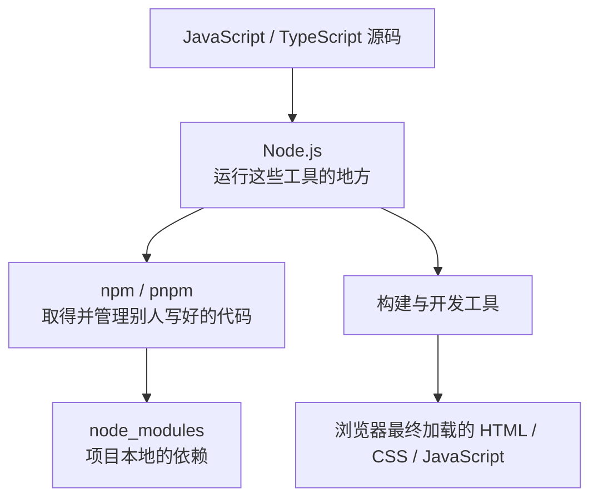
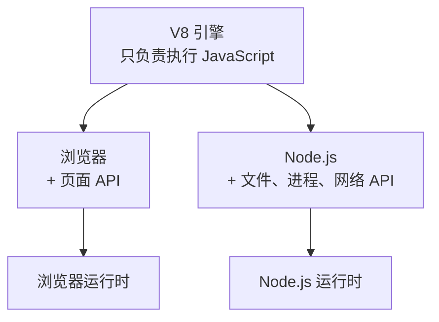
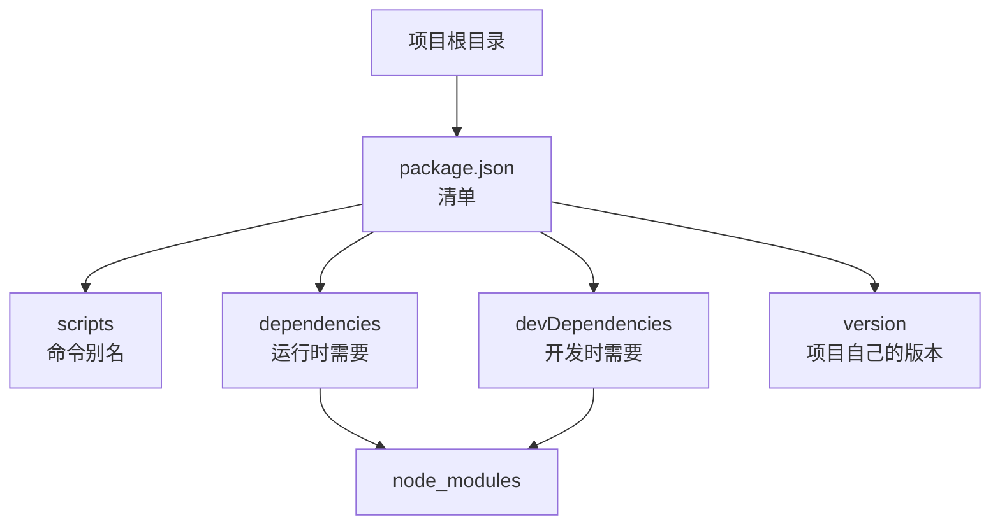
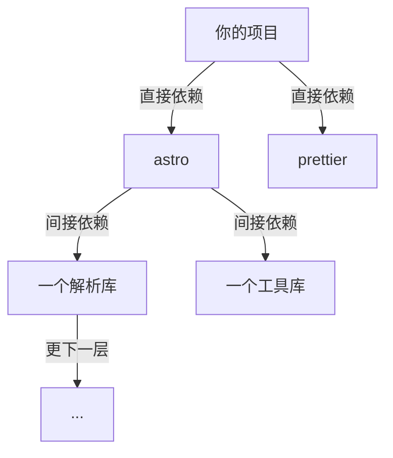
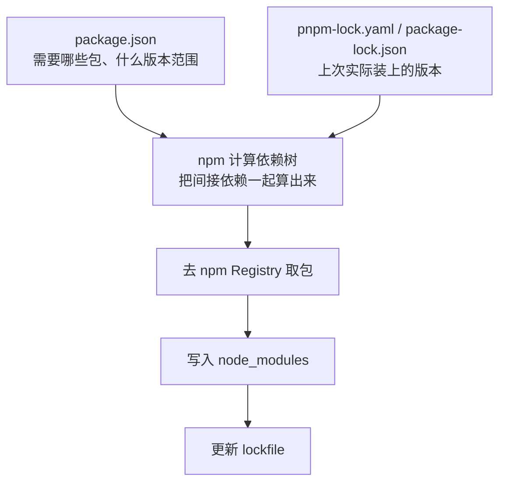
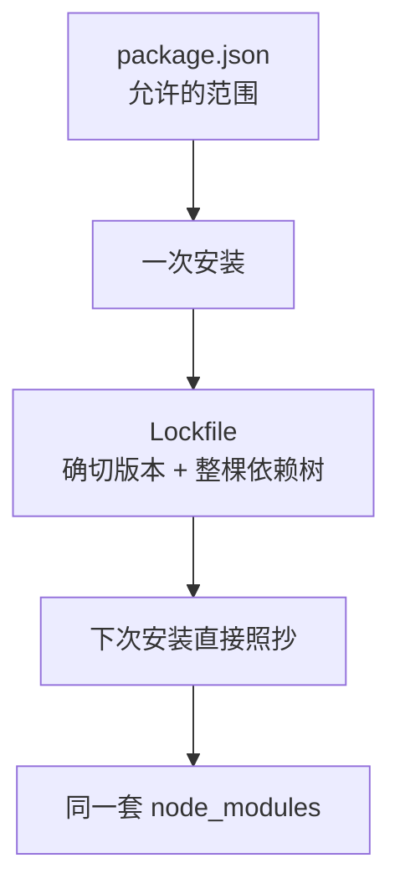
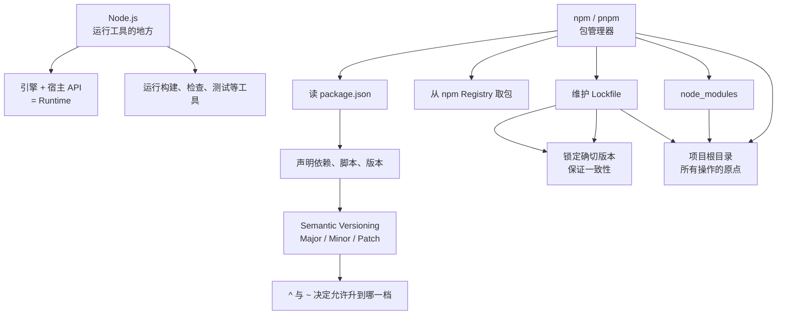

## 本章导读

上一章留下了一个前提：检查类型、标注错误位置、给编辑器提供提示的那些工具，都不在浏览器里运行。它们需要一个能在你自己的电脑上执行 JavaScript 的地方。这一章要填的就是这个位置，以及长在它上面的一整套「把别人写好的代码拿进自己项目」的机制。

对刚接触现代前端项目的人来说，最先撞上的往往不是页面，而是终端里的几分钟。AI 先让你装 Node.js，再让你跑 `pnpm install`，然后让你看一眼 `package.json`。这几件事没有一件和页面长什么样有关，可它们没跑通，后面所有步骤都不会开始。这也是为什么很多人的第一次失败并不是「网页写错了」，而是「命令没找到」。

所以这一章要回答的是三个连着的问题：这些工具为什么需要一个独立于浏览器的运行环境，这个环境是什么，以及建立在它之上的软件包体系是怎么让一个项目用上成千上万行别人写好、自己不用维护的代码的。把这三件事讲清楚，再回头看 AI 的那几条安装指令，它们就不再是需要照抄的咒语。

## 本章在技术栈中的位置



这张图说明本章处在哪一格：源码和浏览器之间隔着一整套在开发电脑上运行的东西，Node.js 是这一整套的地基。它不产生任何最终会出现在用户浏览器里的文件，它只是让开发阶段的各种程序有地方可跑。等这些程序把源码处理好，输出才是浏览器认得的那三类文件。

## 读完本章，你应该能看懂

- “Install Node.js first.”
- “Run `pnpm install` to install the dependencies.”
- “Check your `package.json`.”
- “Delete `node_modules` and reinstall.”
- “This looks like a Node version compatibility issue.”
- “Add it as a dev dependency.”
- “Don't commit `node_modules`.”

这些句子的共同点是：它们都在动开发电脑上的东西，而不是网页本身。读完之后，你应该能判断它们各自在动哪一层、动了会有什么后果。

---

## 5.1 Node.js

JavaScript 语言本身不会自己运行。它需要一个程序来读取它、执行它，并提供一些基本能力——比如往屏幕上打印一行字、读写一个文件。这个「执行 JavaScript 并给它提供能力」的角色，在网页里由浏览器担任，在开发电脑上由 Node.js 担任。这一节先把 Node.js 是什么、它为什么存在、它和浏览器的分工讲清楚，后面几节再讲围绕它建立起来的项目与依赖体系。

### 5.1.1 为什么 JavaScript 要离开浏览器

JavaScript 出生在浏览器里，它的第一份工作就是让页面动起来。这个出身带来了一条很深的印记：很长一段时间里，写 JavaScript 就等于写网页。

但开发一个现代网站，除了「网页本身」还有大量和页面无关的活。要把写好的几个文件合并成一个、要把新语法翻译成旧浏览器也认的写法、要检查类型写得对不对、要在本地起一个服务器让你在浏览器里预览、要压缩图片、要跑测试。这些活都在开发阶段完成，都不在页面上显示，可它们都需要一门能「算」的语言来写。

它们最终写成了 JavaScript。这件事不是必然的。完全可以另造一门语言专门做这些事。真实的选择之所以落在 JavaScript 上，是因为前端开发者本来就熟悉它，而一旦一门语言的使用者足够多，围绕它生长的现成工具也会足够多，于是后来者更愿意继续用它。这是一个典型的「生态自我强化」的结果，而不是技术上的必然最优。

要让 JavaScript 在浏览器之外跑起来，缺的是执行它的程序。前面 1.3.3 已经埋下这条线：Chrome 使用的 V8 是一个 JavaScript 引擎，它负责把 JavaScript 读进来、执行掉。引擎本身并不绑定浏览器——把它从浏览器里取出来，再配上一套访问文件和网络的接口，就得到了一个能在你自己电脑上运行 JavaScript 的东西。这就是 Node.js。

理解了这一步，那个反复出现的疑问就有了答案：一个做网页的项目，为什么先要在开发电脑上装 Node.js。因为开发网页要用到的那些工具，本身就是用 JavaScript 写的程序，而它们需要一个地方运行。

反过来想：如果没有一个能在浏览器之外运行 JavaScript 的环境，今天这些工具会变成什么样。构建、类型检查、格式化，每一件事都得另找一门语言来实现，于是每装一个工具就要学一套语法、一套依赖管理、一套报错方式。单看一个工具，成本不高；把这些成本乘上十几个工具，就不再是小事。

还有一层更贴近现实的原因。这些工具本身也是软件：有版本、会更新、会有缺陷、也依赖别人写好的代码。它们需要一个和你项目一样的运行环境——有清单、有依赖、有安装过程。Node.js 提供的正是这整套东西的落脚点。

### 5.1.2 Runtime 是什么

**运行时（Runtime）** 是描述「一段代码在什么环境里、靠什么条件运行」的词。AI 经常用它，比如“this needs a Node runtime”“the runtime doesn't support it”。这个词听起来抽象，但它指的是一件很具体的事。

一个准确的模型是：运行时 = JavaScript 引擎 + 这个引擎能调用的外部能力 + 一套把程序启动起来的机制。

引擎只负责一件事：把符合语言标准的语句执行掉。它知道怎么加两个数字、怎么调用一个函数、怎么处理一个字符串。但它不知道文件是什么、网络是什么、屏幕是什么。一门语言如果只有引擎，写出来的程序能做的一切就是把数字算来算去，然后扔掉结果。

外部能力是宿主补上的。宿主指的是承载这个引擎的程序，它负责提供引擎自己没有的那部分——在浏览器里是操作页面的能力，在 Node.js 里是操作文件和进程的能力。同一个引擎配不同的宿主，就得到两个不同的运行时。



这张图有一个容易看漏的点：V8 在两边都有，区别不在引擎，而在引擎之外接了什么。所以「Node.js 用的也是 V8」这句话既正确又不完整——它说明了语言层面为什么一致，没有说明两者为什么用途完全不同。

再补一句和 1.1.7 的衔接：运行时和进程不是一回事。Node.js 平时是磁盘上的一个程序文件，只有当你运行它，操作系统才会创建一个进程，把这个程序读进内存跑起来。同一个 Node.js 程序可以同时有多个进程，这就是为什么你开三个终端可以同时跑三个开发服务器。

「运行时」这个词在 AI 的话里出现得很频繁，多半是在讨论兼容性。说某个功能「需要更新的运行环境」，意思是旧版本的引擎或宿主还不支持它；说「这在两个运行时里表现不一样」，意思就是同一份代码在两个宿主里能调用的东西不同。记住它的组成，这类句子就能翻译成具体的意思。

还有一层区分可以提前知道：运行时决定了**哪些能力可用**。同样是发一个网络请求，浏览器里 `fetch` 是一个现成的全局函数，更早的 Node.js 版本里则要绕别的方式，后来才补上。工具对版本敏感，根子就在这里——版本变了，能用的东西也跟着变。

为什么这件事要单独给它一个词？因为同一份代码在不同运行环境下的表现，是 AI 讨论兼容性时最常用的切口。“It works in Node but not in the browser”这类句子，拆开看就是两套运行时能力的对照。把它当成一个名词记住，听到时就知道说的是环境，不是语言。

### 5.1.3 Node.js 能做什么

Node.js 做的最主要一件事是：**当开发工具的执行环境**。现代前端项目里几乎每一个在你电脑上跑的程序，最终都是被 Node.js 起来的。构建工具、类型检查器、测试运行器、代码格式化工具、开发服务器，它们要么本身是用 JavaScript 写的、跑在 Node 上，要么习惯上通过 Node 的命令行入口来启动。

第二个用途是写独立的小程序。一个用来批量重命名图片的脚本、一个把 Markdown 转成网页的程序、一个定时抓取数据的任务，都可以写成 Node.js 程序。这解释了一个现象：AI 有时会给你一段 `.js` 或 `.ts` 文件，让你用 `node 文件名` 跑一下。它给的不是网页代码，而是一个跑在开发电脑上的小程序。

Node.js 也常被用来写服务器。不过本书不展开这一支，第五章要讲的是它在**前端工程**里的角色。理解到「JavaScript 也能在服务器上运行」这一层就够了，具体写一个后端服务属于另一个方向。

Node.js 提供的能力里，有两组名字会在报错和文档里反复出现。`process` 代表当前这个正在运行的进程，你能从它读到环境变量、当前目录、退出码这类信息；`fs` 是文件系统，读文件、写文件、列目录都靠它。它们的共同点是：**浏览器里没有**。前面 3.1.3 已经说过这件事，这里再确认一次——`process` 和 `fs` 是 Node.js 这个宿主接上的插座，不是语言自带的。

还有一件新近的事要知道：Node.js 从近几个版本起可以**直接运行 `.ts` 文件**。这一点第四章 4.2.1 已经提过，口径也一样——它的做法是把类型语法删掉再执行，并不做类型检查。所以看到 AI 用 `node` 跑一个 `.ts` 文件时，不要以为类型因此被验证过了；类型检查和执行仍然是两件事，只是恰好可以作用在同一份文件上。

三个日常会用到的命令长这样。

```text
$ node -v              查看当前 Node.js 的版本
$ node script.js       运行一个脚本文件
$ node -e "1 + 1"      直接执行一小段代码
```

需要看懂三条各自的用途。第一条几乎每个项目都会碰到，因为版本不合是常见报错的原因。第二条就是你运行那些工具的实际方式——`node` 后面跟的既可以是你写的脚本，也可以是 `node_modules` 里某个包提供的入口。第三条一般用在临时验证一个表达式的时候，很少写在项目里。

它们也都是 AI 报错信息的来源。提示「`node` 不是可识别的命令」，说明操作系统没找到这个程序，第一章 1.2.6 讲了三种可能；提示某个包要求的 Node 版本不符，则是版本范围不匹配，处理办法是换一个 Node.js 版本，而不是改代码。

这里可以回答一个实际的疑问：为什么一个前端项目的根目录里会出现这么多以“node”开头的东西。因为那一层工具全跑在它上面，而工具链本身又需要被声明、被安装、被配置，于是 Node.js 的名字就洇到了项目的表面。看到 `node_modules`、`NODE_ENV`、`engines` 这类名字，回到这个前提就好理解。

模块方面，第三章 3.3.4 的函数与 3.7 的 `import` / `export` 在 Node 里同样有效。Node 同时支持两套模块写法：一套是 3.7 讲的 ES Modules，另一套是更早的 CommonJS，写作 `require(...)` 和 `module.exports`。一个项目用哪套，取决于文件扩展名和 `package.json` 里的一个开关，两者也可以在同一个项目里共存。这里理解到「两套都在、需要看文件后缀和配置」即可。

### 5.1.4 Node.js 与浏览器的区别

3.1.3 已经讲过最核心的一条：浏览器 JavaScript 和 Node.js JavaScript 是同一门语言，差别在宿主提供的 API。这里不重复那张对照表，而是把差别放大一层来看——因为在真实项目里，这个差别决定了哪些代码能放哪、以及 AI 让你跑的东西有多大权限。

第一层差别是**能碰到什么**。浏览器运行时面向的是一个页面：它能操作文档、监听点击、发送请求，但它碰不到你电脑上的文件系统，也不能随便启动别的程序。这是浏览器沙箱（1.3.4）的直接结果——网页代码来自互联网，如果它能读写你的硬盘，访问任何一个网页都会变成一件危险的事。Node.js 运行时面向的是一台机器：它能读写文件、能启动进程、能监听端口。它没有浏览器那层沙箱，因为运行它的人就是你自己。

第二层差别是**给谁用**。浏览器里跑的代码是给用户用的，用户下载它、在你的页面上执行它。Node.js 里跑的代码是给你自己用的，它是开发过程的一部分，用户永远不会直接看到它。

第三层差别是**代码从哪来**。浏览器里的代码通常来自网络，Node.js 里的代码通常来自你自己的项目目录或项目安装的依赖。

把这三层合起来，得到一个在判断 AI 行为时很好用的结论：**当你运行一个 Node.js 程序，它拥有的权限和你在终端里拥有的权限是一样的。** 它能删掉的东西，你能删掉；它能装的东西，你能装。相比之下，一个网页代码再怎么写，也做不到这些。所以在看见 AI 让你执行一段本地脚本时，值得先看一眼它准备动什么，而不是默认「反正是在我电脑上跑」。

这个区别在工程里会以很具体的方式出现。一个 Node 程序能读你项目之外的目录、能改写文件、能装东西，所以一段来源不明的本地脚本值得看一眼再跑；而一个网页即便被注入了恶意代码，它碰不到你的磁盘，这是浏览器沙箱给的保护。两者的差别不是编程水平，是宿主给的能力边界。

反过来说，也不要因此把 Node 程序当成危险的东西。绝大多数时候，你运行的就是项目自己声明的那几条命令，它们动的是项目目录里的文件。需要养成的习惯只是：知道它有能力做更多，所以在它要动项目之外的东西时多看一眼。

同一段代码放错运行时，会在报错里直接暴露出来：

```text
$ node -e "document.title"
ReferenceError: document is not defined
```

`document` 是浏览器宿主提供的，Node.js 这个宿主里没有这个名字。反过来，前面说的 `process` 和 `fs` 拿到浏览器里跑，也是同样的结果。报错说的不是代码写错了，而是这段代码和它所在的环境对不上。

### 5.1.5 Node.js 与前端开发的关系

把这一节收束成一句容易记住的话：**Node.js 不出现在你的网站里。**

用户打开你的网站时，浏览器收到的是 HTML、CSS 和 JavaScript 三类文件，里面没有 Node.js 的位置，也没有 npm、pnpm 或 `node_modules` 的位置。这些名字属于开发阶段，属于你的电脑。第〇章 0.5.2 把技术栈分成「浏览器侧」和「开发工具侧」两半，本章要讲的整套东西都在后一半。

这条区分有用，是因为它同时解释了两件容易困惑的事。一件是「为什么我装了 Node.js，网站上线后却和它无关」——因为上线的是处理好的产物，Node.js 的工作在产物生成之前就结束了。另一件是「为什么 AI 说某个依赖只是开发用的」——因为有些包的作用就是帮你在本地把源码处理好，处理完它们就功成身退，不会跟着产品走。

这里也正好接上第一章 1.4.5 留下的话。那句话说的是：有了这个运行环境，JavaScript 在前后端两边都能跑。对前端工程来说，这件事的意义不是「前端可以顺手写后端」，而是**让前端这一侧也拥有了一个可以运行程序的环境**。上一章那些不在浏览器里跑的检查工具，正是靠它才跑得起来的。

再往具体处说一层：同一条 `import` 语句，在浏览器里是为了让页面拿到代码，在 Node.js 里则可能是构建工具或检查工具在读取你的源码。写的是同一门语言、同一套模块语法，跑它的却是两个不同的运行时。这也是为什么一个项目里会有两套「可用的东西」：浏览器里能调的 API 和 Node 里能调的 API 各成一整套，用错了会在报错里直接体现出来。

---

## 5.2 Node.js 项目

上一节讲的是 Node.js 这个运行环境本身。这一节往下走一步：一个项目怎么被组织起来，才能让工具知道要处理什么、从哪开始、需要哪些东西。答案落在一个目录和一份文件上。



这张图想先给出一个速览：一份清单同时管着四件事，而其中两件最终都指向同一个生成目录。后面几个小节逐个展开这四件。

### 5.2.1 Project Root

**项目根（Project Root）** 是一个项目的顶层目录，也是「这个项目到哪里为止」的边界。它最实际的标志是：这个目录里有一份 `package.json`。

没有 `package.json` 的目录，对 Node.js 生态来说只是一个普通文件夹。有了它，这个目录才被认作一个 Node.js 项目——工具从这里开始找配置、依赖装到这里、命令也要求你站在这里执行。

第一章 1.2.3 讲工作目录时已经点过这一类现象。安装命令要求当前目录下有 `package.json`，站在别的地方执行，它会报找不到文件。当时说的是命令行的工作目录规则，现在可以补上另一半原因：它要找的不只是"有一个文件"，而是这个文件所代表的**项目身份**。项目根是安装、运行、构建三类操作共同的原点。

这样设计有一个实际后果：一个目录里可以有嵌套的项目。比如一个大仓库里放了几个各自独立的子项目，每个子项目自带一份清单，那么每个子目录都是一个独立的根——在哪个里面跑命令，就在装哪个项目的依赖。第一章 1.2.3 说的「站在哪个目录里」不只是习惯问题，它直接决定命令作用在哪个项目上。

一个典型的前端项目根长这样：

```text
my-site/
├── package.json          ← 项目的清单，标志这里是项目根
├── pnpm-lock.yaml        ← 记录实际装上的版本
├── node_modules/         ← 依赖装在这里（5.6）
├── public/               ← 不需要处理的静态文件
├── src/                  ← 你自己写的源码
└── astro.config.mjs      ← 工具配置
```

需要看懂的是第一行和第三行的分工：`package.json` 是你写给人看、也写给工具看的清单，`node_modules` 是工具按这份清单干活之后留下的结果。清单入库，结果不入库，这个区别后面 5.6 和 5.7 会展开。

### 5.2.2 package.json

**`package.json`** 是一个 Node.js 项目的清单文件。它用 JSON 格式写在一份普通文本文件里，回答三个问题：这个项目叫什么、它需要哪些别人写好的代码、它可以怎么被运行。

为什么一个项目需要这样一份文件？因为项目本身只是一堆文件，没有任何内在的方式告诉外界它需要什么。没有清单，别人拿到你的项目，只能靠打开每个文件去猜你用了哪些库、装了什么版本、怎么启动。清单把这些信息从代码里抽出来，放在一个固定位置，让工具和人都不用猜。

一份最小的 `package.json` 大概是这个规模：

```json
{
	"name": "my-site",
	"version": "0.1.0",
	"private": true,
	"scripts": {
		"dev": "astro dev"
	},
	"dependencies": {
		"astro": "^5.0.0"
	}
}
```

需要看懂四件事。`name` 和 `version` 是这份清单的身份标识（5.2.6 会再谈 `version`）。`private` 为 `true` 表示这个包不打算公开发布，可以防止误操作把它推到公共仓库。`scripts` 是几条命令的别名（5.2.3）。`dependencies` 里列出的是项目需要的包，后面跟的是版本范围（5.3 和 5.8 会解释版本范围这种写法）。

AI 频繁修改这份文件，原因也在这里：装一个新包要往 `dependencies` 或 `devDependencies` 里加一行，加一个自定义命令要往 `scripts` 里加一条，调整项目类型要改 `type` 字段。看到 AI 说“I'll add it to your package.json”，它准备做的就是这类改动——改的是清单，不是代码。

有一个区分要现在建立起来：**`package.json` 声明需求，它本身不提供代码。** 它说「我需要 astro 5 系列」，但 astro 的代码不在这个文件里，也不在装完之后的 `package.json` 里。真正的代码在 `node_modules`（5.6）里。把清单和内容当成两件事，后面理解安装流程和 lockfile 都会顺很多。

还应该知道的一件事：`package.json` 是**给人读的**，所以它写得相当直白。字段名就是英文单词，值多是字符串或对象，没有隐藏的语法。一份陌生的项目看下来，你往往能在两分钟内知道它用了什么框架、怎么启动、是不是对外发布。要判断 AI 改它的影响，这份文件永远是第一个该看的地方。

把前面几节的内容合起来，一份完整的清单大致长这样：

```json
{
	"name": "my-site",
	"version": "0.1.0",
	"private": true,
	"type": "module",
	"scripts": {
		"dev": "astro dev",
		"build": "astro build",
		"check": "astro check"
	},
	"dependencies": {
		"astro": "^5.0.0"
	},
	"devDependencies": {
		"typescript": "^5.6.0"
	}
}
```

需要看懂它分成四块：身份（`name`、`version`、`private`）、一个开关（`type`，影响 Node 把 `.js` 文件当成哪种模块）、命令（`scripts`）、依赖（`dependencies` 与 `devDependencies`）。后面几节按这个顺序展开。

### 5.2.3 scripts

**`scripts`** 是一组命令别名。写在里面的每一条，都是一段可以在终端里执行的命令，被起了一个短名字。

```json
{
	"scripts": {
		"dev": "astro dev",
		"build": "astro build",
		"check": "astro check"
	}
}
```

需要看懂的是：这三行本身不执行任何东西，它们只是把 `astro dev` 这样的命令记在“dev”这个名字下面。当你运行 `npm run dev` 或 `pnpm run dev`，包管理器会去 `scripts` 里查 `dev` 对应的是哪条命令，然后执行它。

为什么要把命令收进清单，而不是每次手敲？三个实际的好处。同一条命令只写一次，团队里所有人用同一个入口，不会有人记错参数。部署时自动化系统读的也是同一份清单，你在本地跑的和服务器上跑的是同一条命令。命令从一个地方改，所有引用它的地方都跟着变。

这里有一个不显眼但很好用的机制：执行脚本时，包管理器会把你项目里安装的那些命令（也就是 `node_modules` 里的可执行文件）临时加进查找路径。这正是为什么 `scripts` 里可以直接写 `astro dev`，而不必写完整的路径。你装了什么，脚本里就能直接用它的名字。

AI 常说的两句话就落在这里：“I'll add a script for that”是往这个清单里加一行，“run the dev script”是让你执行里面某一条。至于那条命令启动的开发服务器到底是什么、`dev` 和 `build` 在处理流程上有什么不同，属于第六章 6.3 的内容，这一节只负责说清「脚本是别名」这一层。

```text
$ npm run              不带名字，列出所有可用脚本
$ npm run dev          执行 scripts.dev 里的那条命令
$ pnpm run build       换成 pnpm，执行的是同一个定义
```

这三条里最要紧的是第一条。拿到一个陌生项目时，先跑一次不带名字的 `run`，它会把项目准备的所有入口列出来，比逐行读清单快得多。后面两条的差别只在包管理器，脚本本身是同一份。

脚本还有一层团队层面的作用：部署流程读的就是它。第十三章会讲自动化，那里服务器上执行的那几条命令，入口几乎都写在 `scripts` 里。一份清单同时服务本地的你、你的同事和服务器，这也是它存在的理由之一。

### 5.2.4 dependencies

**依赖（Dependency）** 是项目需要的、由别人写好的代码。`dependencies` 这一个字段，列出的是**项目运行或产出时确实要用到**的那些。

判断标准可以用一句话记：如果这个包的内容会跟着你的代码一起进入最终产物，或者运行时需要它在场，它就应该放在 `dependencies` 里。页面用到的框架、处理数据的工具库、负责渲染的组件库，都属于这一类。

```json
{
	"dependencies": {
		"astro": "^5.0.0",
		"react": "^19.0.0"
	}
}
```

AI 说“add it as a dependency”时，它准备做的事是：把包的名字和版本写进这个字段，然后安装。放在这里意味着这份依赖被当成项目的一部分——别人克隆你的项目、或者部署时，默认会把它装上。

有一个容易搞反的地方：判断一个包属于哪一类，看的是它在最终产物里的位置，而不是它出现在构建流程的哪一步。一个只在构建时被调用的工具，哪怕它参与了产物的生成，它本身也不进产物，所以属于下一节的开发依赖。

### 5.2.5 devDependencies

**开发依赖（devDependencies）** 是另一类：只在开发阶段用得上，产品本身不依赖它。

典型的成员是那些「帮你把活干完就退场」的工具：类型检查器、构建工具、测试运行器、格式化工具、类型声明包（第四章 4.6.4 讲过的那些）。它们的作用是把源码处理成可以交付的东西，处理完就不需要了。

```json
{
	"dependencies": {
		"astro": "^5.0.0"
	},
	"devDependencies": {
		"typescript": "^5.6.0",
		"prettier": "^3.3.0"
	}
}
```

两段的差别，在安装时才会显现出实际作用：安装时可以指定「只要运行需要的」而跳过开发依赖。这对于部署很有意义——服务器上不需要装格式化工具，省下的空间和时间都是实打实的。

一个常见的真实错误是把两者放反。把只在开发时用的工具写进 `dependencies`，会让它在生产环境里被白白安装；把运行时要用的包写进 `devDependencies`，则可能让线上环境缺少必需的代码。看见 AI 说“install it as a dev dependency”时，它其实是在替你做这个判断——判断这个包会不会进入产物。

两类的边界在少数包上确实模糊：有的包既提供运行时用的代码，也提供只在开发时用的命令行工具。真实项目里的做法是看它主要被谁使用。这类判断不需要精确到没有争议，重要的是知道这个分类存在，以及它为什么有实际影响。

### 5.2.6 version

这份清单里的 `version` 字段，是这个项目**自己的版本号**，用的是软件界通用的三段式写法（5.8 会完整展开这套写法）。

要区分开的是两个不同位置的版本号：`package.json` 顶层的 `version` 说的是这个项目本身的版本，`dependencies` 里每一项后面跟的版本说的是**它依赖的那个包**的版本。前者描述自己，后者约束别人。

这个字段在个人项目里常常被忽略，但它不是装饰。当项目被发布、被引用、被部署时，版本号是别人区分「这是哪一版」的依据。AI 说“bump the version”时，它的意思就是按规则把这个数字往上推一格——推哪一格，取决于这次改动的性质，这正是 5.8 要讲的规则。

顺带把一个常见误解说清：这个字段变了，不代表 `dependencies` 里任何东西变了，也不代表你的代码变了。它只是这个项目对外报出的版本号。看见 AI 改动它，先分清它改的是这个字段，还是某个依赖后面的版本范围。

---

## 5.3 Package

上一节谈的是项目一侧：清单怎么写。这一节换到另一侧：清单里那些名字指向的东西，到底是什么。

### 5.3.1 软件包是什么

**软件包（Package）** 是一个可以被别人复用的代码单元。一个包通常就是一个目录：里面有一份自己的 `package.json`（说明它叫什么、什么版本、依赖谁）、若干源码或编译好的文件，以及一份说明文档。

「软件包」这个词容易让人想到「安装一个软件」，但它们的机制完全不同。安装一个软件，通常会在系统里注册一个程序、写上开始菜单的条目、可能还会常驻后台。装一个包，发生的事情简单得多：**把别人的代码复制到你的项目里**。它不注册、不常驻、不影响系统里的任何其它项目。删掉项目目录，它就一起消失了。

这个区别要说清楚，因为它解释了一个常见困惑：为什么同一个项目要装几百个包，而你电脑上并没有多出几百个软件。它们只是文件，躺在这个项目的目录里。

一个包也不一定只有代码。很多包的目录里还带着一份 README、一个许可证文件、一些示例。这些不参与运行，但在你判断一个包能不能用时很有价值：README 说明它干什么，许可证说明你能怎么用它。

打开任意一个包，内部结构都大同小异：

```text
node_modules/prettier/
├── package.json     它自己的清单：叫什么、依赖谁
├── index.js         入口文件
├── license          许可证
└── README.md        说明文档
```

关键在于第一行：**包自己也是一份项目**，也有自己的 `package.json`。依赖关系之所以能一层层展开，就是因为每个包都能声明它自己需要谁。

### 5.3.2 Dependency 是什么

第〇章 0.4.1 给过一个定义：依赖就是你项目里需要的、别人已经写好的东西。这里把它说得更准确一点：**依赖是一种关系，不是一种文件。**

「我的项目依赖 astro」这句话描述的是两者之间的关系：我的项目需要 astro，而且是某个范围内的版本。这个关系被写在 `package.json` 里。至于 astro 的代码什么时候、以什么形式出现在我的项目里，那是安装时发生的事。

一条依赖由两部分组成：一个名字，和一个版本范围。名字指向要哪个包，版本范围指向可接受哪些版本。看一条依赖声明时，这两个部分都要看——只看到名字，不知道它允许升到多新；只看到版本号，不知道说的是谁。

这两部分是谁填上去的也可以说一句。当你执行 `pnpm add` 时，名字是你给的，范围是工具按约定生成的（通常带 `^`，见 5.8.4）。所以清单里那一行，实际上是人和工具共同写下的。

一条依赖写在清单里，大致长这样：

```json
"astro": "^5.0.0"
```

左边是包名，右边是允许的版本范围。两者一起才算一条完整的依赖声明。

### 5.3.3 直接依赖

**直接依赖** 是你自己写进清单里的那些：你明确知道自己在用 astro，所以把它写进 `dependencies`；你明确装了 prettier，所以把它写进 `devDependencies`。

直接依赖的数量通常可控。一个中等规模的项目，自己声明的包往往在十几个到几十个之间，每一行都对应着代码里某处真实的 `import` 或者某条真实的命令。想知道一个项目用了什么，看 `package.json` 的这两个字段就够了。

直接依赖还有一个附带的好处：它是这个项目最诚实的自我介绍。想知道一个项目用了什么技术、大概是什么规模，读这两段就够了——比读源代码快，比读文档准。

### 5.3.4 间接依赖

**间接依赖** 是依赖的依赖。你装了 astro，astro 自己又需要别的包；那些包又各自需要它们自己的依赖。层层展开，最终形成的数量远远超过你亲手写下的那些。

这个数量级需要一个具体印象：一个自己只声明了二十来个包的现代前端项目，装完之后 `node_modules` 里躺着的包可能有几百个甚至上千个。绝大多数你从未听说过，也没有在代码里直接引用过。

这带来一个需要建立的认知：**你管不了间接依赖，但你必须知道它们存在。** 因为你项目里跑的代码有相当一部分来自它们。安全漏洞常常出在某个你没听说的间接依赖里；某个包突然变大，往往是它引了一棵很大的依赖树；不同依赖之间要求同一个包的不同版本时，冲突也是在这里产生的。

它也解释了一个初看很奇怪的现象：明明只装了一个包，报错里却出现一个你没听说过的名字。顺着报错去看，那个名字通常是某个间接依赖。



图里只有第一层是你亲手写的。往下几层都是自动展开的，而且常常深到好几个级别。这就是为什么「只装了一个包」和「装完多了上千个目录」可以同时成立。

### 5.3.5 Package Ecosystem

**软件包生态（Package Ecosystem）** 是这套机制的总体：一个中央仓库，加上一套命名和版本的规则，加上围绕它们形成的工具与惯例。

它的价值在于「复用」这件事终于有了标准做法。在此之前，要用别人的代码，得手动下载、手动放到正确位置、手动记下版本；现在一句命令就能完成，而且版本是可追溯的、来源是可验证的。现代前端项目动辄依赖成百上千个包，靠的正是这套基础设施。

这也解释了为什么 AI 的建议里总带着包名和版本。AI 给你的方案，很大一部分实际是「使用生态里已有的某个包」，而不是「从头写一段代码」。看懂一个包的名字、版本和它承担的角色，是看懂这类建议的前提。

对一个初学者来说，这套生态最要紧的含义不是「包很多」，而是「大多数需求已经有人做过了」。于是很常见的做法是把已有的包组合起来，而不是从零写。看懂一个包在生态里的位置，和看懂它的代码怎么写，是两件事——本书要的是前一件。

---

## 5.4 npm

有了清单和包的概念，还需要一个东西把两边连起来：读清单、去仓库取包、把包放进项目。承担这件事的程序就是包管理器。npm 是最早、最普及的一个，也是理解后面所有同类工具的基础。

### 5.4.1 npm 的几个不同含义

`npm` 这三个字母在实际使用中指向三样不同的东西，混在一起是初学者最容易犯的错之一。

第一个含义是一个**命令行程序**。你在终端里敲的 `npm install`、`npm run dev`，执行的是安装在电脑上的一个命令。它随 Node.js 一起装好，不需要单独安装。

第二个含义是一个**中央仓库**。全世界的开发者把自己写的包发布到一个叫 npm Registry 的网站上，别人再从那里取。说「这个包在 npm 上」时，指的是这个仓库。

第三个含义是**这套生态与惯例的统称**。说「npm 生态」时，指的是仓库、版本规则、包的命名方式、围绕它们形成的工具和文档这一整套东西。

区分的方法很简单，看句子在说什么动作。说要“run `npm install`”，讲的是那个命令；说要“publish to npm”，讲的是那个仓库；说“the npm ecosystem”，讲的是整个体系。`编辑规则.md` 把“npm ≠ npm Registry”列为必须主动澄清的易混项，原因就在这里：仓库不会自己运行，命令也不会存包，它们是两件东西。

这种一词多义在技术领域很常见，但在 npm 这里特别容易造成误解，因为三者的名字几乎一模一样。一个实际的判断方法是看名词后面跟的是动词还是名词：能“run”的只有命令，能“publish to”的是仓库，被“grow”或“support”的是生态。

### 5.4.2 npm Registry

**npm Registry** 是存放公开软件包的中央仓库。它是一个服务，提供一个可以搜索的网站，也提供一套程序接口，让包管理器能按名字和版本取包。

它存的东西和你项目里的 `node_modules` 不是一回事。仓库里存的是所有**公开发布过**的包，每个包的历史版本都在；你的项目里存的只是你这次真正用到的那些。仓库是公共图书馆，`node_modules` 是你从图书馆借回来堆在书桌上的那几本。

这个区别解释了 AI 的一类说法。「这个包已经在 npm 上了」说的是它被公开发布过，谁都能装；「我们内部用的包」则可能放在私有仓库里，需要额外配置才能取到。取包的地方是可以指定的——官方仓库之外还有各种镜像，公司内部也常有自建仓库。对大多数项目来说，默认的那个就够用。

它还有一个会影响到日常操作的性质：一个包发布了某个版本之后，它的内容就不再改动。想修一个已发布版本里的问题，只能发一个新的版本号。这条约定保证了你装到的那个版本永远是同一份代码，也是 lockfile 能成立的前提之一。

它还承担了一个不那么显眼、但很重要的职责：它是整个依赖体系的信任起点。你装进项目的代码来自陌生人，而你能做的基本判断只有几个——这个包发布了多久、有多少项目在用、还有没有人在维护、它的许可证允不允许你用。这些都是 AI 建议引入一个新依赖时，可以一并看的东西。

### 5.4.3 npm CLI

**npm CLI** 就是那个命令。有一件有意思的事：**它本身也是一个用 JavaScript 写的程序，运行在 Node.js 上。** 包管理器不是操作系统的一部分，它只是众多 Node.js 程序里的一个，而它的工作恰好是管理别的程序。

它做的事可以概括成三步：读项目里的两份文件（`package.json` 和 lockfile），去仓库取包，把结果写回项目。整个过程都在项目目录里进行，装到系统其它地方的只有 npm 自己。

这一节只建立「npm 是一个普通程序」这个认知。它的具体命令不需要背，常用的那几条下一节说。

有一点可以和前面的进程概念接上：你每敲一次 `npm` 或 `pnpm`，都相当于启动了一个新进程，它干完活就退出。它不常驻、不监听、不占用端口。所以「包管理器没跑」不是指哪个服务停了，只是指那条命令没被执行。

### 5.4.4 npm install

`npm install` 是这个命令里最常用的一条，它的完整流程要走一遍，因为后面理解 pnpm、lockfile 和「删了重装」都建立在它之上。



这张图里有两条线索汇合。一条是 `package.json`，它说的是「我需要 astro 5 系列」这种范围；另一条是 lockfile，它记住的是「上次实际装上的具体版本」。有 lockfile 时，npm 优先照它装，而不是重新算一遍该用哪个版本。这正是 5.7 要讲的「版本一致性」的来由。只有在没有 lockfile 或者依赖有变动时，它才会重新计算。

这条命令还有另一种用法：后面直接跟一个包名，比如 `npm install prettier`。这时它多做了一件事——把新包写进 `package.json`。不带包名时它只照清单装，不动清单；带包名时它既装包也改清单。这个区别在判断 AI 的操作时有用：看见它往清单里加了一行，说明这次是「新增一个依赖」，而不是「按现有清单重装」。

还有一个性质会让第一次用的人意外：这条命令是**可以重复执行**的。清单没变、lockfile 没变时再跑一次，它不会重复下载，只会确认现状。所以「跑一下 install 看看」通常是一个安全且合理的建议——它不会破坏已有的东西，最多是补上缺的那部分。危险的是另一类操作：删掉 lockfile 再装，那等于放弃已有的版本记录，重新算一次。

安装失败时的报错，有两类要认出来。

```text
npm error code ERESOLVE
npm error ERESOLVE unable to resolve dependency tree
npm error
npm error While resolving: my-site@1.0.0
npm error Found: react@19.0.0
npm error Could not resolve dependency:
npm error peer react@"^18.3.1" from react-dom@18.3.1
```

第一类发生在**计算依赖关系**的阶段。示例里发生的事是这样的：项目自己装的是 react 19，而 react-dom 18 带着一条**对等依赖（peer dependency）**——它的意思是「我需要 react，但不自己把它装下来，而由使用我的项目提供」，并要求是 18 系列。两个要求对不上，工具就算不出一个同时满足两边的组合。它和代码无关，常见解法是让两边的版本对齐，或者明确接受一次不一致的安装。报错文案的措辞与前缀会随 npm 版本变化（旧版本写的是 `npm ERR!`），不必去背某一行的字样。

第二类发生在**安装之后的某个脚本**里。包本身已经装上了，是它在安装时自动执行的一条命令失败退出了。判断点在于：这类报错的上方还有一段更具体的输出，那是脚本自己打印的，故障的根源在那里，不在依赖版本上。安装命令最终会以那个失败脚本的退出码结束，非零就代表有东西没成。它的固定文案同样随 npm 版本变化，不必去记某一行的字样，认住「脚本失败」这个性质就够了。

安装成功时的输出则简单得多，大致是「加上了几个包、花了几秒」：

```text
added 312 packages in 8s
```

需要看懂的是那个数字：你写下的依赖可能只有十几个，而装上的是几百个。两者的差额就是 5.3.4 讲的间接依赖。

### 5.4.5 npm run

`npm run 名字` 执行 `scripts` 里同名的那条命令。这一节把它和 5.2.3 接上：`scripts` 负责定义别名，`npm run` 负责执行别名，两者是一件事的两端。

单独跑 `npm run`（后面不跟名字）会列出清单里所有可用的脚本。这是拿到一个陌生项目时最快弄清「它能怎么跑」的办法——比逐行读 `package.json` 更直接。

AI 说“run the dev script”时，指的就是这组脚本里的某一条。它启动的具体程序是什么、为什么能在浏览器里实时看到改动，属于第六章 6.3，这里只需要知道：你执行的是一个别名，而这个别名背后是一条命令。

这也是一个看 AI 说法的好例子。「跑一下 dev」听起来像在描述一个功能，实际只是执行清单里的一行。至于为什么改一下文件浏览器里就自动更新了、`dev` 和 `build` 的结果为什么不同，那些属于构建层面的问题，本章不回答。

---

## 5.5 pnpm

`pnpm` 是另一个包管理器。它做的是同一件事——读清单、取包、写 `node_modules`——但实现方式不同。这一节的重点不在于「哪个更好」，而在于理解「同一件事为什么会有不同做法」，因为 AI 项目里遇到 `pnpm` 的概率和 `npm` 一样高。

### 5.5.1 pnpm 是什么

**pnpm** 是一个与 npm 同类的包管理器。它读同一份 `package.json`、面向同一个 registry、管理同一套依赖关系。换句话说，你可以把项目里的 `npm` 命令换成 `pnpm`，项目本身不用改一行代码。

它能这样替换，正是因为它管理的东西是标准的：清单格式是公开约定，仓库接口是公开约定。包管理器只是这套约定的一种实现，换一个实现，约定不变。

同一个位置还可以换上别的实现（比如 yarn），原理一样。这些工具之间竞争的是机制和体验，不是它们管理的东西——后者是标准，不归哪一个工具所有。

### 5.5.2 pnpm 与 npm

两者的差别集中在**依赖在磁盘上怎么放**这件事上。

npm 的 `node_modules` 是**扁平**的：为了不让路径层层嵌套，它把大部分包都摊平放在同一层里。这样做的副作用是，即使你的项目并没有声明某个包，只要它被别的包带进来了，你也能在代码里直接 `import` 到它。这种「没声明也能用」的依赖被称为幽灵依赖（Phantom Dependency），它让代码在换个包管理器时可能突然找不到某个模块。

pnpm 的做法不同。它在电脑上维护一份**全局存储**（global store），每个包的每个版本在磁盘上只存一份；项目里的 `node_modules` 通过**硬链接**指向那份存储，而不是复制一份。这让多个项目共用同一份文件，装第二遍、第三遍时省下的是磁盘和下载时间。同时它的目录结构是**严格**的：就**你自己的代码**来说，只有你在清单里声明过的包，才出现在能被找到的位置。你声明了 astro 才能 `import` astro；一个包即便被你的某个直接依赖用过，只要你没自己声明，你的代码也拿不到它。这里要加一个限定：pnpm 为了兼容生态里那些漏写依赖声明的包，默认会把所有依赖也提升到内部的 `node_modules/.pnpm/node_modules` 里，所以这种隔离不是绝对的。

这两点听上去是技术细节，但它们会以具体现象出现在项目里。换包管理器之后原本能用的 `import` 报错，往往就是扁平结构掩盖过的幽灵依赖被暴露了出来；删掉 `node_modules` 再装一次比想象中快很多，往往是全局存储里已经有同一份文件（这份存储在本机，不随机器迁移，到新机器上仍要重新下载）。这一点常被简化成一句「pnpm 比 npm 快」，但快慢只是结果；要理解的是两套不同的组织方式，以及它们各自会在什么时候让你看到差别。

需要提醒的是，这些差别大多是工具作者有意做出的取舍，没有哪个方案在所有场景下都占优。这里不比较优劣，只要求你能看出一个项目用的是哪一套，以及两套之间切换时会发生什么。

两套布局的差别可以用一张图概括：

```text
npm（扁平）                     pnpm（严格）
node_modules/                  node_modules/
├── astro/                     ├── .bin/
├── prettier/                  ├── astro/        ← 你声明过的
└── 顺带带进来的包/             └── .pnpm/        ← 其余都在这里
```

左边这一类里，没声明过的包也能在代码里找到；右边这一类里，你自己的代码找不到没声明过的包。不过前面说过，pnpm 默认做了一次兼容性的提升，所以这条边界不是绝对的。这不是谁写错了，而是两套设计各自的选择。

### 5.5.3 pnpm install

`pnpm install` 对应 `npm install`：读 `package.json`，结合 `pnpm-lock.yaml`，把依赖装进 `node_modules`。流程里的分工和 5.4.4 那张图一致，区别只在「装」这一步具体用了什么机制。

在这里遇到的一个例外情况要留意：一个本来用 npm 装好的项目换成 `pnpm install`，或者反过来，都会因为两边的 lockfile 不同、目录布局不同而重新建立一遍依赖。混用两个包管理器不是错误，但会让 lockfile 反复被改写。团队项目里通常会明确指定用哪一个，看的是 `packageManager` 这类字段或者项目文档。最省事的办法是看项目根有哪些锁文件：有 `pnpm-lock.yaml` 就说明这个项目用 pnpm 维护依赖。

### 5.5.4 pnpm add

`pnpm add 包名` 装一个新包并把它写进 `dependencies`；加 `-D` 参数则写进 `devDependencies`。

把它和 5.4.4 的那个区分对上：`install` 是「照清单装」，`add` 是「改清单并装」。名字不同，做的事情重叠但不相等。`add` 更适合新增依赖，因为它会顺手把版本范围写进清单；`install` 更适合按现状补齐或复现环境。

AI 让你“add it as a dev dependency”时，对应的就是带 `-D` 的那一条命令。

```text
$ pnpm add prettier        装进 dependencies
$ pnpm add -D prettier     装进 devDependencies
```

两条命令的差别只有那个参数，写进清单的位置却不同。记不住名字时，记住这个判断就够了：它会不会跟着产物走。

### 5.5.5 pnpm remove

`pnpm remove 包名` 把包从项目里移除，同时从清单里删掉对应的那一行。执行完之后，代码里如果还有指向它的 `import`，就会在运行或检查时报「找不到模块」。

这个命令可以用来观察一个常见现象：卸掉一个包之后报错的地方，往往不止你自己写的那一处，还可能牵出几个间接依赖它的包。这正是 5.3.4 说的那件事——依赖关系是一张网，动一个节点会牵扯到别的节点。

所以删掉一个依赖之后，应该接着跑一次检查或构建，看有没有新的报错冒出来。这一步用到的工具后面几章才会出现，这里先记住这个习惯：改完依赖要验证，不能改完就结束。

### 5.5.6 pnpm run

`pnpm run 名字` 与 `npm run 名字` 行为一致，执行的还是 `scripts` 里定义的那些别名。

之所以要把这几条分开列出来，是因为它们经常被写得一模一样而省略说明。理解它们的共同点（都读同一份清单、都执行同一个脚本定义）比记住具体敲法有用：将来项目里用的包管理器变了，你脑子里那套模型不用换。

---

## 5.6 node_modules

前面反复提到 `node_modules`，但一直没正面讲它。它是依赖真正落地的地方——`package.json` 里写的名字、`npm install` 干完的活，最后都体现在这个目录上。它同时也是最让人困惑的一个目录：为什么它这么大，为什么别人总说不要提交它，为什么不能手动改它。

### 5.6.1 node_modules 是什么

**`node_modules`** 是项目里存放依赖代码的目录。装一个包，就是在这个目录下建立一个以包名命名的子目录，把它的文件放进去；依赖的依赖也同样放在这里。

它有一个性质要先记住：**它是生成出来的，不是写出来的。** 你不会手动在里面创建文件，也不应该在里面做任何长期修改。它存在的意义是让代码找到要用的包——你在源码里写 `import astro`，运行时或工具就沿着这个目录去找。

```text
node_modules/
├── .bin/          可执行命令（5.2.3 说的那个查找路径）
├── astro/         直接声明的依赖
├── prettier/      直接声明的开发依赖
└── ...            间接依赖与它们各自的子依赖
```

这张结构里只有两类东西：一类是你自己在清单里写了名字的，另一类是被前者带进来的。后面的数量远多于前面，这正是它显得杂乱的由来。

第〇章 0.5.2 说过，这类目录属于「开发工具侧」。现在可以补上原因：它是开发阶段的中间产物，是「别人写好的代码被搬进你项目」之后的落地形态，不是会被送到浏览器的东西。

这也回答了一个常见困惑：为什么你可以在源码里 `import` 一个自己从没在清单里写过的包。那通常是因为它就躺在这一目录里，并且目录结构允许被找到。能不能这样用、该不该这样用，恰好是 5.5.2 要对比的两套机制之一。

### 5.6.2 为什么它这么大

三个原因叠加在一起。

第一个是刚才 5.3.4 说的间接依赖。你写了二十行依赖，装完可能多出上千个包。

第二个是每个包会带上自己的各种文件：源码、编译产物、类型声明、文档、许可证、测试。被你的代码用到的可能只是其中一小部分，但出于简单和通用，安装时通常整包取回。

第三个是同一个包的**多个版本可能并存**。当两个依赖分别要求同一个包的不同大版本、而两者互不兼容时，包管理器不会强行只留一个，而是各留一份，让各自的依赖都能正常工作。

这个体积是可以接受的，因为它换来的是一件很重要的事：每个项目自带完整、自洽的一套依赖，不受其它项目的状态影响。

想对具体数字有个感觉，可以数一下 `node_modules` 下面的子目录数量，或者看一眼 lockfile 的长度——两份东西记的是同一批包，只是一个看得见、一个看得清。

第三个原因（同一包的多个版本并存）在目录里的样子是这样的：

```text
node_modules/
├── some-lib/              1.2.0   ← 供依赖 A 使用
└── another-dep/
    └── node_modules/
        └── some-lib/      2.0.0   ← 供依赖 B 使用
```

两个版本不能合成一个（否则总有一方会坏），所以它们各占一份。这也是一部分「重复」的真正来源。

### 5.6.3 为什么通常不提交 Git

`node_modules` 一般会写进 `.gitignore`，也就是不纳入版本管理。原因不是它不重要，恰恰相反——它太重要了，所以不能靠提交来保证。

它能被完整重建。只要有 `package.json`（说清需要什么）和 lockfile（说清上次装的是哪些具体版本），一条安装命令就能把它原样还原。既然可以重造，把重造的结果也存进仓库就是重复。

而重复的代价不小。它的体积会让仓库膨胀；每次依赖有任何变动，都会产生海量的文件变化，把真正需要审阅的代码改动淹掉；不同操作系统上同一个包的文件可能略有差异，提交它还会引入无意义的平台间冲突。

所以在看见 AI 说“commit node_modules”或者把它加进版本控制时，可以直接判断这是不对的。反过来，「删除 `node_modules` 并重新安装」之所以是常见的修复建议，也正是因为这一步是安全可逆的——它删掉的东西随时能重造。

判断一个文件该不该入库，先看它能不能由仓库里的其它文件重新生成。依赖目录能，构建产物能，缓存能——这一类不入库，因为留着只会让仓库重复和膨胀。源码、清单、lockfile 不能，必须入库。

还有一类不入库，理由不同：**里面装的是只属于这台机器的值，或者密钥**。这类文件不是生成出来的，提交上去等于把你这台机器的状态、甚至秘密本身写进仓库历史，而后一件很难靠删除提交记录补救。

要提醒的是，这里的判断依据是**内容**，不是文件名。`.env` 这个名字本身不决定能不能提交：同一个文件名，在一个项目里放着所有人共用的接口地址，在另一个项目里放着私钥。第六章会正面讲的那套构建工具，它的官方文档里被点名要排除在版本管理之外的，是带 `.local` 后缀的那一类——这个后缀的含义就是「只在我这台机器上生效」。至于这套文件一共有哪几个、各在什么时候被读，第六章 6.8.2 会正面讲。

落到目录里，这条规则的结果是：

```text
要入库：src/  public/  package.json  pnpm-lock.yaml
不入库：node_modules/  dist/  各种缓存目录   ← 能重新生成
        *.local 这类文件                    ← 只属于这台机器
```

拿到一个陌生项目时，先看 `.gitignore`，就能知道哪些东西不属于这个仓库、需要重新装或重新配一遍。

### 5.6.4 为什么不要手动修改

依赖出问题时，一个看起来很自然的想法是：直接进去把那个文件改了。这个做法几乎总是不划算。

原因很直接：`node_modules` 是生成物，下一次安装就会覆盖你的修改。而且你的修改只存在于这台机器上，别人拿到你的项目不会拥有它，问题在别人那里照旧。

正确的路径是改**上游**：如果是版本问题，就在 `package.json` 里调整版本范围；如果是这个包本身有缺陷，就去找有没有替代包或更新版本；如果确实必须打补丁，也有专门的机制记录这个补丁，让它跟着安装过程一起生效，而不是手动改一个迟早被覆盖的文件。

有一类例外要分清：AI 让你「删除 `node_modules` 然后重新安装」，这不属于手动修改，而是**把生成物整个重造**。当安装过程中途出错、留下了不完整的状态时，这是常规且有效的做法。它和「进去改一个文件」的区别在于：前者回到由清单和 lockfile 决定的状态，后者偏离了这个状态。

如果真的需要修正一个包的行为，正规路径是这条：

```text
修改包本身？     → 不推荐，下次安装会被覆盖
换个版本？       → 改 package.json 的范围，重装
换个包？         → 找替代品，改 import
本包真的有问题？ → 用补丁机制记录，跟着安装一起生效
```

四条里前三条都是改「上游」，只有第四条会碰到包本身的文件，而它也是由工具记住的，不是你去手改的。

---

## 5.7 Lockfile

前面几次提到 lockfile，都先绕过去了。现在把它正面讲清楚，因为它回答的是一个非常实际的问题：同一个项目，在两个人、两台电脑上装出来的依赖，凭什么是一样的。

### 5.7.1 Lockfile 为什么存在

先把问题摆出来。`package.json` 里写的版本是一个**范围**，比如 `^5.0.0`。范围的意思是「5 系列里任何一个不低于我指定的这个版本」。这带来一个后果：今天装一次拿到的可能是 v5.3.1，下个月另一个人装一次，可能拿到 v5.7.0。两个人都没错，但两者装出来的不是同一套代码。

对一个单人项目，这也许无所谓。一旦项目有第二个人参与、或者需要在本机和服务器上跑同样的东西，它就变成了大问题：「在我这里能跑，在你那里报错」往往就是这么来的。

**锁文件（Lockfile）** 解决的正是这件事。它是安装过程中由工具自动生成的一份记录，记下的不是「允许哪些版本」，而是「这次实际装上的确切版本」，而且精确到每一个间接依赖。有了它，下次安装就不再重新计算该用哪个版本，而是直接照它装。



这张图的关键是最后一步：lockfile 的作用不是存包，而是让「相同的输入产生相同的输出」。它把「版本范围」这个模糊的东西冻结成一个确定的结果。

名字上还要分清一点：lockfile 不是依赖清单，它更像上一次安装的收据。清单是你希望要什么，收据是实际拿到了什么。两者都在仓库里，缺一不可。

### 5.7.2 pnpm-lock.yaml

Lockfile 的文件名看包管理器：npm 生成 `package-lock.json`，pnpm 生成 `pnpm-lock.yaml`，yarn 生成 `yarn.lock`。名字不同，承担的角色相同。

以 pnpm 的为例，它的内容大致是这样一种结构（实际文件比这里长得多）：

```yaml
lockfileVersion: "9.0"

importers:
    .:
        dependencies:
            astro:
                specifier: ^5.0.0
                version: 5.3.1
```

需要看懂两点。第一行说明这份 lockfile 自己的格式版本。下面每一段把一个包从「清单里写的范围」（`^5.0.0`）映射到「实际装上的版本」（`5.3.1`）。同一个包在不同依赖下要求不同版本时，这里会分别列出多份，这也正是 5.6.2 说的「同一包多版本并存」在 lockfile 里的样子。

它和 `node_modules` 正好构成一对：`node_modules` 是结果，不入库；lockfile 是「怎么得到这个结果」的记录，要入库。丢了前者可以重建，丢了后者就丢失了确定性的依据。

它还有一个实际用途：代码评审里看到一个包被升级了，去 lockfile 的改动里找比在 `package.json` 里找更准——因为具体的版本号写在那里。

它不适合手动读完整。一个中等项目的 lockfile 动辄几千行，里面大半是间接依赖。把它当「账本」看就够了：需要确认某个包到底装没装、装的哪个版本时，去里面搜名字，比翻 `node_modules` 可靠得多。有时项目根会同时出现两个锁文件：

```text
package-lock.json    ← 以前用 npm 留下的
pnpm-lock.yaml       ← 现在用 pnpm
```

这通常不是有意为之，而是换过包管理器留下的痕迹。这时该留哪一个，取决于项目现在实际用哪个——两套记录同时存在，只会让后来的人不知道该信谁。

### 5.7.3 package.json 与 Lockfile 的区别

两个文件都在项目根，都在说版本，容易混在一起。它们的分工可以用一句话分开：**一个说想要什么，一个说上次拿到了什么。**

|            | `package.json`         | Lockfile               |
| ---------- | ---------------------- | ---------------------- |
| 内容       | 版本范围，如 `^5.0.0`  | 确切版本与整棵依赖树   |
| 谁写       | 人（或 AI）手动维护    | 工具自动生成           |
| 版本控制   | 入库                   | 入库                   |
| 另一个文件 | node_modules（不入库） | node_modules（不入库） |

差别带来的一个实际纪律是：**不要手动改 lockfile。** 你改 `package.json` 里的范围，然后跑一次安装，工具会把 lockfile 改到与新范围一致。如果你反过来直接编辑 lockfile，就相当于绕过工具去伪造一个「上次装过的状态」，下次安装时它会被重写，或者把你导向一个从未验证过的组合。

两个文件放在一起对比，差别最清楚：

```text
package.json     "astro": "^5.0.0"      ← 允许的范围
pnpm-lock.yaml   astro: 5.3.1           ← 实际装上的版本
```

上面一行是意图，下面一行是事实。依赖出现意外行为时，先看哪一行，往往就能把问题缩小到「想要的和装上的不一样」这一类，还是别的性质。

### 5.7.4 版本一致性

把前三节合成一个概念：**版本一致性**，指的是同一份 `package.json` 配同一份 lockfile，在任何一台机器上装出来的依赖应该是一样的。

它是「在我这里能跑」这类问题的反面。有了 lockfile，环境之间的差异被压缩到最小，排错时也能先把「版本不一致」这个可能性排除掉。

也正是因为它承担这个作用，`编辑规则.md` 把「`package.json` ≠ `node_modules`」和「`Build` ≠ `Deploy`」这类易混项摆在一起要求澄清：它们看起来都在描述同一个项目，职责却完全不同、可丢弃程度也不同。一个更实际的推论是：**删掉 lockfile 不是无痛操作。** AI 有时会建议「删掉 lockfile 重装」，这会放弃已有的确定性记录，让所有依赖按清单里的范围重新算一遍。它能治某些病（例如 lockfile 已经损坏、或者你确实想整体升级），但它也可能顺手把一批包升到更新的版本，带进本来没有的问题。看见这个建议时，可以先问一句：这次是为了修什么。

需要锁定的场景，往往不是一个人写代码的时候，而是多个环境之间。本地能跑、服务器不能跑、同事新拉一遍代码报错，这几类问题的共同点都是版本不一致。lockfile 存在的全部理由，就是让这种不一致尽量不出现。

---

## 5.8 Semantic Versioning

上一节说的「范围」和「确切版本」，都建立在一套写法上。这套写法是现代软件生态里少数几个被广泛接受、几乎人人遵守的约定之一，看懂它，才能看懂 `package.json` 里那些字符串在说什么。

### 5.8.1 Major

**语义化版本（Semantic Versioning）** 把版本号写成三段：`主版本.次版本.修订号`，也就是 `Major.Minor.Patch`。

**主版本（Major）** 是三层里最重的一层。它的含义是：当我做了**不向后兼容**的改动时，就把它加一。所谓不兼容，指的是旧代码按照过去的方式使用新版本，会坏掉——函数改名了、参数换了、以前能用的写法不再支持了。

所以看到主版本从 4 跳到 5，这句话的含义是：**升级它可能要让你的代码跟着改。** 这不是「更难」的意思，而是「不能无痛升级」。

一个实际例子：一个包从主版本 1 升到主版本 2，它的升级说明里通常会有「破坏性变更」一节，列出哪些写法不再支持。这一节就是升级后代码可能报错的清单，读它比读代码快。

### 5.8.2 Minor

**次版本（Minor）** 的含义是：我**新增了功能，但没有破坏旧用法**。旧代码继续照常工作，只是多了一些可用的东西。

这带来一个很好用的判断：次版本升级通常是安全的。依赖升级到新功能的版本，已经在用的写法不会因此失效。

不过它仍有轻微的风险：新功能偶尔会带来行为变化，特别是那些主版本还是 0 的包（5.8.4 会讲）。所以「次版本升级通常安全」是一条统计规律，不是保证。

### 5.8.3 Patch

**修订号（Patch）** 表示**只修了缺陷，没有新功能，也没有破坏旧用法**。它是最小的一层，代表「同一个东西，只是更好了一点」。

三层合起来的完整写法是 `1.2.3`：1 是主版本，2 是次版本，3 是修订号。版本比较时从左往右比，主版本高的一定更新。这也解释了为什么 `^` 锁住的是主版本——它锁住的正是变化最大的那一层。

三层分别对应哪种改动，可以这样记：

```text
1.4.2  →  1.4.3     修了缺陷，用法不变          Patch
1.4.3  →  1.5.0     加了新东西，旧用法照用       Minor
1.5.0  →  2.0.0     改了不兼容的地方，要动代码   Major
```

读左侧这些数字时，先看第几位变了，就知道这次升级需要多少注意力。

升级本身也分两种做法。一种是按范围允许自动升，装完就是新的修订或次版本；另一种是明确指定目标版本，把范围改掉：

```text
"astro": "^5.0.0"   →   "astro": "^5.2.0"
```

前者风险小、不需要改代码；后者往往伴随代码改动。AI 说“upgrade to the latest”时，通常指的是后者——它可能会顺带改几处代码，那是升级的一部分，不是意外。

把它和上一节连起来看，会发现这三层其实在回答同一个问题：**这次升级，会不会让我现有的代码失效。** 三层各自对应一种答案：不会（patch）、不会而且有东西可拿（minor）、可能会（major）。这正是它能被工具自动使用的根本原因。

需要补充一句边界：这是一套**约定**，不是强制。它有效的前提是包的作者遵守它。如果发布者把不兼容的改动放在一个次版本里，工具和人都会被误导。所以它可靠但不绝对。

### 5.8.4 `^` 与 `~`

清单里的版本号前面经常带着两个符号，它们决定「允许升到哪一档」。

```text
^1.2.3   →   >=1.2.3 且 <2.0.0     允许次版本和修订号升
~1.2.3   →   >=1.2.3 且 <1.3.0     只允许修订号升
1.2.3    →   就这个版本，不许升
```

需要看懂的是：`^`（插入符）锁住的是**主版本**，`~`（波浪号）锁住的是**次版本**，不写符号锁的是这一版本身。安装时默认会写入 `^`，这解释了为什么你的 `package.json` 里几乎到处都是它——它表达的是「不破坏兼容的前提下，尽量用新的」。

有一个例外记住就好：当主版本是 `0` 时，情况会不一样，`^0.2.3` 的处理比 `^1.2.3` 更保守。这类版本通常意味着「还在早期、随时可能改」，所以约定上把它当成不稳定来对待。日常项目里遇到 `0.x` 的包，可以预期它的接口变动的可能性更大。

另一个常见写法是 `*`（任意版本），它几乎不设限制，装到什么全看当时仓库里最新的是什么。这类写法在演示项目里很省事，在要认真维护的项目里却会让版本失去约束。看见它时，可以多问一句为什么。

还有一个细节与前面的符号相关：`^` 和 `~` 只影响「允许装哪些版本」，不影响「已经装的版本」。你先在本地把某个包装到了新版本，然后把范围符号收紧，本地不会因此回退——回退得靠重新安装，让工具按新的范围重新算一次。

### 5.8.5 依赖升级与兼容性

把这一节收束一下：版本号、范围符号、lockfile 三者合起来，回答的是「什么时候装什么」，而它们背后的判断依据始终是**兼容性**。

AI 说“upgrade”时，要看它动的是哪一层。升级一个修订号通常无感；升级主版本则意味着可能有代码要跟着改，升级完应当跑一次检查。这也是为什么一次「升级」的建议里，有时会连带出现「把某个 `import` 改一下」——那不是附赠的优化，而是主版本升级的一部分。

反过来，当你看到 `^` 的范围而实际装上的版本比当初新很多，也不必惊讶：那是范围在起作用，而 lockfile 会在你下一次安装时把这件事记录下来。

版本敏感的报错里，最常见的一类是 Node.js 版本不符。

```text
npm error code EBADENGINE
npm error notsup Required: {"node":">=20"}
npm error notsup Actual:   {"node":"v18.19.0"}
```

这段输出的意思是：某个包在清单里写明了「我只在 Node 20 及以上能工作」，而你用的是 18。默认行为下，这类不匹配只是**警告**，安装会继续完成；只有显式打开严格模式时，它才会变成上面这样的错误。所以看到警告不用慌，但也不要直接忽略——正确的处理是换一个符合要求的 Node.js 版本，而不是去改包的代码。这个要求通常写在包的 `engines` 字段里，属于作者声明的适用条件。

---

## 5.9 一个现代项目的文件结构

前面八节拆开讲了运行环境、项目、包、包管理器、安装目录、锁文件和版本规则。这一节换个角度：打开一个真实项目，这些都长什么样。把概念落到目录上，是为了让你在 AI 说「看项目的 src 目录」或者「改一下 `astro.config`」时，脑子里能立刻出现它指的是哪一块。

```text
my-site/
├── .git/                 隐藏：Git 自己用的目录
├── .gitignore            隐藏：哪些东西不进版本管理
├── src/                  你自己写的源码
│   ├── pages/            页面
│   └── components/       组件
├── public/               原样输出的静态文件
├── node_modules/         依赖（生成物，不入库）
├── dist/                 构建产物（生成物，不入库）
├── astro.config.mjs      工具配置
├── tsconfig.json         工具配置
├── package.json          项目清单
└── pnpm-lock.yaml       依赖版本记录
```

这张目录树可以先整体看一眼：十来个条目里，属于「你自己写」的其实只有 `src/` 和 `public/` 两块，其余要么是工具生成的，要么是给工具读的。

### 5.9.1 src

**`src`** 是 source 的缩写，存放你自己写的源码。它通常是后面所有环节的起点：构建工具读它，类型检查器查它，测试跑它。

把源码单独放进一个目录，图的是分得清「我写的东西」和「别的东西」。看到 AI 改动 `src` 下面的文件，那是真在改项目；看到它改 `node_modules` 或 `dist`，那是在动生成物。这个区分也是 Code Review 的基本习惯：一个改动是否应该被审阅，先看它在哪一侧。

在一个框架项目里，`src` 下面通常还会有 `pages` 和 `components` 这样的子目录，分别放页面和组件。它们的具体含义属于第七章和第十章，这里只需要知道它们都在 `src` 之下。把源码集中在一个目录还有一层好处：什么该入库、什么不该入库，答案变得直白。`src` 和 `public` 是你写的，要入库；依赖目录和构建产物是生成的，不入库。

### 5.9.2 public

**`public`** 存放不需要被处理的文件：网站图标、图片、`robots.txt` 这类。它们在构建时被**原样搬到输出目录**，不改内容、不改文件名。

「原样」这两个字是它和 `src` 的关键区别。放进 `src` 的资源会经过处理（比如图片可能被压缩、文件名可能带上校验信息），而 `public` 里的东西构建工具不碰。所以你引用 `public/favicon.ico` 时，它在最终网站上的地址就是 `/favicon.ico`，与你写的路径一致，不需要多一层目录名。

这也意味着它不能参与任何需要处理的过程。想把一张大图压缩、想按屏幕尺寸生成不同版本，都不应该交给它——那些属于构建环节，是下一章的事。

### 5.9.3 node_modules

这一节已经在 5.6 讲透，这里只说它在目录里的位置：它就在项目根，和 `package.json` 平级。

唯一的实践建议是：**平时不要点进去看。** 它是生成物，里面成千上万个文件都是别人写的，看它得不到关于你项目的任何信息。要弄清楚一个包到底装了什么版本，看 lockfile（5.7）比翻目录快得多。

目录本身只看结构，不看内容。想知道一个包在不在、里面有没有你要的东西，搜索目录比打开文件快，但「装的是哪个版本」这个问题永远应该去问 lockfile。

### 5.9.4 配置文件

项目根下那些名字带工具名、后缀是 `.js` / `.mjs` / `.ts` / `.json` / `.yaml` 的文件，多数是**配置文件**。它们的共同特点是：不属于你的业务代码，但决定工具怎么跑。

第二章到第五章已经陆续出现过它们：`tsconfig.json` 决定 TypeScript 怎么检查（4.6），`astro.config.mjs` 定义这个网站的配置，`.npmrc` 影响安装行为，`.prettierrc` 决定代码格式风格。它们不是同一种格式，但属于同一类东西。

这里只建立「它们是一类」这个认知。具体哪个文件有哪些字段、什么时候需要改，属于相应工具自己的章节（构建相关的配置在第六章，框架自己的配置在第七章）。

最常见的几个，大致是这样的：

```text
astro.config.mjs    网站本身怎么组织、启用了什么
tsconfig.json       TypeScript 按哪套规则检查（4.6）
.prettierrc          代码格式规则
.npmrc               安装行为（仓库地址、镜像等）
```

它们放在项目根，是因为工具默认从这里开始找。这也是为什么很多命令要求你在项目根执行——工具得先看到这些文件。看到 AI 说“update the config”时，先确认它指的是哪一个文件的哪一个部分。

### 5.9.5 Lockfile

`pnpm-lock.yaml`（或 `package-lock.json`、`yarn.lock`）同样在项目根，名字带 lock。

它和 `node_modules` 的关系已经在 5.7 说明：一个入库、一个不入库，一个是要保留的记录、一个是可重建的结果。在目录里看到它们俩挨在一起，正好是这对关系的直观体现。

### 5.9.6 构建产物

**构建产物** 是那些工具处理过后、准备交给浏览器的文件，通常放在 `dist`（distribution 的缩写）或 `build` 目录里。

它和 `node_modules` 有一个共同点：也是生成物，通常也不入库。因为只要源码、配置、依赖记录都在，整个目录随时可以重新生成一次。

需要把握边界的是：这里只回答「那个目录是什么、为什么不该手改」。至于它是怎么从源码变出来的、里面到底处理了哪些事，是下一章（L5 构建基础设施）的主题，本章不展开。一个实用的判断是：**如果你改了源码却看到 `dist` 里的文件变了，那说明有一个构建过程在跑**——它具体是什么，留给下一章。

它的内容长什么样，可以提前看一眼：

```text
dist/
├── index.html        构建后的页面
├── _astro/           处理过的样式与脚本
└── favicon.ico       从 public/ 原样搬过来的
```

这个目录的用途是部署——把它的内容上传到服务器，网站就能被访问。这条链路属于第十三章，这里只需要知道它是「做完的成品」。

### 5.9.7 隐藏文件

名字以 `.` 开头的文件或目录叫**隐藏文件**，因为默认不在文件管理器里显示（第一章 1.1.2 提过，它们在 macOS 和 Linux 上默认不列出来）。

它们往往比普通文件更重要，因为它们装的多是「关于项目本身的规则」，而不是项目内容。`.gitignore` 决定哪些东西不进版本管理，像依赖目录和构建产物就写在这里；`.env` 这一类存放不想写进代码的配置，比如接口地址或者密钥，1.1.6 讲过它不是操作系统的东西，而它该不该提交按 5.6.3 那条看内容判断；`.github/` 存放自动化配置，第十三章会讲。

所以一个项目的隐藏文件大致是这几类：

```text
.gitignore      哪些不入库
.env            不写进代码的配置（是否入库看内容）
.npmrc          安装行为
.github/        自动化流程配置
```

它们默认看不见，但往往决定了一个项目「能不能跑起来」。碰到「在我这里正常、在别人那里报错」时，对比隐藏文件常常能直接找到差异。

看懂 `.gitignore` 是这一组里性价比最高的。它是「哪些东西不入库」这一问题的唯一答案来源，而前面讲到的那一批不该提交的东西（`node_modules`、`dist`、带 `.local` 的那类文件）能不能被排除，全靠它。当 AI 说「这个文件不应该提交」时，它实际上在做的事通常是往这个文件里加一行。

---

## 5.10 L4 知识地图



这张图把本章十二节串成两条线：一条是 Node.js 本身（它是何、它能做什么、它的权限边界），另一条是从「声明依赖」到「装上依赖并锁住版本」的完整链路。两条线在项目根目录上汇合——因为无论是运行工具还是安装依赖，你都得先站在这个位置。

## 5.11 本章小结

这一章最重要的一个认知是分工：**Node.js 一整套东西都在开发电脑上，不在你的网站里。** 浏览器最终拿到的仍然是 HTML、CSS 和 JavaScript，本章讲的所有东西都在它们被生成出来之前。

第二个认知是关于「依赖」这个词的：它描述一种关系（我的项目需要别人的某个包），而 `package.json` 是这种关系的声明，`node_modules` 是这种关系落实后的结果，lockfile 是「上次落实成了什么样」的记录。三个文件长得很像，职责却完全不同。

第三个认知是版本体系：语义化版本号告诉工具「这次升级会不会破坏现状」，`^` 和 `~` 告诉工具「允许升到哪一档」，lockfile 则把最终结果固定下来。这套东西存在的全部理由是：让不同的人、不同的机器，装出同一套依赖。

回到开头的场景。现在再看 AI 那几句安装指令，应该能分清它们各自在动哪一层：装 Node.js 是在装运行环境，`pnpm install` 是按清单把依赖装进项目，删 `node_modules` 重装是把生成物重造，改 `package.json` 是在改声明。

把这些合起来看，本章其实一直在回答同一个问题：**「别人写好的代码」是怎么变成项目里能用的东西的。** 答案是三道环节：声明（清单）、获取（包管理器 + 仓库）、落地（依赖目录 + 锁文件）。三者缺一不可，而且它们分属不同的文件、承担不同的职责——这也解释了为什么 AI 提到依赖时，常常会先让你「看一下 package.json」，再「跑一下 install」。

## 5.12 AI 黑话速查

| AI 常说的话                                  | 实际意思                                                         |
| -------------------------------------------- | ---------------------------------------------------------------- |
| `Run pnpm install`                           | 按 `package.json` 与 lockfile，把项目需要的包装进 `node_modules` |
| `Check your package.json`                    | 去看项目的清单：依赖声明、脚本、版本号                           |
| `Delete node_modules and reinstall`          | 把生成物整个重造一遍，用来修复装坏了的环境                       |
| `Add it as a dev dependency`                 | 这个包只在开发阶段用，不会跟着产物走                             |
| `This is a Node version compatibility issue` | 你电脑上的 Node.js 版本与项目要求的范围不匹配                    |

到这里，一个现代前端项目已经具备了运行工具和管理依赖的能力：Node.js 提供了执行环境，包管理器把项目需要的东西准备好，lockfile 保证了结果可重现。但这些都还是开发电脑上的事。源码里写着 TypeScript、写着 `import`、写着还没处理的样式，而浏览器读不懂它们——所以还差一道工序：把源码变成浏览器真正需要的那几类文件。这就是下一章要讲的事。
